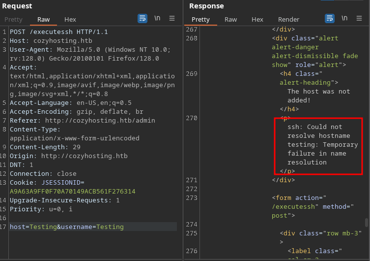

<br />


<br />

OS -> Linux.

Difficulty -> Easy 

<br />

# Introduction:
<br />


<br />

# Enumeration:

<br />

We start by running the typical nmap scan to see which ports are open:

<br />

```bash
❯ nmap -p- 10.10.11.230 --open --min-rate 5000 -sS -T5 -Pn -n -sCV
Starting Nmap 7.94SVN ( https://nmap.org ) at 2025-01-26 15:24 CET
Nmap scan report for 10.10.11.230
Host is up (0.94s latency).
Not shown: 62221 closed tcp ports (reset), 3312 filtered tcp ports (no-response)
Some closed ports may be reported as filtered due to --defeat-rst-ratelimit
PORT   STATE SERVICE VERSION
22/tcp open  ssh     OpenSSH 8.9p1 Ubuntu 3ubuntu0.3 (Ubuntu Linux; protocol 2.0)
| ssh-hostkey: 
|   256 43:56:bc:a7:f2:ec:46:dd:c1:0f:83:30:4c:2c:aa:a8 (ECDSA)
|_  256 6f:7a:6c:3f:a6:8d:e2:75:95:d4:7b:71:ac:4f:7e:42 (ED25519)
80/tcp open  http    nginx 1.18.0 (Ubuntu)
|_http-title: Did not follow redirect to http://cozyhosting.htb
|_http-server-header: nginx/1.18.0 (Ubuntu)
Service Info: OS: Linux; CPE: cpe:/o:linux:linux_kernel

Service detection performed. Please report any incorrect results at https://nmap.org/submit/ .
Nmap done: 1 IP address (1 host up) scanned in 33.98 seconds
```

<br />

Open Ports:

- `Port 22` -> ssh

- `Port 80` -> http

<br />

# Http Enumeration: -> Port 80

<br />

Proceed to list the website and it redirects to cozyhosting.htb, so we add this domain to our /etc/hosts:

<br />

```bash
❯ echo '10.10.11.230 cozyhosting.htb' >> /etc/hosts
```

<br />

The website is very static and doesn't has anything interesting, only a /login:

<br />


<br />

Try creds like admin:admin but don't work:

<br />


<br />

The 404 error page seems interesting:

<br />


<br />

Search about this error on Google and I discover that Spring Boot its being used in the backend of the Server:

<br />


<br />

As we know, there are specific dictionaries for this type of framework, so we proceed to fuzz with wfuzz using the dictionary "spring-boot.txt" from the [SecLists](https://github.com/danielmiessler/SecLists) of Daniel Miessler and discover the following paths:

<br />

# Information Leakeage:

<br />

```bash
❯ wfuzz -c -t 50 --hc=404 -w /usr/share/SecLists/Discovery/Web-Content/spring-boot.txt http://cozyhosting.htb/FUZZ
 /usr/lib/python3/dist-packages/wfuzz/__init__.py:34: UserWarning:Pycurl is not compiled against Openssl. Wfuzz might not work correctly when fuzzing SSL sites. Check Wfuzz's documentation for more information.
********************************************************
* Wfuzz 3.1.0 - The Web Fuzzer                         *
********************************************************

Target: http://cozyhosting.htb/FUZZ
Total requests: 112

=====================================================================
ID           Response   Lines    Word       Chars       Payload                                                                                                                
=====================================================================

000000041:   200        0 L      13 W       487 Ch      "actuator/env/lang"                                                                                                    
000000044:   200        0 L      13 W       487 Ch      "actuator/env/path"                                                                                                    
000000039:   200        0 L      13 W       487 Ch      "actuator/env/home"                                                                                                    
000000029:   200        0 L      1 W        634 Ch      "actuator"                                                                                                             
000000051:   200        0 L      1 W        15 Ch       "actuator/health"                                                                                                      
000000072:   200        0 L      1 W        48 Ch       "actuator/sessions"                                                                                                    
000000038:   200        0 L      120 W      4957 Ch     "actuator/env"                                                                                                         
000000058:   200        0 L      108 W      9938 Ch     "actuator/mappings"                                                                                                    
000000032:   200        0 L      542 W      127224 Ch   "actuator/beans"                                                                                                       

Total time: 0.748504
Processed Requests: 112
Filtered Requests: 103
Requests/sec.: 149.6316
```

<br />

Of all these paths, we proceed to list first the one that seems most interesting to me, which is /actuator/sessions:

<br />


<br />

It seems to be a session cookie, let's try to set it and load again the /login page:

<br />


<br />

Perfect!! We have access to an Administration Panel as the user K.Anderson:

<br />


<br />

# Command Injection:

<br />

Att the bottom of the page, we see a funcionality that seems very interesting:
q
<br />


<br />

Let's intercept the petition with Burp Suite to test different things:

<br />



<br />

As we can see, there is a error in the response "Could not resolve hostname testing".

It seems that the server is running ssh behind the scenes to try to connect, let's inject a command in the username field:

<br />


<br />

Yesss!! We are able to inject a command as the "app" user.
