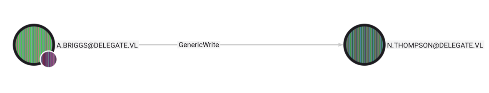

<br />


<br />

OS -> Windows.

Difficulty -> Medium.

<br />

# Introduction:

<br />


<br />

# Enumeration:

<br />

We start by running an `nmap` scan to see which ports are open:

<br />

```bash
❯ nmap -sCV -p53,88,135,139,389,445,464,593,636,3268,3269,3389,5985,9389,47001,49664,49665,49666,49667,49668,49670,54023,64755,65501,65502,65507,65519 10.129.34.106 -oN targeted
Starting Nmap 7.94SVN ( https://nmap.org ) at 2026-01-07 20:13 CET
Nmap scan report for 10.129.34.106
Host is up (0.044s latency).

PORT      STATE SERVICE       VERSION
53/tcp    open  domain        Simple DNS Plus
88/tcp    open  kerberos-sec  Microsoft Windows Kerberos (server time: 2026-01-07 19:13:31Z)
135/tcp   open  msrpc         Microsoft Windows RPC
139/tcp   open  netbios-ssn   Microsoft Windows netbios-ssn
389/tcp   open  ldap          Microsoft Windows Active Directory LDAP (Domain: delegate.vl0., Site: Default-First-Site-Name)
445/tcp   open  microsoft-ds?
464/tcp   open  kpasswd5?
593/tcp   open  ncacn_http    Microsoft Windows RPC over HTTP 1.0
636/tcp   open  tcpwrapped
3268/tcp  open  ldap          Microsoft Windows Active Directory LDAP (Domain: delegate.vl0., Site: Default-First-Site-Name)
3269/tcp  open  tcpwrapped
3389/tcp  open  ms-wbt-server Microsoft Terminal Services
| ssl-cert: Subject: commonName=DC1.delegate.vl
| Not valid before: 2026-01-06T19:09:14
|_Not valid after:  2026-07-08T19:09:14
|_ssl-date: 2026-01-07T19:15:06+00:00; +1s from scanner time.
| rdp-ntlm-info: 
|   Target_Name: DELEGATE
|   NetBIOS_Domain_Name: DELEGATE
|   NetBIOS_Computer_Name: DC1
|   DNS_Domain_Name: delegate.vl
|   DNS_Computer_Name: DC1.delegate.vl
|   DNS_Tree_Name: delegate.vl
|   Product_Version: 10.0.20348
|_  System_Time: 2026-01-07T19:14:26+00:00
5985/tcp  open  http          Microsoft HTTPAPI httpd 2.0 (SSDP/UPnP)
|_http-title: Not Found
|_http-server-header: Microsoft-HTTPAPI/2.0
9389/tcp  open  mc-nmf        .NET Message Framing
47001/tcp open  http          Microsoft HTTPAPI httpd 2.0 (SSDP/UPnP)
|_http-server-header: Microsoft-HTTPAPI/2.0
|_http-title: Not Found
49664/tcp open  msrpc         Microsoft Windows RPC
49665/tcp open  msrpc         Microsoft Windows RPC
49666/tcp open  msrpc         Microsoft Windows RPC
49667/tcp open  msrpc         Microsoft Windows RPC
49668/tcp open  msrpc         Microsoft Windows RPC
49670/tcp open  msrpc         Microsoft Windows RPC
54023/tcp open  msrpc         Microsoft Windows RPC
64755/tcp open  msrpc         Microsoft Windows RPC
65501/tcp open  ncacn_http    Microsoft Windows RPC over HTTP 1.0
65502/tcp open  msrpc         Microsoft Windows RPC
65507/tcp open  msrpc         Microsoft Windows RPC
65519/tcp open  msrpc         Microsoft Windows RPC
Service Info: Host: DC1; OS: Windows; CPE: cpe:/o:microsoft:windows

Host script results:
| smb2-security-mode: 
|   3:1:1: 
|_    Message signing enabled and required
| smb2-time: 
|   date: 2026-01-07T19:14:30
|_  start_date: N/A

Service detection performed. Please report any incorrect results at https://nmap.org/submit/ .
Nmap done: 1 IP address (1 host up) scanned in 103.32 seconds
```

<br />

Relevant open ports:

- `Port 53`   -> dns

- `Port 88`   -> kerberos

- `Port 135`  -> rpc

- `Port 139`  -> netbios

- `Port 389`  -> ldap

- `Port 445`  -> smb

- `Port 464`  -> kpasswd (kerberos password change)

- `Port 593`  -> rpc over http

- `Port 636`  -> ldaps

- `Port 3389` -> rdp

- `Port 5985` -> winrm

<br />

The domain `delegate.vl` and the hostname `DC1.delegate.vl` appear across multiple services and ports, so I’ll add them to my `/etc/hosts` file:

<br />

```bash
10.129.34.106 delegate.vl DC1.delegate.vl
```

<br />

# SMB Enumeration: -> Port 445 

<br />

To start enumerating this service, we'll run a basic [NetExec](https://github.com/Pennyw0rth/NetExec) oneliner to gather some information about the Windows system that we're auditing:

<br />

```bash
❯ nxc smb delegate.vl
SMB         10.129.34.106   445    DC1              [*] Windows Server 2022 Build 20348 x64 (name:DC1) (domain:delegate.vl) (signing:True) (SMBv1:None) (Null Auth:True)
```

<br />

The target is a Windows Server 2022, a Windows version without any active vulnerability or CVE to exploit.

The null session using a random username allowed us to list shares:

<br />

```bash
❯ nxc smb delegate.vl -u "RANDOM" -p "" --shares
SMB         10.129.34.106   445    DC1              [*] Windows Server 2022 Build 20348 x64 (name:DC1) (domain:delegate.vl) (signing:True) (SMBv1:None) (Null Auth:True)
SMB         10.129.34.106   445    DC1              [+] delegate.vl\RANDOM: (Guest)
SMB         10.129.34.106   445    DC1              [*] Enumerated shares
SMB         10.129.34.106   445    DC1              Share           Permissions     Remark
SMB         10.129.34.106   445    DC1              -----           -----------     ------
SMB         10.129.34.106   445    DC1              ADMIN$                          Remote Admin
SMB         10.129.34.106   445    DC1              C$                              Default share
SMB         10.129.34.106   445    DC1              IPC$            READ            Remote IPC
SMB         10.129.34.106   445    DC1              NETLOGON        READ            Logon server share 
SMB         10.129.34.106   445    DC1              SYSVOL          READ            Logon server share
```

<br />

If we access the `NETLOGON` default share with smbclient, there is a bat script called `users.bat`:

<br />

```bash
❯ smbclient //delegate.vl/NETLOGON -U ""
Password for [WORKGROUP\]:
Try "help" to get a list of possible commands.
smb: \> ls
  .                                   D        0  Sat Aug 26 14:45:24 2023
  ..                                  D        0  Sat Aug 26 11:45:45 2023
  users.bat                           A      159  Sat Aug 26 14:54:29 2023

		4652287 blocks of size 4096. 1095039 blocks available
smb: \> get users.bat 
getting file \users.bat of size 159 as users.bat (0,9 KiloBytes/sec) (average 0,9 KiloBytes/sec)
```

<br />

Inside the script we founded an interesting AD username and a password:

User: `A.Briggs`

Password: `P4ssw0rd1#123`

<br />

```bash
❯ /usr/bin/cat users.bat
rem @echo off
net use * /delete /y
net use v: \\dc1\development 

if %USERNAME%==A.Briggs net use h: \\fileserver\backups /user:Administrator P4ssw0rd1#123
```

<br />

Netexec confirmed that these credentials are valid for the SMB service:

<br />

```bash
❯ nxc smb delegate.vl -u a.briggs -p 'P4ssw0rd1#123'
SMB         10.129.34.106   445    DC1              [*] Windows Server 2022 Build 20348 x64 (name:DC1) (domain:delegate.vl) (signing:True) (SMBv1:None) (Null Auth:True)
SMB         10.129.34.106   445    DC1              [+] delegate.vl\a.briggs:P4ssw0rd1#123
```

<br />

However, it didn't work with WinRM or RDP.

This means that we can use this session to gather interesting AD data with tools such as `BloodHound`.

<br />

## BloodHound

<br />

Normally, we use `bloodhound-pyton` to the data extraction, instead of this tool, today we will use `Netexec`:

<br />

```bash
❯ nxc ldap delegate.vl -u a.briggs -p 'P4ssw0rd1#123' --bloodhound -c All --dns-server 10.129.34.106
LDAP        10.129.34.106   389    DC1              [*] Windows Server 2022 Build 20348 (name:DC1) (domain:delegate.vl) (signing:None) (channel binding:No TLS cert) 
LDAP        10.129.34.106   389    DC1              [+] delegate.vl\a.briggs:P4ssw0rd1#123 
LDAP        10.129.34.106   389    DC1              Resolved collection methods: trusts, session, container, rdp, localadmin, psremote, acl, objectprops, group, dcom
LDAP        10.129.34.106   389    DC1              Done in 0M 10S
LDAP        10.129.34.106   389    DC1              Compressing output into /home/theredp4nther/.nxc/logs/DC1_10.129.34.106_2026-01-07_204000_bloodhound.zip
```

<br />

### GenericWrite 

<br />

Once inside BloodHound, we marked the `A.Briggs` principal as owned and the `Shortest paths from Owned objects` revealed a crytical missconfiguration:

<br />



<br />

As we can see, the user `A.Briggs` has `GenericWrite` permissions over a user called `N.Thompson`.


This user is member of the `Remote Management Users` group, this means that if we compromised him, we will be able to authentica via `WinRM` ro the target machine.

<br />


<br />

This excesive permission can be exploited in several different ways. 
