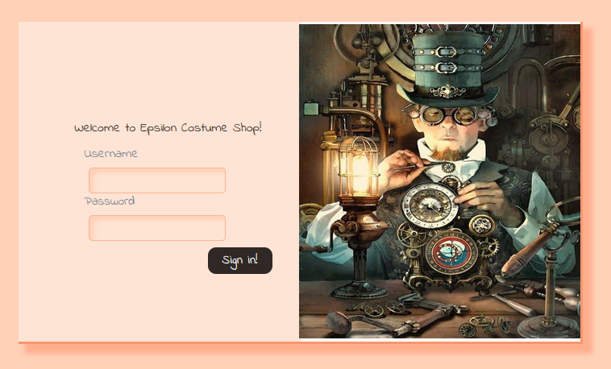
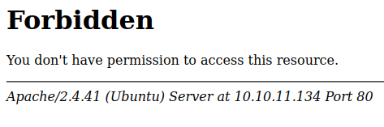

<br />


<br />

OS -> Linux.

Difficulty -> Medium.

<br />

# Introduction:

<br />


<br />

# Enumeration:

<br />

As always we are going to start with a `nmap` scan to enumerate the open ports and services running on the victim machine:

<br />

```bash
❯ nmap -p- 10.10.11.134 --open --min-rate 5000 -sS -T5 -Pn -n -sCV
Starting Nmap 7.94SVN ( https://nmap.org ) at 2025-05-24 12:29 CEST
Nmap scan report for 10.10.11.134
Host is up (0.049s latency).
Not shown: 65532 closed tcp ports (reset)
PORT     STATE SERVICE VERSION
22/tcp   open  ssh     OpenSSH 8.2p1 Ubuntu 4ubuntu0.4 (Ubuntu Linux; protocol 2.0)
| ssh-hostkey: 
|   3072 48:ad:d5:b8:3a:9f:bc:be:f7:e8:20:1e:f6:bf:de:ae (RSA)
|   256 b7:89:6c:0b:20:ed:49:b2:c1:86:7c:29:92:74:1c:1f (ECDSA)
|_  256 18:cd:9d:08:a6:21:a8:b8:b6:f7:9f:8d:40:51:54:fb (ED25519)
80/tcp   open  http    Apache httpd 2.4.41
|_http-title: 403 Forbidden
| http-git: 
|   10.10.11.134:80/.git/
|     Git repository found!
|     Repository description: Unnamed repository; edit this file 'description' to name the...
|_    Last commit message: Updating Tracking API  # Please enter the commit message for...
|_http-server-header: Apache/2.4.41 (Ubuntu)
5000/tcp open  http    Werkzeug httpd 2.0.2 (Python 3.8.10)
|_http-title: Costume Shop
|_http-server-header: Werkzeug/2.0.2 Python/3.8.10
Service Info: Host: 127.0.1.1; OS: Linux; CPE: cpe:/o:linux:linux_kernel

Service detection performed. Please report any incorrect results at https://nmap.org/submit/ .
Nmap done: 1 IP address (1 host up) scanned in 21.86 seconds
```

<br />

Open Ports:

`Port 22` -> ssh 

`Port 80` -> http 

`Port 5000` -> http

<br />

# Http Enumeration: -> Port 5000

<br />

If we browse the website on the port 5000, we're presented with a login panel:

<br />



<br />

We tried default credentials such as `admin:admin` and basic SQL Injection trying to bypass the login, but without success.

<br />

# Http Enumeration: -> Port 80

<br />

There is a website running on the port 80, but attempting to access it returns a `403 forbidden` status code:

<br />



<br />

## .git exposed:

<br />

At first glance, it seems there isn't much we can do here.

However, upon analyzing the `nmap` output, we notice the presence of a `.git` directory on the web server.

Using the popular tool [git-dumper](https://github.com/arthaud/git-dumper), we can retrieve the repository with the following oneliner:

<br />

```bash
❯ python3 git_dumper.py http://10.10.11.134/.git EPSILON
```

<br />

Now, we can explore the directory and inspect the contents of the dumped `.git` repository:

<br />

```bash
❯ ls -la
drwxr-xr-x root root  64 B  Sat May 24 12:44:24 2025  .
drwxr-xr-x root root 196 B  Sat May 24 12:44:21 2025  ..
drwxr-xr-x root root 146 B  Sat May 24 12:45:34 2025  .git
.rw-r--r-- root root 1.6 KB Sat May 24 12:44:24 2025  server.py
.rw-r--r-- root root 1.1 KB Sat May 24 12:44:24 2025  track_api_CR_148.py
```

<br />

As we can see, there are some interesting Python scripts along with the usual `.git` directory.

To better understand everything, we will analyze both of them.

<br />

### server.py:

<br />

This scripts appears to be the source code of the website running on port 5000.

There are different functionalities with their own paths.

The first one is a function named `verify_jwt`, which is used to validate the admin's identity:

<br />

```python3
secret = '<secret_key>'

def verify_jwt(token,key):
    try:
        username=jwt.decode(token,key,algorithms=['HS256',])['username']
        if username:
            return True
        else:
            return False
    except:
        return False
```

After that function, we have another one named `index`:

<br />

```python3 
@app.route("/", methods=["GET","POST"])
def index():
    if request.method=="POST":
        if request.form['username']=="admin" and request.form['password']=="admin":
            res = make_response()
            username=request.form['username']
            token=jwt.encode({"username":"admin"},secret,algorithm="HS256")
            res.set_cookie("auth",token)
            res.headers['location']='/home'
            return res,302
        else:
            return render_template('index.html')
    else:
        return render_template('index.html')
```

In this function, we can see that the `admin:admin` credentials should work, but as we saw earlier, they didn't.

<br />

The `home` function renders the homepage after verifying the admin's `JWT` using the `verify_jwt` function.

<br />

```python3 
@app.route("/home")
def home():
    if verify_jwt(request.cookies.get('auth'),secret):
        return render_template('home.html')
    else:
        return redirect('/',code=302)
```

<br />

The `/track` route only implements auth verification for the POST request, but not for the GET one.

<br />

```python3
@app.route("/track",methods=["GET","POST"])
def track():
    if request.method=="POST":
        if verify_jwt(request.cookies.get('auth'),secret):
            return render_template('track.html',message=True)
        else:
            return redirect('/',code=302)
    else:
        return render_template('track.html')
```

<br />

Finally, we have the `order` function.

This is the most interesting part, as it uses `user input` without any sanitization and renders it directly in a `template`.

This likely introduces an `SSTI` (Server Side Template Injection) vulnerability.

<br />

```python3 
@app.route('/order',methods=["GET","POST"])
def order():
    if verify_jwt(request.cookies.get('auth'),secret):
        if request.method=="POST":
            costume=request.form["costume"]
            message = '''
            Your order of "{}" has been placed successfully.
            '''.format(costume)
            tmpl=render_template_string(message,costume=costume)
            return render_template('order.html',message=tmpl)
        else:
            return render_template('order.html')
    else:
        return redirect('/',code=302)
```

<br />

### track_api_CR_148.py:

<br />

In the other script, we can found what seems to be an `AWS` (Amazon Web Services) instance.

<br />

```python3 
session = Session(
    aws_access_key_id='<aws_access_key_id>',
    aws_secret_access_key='<aws_secret_access_key>',
    region_name='us-east-1',
    endpoint_url='http://cloud.epsilon.htb')
aws_lambda = session.client('lambda')
```

<br />


