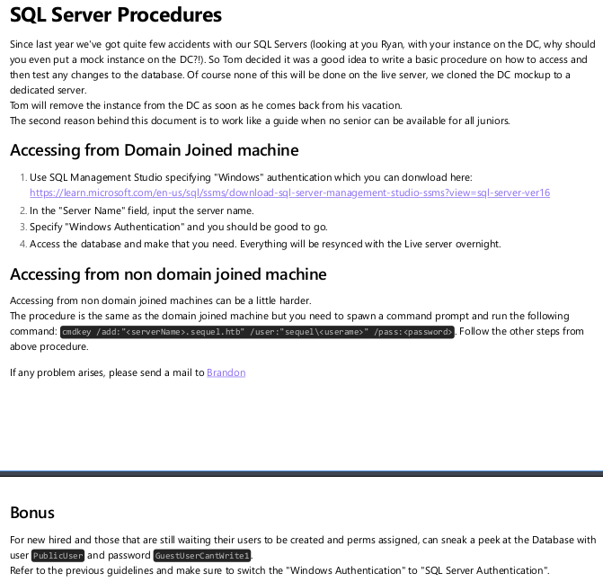

<br />


<br />

OS -> Windows.

Difficulty -> Medium.

<br />

# Introduction:

<br />


<br />

# Enumeration:

<br />

We start by running the typical `nmap` scan to see which ports are open:

<br />

```bash
❯ nmap -p- 10.10.11.202 --open --min-rate 5000 -sS -T5 -Pn -n -sCV
Starting Nmap 7.94SVN ( https://nmap.org ) at 2025-05-02 20:12 CEST
Nmap scan report for 10.10.11.202
Host is up (0.051s latency).
Not shown: 65515 filtered tcp ports (no-response)
Some closed ports may be reported as filtered due to --defeat-rst-ratelimit
PORT      STATE SERVICE       VERSION
53/tcp    open  domain        Simple DNS Plus
88/tcp    open  kerberos-sec  Microsoft Windows Kerberos (server time: 2025-05-03 02:11:56Z)
135/tcp   open  msrpc         Microsoft Windows RPC
139/tcp   open  netbios-ssn   Microsoft Windows netbios-ssn
389/tcp   open  ldap          Microsoft Windows Active Directory LDAP (Domain: sequel.htb0., Site: Default-First-Site-Name)
|_ssl-date: 2025-05-03T02:13:26+00:00; +7h58m14s from scanner time.
| ssl-cert: Subject: 
| Subject Alternative Name: DNS:dc.sequel.htb, DNS:sequel.htb, DNS:sequel
| Not valid before: 2024-01-18T23:03:57
|_Not valid after:  2074-01-05T23:03:57
445/tcp   open  microsoft-ds?
464/tcp   open  kpasswd5?
593/tcp   open  ncacn_http    Microsoft Windows RPC over HTTP 1.0
636/tcp   open  ssl/ldap      Microsoft Windows Active Directory LDAP (Domain: sequel.htb0., Site: Default-First-Site-Name)
|_ssl-date: 2025-05-03T02:13:26+00:00; +7h58m15s from scanner time.
| ssl-cert: Subject: 
| Subject Alternative Name: DNS:dc.sequel.htb, DNS:sequel.htb, DNS:sequel
| Not valid before: 2024-01-18T23:03:57
|_Not valid after:  2074-01-05T23:03:57
1433/tcp  open  ms-sql-s      Microsoft SQL Server 2019 15.00.2000.00; RTM
|_ms-sql-info: ERROR: Script execution failed (use -d to debug)
|_ssl-date: 2025-05-03T02:13:26+00:00; +7h58m14s from scanner time.
| ssl-cert: Subject: commonName=SSL_Self_Signed_Fallback
| Not valid before: 2025-05-03T00:42:02
|_Not valid after:  2055-05-03T00:42:02
|_ms-sql-ntlm-info: ERROR: Script execution failed (use -d to debug)
3268/tcp  open  ldap          Microsoft Windows Active Directory LDAP (Domain: sequel.htb0., Site: Default-First-Site-Name)
|_ssl-date: 2025-05-03T02:13:26+00:00; +7h58m14s from scanner time.
| ssl-cert: Subject: 
| Subject Alternative Name: DNS:dc.sequel.htb, DNS:sequel.htb, DNS:sequel
| Not valid before: 2024-01-18T23:03:57
|_Not valid after:  2074-01-05T23:03:57
3269/tcp  open  ssl/ldap      Microsoft Windows Active Directory LDAP (Domain: sequel.htb0., Site: Default-First-Site-Name)
|_ssl-date: 2025-05-03T02:13:26+00:00; +7h58m15s from scanner time.
| ssl-cert: Subject: 
| Subject Alternative Name: DNS:dc.sequel.htb, DNS:sequel.htb, DNS:sequel
| Not valid before: 2024-01-18T23:03:57
|_Not valid after:  2074-01-05T23:03:57
5985/tcp  open  http          Microsoft HTTPAPI httpd 2.0 (SSDP/UPnP)
|_http-title: Not Found
|_http-server-header: Microsoft-HTTPAPI/2.0
9389/tcp  open  mc-nmf        .NET Message Framing
49667/tcp open  msrpc         Microsoft Windows RPC
49689/tcp open  ncacn_http    Microsoft Windows RPC over HTTP 1.0
49690/tcp open  msrpc         Microsoft Windows RPC
49713/tcp open  msrpc         Microsoft Windows RPC
49722/tcp open  msrpc         Microsoft Windows RPC
49752/tcp open  msrpc         Microsoft Windows RPC
Service Info: Host: DC; OS: Windows; CPE: cpe:/o:microsoft:windows

Host script results:
| smb2-security-mode: 
|   3:1:1: 
|_    Message signing enabled and required
| smb2-time: 
|   date: 2025-05-03T02:12:47
|_  start_date: N/A
|_clock-skew: mean: 7h58m14s, deviation: 0s, median: 7h58m13s

Service detection performed. Please report any incorrect results at https://nmap.org/submit/ .
Nmap done: 1 IP address (1 host up) scanned in 136.36 seconds
```

<br />

Relevant Open Ports:

- `Port 53`   -> dns  

- `Port 88`   -> kerberos  

- `Port 135`  -> rpc  

- `Port 139`  -> netbios  

- `Port 389`  -> ldap  

- `Port 445`  -> smb  

- `Port 464`  -> kpasswd (kerberos password change)  

- `Port 593`  -> rpc over http  

- `Port 636`  -> ldaps  

- `Port 1433` -> mssql  

- `Port 5985` -> winrm  

<br />

The nmap script shows in LDAP service the domain name of `sequel.htb` and the TLS certificate `dc.sequel.htb`.

So we add them to our `/etc/hosts`:

<br />

```bash
10.10.11.202 sequel.htb dc.sequel.htb
```

<br />

# TLS Certificate: Port -> 3269

<br />

Let's inspect the `TLS` certificate using `openssl` to check for any relevant information:

<br />

```bash
---
Server certificate
subject=
issuer=DC = htb, DC = sequel, CN = sequel-DC-CA
---
```

<br />

The only noteworthy detail in the output is the `CA` certificate name: `sequel-DC-CA`.

<br />

# SMB Enumeration: Port -> 445

<br />

To gather additional system information, we'll start with a classic `Crackmapexec` oneliner:

<br />

```bash
❯ crackmapexec smb 10.10.11.202
SMB         10.10.11.202    445    DC               [*] Windows 10.0 Build 17763 x64 (name:DC) (domain:sequel.htb) (signing:True) (SMBv1:False)
```

<br />

As seen in the output, the host is running  Windows 10 (Build 17763), and we confirm the domain name: `sequel.htb`

<br />

Next, we attempt a `null session` (empty password) to enumerate shared resources over `SMB`:

<br />

```bash
❯ crackmapexec smb 10.10.11.202 -u 'fakeuser' -p '' --shares
SMB         10.10.11.202    445    DC               [*] Windows 10.0 Build 17763 x64 (name:DC) (domain:sequel.htb) (signing:True) (SMBv1:False)
SMB         10.10.11.202    445    DC               [+] sequel.htb\fakeuser: 
SMB         10.10.11.202    445    DC               [*] Enumerated shares
SMB         10.10.11.202    445    DC               Share           Permissions     Remark
SMB         10.10.11.202    445    DC               -----           -----------     ------
SMB         10.10.11.202    445    DC               ADMIN$                          Remote Admin
SMB         10.10.11.202    445    DC               C$                              Default share
SMB         10.10.11.202    445    DC               IPC$            READ            Remote IPC
SMB         10.10.11.202    445    DC               NETLOGON                        Logon server share 
SMB         10.10.11.202    445    DC               Public          READ            
SMB         10.10.11.202    445    DC               SYSVOL                          Logon server share
```

<br />

Great! The `Public` share is not a default folder, and we have `READ` access to it.

While enumerating this folder with `smbclient` we find an interesting SQL pdf:

<br />

```bash
❯ smbclient //10.10.11.202/Public -N
Try "help" to get a list of possible commands.
smb: \> ls
  .                                   D        0  Sat Nov 19 12:51:25 2022
  ..                                  D        0  Sat Nov 19 12:51:25 2022
  SQL Server Procedures.pdf           A    49551  Fri Nov 18 14:39:43 2022

		5184255 blocks of size 4096. 1465497 blocks available
smb: \> get "SQL Server Procedures.pdf"
getting file \SQL Server Procedures.pdf of size 49551 as SQL Server Procedures.pdf (177,9 KiloBytes/sec) (average 177,9 KiloBytes/sec)
```

<br />

We `download` the file using get and open it locally for further analysis:

<br />

```bash
open "SQL Server Procedures.pdf"
```

<br />



<br />

At the end of the PDF, we have discover some potential useful `SQL` credentials: `PublicUser:GuestUserCantWrite1`

They are mentioned in the following excerpt:

<br />

```bash
For new hired and those that are still waiting their users to be created and perms assigned, can sneak a peek at the Database with
user PublicUser and password GuestUserCantWrite1 .
Refer to the previous guidelines and make sure to switch the "Windows Authentication" to "SQL Server Authentication".
```

<br />

These credentials do not grant access to any SMB shares.

<br />

# MSSQL Enumeration:

<br />
