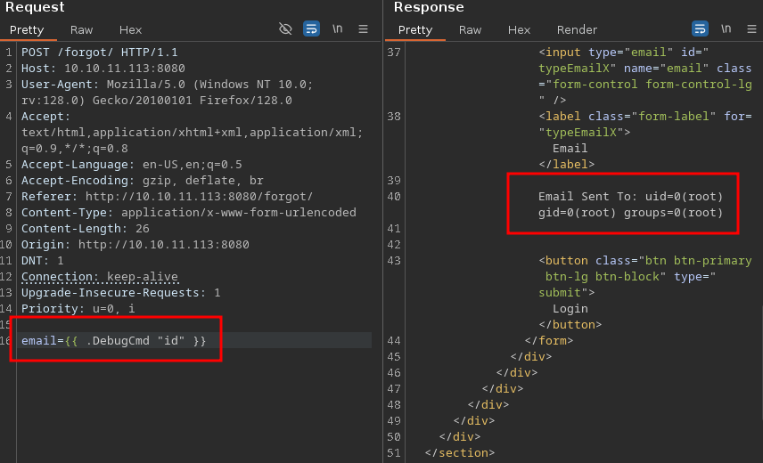

<br />


<br />

OS -> Linux.

Difficulty -> Medium.

<br />

# Introduction:

<br />


<br />

# Enumeration:

<br />

We start by running the typical `nmap` scan to see which ports are open:

<br />

```bash
❯ nmap -p- 10.10.11.113 --open --min-rate 5000 -sS -T5 -Pn -n -sCV
Starting Nmap 7.94SVN ( https://nmap.org ) at 2025-04-16 17:33 CEST
Nmap scan report for 10.10.11.113
Host is up (0.044s latency).
Not shown: 65413 closed tcp ports (reset), 118 filtered tcp ports (no-response)
Some closed ports may be reported as filtered due to --defeat-rst-ratelimit
PORT     STATE SERVICE VERSION
22/tcp   open  ssh     OpenSSH 8.2p1 Ubuntu 4ubuntu0.3 (Ubuntu Linux; protocol 2.0)
| ssh-hostkey: 
|   3072 d8:f5:ef:d2:d3:f9:8d:ad:c6:cf:24:85:94:26:ef:7a (RSA)
|   256 46:3d:6b:cb:a8:19:eb:6a:d0:68:86:94:86:73:e1:72 (ECDSA)
|_  256 70:32:d7:e3:77:c1:4a:cf:47:2a:de:e5:08:7a:f8:7a (ED25519)
80/tcp   open  http    nginx
|_http-title: Hacking eSports | {{.Title}}
4566/tcp open  http    nginx
|_http-title: 403 Forbidden
8080/tcp open  http    nginx
|_http-open-proxy: Proxy might be redirecting requests
|_http-title: Hacking eSports | Home page
Service Info: OS: Linux; CPE: cpe:/o:linux:linux_kernel

Service detection performed. Please report any incorrect results at https://nmap.org/submit/ .
Nmap done: 1 IP address (1 host up) scanned in 27.39 seconds
```

<br />

Open Ports:

- `Port 22` -> ssh 

- `Port 80` -> http

- `Port 4566` -> internal service (?)

- `Port 8080` -> http

<br />

# Http Enumeration: -> Port 80

<br />

Browsing the website on port 80:

<br />


<br />

It's a page for an `eSports` hacking competition, but we there is nothing `useful` or interactive at first glance.

We move on to the next HTPP port.

<br />

# Http Enumeration: -> Port 8080

<br />

The front page on port 8080 shows a `login panel`:

<br />


<br />

We try some common default `credentials` but none of them work.

Clicking on the "`Forgot Password`" link reveals the following form:

<br />


<br />

Submitting a random email shows our `input` reflected in the `response`:

<br />


<br />

As we know, being able to control the `output`, open the door to several types of `vulnerabilities`.

So, we intercept the request using `Burp Suite`:

<br />


<br />

Inside Burp Suite, there are two `key` things worth nothing:

- 1.- `X-Forwarded-Server: golang`:

This header reveals to us the `technology` stack used by the backend - In this case, `Golang`. 

It's useful `information` when testing for technology specific `vulnerabilities`.

<br />

```bash
HTTP/1.1 200 OK␍
Server: nginx␍
Date: Wed, 16 Apr 2025 16:11:59 GMT␍
Content-Type: text/html; charset=utf-8␍
Connection: keep-alive␍
X-Forwarded-Server: golang␍
Content-Length: 1513
```

<br />

- 2.- `Email validation is on the client-side only`:

Burp Suite allows us to `bypass` the Front-End validation by sending arbitrary values - even `non email` strings:

<br />


<br />

At this point, a specific vulnerability becomes more likely given the context, `SSTI (Server Side Template Injection)`.

<br />

## SSTI - GOLANG:

<br />

After some research, I found this [post](https://dev.to/blue_byte/server-side-template-injection-in-go-28md) that explains how to extract internal data from `Golang` template engines by exploiting SSTI.

<br />

### SSTI Test Payloads:

<br />

We start testing SSTI `basic` payloads such as:


```go
{{ printf "TESTING" }}
```


<br />

With this result:

<br />


<br />

Perfect! The `Golang` template engine is interpreting our `payload` succesfully!

Next, we attempt to `extract` internal data:


```go
{{ . }}
```


<br />


<br />

It works! Some `credentials` are revealed in the output.

We can use them to `log` in to the login panel we found earlier:

<br />


<br />

Inside, we can see the `source code` of the main Golang application.

While analyzing it, we find an interesting `function` called (DebugCmd):

<br />


<br />

## DebugCmd - RCE:

<br />

We can `invoke` this `function` by writting its name preceded by a dot (.).

Any `arguments` passed to this function, will be `executed` as system commands.

To test it, we are going to execute a `"id"`:

<br />



<br />

The `command` was executed succesfully.

But we are probably into a docker `container`, because it's really strange to gain access as `root`.

To check we it `run` the following:

<br />


<br />
