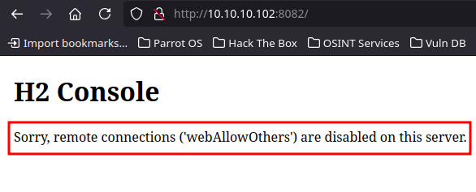
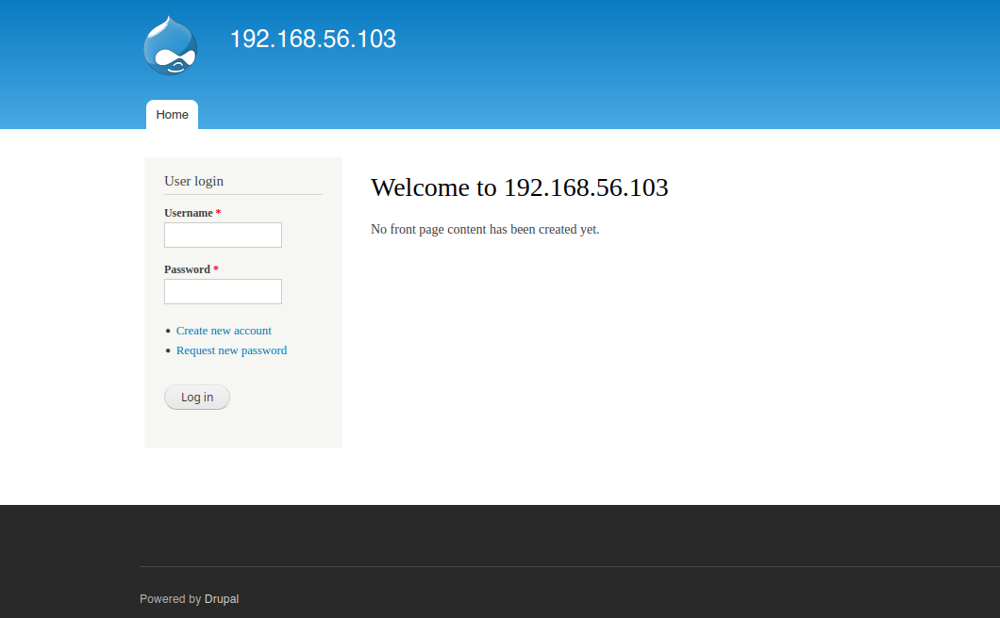
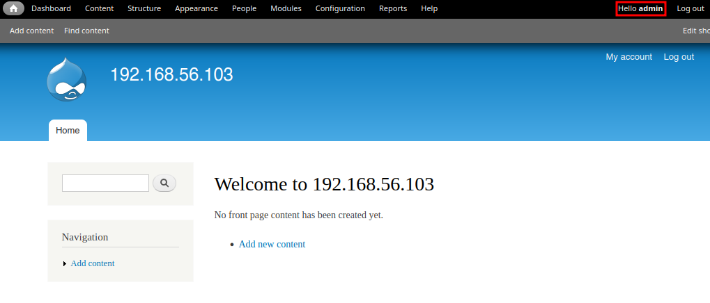
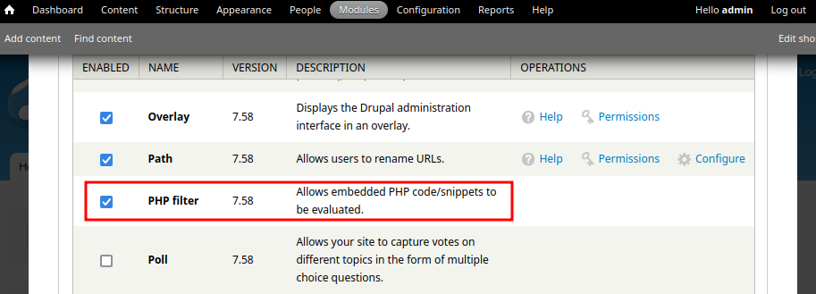

<br />


<br />

OS -> Linux.

Difficulty -> Medium.

<br />

# Introduction:
<br />

Hello hackers! Today we’ll tackle the Hawk Machine, a medium-difficulty Linux challenge. We’ll start by retrieving an OpenSSL-encoded file from an FTP server with anonymous login enabled. After brute-forcing it using a custom Bash utility we create ourselves, we’ll obtain credentials to access a Drupal site where we can execute PHP code and gain system access. Once inside, we’ll retrieve credentials from a configuration file to pivot to another user. Finally, we’ll exploit a vulnerable internal service to escalate privileges and become root.

<br />

# Enumeration:

<br />

Run the typical nmap scan to see which ports are open:

<br />

```Bash
❯ nmap -p- 10.10.10.102 --open --min-rate 5000 -sS -T5 -Pn -n -sCV
Starting Nmap 7.94SVN ( https://nmap.org ) at 2025-01-12 15:09 CET
Nmap scan report for 10.10.10.102
Host is up (0.079s latency).
Not shown: 65529 closed tcp ports (reset)
PORT     STATE SERVICE       VERSION
21/tcp   open  ftp           vsftpd 3.0.3
| ftp-syst: 
|   STAT: 
| FTP server status:
|      Connected to ::ffff:10.10.14.13
|      Logged in as ftp
|      TYPE: ASCII
|      No session bandwidth limit
|      Session timeout in seconds is 300
|      Control connection is plain text
|      Data connections will be plain text
|      At session startup, client count was 2
|      vsFTPd 3.0.3 - secure, fast, stable
|_End of status
| ftp-anon: Anonymous FTP login allowed (FTP code 230)
|_drwxr-xr-x    2 ftp      ftp          4096 Jun 16  2018 messages
22/tcp   open  ssh           OpenSSH 7.6p1 Ubuntu 4 (Ubuntu Linux; protocol 2.0)
| ssh-hostkey: 
|   2048 e4:0c:cb:c5:a5:91:78:ea:54:96:af:4d:03:e4:fc:88 (RSA)
|   256 95:cb:f8:c7:35:5e:af:a9:44:8b:17:59:4d:db:5a:df (ECDSA)
|_  256 4a:0b:2e:f7:1d:99:bc:c7:d3:0b:91:53:b9:3b:e2:79 (ED25519)
80/tcp   open  http          Apache httpd 2.4.29 ((Ubuntu))
|_http-title: Welcome to 192.168.56.103 | 192.168.56.103
|_http-generator: Drupal 7 (http://drupal.org)
|_http-server-header: Apache/2.4.29 (Ubuntu)
| http-robots.txt: 36 disallowed entries (15 shown)
| /includes/ /misc/ /modules/ /profiles/ /scripts/ 
| /themes/ /CHANGELOG.txt /cron.php /INSTALL.mysql.txt 
| /INSTALL.pgsql.txt /INSTALL.sqlite.txt /install.php /INSTALL.txt 
|_/LICENSE.txt /MAINTAINERS.txt
5435/tcp open  tcpwrapped
8082/tcp open  http          H2 database http console
|_http-title: H2 Console
9092/tcp open  XmlIpcRegSvc?
1 service unrecognized despite returning data. If you know the service/version, please submit the following fingerprint at https://nmap.org/cgi-bin/submit.cgi?new-service :
SF-Port9092-TCP:V=7.94SVN%I=7%D=1/12%Time=6783CD17%P=x86_64-pc-linux-gnu%r
SF:(NULL,45E,"\0\0\0\0\0\0\0\x05\x009\x000\x001\x001\x007\0\0\0F\0R\0e\0m\
SF:0o\0t\0e\0\x20\0c\0o\0n\0n\0e\0c\0t\0i\0o\0n\0s\0\x20\0t\0o\0\x20\0t\0h
SF:\0i\0s\0\x20\0s\0e\0r\0v\0e\0r\0\x20\0a\0r\0e\0\x20\0n\0o\0t\0\x20\0a\0
SF:l\0l\0o\0w\0e\0d\0,\0\x20\0s\0e\0e\0\x20\0-\0t\0c\0p\0A\0l\0l\0o\0w\0O\
SF:0t\0h\0e\0r\0s\xff\xff\xff\xff\0\x01`\x05\0\0\x01\xd8\0o\0r\0g\0\.\0h\x
SF:002\0\.\0j\0d\0b\0c\0\.\0J\0d\0b\0c\0S\0Q\0L\0E\0x\0c\0e\0p\0t\0i\0o\0n
SF:\0:\0\x20\0R\0e\0m\0o\0t\0e\0\x20\0c\0o\0n\0n\0e\0c\0t\0i\0o\0n\0s\0\x2
SF:0\0t\0o\0\x20\0t\0h\0i\0s\0\x20\0s\0e\0r\0v\0e\0r\0\x20\0a\0r\0e\0\x20\
SF:0n\0o\0t\0\x20\0a\0l\0l\0o\0w\0e\0d\0,\0\x20\0s\0e\0e\0\x20\0-\0t\0c\0p
SF:\0A\0l\0l\0o\0w\0O\0t\0h\0e\0r\0s\0\x20\0\[\x009\x000\x001\x001\x007\0-
SF:\x001\x009\x006\0\]\0\n\0\t\0a\0t\0\x20\0o\0r\0g\0\.\0h\x002\0\.\0m\0e\
SF:0s\0s\0a\0g\0e\0\.\0D\0b\0E\0x\0c\0e\0p\0t\0i\0o\0n\0\.\0g\0e\0t\0J\0d\
SF:0b\0c\0S\0Q\0L\0E\0x\0c\0e\0p\0t\0i\0o\0n\0\(\0D\0b\0E\0x\0c\0e\0p\0t\0
SF:i\0o\0n\0\.\0j\0a\0v\0a\0:\x003\x004\x005\0\)\0\n\0\t\0a\0t\0\x20\0o\0r
SF:\0g\0\.\0h\x002\0\.\0m\0e\0s\0s\0a\0g\0e\0\.\0D\0b\0E\0x\0c\0e\0p\0t\0i
SF:\0o\0n\0\.\0g\0e\0t\0\(\0D\0b\0E\0x\0c\0e\0p\0t\0i\0o\0n\0\.\0j\0a\0v\0
SF:a\0:\x001\x007\x009\0\)\0\n\0\t\0a\0t\0\x20\0o\0r\0g\0\.\0h\x002\0\.\0m
SF:\0e\0s\0s\0a\0g\0e\0\.\0D\0b\0E\0x\0c\0e\0p\0t\0i\0o\0n\0\.\0g\0e\0t\0\
SF:(\0D\0b\0E\0x\0c\0e\0p\0t\0i\0o\0n\0\.\0j\0a\0v\0a\0:\x001\x005\x005\0\
SF:)\0\n\0\t\0a\0t\0\x20\0o\0r\0g\0\.\0h\x002\0\.\0m\0e\0s\0s\0a\0g\0e\0\.
SF:\0D\0b\0E\0x\0c\0e\0p\0t\0i\0o\0n\0\.\0g\0e\0t\0\(\0D\0b\0E\0x\0c\0e\0p
SF:\0t\0i\0o\0n\0\.\0j\0a\0v\0a\0:\x001\x004\x004\0\)\0\n\0\t\0a\0t\0\x20\
SF:0o\0r")%r(informix,45E,"\0\0\0\0\0\0\0\x05\x009\x000\x001\x001\x007\0\0
SF:\0F\0R\0e\0m\0o\0t\0e\0\x20\0c\0o\0n\0n\0e\0c\0t\0i\0o\0n\0s\0\x20\0t\0
SF:o\0\x20\0t\0h\0i\0s\0\x20\0s\0e\0r\0v\0e\0r\0\x20\0a\0r\0e\0\x20\0n\0o\
SF:0t\0\x20\0a\0l\0l\0o\0w\0e\0d\0,\0\x20\0s\0e\0e\0\x20\0-\0t\0c\0p\0A\0l
SF:\0l\0o\0w\0O\0t\0h\0e\0r\0s\xff\xff\xff\xff\0\x01`\x05\0\0\x01\xd8\0o\0
SF:r\0g\0\.\0h\x002\0\.\0j\0d\0b\0c\0\.\0J\0d\0b\0c\0S\0Q\0L\0E\0x\0c\0e\0
SF:p\0t\0i\0o\0n\0:\0\x20\0R\0e\0m\0o\0t\0e\0\x20\0c\0o\0n\0n\0e\0c\0t\0i\
SF:0o\0n\0s\0\x20\0t\0o\0\x20\0t\0h\0i\0s\0\x20\0s\0e\0r\0v\0e\0r\0\x20\0a
SF:\0r\0e\0\x20\0n\0o\0t\0\x20\0a\0l\0l\0o\0w\0e\0d\0,\0\x20\0s\0e\0e\0\x2
SF:0\0-\0t\0c\0p\0A\0l\0l\0o\0w\0O\0t\0h\0e\0r\0s\0\x20\0\[\x009\x000\x001
SF:\x001\x007\0-\x001\x009\x006\0\]\0\n\0\t\0a\0t\0\x20\0o\0r\0g\0\.\0h\x0
SF:02\0\.\0m\0e\0s\0s\0a\0g\0e\0\.\0D\0b\0E\0x\0c\0e\0p\0t\0i\0o\0n\0\.\0g
SF:\0e\0t\0J\0d\0b\0c\0S\0Q\0L\0E\0x\0c\0e\0p\0t\0i\0o\0n\0\(\0D\0b\0E\0x\
SF:0c\0e\0p\0t\0i\0o\0n\0\.\0j\0a\0v\0a\0:\x003\x004\x005\0\)\0\n\0\t\0a\0
SF:t\0\x20\0o\0r\0g\0\.\0h\x002\0\.\0m\0e\0s\0s\0a\0g\0e\0\.\0D\0b\0E\0x\0
SF:c\0e\0p\0t\0i\0o\0n\0\.\0g\0e\0t\0\(\0D\0b\0E\0x\0c\0e\0p\0t\0i\0o\0n\0
SF:\.\0j\0a\0v\0a\0:\x001\x007\x009\0\)\0\n\0\t\0a\0t\0\x20\0o\0r\0g\0\.\0
SF:h\x002\0\.\0m\0e\0s\0s\0a\0g\0e\0\.\0D\0b\0E\0x\0c\0e\0p\0t\0i\0o\0n\0\
SF:.\0g\0e\0t\0\(\0D\0b\0E\0x\0c\0e\0p\0t\0i\0o\0n\0\.\0j\0a\0v\0a\0:\x001
SF:\x005\x005\0\)\0\n\0\t\0a\0t\0\x20\0o\0r\0g\0\.\0h\x002\0\.\0m\0e\0s\0s
SF:\0a\0g\0e\0\.\0D\0b\0E\0x\0c\0e\0p\0t\0i\0o\0n\0\.\0g\0e\0t\0\(\0D\0b\0
SF:E\0x\0c\0e\0p\0t\0i\0o\0n\0\.\0j\0a\0v\0a\0:\x001\x004\x004\0\)\0\n\0\t
SF:\0a\0t\0\x20\0o\0r");
Service Info: OSs: Unix, Linux; CPE: cpe:/o:linux:linux_kernel

Service detection performed. Please report any incorrect results at https://nmap.org/submit/ .
Nmap done: 1 IP address (1 host up) scanned in 30.36 seconds
```

<br />

Open Ports:

- `Port 21` -> ftp
- `Port 22` -> ssh 
- `Port 80` -> http
- `Port 5435` -> TCP Wrapper
- `Port 8082` -> H2 Console
- `Port 9092` -> Unknown

<br />

# H2 Console -> Port 8082

<br />

Started by listing this port because it particularly caught my attention, but in doing so we see that it is an `internal service` (H2 Console) in which we `cannot do much`.

<br />



<br />

# FTP Enumeration: -> Port 21 

<br />

Anonymous Login is Allowed, so try to `connect` the `FTP Server` as `anonymous` to enumerate it:

<br />

```Bash
❯ ftp 10.10.10.102
Connected to 10.10.10.102.
220 (vsFTPd 3.0.3)
Name (10.10.10.102:theredp4nther): anonymous
230 Login successful.
Remote system type is UNIX.
Using binary mode to transfer files.
```

<br />

Once in, we find a file `".drupal.txt.enc"` that seems interesting, so we keep it to our machine:

<br />

```Bash
ftp> ls -la
229 Entering Extended Passive Mode (|||46102|)
150 Here comes the directory listing.
drwxr-xr-x    3 ftp      ftp          4096 Jun 16  2018 .
drwxr-xr-x    3 ftp      ftp          4096 Jun 16  2018 ..
drwxr-xr-x    2 ftp      ftp          4096 Jun 16  2018 messages
226 Directory send OK.
ftp> cd messages
250 Directory successfully changed.
ftp> ls -la
229 Entering Extended Passive Mode (|||42404|)
150 Here comes the directory listing.
drwxr-xr-x    2 ftp      ftp          4096 Jun 16  2018 .
drwxr-xr-x    3 ftp      ftp          4096 Jun 16  2018 ..
-rw-r--r--    1 ftp      ftp           240 Jun 16  2018 .drupal.txt.enc
226 Directory send OK.
ftp> get .drupal.txt.enc
local: .drupal.txt.enc remote: .drupal.txt.enc
229 Entering Extended Passive Mode (|||44725|)
150 Opening BINARY mode data connection for .drupal.txt.enc (240 bytes).
100% |******************************************************************************************************************************************|   240       67.42 KiB/s    00:00 ETA
226 Transfer complete.
240 bytes received in 00:00 (5.02 KiB/s)
```

<br />

Apply a cat to it and we see that it seems that its content is in `base64`.

<br />

```Bash
❯ cat .drupal.txt.enc
───────┬───────────────────────────────────────────────────────────────────────────────────────────────────────────────────────────────────────────────────────────────────────────────
       │ File: .drupal.txt.enc
───────┼───────────────────────────────────────────────────────────────────────────────────────────────────────────────────────────────────────────────────────────────────────────────
   1   │ U2FsdGVkX19rWSAG1JNpLTawAmzz/ckaN1oZFZewtIM+e84km3Csja3GADUg2jJb
   2   │ CmSdwTtr/IIShvTbUd0yQxfe9OuoMxxfNIUN/YPHx+vVw/6eOD+Cc1ftaiNUEiQz
   3   │ QUf9FyxmCb2fuFoOXGphAMo+Pkc2ChXgLsj4RfgX+P7DkFa8w1ZA9Yj7kR+tyZfy
   4   │ t4M0qvmWvMhAj3fuuKCCeFoXpYBOacGvUHRGywb4YCk=
```

<br />

Make a `base64 -d` and save the binary output into another file:

<br />

```Bash
❯ cat .drupal.txt.enc | base64 -d
Salted__kY ԓi-6�l���7Z����>{�$�p����5 �2[
���������8?�sW�j#T$3AG�,f	���Z\ja�>>G6
�.��E���ÐV��V@�����ɗ�4�����@�w�xZ��Ni��PtF��`)#                                                                                                                                       ❯ cat .drupal.txt.enc | base64 -d > drupal.enc
```
<br />

## Openssl Encrypt:

<br />

Take a look to see what `kind of file` it is and surprise! It's `openssl encrypted`:

<br />

```Bash
❯ file drupal.enc
drupal.enc: openssl enc'd data with salted password
```

<br />

After doing several searches on Google, discovered the following oneliner to decrypt the file:

`openssl enc -d -aes-256-cbc -salt -in drupal.enc -out content.txt -pass pass:$password`

-> `enc -d`: Decrypt Option.

-> `-aes-256-cbc`: Cipher type.

-> `-salt`: Indicate that the file contains a salt.

-> `-in`: File to decrypt.

-> `-out`: Decrypted file.

-> `-pass`: Indicate the password that we want to use.

<br />

To `automate` this process, I `created` the following `bash script` using a loop with `"while read"` to be able to test all the `passwords` in a `dictionary` until finding a valid one:

<br />

```bash
#!/bin/bash

# Author TheRedP4nther

# Global Variables:
dictionary="/usr/share/wordlists/rockyou.txt"
file="drupal.enc"

echo -e "\n[+] Bruteforcing the file -> $file.\n"

while read password; do 
  echo -e "[+] Testing the password: $password"
  openssl enc -d -aes-256-cbc -salt -in drupal.enc -out content.txt -pass pass:$password 2>/dev/null
  if [ "$?" -eq 0 ]; then 
    echo -e "\n[+] The correct password is -> $password"
    echo -e "[+] Decrypted content was saved into the file -> $file"
    break
  else
    continue
  fi
done < "$dictionary"
```

<br />

Successfully got the `password`:

<br />

```bash
❯ bash bruteforce.sh

[+] Bruteforcing the file -> drupal.enc.

[+] Testing the password: 123456
[+] Testing the password: 12345
[+] Testing the password: 123456789
[+] Testing the password: password
[+] Testing the password: iloveyou
[+] Testing the password: princess
[+] Testing the password: 1234567
[+] Testing the password: rockyou
[+] Testing the password: 12345678
[+] Testing the password: abc123
[+] Testing the password: nicole
[+] Testing the password: daniel
[+] Testing the password: babygirl
[+] Testing the password: monkey
[+] Testing the password: lovely
[+] Testing the password: jessica
[+] Testing the password: 654321
[+] Testing the password: michael
[+] Testing the password: ashley
[+] Testing the password: qwerty
[+] Testing the password: 111111
[+] Testing the password: iloveu
[+] Testing the password: 000000
[+] Testing the password: michelle
[+] Testing the password: tigger
[+] Testing the password: sunshine
[+] Testing the password: chocolate
[+] Testing the password: password1
[+] Testing the password: soccer
[+] Testing the password: anthony
[+] Testing the password: friends

[+] The correct password is -> friends
[+] Decrypted content was saved into the file -> content.txt.
```

<br />

`Content` of the `decrypted file`:

<br />

```bash
❯ cat content.txt
───────┬───────────────────────────────────────────────────────────────────────────────────────────────────────────────────────────────────────────────────────────────────────────────
       │ File: content.txt
───────┼───────────────────────────────────────────────────────────────────────────────────────────────────────────────────────────────────────────────────────────────────────────────
   1   │ Daniel,
   2   │ 
   3   │ Following the password for the portal:
   4   │ 
   5   │ PencilKeyboardScanner123
   6   │ 
   7   │ Please let us know when the portal is ready.
   8   │ 
   9   │ Kind Regards,
  10   │ 
  11   │ IT department
```

<br />

As we can see, we have what appears to be a `password`, let's continue listing to see if we can `find where we can use it`.

<br />

# Http Enumeration: -> Port 80 (Drupal):

<br />

Proceed to list the `website` and land on a `Drupal` with its `login panel`:

<br />



<br />

We have a `login panel`, so try to log in as the `admin` user with the `credentials` of the `decrypted file` and we're in!

`USER`: admin

`PASSWORD`: PencilKeyboardScanner123 

<br />



<br />

Now that we are inside, as we know, drupal has the ability to execute php code in its posts, but to do, we need to activate the option in the "Modules" section:

<br />



<br />

Once activated, we leave modules, click on Content -> Add Content -> Article. Cover all the data by injecting the PHP code in the "Body" field and select the "PHP Code" option in text format.

<br />


