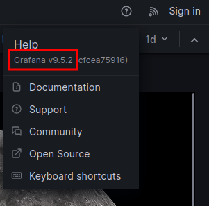

<br />


<br />

OS -> Linux.

Difficulty -> Medium.

<br />

# Introduction:

<br />


<br />

# Enumeration:

<br />

We start by running the typical `nmap` scan to see which ports are open:

<br />

```bash
❯ nmap -p- 10.10.11.216 --open --min-rate 5000 -sS -T5 -Pn -n -sCV
Starting Nmap 7.94SVN ( https://nmap.org ) at 2025-03-26 17:54 CET
Nmap scan report for 10.10.11.216
Host is up (0.051s latency).
Not shown: 65512 closed tcp ports (reset), 21 filtered tcp ports (no-response)
Some closed ports may be reported as filtered due to --defeat-rst-ratelimit
PORT   STATE SERVICE VERSION
22/tcp open  ssh     OpenSSH 8.9p1 Ubuntu 3ubuntu0.1 (Ubuntu Linux; protocol 2.0)
| ssh-hostkey: 
|   256 ac:5b:be:79:2d:c9:7a:00:ed:9a:e6:2b:2d:0e:9b:32 (ECDSA)
|_  256 60:01:d7:db:92:7b:13:f0:ba:20:c6:c9:00:a7:1b:41 (ED25519)
80/tcp open  http    nginx 1.18.0 (Ubuntu)
|_http-title: Did not follow redirect to http://jupiter.htb/
|_http-server-header: nginx/1.18.0 (Ubuntu)
Service Info: OS: Linux; CPE: cpe:/o:linux:linux_kernel

Service detection performed. Please report any incorrect results at https://nmap.org/submit/ .
Nmap done: 1 IP address (1 host up) scanned in 23.14 seconds
```

<br />

Open Ports:

- `Port 22` -> ssh

- `Port 80` -> http 

<br />

# Http Enumeration: Port -> 80

<br />

When we list the website it redirects to the following url -> `jupiter.htb`, so we proceed to introduce it in our `/etc/hosts`:

<br />

```bash
echo "10.10.11.216 jupiter.htb" >> /etc/hosts 
```

<br />

Refresh the page:

<br />


<br />

It is a fairly `static` page without interesting `funcionalities`.

But when we look for `subdomains` with ffuf, find the following:

<br />

```bash
❯ ffuf -u http://jupiter.htb -H "Host: FUZZ.jupiter.htb" -w /usr/share/seclists/Discovery/DNS/subdomains-top1million-5000.txt -c -t 20 -fs 178

        /'___\  /'___\           /'___\       
       /\ \__/ /\ \__/  __  __  /\ \__/       
       \ \ ,__\\ \ ,__\/\ \/\ \ \ \ ,__\      
        \ \ \_/ \ \ \_/\ \ \_\ \ \ \ \_/      
         \ \_\   \ \_\  \ \____/  \ \_\       
          \/_/    \/_/   \/___/    \/_/       

       v2.1.0-dev
________________________________________________

 :: Method           : GET
 :: URL              : http://jupiter.htb
 :: Wordlist         : FUZZ: /usr/share/seclists/Discovery/DNS/subdomains-top1million-5000.txt
 :: Header           : Host: FUZZ.jupiter.htb
 :: Follow redirects : false
 :: Calibration      : false
 :: Timeout          : 10
 :: Threads          : 20
 :: Matcher          : Response status: 200-299,301,302,307,401,403,405,500
 :: Filter           : Response size: 178
________________________________________________

kiosk                   [Status: 200, Size: 34390, Words: 2150, Lines: 212, Duration: 72ms]
:: Progress: [4989/4989] :: Job [1/1] :: 398 req/sec :: Duration: [0:00:13] :: Errors: 0 ::
```

<br />

Perfect! Let's add it to `/etc/hosts`:

<br />

```bash
10.10.11.216 jupiter.htb kiosk.jupiter.htb
```

<br />

## kiosk.jupiter.htb 

<br />

The website has different information about `"moons"`:

<br />


<br />

If we pay a little attention, we can see the `Grafana` icon in the upper left corner.

And by clicking in the help button we check the `version` in use:

<br />



<br />

But this `version` doesn't has any critical `vulnerability` to exploit.

<br />

## Burp Suite Web Crawling:

<br />


<br />

As we know, `Burp Suite` automatically performs some web `crawling` when we navigate through a website.

If we analyze the `HTTP` requests History made to `Grafana`, we find one that is more interesting than the others.

<br />

POST - `/api/ds/query`


<br />

The `json's` body looks like this:

<br />

```json
{
  "queries": [
    {
      "refId": "A",
      "datasource": {
        "type": "postgres",
        "uid": "YItSLg-Vz"
      },
      "rawSql": "select \n  name as \"Name\", \n  parent as \"Parent Planet\", \n  meaning as \"Name Meaning\" \nfrom \n  moons \nwhere \n  parent = 'Saturn' \norder by \n  name desc;",
      "format": "table",
      "datasourceId": 1,
      "intervalMs": 60000,
      "maxDataPoints": 819
    }
  ],
  "range": {
    "from": "2025-03-26T11:52:56.567Z",
    "to": "2025-03-26T17:52:56.567Z",
    "raw": {
      "from": "now-6h",
      "to": "now"
    }
  },
  "from": "1742989976567",
  "to": "1743011576567"
}
```

<br />

As we can see, it is a `POST` request with a `postgresql` query.

Knowing the `database` type and identifying the `"rawSql"` field, we can try to tampering it and inyect a `query`:

<br />

`SELECT version();`


<br />

The `server` has no control over whether database queries can be `manipulated`.

<br />

## PostgreSQL RCE:

<br />

There’s a very interesting way to turn a `SQL` Injection in PostgreSQL into an `RCE`. To do this, we’ll rely on the excellent repository [Payloads All The Things](https://github.com/swisskyrepo/PayloadsAllTheThings/blob/master/SQL%20Injection/PostgreSQL%20Injection.md), which has a section that talks about this.

<br />


<br />
