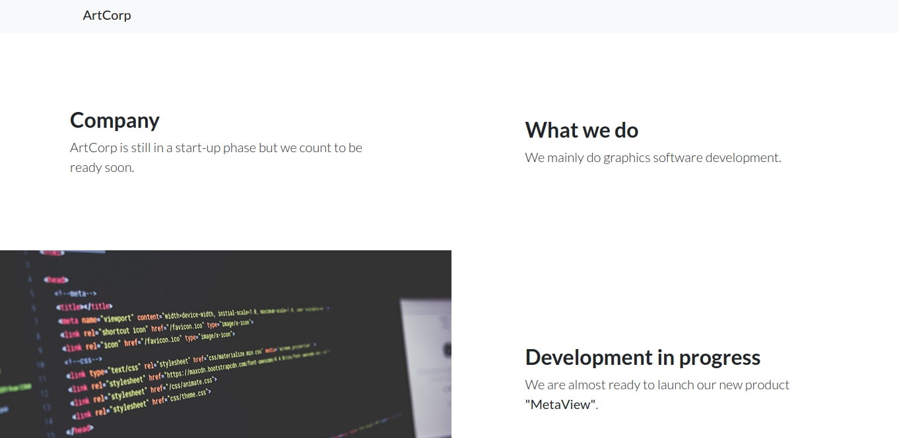
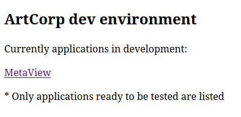

<br />


<br />

OS -> Linux.

Difficulty -> Medium.

<br />

# Introduction:

<br />


<br />

# Enumeration:

<br />

We start by running the typical `nmap` scan to see which ports are open:

<br />

```bash
❯ nmap -p- 10.10.11.140 --open --min-rate 5000 -sS -T5 -Pn -n -sCV
Starting Nmap 7.94SVN ( https://nmap.org ) at 2025-02-16 19:19 CET
Nmap scan report for 10.10.11.140
Host is up (0.042s latency).
Not shown: 65219 closed tcp ports (reset), 314 filtered tcp ports (no-response)
Some closed ports may be reported as filtered due to --defeat-rst-ratelimit
PORT   STATE SERVICE VERSION
22/tcp open  ssh     OpenSSH 7.9p1 Debian 10+deb10u2 (protocol 2.0)
| ssh-hostkey: 
|   2048 12:81:17:5a:5a:c9:c6:00:db:f0:ed:93:64:fd:1e:08 (RSA)
|   256 b5:e5:59:53:00:18:96:a6:f8:42:d8:c7:fb:13:20:49 (ECDSA)
|_  256 05:e9:df:71:b5:9f:25:03:6b:d0:46:8d:05:45:44:20 (ED25519)
80/tcp open  http    Apache httpd
|_http-title: Did not follow redirect to http://artcorp.htb
|_http-server-header: Apache
Service Info: OS: Linux; CPE: cpe:/o:linux:linux_kernel

Service detection performed. Please report any incorrect results at https://nmap.org/submit/ .
Nmap done: 1 IP address (1 host up) scanned in 23.09 seconds
```

<br />

Open Ports:

- `Port 22` -> ssh

- `Port 80` -> http

<br />

# Http Enumeration: -> Port 80

<br />

When we try to list the `website`, it `redirects` to the following `domain`:

- `artcorp.htb` 

So we proceed to `add` it to our `/etc/hosts`:

```bash
echo "10.10.11.140 artcorp.htb >> /etc/hosts"
```

<br />

Once this is done, we `reload` the `website` and we see that it is very `static`, not at all `interesting`:

<br />



<br />

When there is nothing interesting on the main website it is advisable to fuzz to find a subdomain, so we do it and surprise:

<br />

```bash
❯ ffuf -u http://artcorp.htb -H "Host: FUZZ.artcorp.htb" -w /usr/share/SecLists/Discovery/DNS/subdomains-top1million-5000.txt -c -t 20  -fs 0

        /'___\  /'___\           /'___\       
       /\ \__/ /\ \__/  __  __  /\ \__/       
       \ \ ,__\\ \ ,__\/\ \/\ \ \ \ ,__\      
        \ \ \_/ \ \ \_/\ \ \_\ \ \ \ \_/      
         \ \_\   \ \_\  \ \____/  \ \_\       
          \/_/    \/_/   \/___/    \/_/       

       v2.1.0-dev
________________________________________________

 :: Method           : GET
 :: URL              : http://artcorp.htb
 :: Wordlist         : FUZZ: /usr/share/SecLists/Discovery/DNS/subdomains-top1million-5000.txt
 :: Header           : Host: FUZZ.artcorp.htb
 :: Follow redirects : false
 :: Calibration      : false
 :: Timeout          : 10
 :: Threads          : 20
 :: Matcher          : Response status: 200-299,301,302,307,401,403,405,500
 :: Filter           : Response size: 0
________________________________________________

dev01                   [Status: 200, Size: 247, Words: 16, Lines: 10, Duration: 599ms]
:: Progress: [4989/4989] :: Job [1/1] :: 507 req/sec :: Duration: [0:00:11] :: Errors: 0 ::
```

<br />

We have a new `subdomain`, let's `add` it to `/etc/hosts`:

<br />

```bash
10.10.11.140 artcorp.htb dev01.artcorp.htb
```

<br />

We load the new subdomain and it seems to bee a website for testing tools that are in the development phase:

<br />



<br />

Click on `metaview` as it is the only `tool` available.

<br />


<br />

