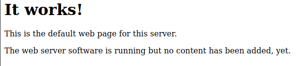
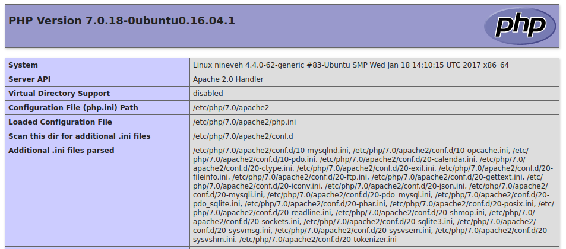

<br />


<br />

OS -> Linux.

Difficulty -> Medium.

<br />

# Introduction:

<br />


<br />

# Enumeration:

<br />

We begin with a standard `nmap` scan to identify open ports and running services:

<br />

```bash
❯ nmap -p- 10.10.10.43 --open --min-rate 5000 -sS -T5 -Pn -n -sCV
Starting Nmap 7.94SVN ( https://nmap.org ) at 2025-07-28 16:12 CEST
Nmap scan report for 10.10.10.43
Host is up (0.082s latency).
Not shown: 65533 filtered tcp ports (no-response)
Some closed ports may be reported as filtered due to --defeat-rst-ratelimit
PORT    STATE SERVICE  VERSION
80/tcp  open  http     Apache httpd 2.4.18 ((Ubuntu))
|_http-server-header: Apache/2.4.18 (Ubuntu)
|_http-title: Site doesn't have a title (text/html).
443/tcp open  ssl/http Apache httpd 2.4.18 ((Ubuntu))
|_ssl-date: TLS randomness does not represent time
| ssl-cert: Subject: commonName=nineveh.htb/organizationName=HackTheBox Ltd/stateOrProvinceName=Athens/countryName=GR
| Not valid before: 2017-07-01T15:03:30
|_Not valid after:  2018-07-01T15:03:30
|_http-title: Site doesn't have a title (text/html).
|_http-server-header: Apache/2.4.18 (Ubuntu)
| tls-alpn: 
|_  http/1.1

Service detection performed. Please report any incorrect results at https://nmap.org/submit/ .
Nmap done: 1 IP address (1 host up) scanned in 45.38 seconds
```

<br />

Open Ports:

`Port 80` -> HTTP 

`Port 443` -> HTTPS 

<br />

# Http Enumeration: - Port 80

<br />

In the port 80, we find a default web page:

<br />



<br />

Perhaps with some directory fuzzing, we can discover interesting paths to explore.

<br />

## Fuzzing 

<br />

To enumerate hidden directories and files, we use `gobuster`:

<br />

```bash

```

<br />

We find several interesting results in the output.

Let's take a look at these paths.

<br />

### info.php

<br />

This page is the typical `phpinfo()` file:

<br />



<br />

### department

<br />

In this other page, we find a `login`:

<br />


<br />

We test default credentials without success.
