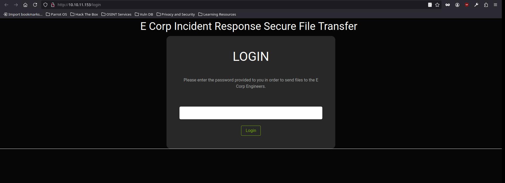
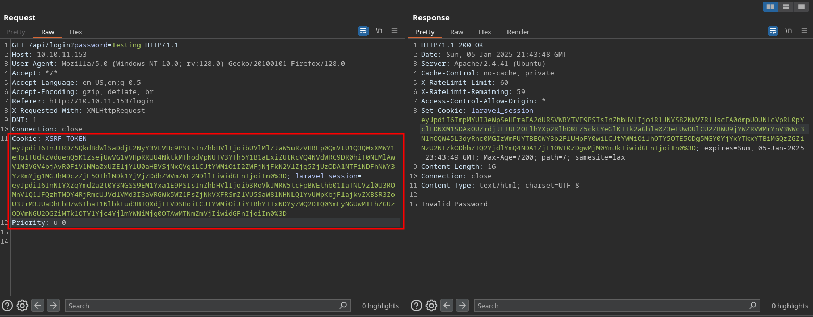
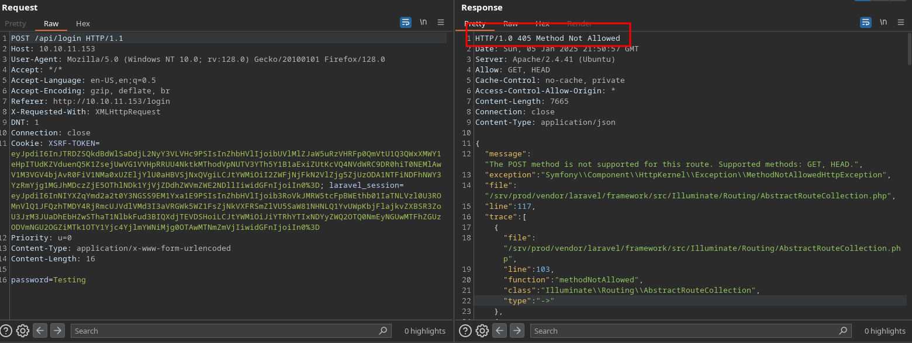
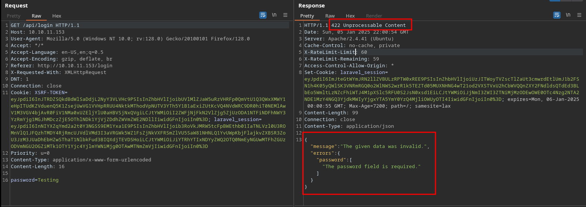
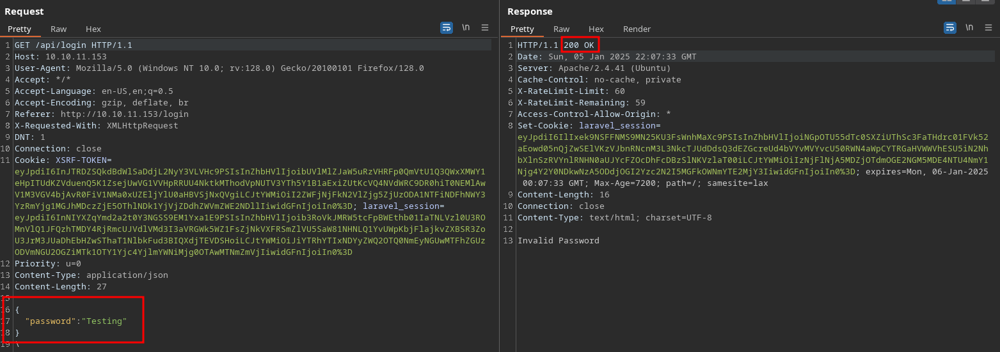

<br />


<br />

# Introduction:

<br />

Hello hackers! Today we’ll tackle the Ransom Machine, a medium-difficulty challenge. We’ll start by exploiting a login panel on the web server with a type juggling attack, taking advantage of improper data type handling. This will give us access to a compressed file containing an encrypted id_rsa key, which we’ll crack using a unique tool. Once decrypted, we’ll use the id_rsa key to log into the victim machine. Finally, we’ll find the root password by navigating through the machine’s directories.

<br />

# Enumeration:

<br />

As always we start running our nmap scan to enumerate open ports and services:

<br />

```bash
❯ nmap -p- 10.10.11.153 --open --min-rate 5000 -sS -T5 -Pn -n -sCV
Starting Nmap 7.94SVN ( https://nmap.org ) at 2025-01-06 00:18 CET
Nmap scan report for 10.10.11.153
Host is up (0.059s latency).
Not shown: 64830 closed tcp ports (reset), 703 filtered tcp ports (no-response)
Some closed ports may be reported as filtered due to --defeat-rst-ratelimit
PORT   STATE SERVICE VERSION
22/tcp open  ssh     OpenSSH 8.2p1 Ubuntu 4ubuntu0.4 (Ubuntu Linux; protocol 2.0)
| ssh-hostkey: 
|   3072 ea:84:21:a3:22:4a:7d:f9:b5:25:51:79:83:a4:f5:f2 (RSA)
|   256 b8:39:9e:f4:88:be:aa:01:73:2d:10:fb:44:7f:84:61 (ECDSA)
|_  256 22:21:e9:f4:85:90:87:45:16:1f:73:36:41:ee:3b:32 (ED25519)
80/tcp open  http    Apache httpd 2.4.41 ((Ubuntu))
|_http-server-header: Apache/2.4.41 (Ubuntu)
| http-title:  Admin - HTML5 Admin Template
|_Requested resource was http://10.10.11.153/login
Service Info: OS: Linux; CPE: cpe:/o:linux:linux_kernel

Service detection performed. Please report any incorrect results at https://nmap.org/submit/ .
Nmap done: 1 IP address (1 host up) scanned in 27.62 seconds
```

<br />

As we can see there are only two open ports:

- `Port 22` -> ssh
- `Port 80` -> http

<br />

# Http Enumeration -> Port 80:

<br />

When loading the website we find a login in which we only have input to put a password, so we try default credentials but nothing:

<br />



<br />

After trying the simplest things like default credentials or some unsuccessful sql injection, we proceed to intercept the request with Burp Suite and send it to the repeater to test more interesting things.

As we can see, it looks like laravel is behind, as we have a cookie telling us so:

<br />



<br />

# Bypass Login:

<br />

The first thing we try is to change the request method by right-clicking and indicating "Change Request Method".

When we do so, we get a status code 405 -> "Method Not Allowed":

<br />



<br />

But there is something we can try, which is to manually change the POST to GET and we get the following response:

<br />



<br />

It's throwing us a 422 "Unprocessable Content" error and we see below that it's representing an error message in json.

So when I see this, it occurs to me to change the Content-Type of our request to json along with the data we are sending to see the server's response:

<br />



<br />

As we can see, it seems that he did like this and the answer is a 200 OK.

When I see this, the light bulb lights up and I remember a vulnerability that applies a lot in these cases, the famous Type Juggling Attack.

This vulnerability is caused by an error when comparing the data that allows us to deceive the server. So we tried changing the password to true and...

<br />


