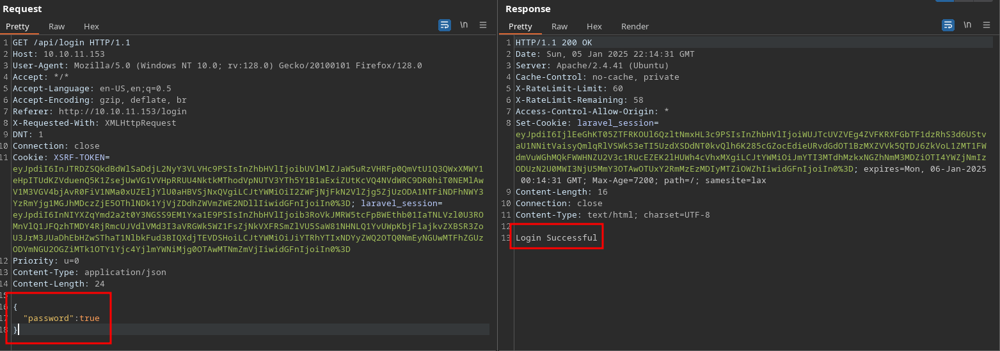
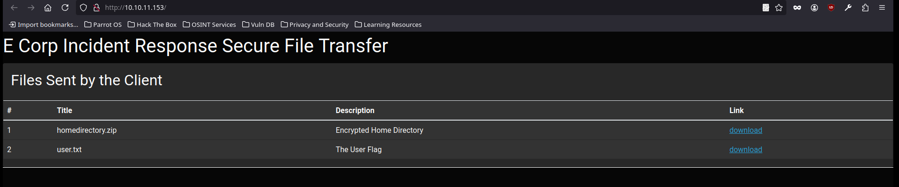

<br />


<br />

# Introduction:

<br />

Hello hackers! Today we’ll tackle the Ransom Machine, a medium-difficulty challenge. We’ll start by exploiting a login panel on the web server with a type juggling attack, taking advantage of improper data type handling. This will give us access to a compressed file containing an encrypted id_rsa key, which we’ll crack using a unique tool. Once decrypted, we’ll use the id_rsa key to log into the victim machine. Finally, we’ll find the root password by navigating through the machine’s directories.

<br />

# Enumeration:

<br />

As always we start running our nmap scan to enumerate open ports and services:

<br />

```bash
❯ nmap -p- 10.10.11.153 --open --min-rate 5000 -sS -T5 -Pn -n -sCV
Starting Nmap 7.94SVN ( https://nmap.org ) at 2025-01-06 00:18 CET
Nmap scan report for 10.10.11.153
Host is up (0.059s latency).
Not shown: 64830 closed tcp ports (reset), 703 filtered tcp ports (no-response)
Some closed ports may be reported as filtered due to --defeat-rst-ratelimit
PORT   STATE SERVICE VERSION
22/tcp open  ssh     OpenSSH 8.2p1 Ubuntu 4ubuntu0.4 (Ubuntu Linux; protocol 2.0)
| ssh-hostkey: 
|   3072 ea:84:21:a3:22:4a:7d:f9:b5:25:51:79:83:a4:f5:f2 (RSA)
|   256 b8:39:9e:f4:88:be:aa:01:73:2d:10:fb:44:7f:84:61 (ECDSA)
|_  256 22:21:e9:f4:85:90:87:45:16:1f:73:36:41:ee:3b:32 (ED25519)
80/tcp open  http    Apache httpd 2.4.41 ((Ubuntu))
|_http-server-header: Apache/2.4.41 (Ubuntu)
| http-title:  Admin - HTML5 Admin Template
|_Requested resource was http://10.10.11.153/login
Service Info: OS: Linux; CPE: cpe:/o:linux:linux_kernel

Service detection performed. Please report any incorrect results at https://nmap.org/submit/ .
Nmap done: 1 IP address (1 host up) scanned in 27.62 seconds
```

<br />

As we can see there are only two open ports:

- `Port 22` -> ssh
- `Port 80` -> http

<br />

# Http Enumeration -> Port 80:

<br />

When loading the website we find a login in which we only have input to put a password, so we try default credentials but nothing:

<br />


<br />

After trying the simplest things like default credentials or some unsuccessful sql injection, we proceed to intercept the request with Burp Suite and send it to the repeater to test more interesting things.

As we can see, it looks like laravel is behind, as we have a cookie telling us so:

<br />


<br />

# Bypass Login:

<br />

The first thing we try is to change the request method by right-clicking and indicating "Change Request Method".

When we do so, we get a status code 405 -> "Method Not Allowed":

<br />


<br />

But there is something we can try, which is to manually change the POST to GET and we get the following response:

<br />


<br />

It's throwing us a 422 "Unprocessable Content" error and we see below that it's representing an error message in json.

So when I see this, it occurs to me to change the Content-Type of our request to json along with the data we are sending to see the server's response:

<br />


<br />

As we can see, it seems that he did like this and the answer is a 200 OK.

When I see this, the light bulb lights up and I remember a vulnerability that applies a lot in these cases, the famous Type Juggling Attack.

This vulnerability is caused by an error when comparing the data types that allows us to deceive the server. So we tried changing the password to true and...

<br />



<br />

Login Successful!! Once inside, we see two files, the user.txt and a compressed file that looks quite good, so we bring it to our machine to see it more closely.

<br />



<br />

Once we have the file locally, we inspect it and it seems to have the contents of a typical home directory including the rsa_id of an user:

<br />

```bash
❯ 7z l ransom.zip

7-Zip [64] 16.02 : Copyright (c) 1999-2016 Igor Pavlov : 2016-05-21
p7zip Version 16.02 (locale=es_ES.UTF-8,Utf16=on,HugeFiles=on,64 bits,128 CPUs AMD Ryzen 7 5825U with Radeon Graphics          (A50F00),ASM,AES-NI)

Scanning the drive for archives:
1 file, 7735 bytes (8 KiB)

Listing archive: ransom.zip

--
Path = ransom.zip
Type = zip
Physical Size = 7735

   Date      Time    Attr         Size   Compressed  Name
------------------- ----- ------------ ------------  ------------------------
2020-02-25 13:03:22 .....          220          170  .bash_logout
2020-02-25 13:03:22 .....         3771         1752  .bashrc
2020-02-25 13:03:22 .....          807          404  .profile
2021-07-02 19:58:14 D....            0            0  .cache
2021-07-02 19:58:14 .....            0           12  .cache/motd.legal-displayed
2021-07-02 19:58:19 .....            0           12  .sudo_as_admin_successful
2022-03-07 13:32:54 D....            0            0  .ssh
2022-03-07 13:32:25 .....         2610         1990  .ssh/id_rsa
2022-03-07 13:32:46 .....          564          475  .ssh/authorized_keys
2022-03-07 13:32:54 .....          564          475  .ssh/id_rsa.pub
2022-03-07 13:32:54 .....         2009          581  .viminfo
------------------- ----- ------------ ------------  ------------------------
2022-03-07 13:32:54              10545         5871  9 files, 2 folders
```

<br />

We unzipped it to extract the contents but SURPRISE! It is password protected:

<br />

```bash
❯ unzip ransom.zip
Archive:  ransom.zip
[ransom.zip] .bash_logout password: 
password incorrect--reenter: 
password incorrect--reenter: 
   skipping: .bash_logout            incorrect password
```

<br />

7zip has a parameter (-slt), with which we can see the type of encryption under which a compressed file is, so we apply it and we discover that the file is under "Zipcrypt Deflate" cipher:

<br />

```bash
❯ 7z l ransom.zip -slt

7-Zip [64] 16.02 : Copyright (c) 1999-2016 Igor Pavlov : 2016-05-21
p7zip Version 16.02 (locale=es_ES.UTF-8,Utf16=on,HugeFiles=on,64 bits,128 CPUs AMD Ryzen 7 5825U with Radeon Graphics          (A50F00),ASM,AES-NI)

Scanning the drive for archives:
1 file, 7735 bytes (8 KiB)

Listing archive: ransom.zip

--
Path = ransom.zip
Type = zip
Physical Size = 7735

----------
Path = .bash_logout
Folder = -
Size = 220
Packed Size = 170
Modified = 2020-02-25 13:03:22
Created = 
Accessed = 
Attributes = _ -rw-r--r--
Encrypted = +
Comment = 
CRC = 6CE3189B
Method = ZipCrypto Deflate
Host OS = Unix
Version = 20
Volume Index = 0

Path = .bashrc
Folder = -
Size = 3771
Packed Size = 1752
Modified = 2020-02-25 13:03:22
Created = 
Accessed = 
Attributes = _ -rw-r--r--
Encrypted = +
Comment = 
CRC = AB254644
Method = ZipCrypto Deflate
Host OS = Unix
Version = 20
Volume Index = 0

Path = .profile
Folder = -
Size = 807
Packed Size = 404
Modified = 2020-02-25 13:03:22
Created = 
Accessed = 
Attributes = _ -rw-r--r--
Encrypted = +
Comment = 
CRC = D1B22A87
Method = ZipCrypto Deflate
Host OS = Unix
Version = 20
Volume Index = 0
...[snip]...
```

<br />

# Decrypt Compressed File:

<br />

There is a well-known attack to decrypt files under this type of encryption "Zipcrypt Deflate".

The attack consists of obtaining a plaintext file that is identical to any of those inside the compressed file and abusing it in order to obtain the rest of the file's content.

<br />

## .bash_logout:

<br />

Of all the files inside our compressed file, there is only one that is identical in absolutely all Linux OS, which is .bash_logout.

So we copy one from our system and bring it to the current path:

<br />

```bash
❯ cat .bash_logout
───────┬───────────────────────────────────────────────────────────────────────────────────────────────────────────────────────────────────────────────────────────────────────────────
       │ File: .bash_logout
───────┼───────────────────────────────────────────────────────────────────────────────────────────────────────────────────────────────────────────────────────────────────────────────
   1   │ # ~/.bash_logout: executed by bash(1) when login shell exits.
   2   │ 
   3   │ # when leaving the console clear the screen to increase privacy
   4   │ 
   5   │ if [ "$SHLVL" = 1 ]; then
   6   │     [ -x /usr/bin/clear_console ] && /usr/bin/clear_console -q
   7   │ fi
```

<br />

To make sure that our .bash_logout is identical to the compressed one, we list the characters in both and see that indeed, they both have 220 characters.

<br />

`Compressed File .bash_logout:`

<br />

```bash
Path = .bash_logout
Folder = -
Size = 220
Packed Size = 170
Modified = 2020-02-25 13:03:22
Created = 
Accessed = 
Attributes = _ -rw-r--r--
Encrypted = +
Comment = 
CRC = 6CE3189B
Method = ZipCrypto Deflate
Host OS = Unix
Version = 20
Volume Index = 0
```

<br />

`Our .bash_logout:`

<br />

```bash
❯ cat .bash_logout | wc -c
220
```

<br />

# Bkcrack:

<br />

Once we have the file ready, we need a tool called bkcrack, which has the following parameters:

<br />

`-> -C:` The encrypted file.
`-> -c:` The known file of the encrypted zip.
`-> -P:` A unencrypted file with the known file in.
`-> -p:` The name of the file in the unencrypted zip. 

<br />

Create the unencrypted file with the known file in:

<br />

```bash
❯ zip plaintext.zip .bash_logout
  adding: .bash_logout (deflated 28%)
```

<br />

And now that we have everything, we run bkcrack generating the private keys that we will need to extract the contents of the encrypted zip:

<br />

```bash
❯ ./bkcrack -C ransom.zip -c ".bash_logout" -P plaintext.zip -p ".bash_logout"
bkcrack 1.7.1 - 2024-12-21
[02:22:58] Z reduction using 151 bytes of known plaintext
100.0 % (151 / 151)
[02:22:58] Attack on 56903 Z values at index 6
Keys: 7b549874 ebc25ec5 7e465e18
75.5 % (42961 / 56903)
Found a solution. Stopping.
You may resume the attack with the option: --continue-attack 42961
[02:24:00] Keys
7b549874 ebc25ec5 7e465e18
```

<br />

Once we have the private keys, we have a bkcrack option, which allows us to generate a new compressed file with all the content we want but with the password we choose.

To do it we are going to need to run bkcrack with the following parameters:

`-> -C:` The encrypted file.
`-> -k:` Generated private keys.
`-> -U:` Output archive name.
`-> password:` The password that we want.

<br />

We run bkcrack and successfully generate the new zip with our password and the contents of the encrypted zip:

<br />

```bash
❯ ./bkcrack -C ransom.zip -k 7b549874 ebc25ec5 7e465e18 -U plaintext.zip 123123
bkcrack 1.7.1 - 2024-12-21
[02:28:06] Writing unlocked archive plaintext.zip with password "123123"
100.0 % (9 / 9)
Wrote unlocked archive.
```

<br />

Now we can decrypt the file with our password "123123":

<br />

```bash
❯ unzip plaintext.zip
Archive:  plaintext.zip
[plaintext.zip] .bash_logout password: 
  inflating: .bash_logout            
  inflating: .bashrc                 
  inflating: .profile                
   creating: .cache/
 extracting: .cache/motd.legal-displayed  
 extracting: .sudo_as_admin_successful  
   creating: .ssh/
  inflating: .ssh/id_rsa             
  inflating: .ssh/authorized_keys    
  inflating: .ssh/id_rsa.pub         
  inflating: .viminfo
```

<br />


